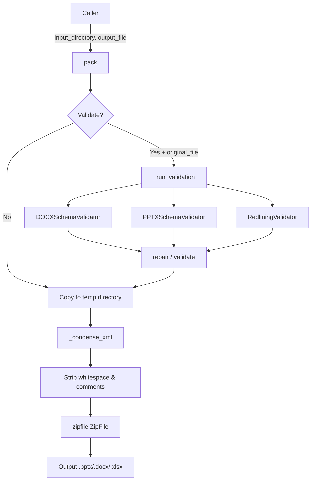
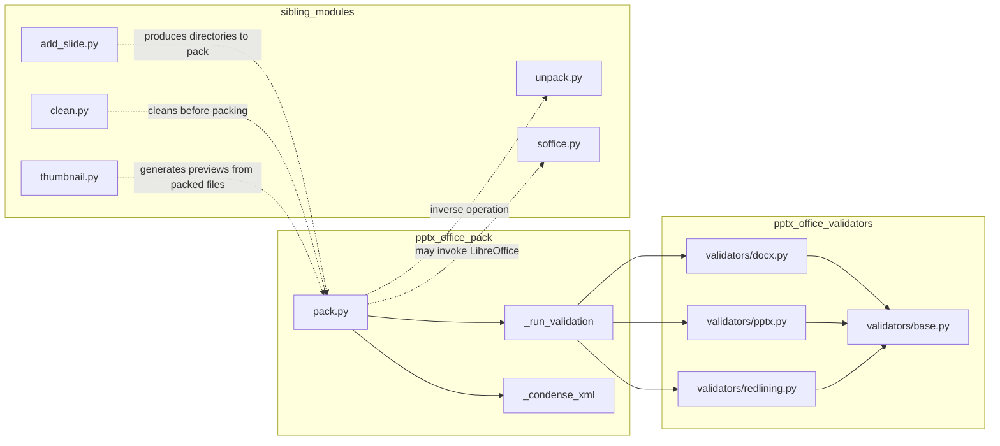
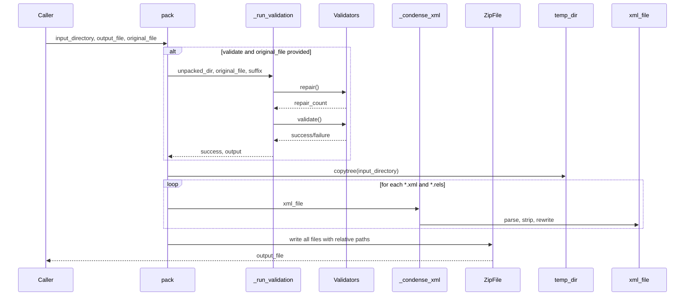
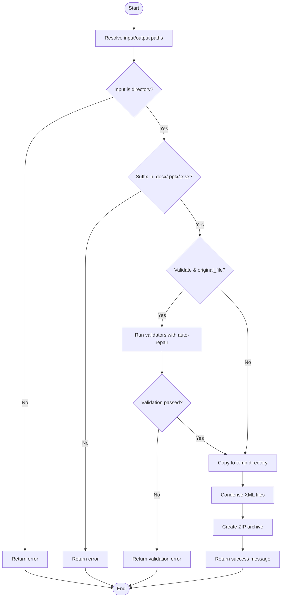

# pptx_office_pack

The `pptx_office_pack` module is a low-level Office Open XML utility that converts an unpacked directory of XML parts and assets back into a valid `.pptx`, `.docx`, or `.xlsx` file. It is part of the `ainxt_docskills` PPTX skill suite and is responsible for the final serialization step after document modifications have been made on disk.

## Overview

This module provides a single public entry point, `pack()`, which:

1. Accepts an unpacked Office document directory.
2. Optionally validates and auto-repairs the contents against an original file.
3. Condenses XML files by stripping non-essential whitespace and comments.
4. Re-packages the directory into a ZIP-based Office Open XML file.

The module supports `.docx`, `.pptx`, and `.xlsx` outputs, although it lives under the PPTX skill tree and is most commonly used to produce PowerPoint presentations.

## Core Functionality

### `pack(input_directory, output_file, original_file=None, validate=True, infer_author_func=None)`

The main packing function. It performs the following steps:

- Validates that `input_directory` exists and is a directory.
- Validates that `output_file` has a supported Office extension (`.docx`, `.pptx`, `.xlsx`).
- If `validate=True` and an `original_file` is provided, runs schema and redlining validators with auto-repair.
- Copies the input directory into a temporary working directory.
- Condenses all `*.xml` and `*.rels` files to remove pretty-printing whitespace and comments.
- Writes the final output as a ZIP archive with `ZIP_DEFLATED` compression.

Returns a tuple `(None, message)` where `message` indicates success or describes the error.

### `_run_validation(unpacked_dir, original_file, suffix, infer_author_func=None)`

Internal helper that selects and runs validators based on the target file type:

- **`.docx`**: Runs `DOCXSchemaValidator` and `RedliningValidator`. The redlining validator uses an author name, which defaults to `"Claude"` but can be inferred via `infer_author_func`.
- **`.pptx`**: Runs `PPTXSchemaValidator`.
- **`.xlsx`**: No validators are currently registered.

Each validator is first asked to `repair()` the unpacked directory, then `validate()` it. The function reports the total number of auto-repairs and whether validation passed.

### `_condense_xml(xml_file)`

Internal helper that normalizes XML files before packaging:

- Parses the XML using `defusedxml.minidom`.
- Removes whitespace-only text nodes and comment nodes from all elements.
- Preserves text content inside elements whose tag name ends with `:t` (Office text elements).
- Rewrites the file with condensed XML.

This reduces file size and avoids issues with extra whitespace in Office documents.

## Architecture



## Component Relationships



## Data Flow



## Process Flow: Packing an Office Document



## How It Fits into the System

The `pptx_office_pack` module is the final stage of the PPTX document manipulation pipeline within `ainxt_docskills`. It works in conjunction with several related modules:

- **[pptx_office_unpack](pptx_office_unpack.md)**: Performs the inverse operation — extracting a `.pptx` file into a directory of XML parts. After modifications are made, `pack()` re-assembles the directory into a presentation.
- **[pptx_office_validators](pptx_office_validators.md)**: Provides schema and redlining validators used by `_run_validation()` to ensure the packed file is structurally sound and consistent with the original.
- **[pptx_office_soffice](pptx_office_soffice.md)**: Integrates with LibreOffice for operations that require a full Office runtime; `pack()` may be called after `soffice` has processed a document.
- **[pptx_add_slide](../clients/pptx_add_slide.md)**: Creates or duplicates slides in an unpacked presentation; the resulting directory is typically passed to `pack()` to produce the final `.pptx`.
- **[pptx_clean](../reference/pptx_clean.md)**: Removes unused files from an unpacked presentation before packing.
- **[pptx_thumbnail](../reference/pptx_thumbnail.md)**: Generates thumbnail images from packed presentations.

Cross-format siblings also exist for Word and Excel documents:

- **[docx_office_pack](docx_office_pack.md)**: Equivalent packing logic for `.docx` files.
- **[xlsx_office_pack](xlsx_office_pack.md)**: Equivalent packing logic for `.xlsx` files.

These modules share the same validator infrastructure and XML condensation strategy, ensuring consistent behavior across Office document types.

## Usage Example

```bash
# Pack an unpacked PPTX directory into a presentation
python pack.py unpacked_pptx/ output.pptx --original original.pptx

# Pack without validation
python pack.py unpacked_pptx/ output.pptx --validate false

# Pack a DOCX directory
python pack.py unpacked_docx/ output.docx --original input.docx
```

## Key Design Decisions

- **Defensive XML parsing**: Uses `defusedxml.minidom` to mitigate XML external entity (XXE) and other parsing vulnerabilities.
- **Auto-repair before validation**: Validators are given a chance to repair issues before the final validation check, increasing the success rate of automated document generation.
- **Temporary working directory**: The input directory is copied to a temp directory before condensation, leaving the source directory untouched.
- **Relative ZIP entries**: Files are written into the ZIP with paths relative to the content root, producing a valid Office Open XML package.
- **Whitespace preservation in text elements**: The `_condense_xml` helper avoids stripping whitespace inside `<a:t>` / `<w:t>` / text elements to prevent accidental content changes.

## Error Handling

The module returns error messages as strings rather than raising exceptions for most validation failures. This allows callers (including CLI usage and upstream skills) to decide how to handle failures. XML parsing errors during condensation are printed to `stderr` and re-raised so that corrupt input does not silently produce invalid output.
