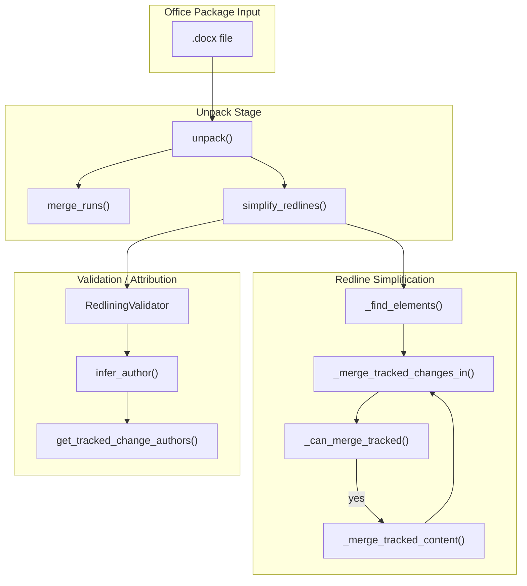
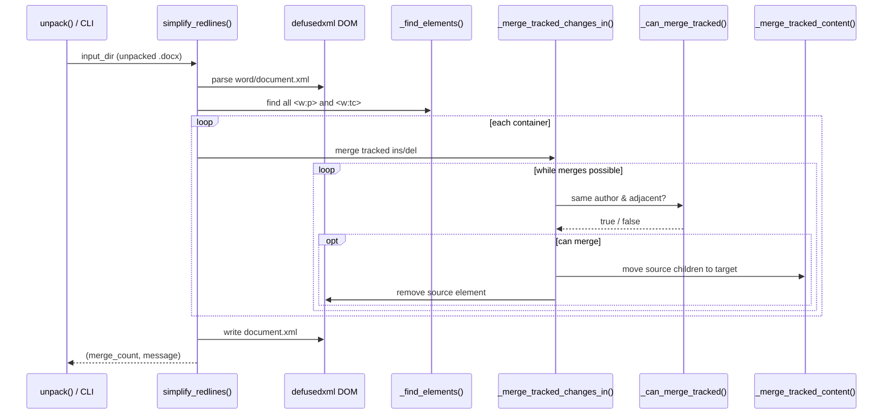
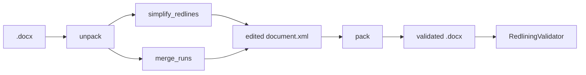

# pptx_office_simplify_redlines

## Brief Introduction

The `pptx_office_simplify_redlines` module is a shared Office Open XML (OOXML) utility that simplifies tracked changes (redlines) in WordprocessingML documents. Despite its location under the PowerPoint (`pptx`) docskill tree, the module operates on `.docx` `word/document.xml` files and is reused across the docx, pptx, and xlsx docskill helper suites. It merges adjacent `<w:ins>` and `<w:del>` elements that share the same author, reducing document complexity and improving downstream validation, diffing, and agent editing workflows.

This module is part of the broader `docskills_legacy` Office helper ecosystem, which provides unpack/pack/validate/merge/simplify primitives for agent-generated Office documents.

---

## Core Functionality

### 1. Redline Simplification

The primary purpose is to coalesce fragmented tracked-change markup. When an agent or user makes multiple consecutive edits, Word may produce many adjacent `<w:ins>` or `<w:del>` wrappers. The module collapses these into a single wrapper per author when they are truly adjacent (only whitespace separates them).

### 2. Author Inference

The module can compare a modified unpacked document against the original `.docx` to determine which author introduced new tracked changes. This is used by the validation pipeline to attribute redlines correctly.

### 3. Author Statistics

Utilities are provided to enumerate all tracked-change authors and their change counts from either an unpacked `document.xml` or a packed `.docx` archive.

---

## Architecture

### Module Location

```text
skills\ainxt_docskills\pptx\scripts\office\helpers\simplify_redlines.py
```

> **Note:** Identical copies exist under `docx/scripts/office/helpers/simplify_redlines.py` and `xlsx/scripts/office/helpers/simplify_redlines.py`. The pptx copy is the canonical reference for this documentation.

### High-Level Architecture



### Component Relationships

| Component | Responsibility |
|-----------|----------------|
| `simplify_redlines` | Entry point. Parses `word/document.xml`, finds paragraph/table-cell containers, and merges `w:ins`/`w:del` elements. |
| `_find_elements` | Recursive DOM traversal to collect elements by local tag name (with or without namespace prefix). |
| `_merge_tracked_changes_in` | Iterates over tracked elements in a container and attempts pairwise merges. |
| `_is_element` | Predicate to match a DOM node against a tag name, supporting both prefixed and non-prefixed forms. |
| `_get_author` | Extracts the `w:author` attribute from a tracked-change element. |
| `_can_merge_tracked` | Determines whether two adjacent tracked elements can be merged (same author, only whitespace between). |
| `_merge_tracked_content` | Moves all child nodes from the source element into the target element. |
| `get_tracked_change_authors` | Returns a frequency map of authors for `w:ins`/`w:del` from an unpacked `document.xml`. |
| `_get_authors_from_docx` | Same as above, but reads directly from a packed `.docx` zip archive. |
| `infer_author` | Compares modified vs. original documents to infer the author of newly added tracked changes. |

---

## Data Flow

### Simplification Flow



### Author Inference Flow

```mermaid
sequenceDiagram
    participant Validator as RedliningValidator
    participant Infer as infer_author()
    participant Mod as get_tracked_change_authors()
    participant Orig as _get_authors_from_docx()

    Validator->>Infer: modified_dir, original_docx, default="Claude"
    Infer->>Mod: read modified authors
    Infer->>Orig: read original authors
    Infer->>Infer: compute diff per author
    alt no new changes
        Infer-->>Validator: default
    alt exactly one new author
        Infer-->>Validator: that author
    else multiple new authors
        Infer-->>Validator: ValueError
    end
```

---

## Merge Rules

The simplification logic enforces strict merge semantics to preserve document meaning:

1. **Same element type** — only `w:ins` merges with `w:ins`, and `w:del` with `w:del`.
2. **Same author** — the `w:author` attribute must match; timestamps are ignored.
3. **True adjacency** — only whitespace text nodes may appear between the two elements. Any other element or non-whitespace text breaks adjacency.

These rules ensure that semantically distinct changes (different authors, separated content, or intervening elements) are never collapsed.

---

## Integration with the Office Pipeline

This module is invoked during the **unpack** phase of the docskill Office pipeline:



For details on the surrounding pipeline, see:

- [pptx_office_unpack](pptx_office_unpack.md) — extraction and pretty-printing of OOXML packages.
- [pptx_office_pack](pptx_office_pack.md) — re-packing and optional validation before output.
- [pptx_office_merge_runs](pptx_office_merge_runs.md) — adjacent run merging for cleaner markup.
- [pptx_office_validators_redlining](pptx_office_validators_redlining.md) — validation that tracked changes preserve document text.

---

## API Reference

### `simplify_redlines(input_dir: str) -> tuple[int, str]`

Simplifies tracked changes in the unpacked `.docx` directory at `input_dir`.

**Returns:**
- `merge_count`: number of merge operations performed.
- `message`: human-readable status or error string.

### `infer_author(modified_dir: Path, original_docx: Path, default: str = "Claude") -> str`

Infers the author of newly introduced tracked changes by comparing author counts.

**Returns:**
- The inferred author name, or `default` if no new changes are detected.

**Raises:**
- `ValueError` if multiple authors added new changes.

### `get_tracked_change_authors(doc_xml_path: Path) -> dict[str, int]`

Returns a mapping of author name to tracked-change count from an unpacked `document.xml`.

### `_get_authors_from_docx(docx_path: Path) -> dict[str, int]`

Same as `get_tracked_change_authors`, but reads directly from a `.docx` zip file.

---

## Error Handling

All public functions are defensive:

- Missing `word/document.xml` returns `(0, "Error: ...")` rather than raising.
- XML parse errors and unexpected exceptions are caught and returned as error messages.
- `infer_author` raises `ValueError` only when attribution is ambiguous.

---

## Dependencies

- `xml.etree.ElementTree` — for author extraction from packed/unpacked XML.
- `defusedxml.minidom` — for safe DOM parsing and mutation during simplification.
- `zipfile` — for reading `.docx` archives without unpacking.
- `pathlib.Path` — filesystem path handling.

---

## Related Modules

| Module | Relationship |
|--------|--------------|
| [docx_office_simplify_redlines](docx_office_simplify_redlines.md) | Functionally identical copy under the docx docskill tree. |
| [xlsx_office_simplify_redlines](xlsx_office_simplify_redlines.md) | Functionally identical copy under the xlsx docskill tree. |
| [pptx_office_merge_runs](pptx_office_merge_runs.md) | Complementary run-merging utility invoked alongside simplification. |
| [pptx_office_unpack](pptx_office_unpack.md) | Calls `simplify_redlines` during `.docx` unpacking. |
| [pptx_office_pack](pptx_office_pack.md) | Re-packs the simplified directory and runs validation. |
| [pptx_office_validators_redlining](pptx_office_validators_redlining.md) | Uses `infer_author` to validate tracked-change attribution. |
| [shared_skills](../agents/shared_skills.md) | Parent module containing all docskill Office utilities. |
