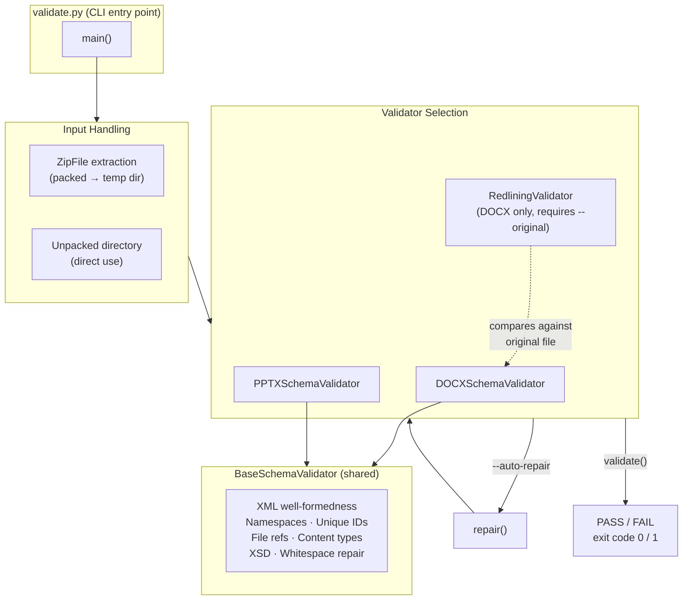
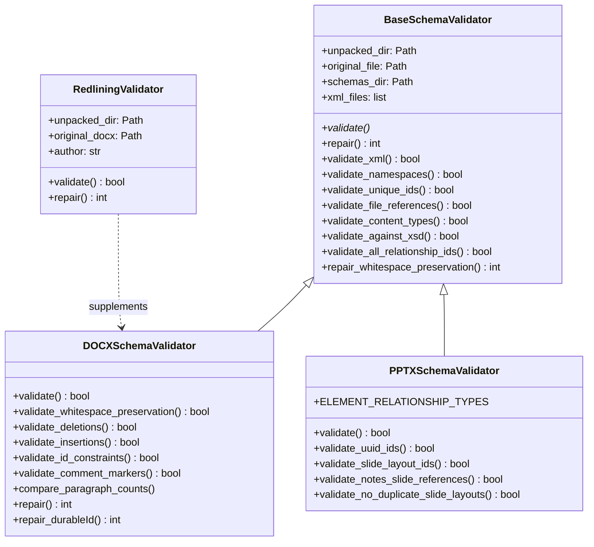
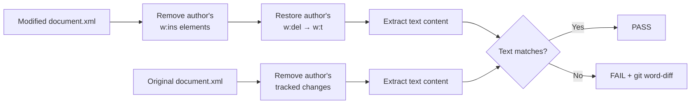
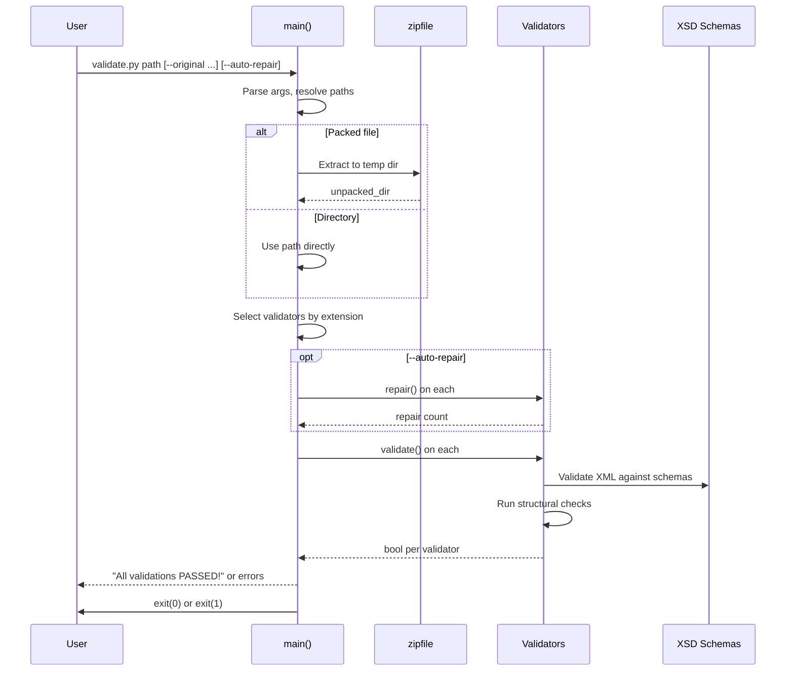
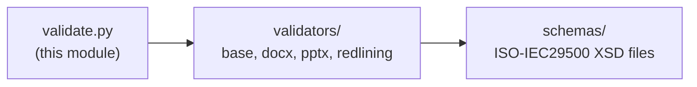

# pptx_office_validate

## Introduction

The `pptx_office_validate` module is the command-line validation entry point for Office Open XML (OOXML) documents within the Anthropic doc-skills PPTX toolchain. It validates unpacked or packed Office files (`.pptx`, `.docx`, `.xlsx`) against ISO/IEC 29500 XSD schemas, structural integrity rules, and tracked-changes (redlining) semantics. The tool can also automatically repair a set of common XML defects before validation.

It lives at `skills/ainxt_docskills/pptx/scripts/office/validate.py` and is the PPTX-flavoured instance of a validation tool that is mirrored across the DOCX and XLSX skill packages (see [Related Modules](#related-modules)).

---

## Architecture Overview



### Component Relationships



---

## Core Component: `main()`

The `main()` function is the sole public entry point. It is a pure CLI orchestrator — it contains no validation logic itself, delegating entirely to the validator classes.

### Responsibilities

| Responsibility | Detail |
|---|---|
| **Argument parsing** | Uses `argparse` to accept `path`, `--original`, `--verbose`, `--auto-repair`, and `--author`. |
| **Input normalisation** | If `path` is a packed Office file, extracts it to a temporary directory via `zipfile`. If it is already a directory, uses it directly. |
| **File-type detection** | Derives the file extension from `--original` (if provided) or from the packed file's suffix. Falls back to an assertion error if the type cannot be determined. |
| **Validator selection** | Dispatches to `DOCXSchemaValidator` for `.docx`, `PPTXSchemaValidator` for `.pptx`. `.xlsx` is accepted by the type check but has no validator wired in the PPTX package (it exits with an error). |
| **Redlining (DOCX only)** | When `--original` is supplied for a `.docx`, a `RedliningValidator` is appended to the validator list to verify tracked-changes integrity. |
| **Auto-repair** | If `--auto-repair` is set, calls `repair()` on every validator before validation and reports the total number of fixes applied. |
| **Exit code** | Exits `0` when all validators pass, `1` otherwise. |

### CLI Interface

```
python validate.py <path> [--original <original_file>] [--auto-repair] [--author NAME] [-v|--verbose]
```

| Flag | Required | Description |
|---|---|---|
| `path` | Yes | Unpacked directory **or** packed Office file (`.docx`/`.pptx`/`.xlsx`). |
| `--original` | No | Original file for diff-based validation. When omitted, all XSD errors are reported and redlining validation is skipped. |
| `--auto-repair` | No | Automatically fix hex-ID overflows and missing `xml:space="preserve"` attributes before validating. |
| `--author` | No | Author name for redlining validation (default: `Claude`). |
| `-v` / `--verbose` | No | Enable per-check PASSED/FAILED output. |

---

## Validation Checks

### Shared Checks (BaseSchemaValidator)

These run for every file type via the base class:

| Check | Method | What it verifies |
|---|---|---|
| **XML well-formedness** | `validate_xml()` | Every `.xml` and `.rels` file parses without syntax errors (via `lxml.etree`). |
| **Namespace declarations** | `validate_namespaces()` | Every namespace prefix listed in `mc:Ignorable` is actually declared on the root element. |
| **Unique IDs** | `validate_unique_ids()` | Elements with ID requirements (comments, bookmarks, slide IDs, shapes, etc.) have unique IDs within their declared scope (`file` or `global`). `mc:AlternateContent` blocks are excluded. |
| **File references** | `validate_file_references()` | All `.rels` targets resolve to existing files; all non-`.rels`/non-`[Content_Types]` files are referenced by at least one relationship. |
| **Content types** | `validate_content_types()` | Every XML part with a declarable root element and every media file extension is declared in `[Content_Types].xml`. |
| **XSD conformance** | `validate_against_xsd()` | Each XML file is validated against its mapped ISO/IEC 29500 XSD schema. **Only *new* errors** (not present in the original file) are reported — pre-existing errors in the original are tolerated. Ignorable namespaces and `mc:Ignorable` attributes are stripped before validation. Template tags (`{{...}}`) in non-text nodes are removed. |
| **Relationship ID integrity** | `validate_all_relationship_ids()` | Every `r:id`/`r:embed`/`r:link` attribute in content XML resolves to a relationship defined in the corresponding `.rels` file, with the correct relationship type. |

### DOCX-Specific Checks (DOCXSchemaValidator)

| Check | Method | What it verifies |
|---|---|---|
| **Whitespace preservation** | `validate_whitespace_preservation()` | `w:t` elements in `document.xml` whose text starts or ends with whitespace carry `xml:space="preserve"`. |
| **Deletion correctness** | `validate_deletions()` | No `w:t` or `w:instrText` elements appear inside `w:del` (deleted text must use `w:delText`; deleted field codes must use `w:delInstrText`). |
| **Insertion correctness** | `validate_insertions()` | No `w:delText` elements appear inside `w:ins` (unless also inside `w:del`). |
| **ID constraints** | `validate_id_constraints()` | `w14:paraId` values are `< 0x80000000`; `w16cid:durableId` values are `< 0x7FFFFFFF` (hex everywhere except `numbering.xml`, which uses decimal). |
| **Comment markers** | `validate_comment_markers()` | Every `commentRangeStart` has a matching `commentRangeEnd` and vice versa; every marker ID references an existing `w:comment` in `comments.xml`. |
| **Paragraph count** | `compare_paragraph_counts()` | Reports the paragraph count delta between the original and modified `document.xml` (informational, non-blocking). |

### PPTX-Specific Checks (PPTXSchemaValidator)

| Check | Method | What it verifies |
|---|---|---|
| **UUID validity** | `validate_uuid_ids()` | Any ID attribute that looks like a UUID (32 hex chars) matches the canonical UUID pattern. |
| **Slide layout IDs** | `validate_slide_layout_ids()` | Every `sldLayoutId` in a slide master references an `r:id` that exists in the master's `.rels` file as a `slideLayout` relationship. |
| **Notes slide references** | `validate_notes_slide_references()` | No notes slide is referenced by more than one slide (each slide must have its own notes slide). |
| **Duplicate slide layouts** | `validate_no_duplicate_slide_layouts()` | Each slide's `.rels` file contains at most one `slideLayout` relationship. |

### Redlining Validation (RedliningValidator)

> Only activated for `.docx` when `--original` is provided.

The redlining validator verifies that an author's tracked changes are **reversible** — i.e., if you remove all of the specified author's insertions and accept all of their deletions, the resulting document text matches the original.



When the check fails, a `git diff --word-diff` is generated (if `git` is available) to pinpoint the textual divergence, along with guidance on correct redlining patterns for pre-redlined documents.

---

## Auto-Repair Capabilities

When `--auto-repair` is passed, `repair()` is called on each validator **before** validation runs. Repairs are cumulative:

| Repair | Source | Scope | Description |
|---|---|---|---|
| **Whitespace preservation** | `BaseSchemaValidator.repair_whitespace_preservation()` | All file types | Adds `xml:space="preserve"` to any `*:t` element whose text begins or ends with whitespace. |
| **durableId overflow** | `DOCXSchemaValidator.repair_durableId()` | DOCX only | Replaces `w16cid:durableId` values `≥ 0x7FFFFFFF` with a random valid value. Uses decimal format in `numbering.xml`, zero-padded hex elsewhere. |

The total repair count is printed, then validation proceeds on the repaired files.

---

## Data Flow



---

## XSD Schema Mapping

The base validator maps XML files to XSD schemas via `SCHEMA_MAPPINGS`. Schemas are stored in a `schemas/` directory sibling to the `validators/` package. Key mappings:

| File / Folder | Schema |
|---|---|
| `word/` | `ISO-IEC29500-4_2016/wml.xsd` |
| `ppt/` | `ISO-IEC29500-4_2016/pml.xsd` |
| `xl/` | `ISO-IEC29500-4_2016/sml.xsd` |
| `[Content_Types].xml` | `ecma/fouth-edition/opc-contentTypes.xsd` |
| `.rels` | `ecma/fouth-edition/opc-relationships.xsd` |
| `chart*.xml` | `ISO-IEC29500-4_2016/dml-chart.xsd` |
| `theme*.xml` | `ISO-IEC29500-4_2016/dml-main.xsd` |

Files without a matching schema are **skipped** (not failed) during XSD validation.

---

## Dependencies

### Internal Dependencies



The `validate.py` script imports directly from the `validators` package:

```python
from validators import DOCXSchemaValidator, PPTXSchemaValidator, RedliningValidator
```

### External Python Dependencies

| Library | Usage |
|---|---|
| `lxml.etree` | XML parsing, XSD validation, XPath queries |
| `defusedxml.minidom` | Safe DOM manipulation for auto-repair |
| `zipfile` | Unpacking packed Office files |
| `argparse` | CLI argument parsing |
| `subprocess` | Invoking `git diff` for redlining diffs |
| `re` | Pattern matching (template tags, UUIDs, whitespace) |

### System Dependencies

- **git** (optional) — used by `RedliningValidator` to generate word-level diffs on failure.
- **XSD schema files** — must be present in the `schemas/` directory alongside the validators.

---

## Related Modules

This validation tool is part of a broader Office document-processing skill suite. The same `validate.py` + `validators/` pattern is replicated across three document types and two skill package generations:

| Module | Path | Notes |
|---|---|---|
| **pptx_office_validate** (this module) | `skills/ainxt_docskills/pptx/scripts/office/validate.py` | Current module — PPTX validation. |
| [pptx_office_validators](pptx_office_validators.md) | `skills/ainxt_docskills/pptx/scripts/office/validators/` | The validator classes consumed by this module. |
| [pptx_office_pack](pptx_office_pack.md) | `skills/ainxt_docskills/pptx/scripts/office/pack.py` | Calls `_run_validation()` (which invokes this tool) before re-packing an unpacked directory into a `.pptx`. |
| [pptx_office_unpack](pptx_office_unpack.md) | `skills/ainxt_docskills/pptx/scripts/office/unpack.py` | Unpacks a `.pptx` into a directory — the inverse of pack, and the source of directories this tool validates. |
| [pptx_office_soffice](pptx_office_soffice.md) | `skills/ainxt_docskills/pptx/scripts/office/soffice.py` | LibreOffice shim used for rendering/conversion. |
| [pptx_office_merge_runs](pptx_office_merge_runs.md) | `skills/ainxt_docskills/pptx/scripts/office/helpers/merge_runs.py` | XML run consolidation helper. |
| [pptx_office_simplify_redlines](pptx_office_simplify_redlines.md) | `skills/ainxt_docskills/pptx/scripts/office/helpers/simplify_redlines.py` | Tracked-changes simplification helper. |
| [docx_office_validate](docx_office_validate.md) | `skills/ainxt_docskills/docx/scripts/office/validate.py` | DOCX-flavoured counterpart (identical structure, DOCX validators). |
| [xlsx_office_validate](xlsx_office_validate.md) | `skills/ainxt_docskills/xlsx/scripts/office/validate.py` | XLSX-flavoured counterpart. |

> **Note:** The `ABStudio/skills/ainxt-skills/{docx,pptx,xlsx}/scripts/office/validate.py` files are an earlier generation of the same tool with near-identical logic. The `skills/ainxt_docskills/` tree is the active version.

---

## Usage Examples

### Basic validation of a packed PPTX

```bash
python validate.py presentation.pptx
```

### Validation with original-file comparison (DOCX redlining)

```bash
python validate.py modified.docx --original original.docx --author "Claude"
```

### Auto-repair then validate an unpacked directory

```bash
python validate.py /tmp/unpacked_pptx/ --auto-repair -v
```

### Programmatic invocation (from pack.py)

The `pack.py` module invokes validation internally via `_run_validation()`, which shells out to this script (or imports the validators directly) before condensing XML and re-zipping the directory into a `.pptx`. See [pptx_office_pack](pptx_office_pack.md) for details.

---

## Exit Codes

| Code | Meaning |
|---|---|
| `0` | All validators passed. |
| `1` | One or more validators failed, or an unsupported file type was provided. |

Assertions on missing paths or undeterminable file types will raise `AssertionError` (non-zero exit) before validation begins.
