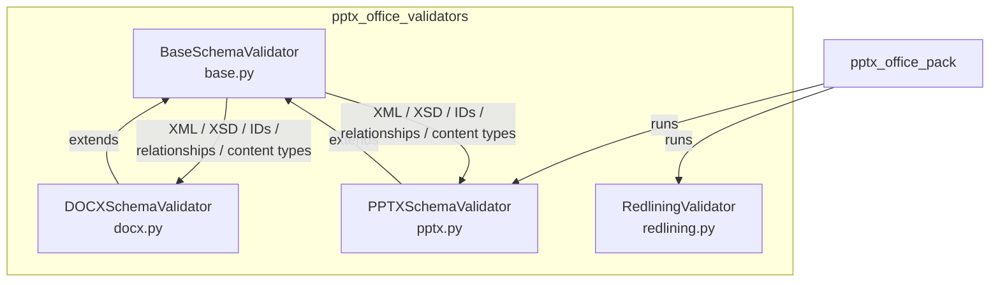
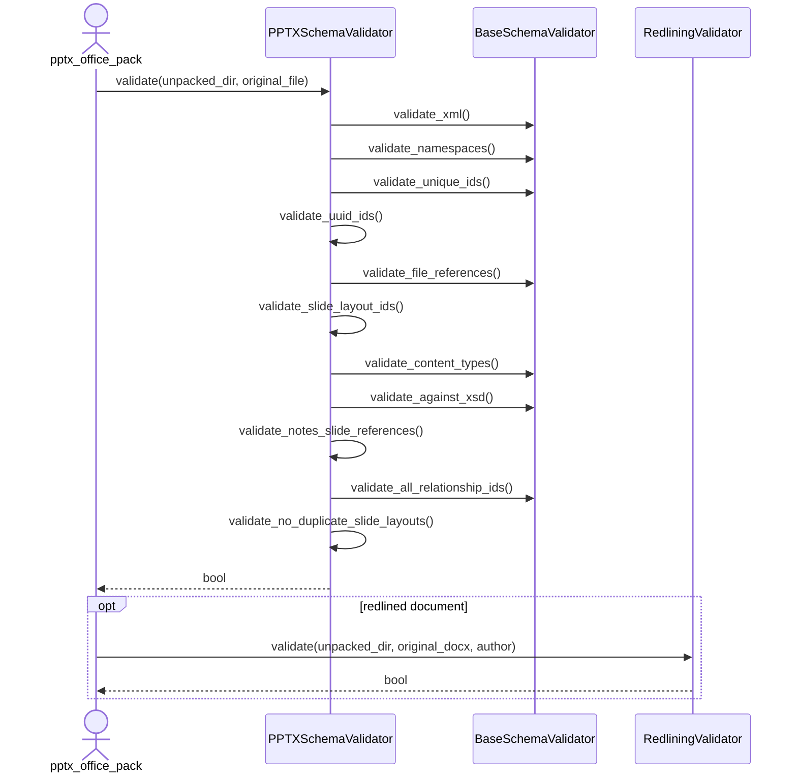

# pptx_office_validators

## Introduction

`pptx_office_validators` is a small but focused Office Open XML (OOXML) validation library used by the legacy Anthropic doc-skills PPTX tooling. It validates unpacked `.docx`, `.pptx`, and related Office documents before they are repacked, ensuring that the generated XML is well-formed, schema-compliant, internally consistent, and safe to open in Microsoft Office and other OOXML consumers.

The module is located under `skills/ainxt_docskills/pptx/scripts/office/validators/` and is consumed by the pack/repack pipeline (see [pptx_office_pack](pptx_office_pack.md) and [pptx_office_validate](pptx_office_validate.md)). It is also related to the broader document-processing skills family:

- [docx_office_validators](docx_office_validators.md) – equivalent validators for the DOCX skill tree
- [xlsx_office_validators](xlsx_office_validators.md) – equivalent validators for the XLSX skill tree
- [pptx_office_pack](pptx_office_pack.md) / [pptx_office_unpack](pptx_office_unpack.md) – ZIP pack/unpack helpers that run these validators
- [pptx_office_simplify_redlines](pptx_office_simplify_redlines.md) – redline simplification helper used before validation

## Architecture Overview

The module is built around a shared base validator and three concrete validator implementations:

### Design Principles

1. **Shared foundation** – `BaseSchemaValidator` centralises OOXML-agnostic checks (well-formed XML, namespace declarations, unique IDs, relationship integrity, content-type declarations, XSD validation).
2. **Format-specific extensions** – `DOCXSchemaValidator` and `PPTXSchemaValidator` add rules for Word and PowerPoint respectively (whitespace preservation, tracked changes, slide layout references, UUID checks).
3. **Redlining as a separate concern** – `RedliningValidator` does not inherit from the base class; it compares text content before and after removing an author's tracked changes to ensure edits were properly recorded.
4. **Repair before reject** – the base validator and `DOCXSchemaValidator` expose `repair()` methods that fix common issues (e.g. missing `xml:space="preserve"`, out-of-range `durableId` values) before the stricter validation pass runs.

## Sub-modules

Detailed component documentation for each validator class is available in the sub-module files linked below.

| Sub-module | Files | Responsibility |
|------------|-------|----------------|
| [pptx_office_validators_base](pptx_office_validators_base.md) | `base.py` | Common OOXML validation framework: XML well-formedness, namespaces, unique IDs, file references, content types, XSD schema checks, and generic repairs. |
| [pptx_office_validators_schema](pptx_office_validators_schema.md) | `docx.py`, `pptx.py` | Format-specific schema validators for Word (`DOCXSchemaValidator`) and PowerPoint (`PPTXSchemaValidator`). |
| [pptx_office_validators_redlining](pptx_office_validators_redlining.md) | `redlining.py` | Validates that tracked changes by a given author preserve the original document text when removed. |

## Data Flow

A typical validation run is triggered by the pack script after XML edits have been made to an unpacked Office package:

## Validation Coverage

| Concern | Base | DOCX | PPTX | Redlining |
|---------|------|------|------|-----------|
| Well-formed XML | ✅ | ✅ | ✅ | ✅ |
| Namespace declarations | ✅ | ✅ | ✅ | – |
| Unique IDs (file/global scope) | ✅ | ✅ | ✅ | – |
| Relationship integrity | ✅ | ✅ | ✅ | – |
| Content-type declarations | ✅ | ✅ | ✅ | – |
| XSD schema validation | ✅ | ✅ | ✅ | – |
| Whitespace preservation | – | ✅ | – | – |
| Tracked-change nesting | – | ✅ | – | ✅ |
| `paraId` / `durableId` constraints | – | ✅ | – | – |
| Comment marker pairing | – | ✅ | – | – |
| UUID-like ID hex checks | – | – | ✅ | – |
| Slide layout references | – | – | ✅ | – |
| Notes-slide uniqueness | – | – | ✅ | – |

## Integration Notes

- The validators operate on an **unpacked directory** produced by [pptx_office_unpack](pptx_office_unpack.md), not on the original `.pptx`/`.docx` ZIP file.
- `original_file` is optional but recommended; it lets `validate_against_xsd()` ignore pre-existing XSD errors that were already present in the source document.
- XSD schemas are loaded from `schemas_dir`, which is resolved relative to the validator source file (`../schemas`).
- `RedliningValidator` is only relevant for Word documents and is typically invoked when the editing agent is expected to produce tracked changes.

## See Also

- [pptx_office_validators_base](pptx_office_validators_base.md)
- [pptx_office_validators_schema](pptx_office_validators_schema.md)
- [pptx_office_validators_redlining](pptx_office_validators_redlining.md)
- [pptx_office_pack](pptx_office_pack.md)
- [pptx_office_unpack](pptx_office_unpack.md)
- [pptx_office_simplify_redlines](pptx_office_simplify_redlines.md)
- [docx_office_validators](docx_office_validators.md)
- [xlsx_office_validators](xlsx_office_validators.md)
