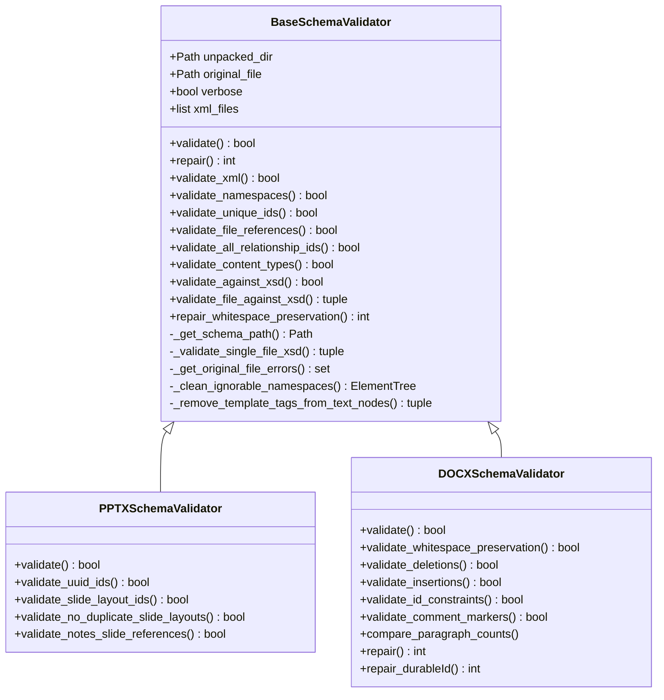
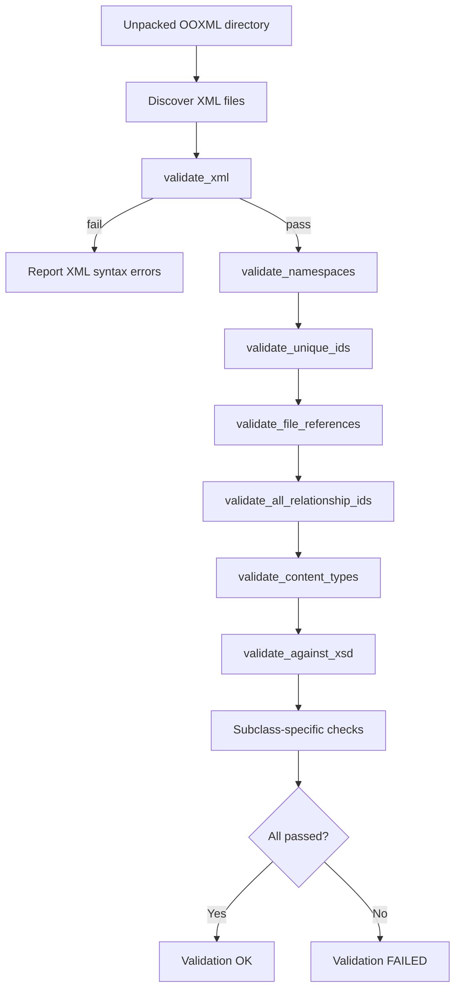
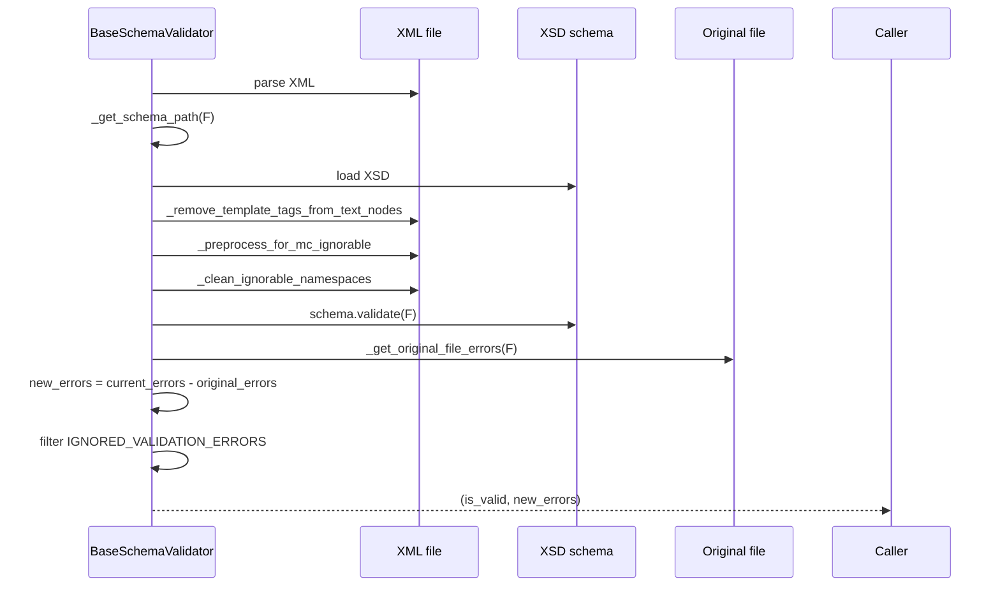
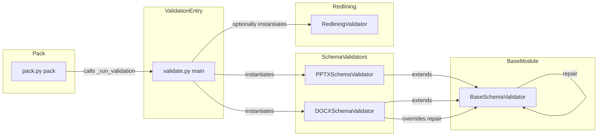
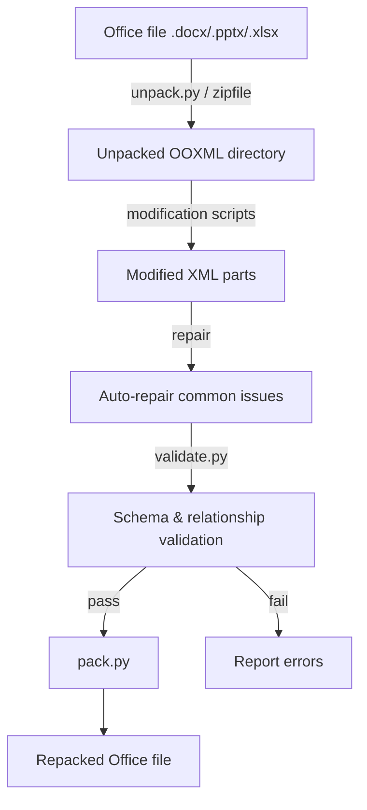

# pptx_office_validators_base

## Brief Introduction

`pptx_office_validators_base` is the foundational module for Office Open XML (OOXML) document validation in the `ainxt_docskills` PPTX skill set. It defines `BaseSchemaValidator`, an abstract base class that encapsulates common validation logic shared across Word (`.docx`), PowerPoint (`.pptx`), and Excel (`.xlsx`) documents.

The validator operates on **unpacked** OOXML packages (the ZIP-expanded directory structure) and checks structural integrity, XML well-formedness, namespace correctness, ID uniqueness, relationship consistency, content-type declarations, and XSD schema conformance. It also provides a baseline repair mechanism for whitespace preservation issues.

This module is intentionally generic; format-specific rules (e.g., DOCX redlining, PPTX slide layout references) are implemented in subclasses. See [pptx_office_validators_schema](pptx_office_validators_schema.md) and [pptx_office_validators_redlining](pptx_office_validators_redlining.md) for those extensions.

---

## Core Functionality

### `BaseSchemaValidator`

The central class in this module. It is initialized with the path to an unpacked OOXML directory and an optional original file for differential validation.

```python
validator = BaseSchemaValidator(
    unpacked_dir="/path/to/unpacked",
    original_file="/path/to/original.pptx",
    verbose=True,
)
```

> **Note:** `BaseSchemaValidator.validate()` raises `NotImplementedError`. Use concrete subclasses such as `PPTXSchemaValidator` or `DOCXSchemaValidator` for actual validation.

### Validation Dimensions

| Validation | Purpose |
|------------|---------|
| `validate_xml()` | Ensures every `.xml` / `.rels` file is well-formed. |
| `validate_namespaces()` | Verifies that namespace prefixes listed in `mc:Ignorable` are actually declared. |
| `validate_unique_ids()` | Detects duplicate IDs for elements such as comments, bookmarks, shapes, slides, and slide layouts. |
| `validate_file_references()` | Checks that every `.rels` target exists and that every non-rels file is referenced. |
| `validate_all_relationship_ids()` | Ensures `r:id` / `r:embed` / `r:link` attributes point to existing relationship IDs of the expected type. |
| `validate_content_types()` | Confirms that `[Content_Types].xml` declares every declarable XML part and known media extension. |
| `validate_against_xsd()` | Validates each XML part against the appropriate ECMA-376 / ISO-IEC 29500 XSD schema, ignoring pre-existing errors from the original file. |

### Repair Capabilities

The base class exposes a `repair()` hook that subclasses can extend. The base implementation repairs whitespace preservation:

- `repair_whitespace_preservation()` — adds `xml:space="preserve"` to `<w:t>`-like text elements that contain leading or trailing whitespace.

Subclasses may add their own repairs (e.g., `DOCXSchemaValidator.repair_durableId()`).

### Key Class Constants

- `UNIQUE_ID_REQUIREMENTS` — maps element names to the attribute and scope (`file` or `global`) that must be unique.
- `SCHEMA_MAPPINGS` — maps file names / namespaces to XSD schema files under `../schemas`.
- `OOXML_NAMESPACES` — allow-list of namespaces used during XSD validation pre-processing.
- `MAIN_CONTENT_FOLDERS` — identifies `word`, `ppt`, and `xl` as primary document folders.

---

## Architecture & Component Relationships

### Class Hierarchy



### Validation Pipeline



### XSD Validation Flow



### Relationship Between Validation, Packing, and Repair



---

## How It Fits into the Overall System

`pptx_office_validators_base` sits at the bottom of the Office document processing stack within the `shared_skills` domain. It is consumed by higher-level scripts that unpack, modify, and repackage OOXML files.

### Position in the Document Lifecycle



### Upstream Consumers

| Consumer | Role | Reference |
|----------|------|-----------|
| `validate.py` | CLI entry point that selects the correct validator subclass and runs validation. | [pptx_office_validate](pptx_office_validate.md) |
| `pack.py` | Repackages an unpacked directory into a `.docx`/`.pptx`/`.xlsx`; optionally runs validation first. | [pptx_office_pack](pptx_office_pack.md) |
| `PPTXSchemaValidator` | Adds PowerPoint-specific rules on top of the base validator. | [pptx_office_validators_schema](pptx_office_validators_schema.md) |
| `DOCXSchemaValidator` | Adds Word-specific rules (redlining, comments, paragraph counts, durable IDs). | [pptx_office_validators_schema](pptx_office_validators_schema.md) |
| `RedliningValidator` | Validates tracked changes by comparing modified and original document text. | [pptx_office_validators_redlining](pptx_office_validators_redlining.md) |

### Downstream Dependencies

The module relies on:

- `lxml.etree` — XML parsing, XPath, and XSD schema validation.
- `defusedxml.minidom` — safe DOM parsing for repair operations.
- `pathlib` — filesystem traversal.
- `re` — template-tag and UUID detection.
- `tempfile` / `zipfile` — extracting the original file for differential error comparison.
- Local XSD schemas under `../schemas` (relative to `base.py`).

---

## Integration Example

A typical call chain when packing a modified PPTX:

```python
# Inside pack.py
success, output = _run_validation(
    input_dir,
    original_path,
    suffix=".pptx",
    infer_author_func=infer_author_func,
)
# _run_validation internally uses PPTXSchemaValidator(...).validate()
```

The validator is also invoked directly from the command line:

```bash
python -m office.validators.validate /path/to/unpacked --original /path/to/original.pptx -v
```

---

## References

- [pptx_office_validators_schema](pptx_office_validators_schema.md) — `PPTXSchemaValidator` and `DOCXSchemaValidator` subclasses.
- [pptx_office_validators_redlining](pptx_office_validators_redlining.md) — `RedliningValidator` for tracked-change verification.
- [pptx_office_pack](pptx_office_pack.md) — repacking logic that invokes validation before zipping.
- [pptx_office_validate](pptx_office_validate.md) — CLI orchestrator that selects and runs validators.
- [pptx_office_simplify_redlines](pptx_office_simplify_redlines.md) — helper for merging tracked changes before validation.
- [pptx_office_merge_runs](pptx_office_merge_runs.md) — run-merging helper used during document cleanup.
