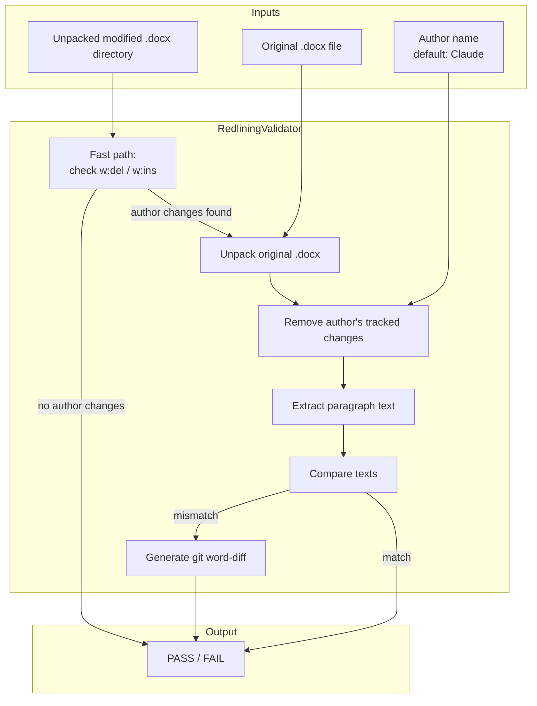
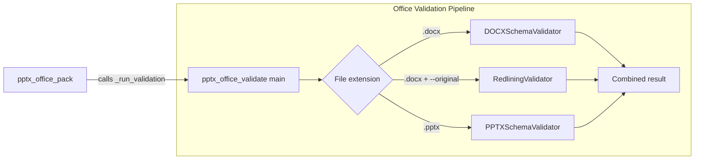
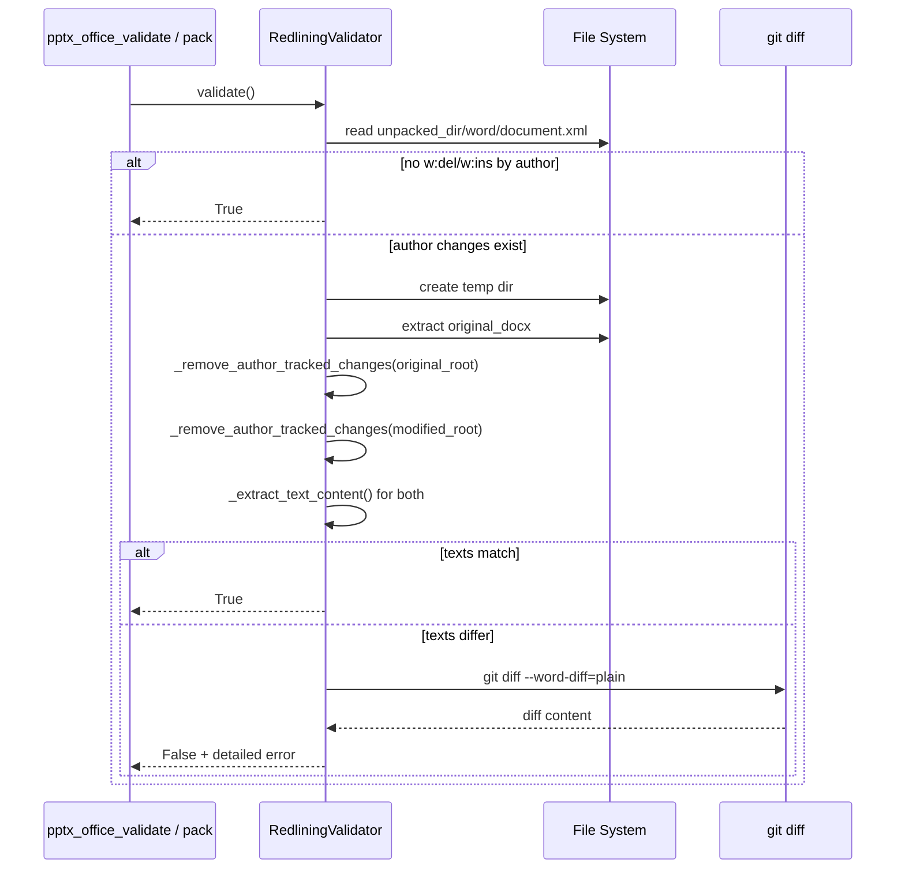

# pptx_office_validators_redlining

## Brief Introduction

The `pptx_office_validators_redlining` module provides semantic validation of tracked changes (redlining) in Word `.docx` documents. It ensures that any textual modifications made by a designated author are correctly captured as tracked changes, preventing silent edits that would otherwise corrupt the document's revision history.

This module is part of the larger Office document processing toolkit located under `skills\ainxt_docskills\pptx\scripts\office\`. Although the path contains `pptx`, the `RedliningValidator` is specifically designed for WordprocessingML documents (`.docx`). It is invoked by the [pptx_office_validate](pptx_office_validate.md) orchestrator and indirectly by [pptx_office_pack](pptx_office_pack.md) when packing a modified document back into an Office Open XML package.

---

## Core Responsibility

`RedliningValidator` answers one critical question:

> *After removing all tracked changes authored by the agent, does the modified document still match the original document?*

If the texts differ, it means the agent introduced changes without tracking them, or it mishandled another author's tracked changes (for example, deleting text inside someone else's insertion without nesting a deletion tag).

---

## Architecture

### Component Overview



### Relationship to Other Validators



For a full description of the base validation framework, see [pptx_office_validators_base](pptx_office_validators_base.md). Schema-specific validation for Word documents is documented in [pptx_office_validators_schema](pptx_office_validators_schema.md).

---

## Core Component: `RedliningValidator`

### Constructor

```python
RedliningValidator(
    unpacked_dir: str | Path,   # Directory containing the unpacked modified .docx
    original_docx: str | Path,  # Path to the original .docx package
    verbose: bool = False,      # Print PASSED / diagnostic messages
    author: str = "Claude"      # Author whose tracked changes should be evaluated
)
```

### Public Methods

| Method | Returns | Purpose |
|--------|---------|---------|
| `repair()` | `int` | No-op for this validator (always returns `0`). Repairs are handled by [pptx_office_validators_schema](pptx_office_validators_schema.md) and the base class. |
| `validate()` | `bool` | Runs the full redlining validation and returns `True` if all author changes are properly tracked. |

### Validation Algorithm

1. **Fast path** — Parse `word/document.xml` from the modified directory and look for any `<w:del>` or `<w:ins>` elements whose `w:author` attribute matches the configured author.
2. **No changes found** — If the author made no tracked changes, validation passes immediately.
3. **Unpack original** — Extract the original `.docx` into a temporary directory.
4. **Normalize both trees** — For both the modified and original `document.xml`, remove the author's insertions and convert the author's deletions back into normal text nodes.
5. **Extract text** — Collect all paragraph text from both normalized documents.
6. **Compare** — If the extracted texts are identical, the author's tracked changes are semantically correct; validation passes.
7. **Report differences** — If the texts differ, produce a detailed `git --word-diff` report explaining the likely causes and correct redlining patterns.

---

## Data Flow



---

## Key Implementation Details

### Removing Author Tracked Changes

The private method `_remove_author_tracked_changes(root)` performs two operations:

- **Insertions (`<w:ins>`)** — Elements authored by the configured author are removed entirely, reverting the document to the state before those insertions.
- **Deletions (`<w:del>`)** — Elements authored by the configured author are *expanded*: `<w:delText>` children are converted back to `<w:t>` elements and hoisted into the parent, restoring the deleted text.

This normalization lets the validator compare the "pre-agent" view of both documents.

### Text Extraction

`_extract_text_content(root)` walks every `<w:p>` paragraph and concatenates the text of all descendant `<w:t>` elements. Empty paragraphs are ignored. The resulting string is a normalized, paragraph-separated representation of the document body.

### Diff Generation

When a mismatch is detected, `_generate_detailed_diff` builds a human-readable message that includes:

- Likely root causes (untracked edits, edits inside another author's tracked changes, incorrect nesting).
- Correct patterns for pre-redlined documents:
  - Reject another author's insertion: nest `<w:del>` inside their `<w:ins>`.
  - Restore another author's deletion: add a new `<w:ins>` after their `<w:del>`.
- A `git --word-diff=plain` character-level diff between the two texts.

---

## Integration Points

| Consumer | Usage |
|----------|-------|
| [pptx_office_validate](pptx_office_validate.md) | Instantiates `RedliningValidator` for `.docx` files when `--original` is supplied. |
| [pptx_office_pack](pptx_office_pack.md) | Calls `_run_validation` before zipping the unpacked directory; redlining validation runs if an original file is provided. |
| [pptx_office_simplify_redlines](pptx_office_simplify_redlines.md) | Related helper that merges adjacent tracked changes; can be used as a pre-processing step before validation. |

---

## Error Scenarios

| Scenario | Behavior |
|----------|----------|
| `word/document.xml` missing in modified directory | Prints `FAILED - Modified document.xml not found` and returns `False`. |
| Original `.docx` cannot be unpacked | Prints `FAILED - Error unpacking original docx` and returns `False`. |
| XML parse error | Prints `FAILED - Error parsing XML files` and returns `False`. |
| Text mismatch after normalization | Prints detailed diff with likely causes and returns `False`. |
| `git` not available | Still reports the failure, but omits the word-level diff. |

---

## Design Notes

- The validator intentionally does **not** repair redlining issues. It is a read-only semantic check.
- It relies on the WordprocessingML namespace `http://schemas.openxmlformats.org/wordprocessingml/2006/main` and is not applicable to `.pptx` or `.xlsx` files.
- The `author` parameter makes the validator reusable for agents or tools that use a different attribution name.

---

## See Also

- [pptx_office_validators_base](pptx_office_validators_base.md) — Base schema validation framework.
- [pptx_office_validators_schema](pptx_office_validators_schema.md) — DOCX and PPTX schema validators.
- [pptx_office_validate](pptx_office_validate.md) — Command-line validation entry point.
- [pptx_office_pack](pptx_office_pack.md) — Packing and validation orchestration.
- [pptx_office_simplify_redlines](pptx_office_simplify_redlines.md) — Helper for merging adjacent tracked changes.
