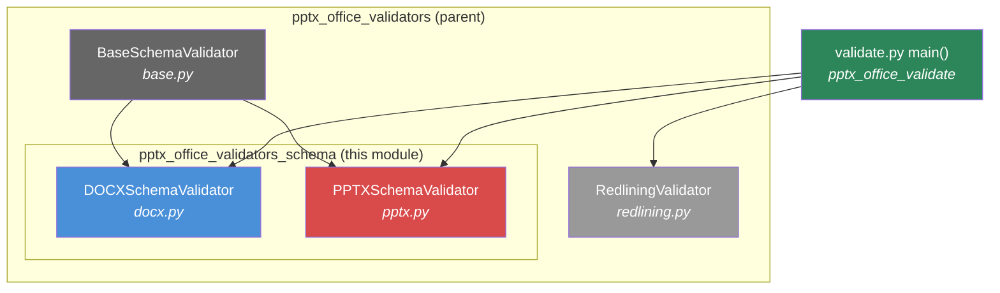
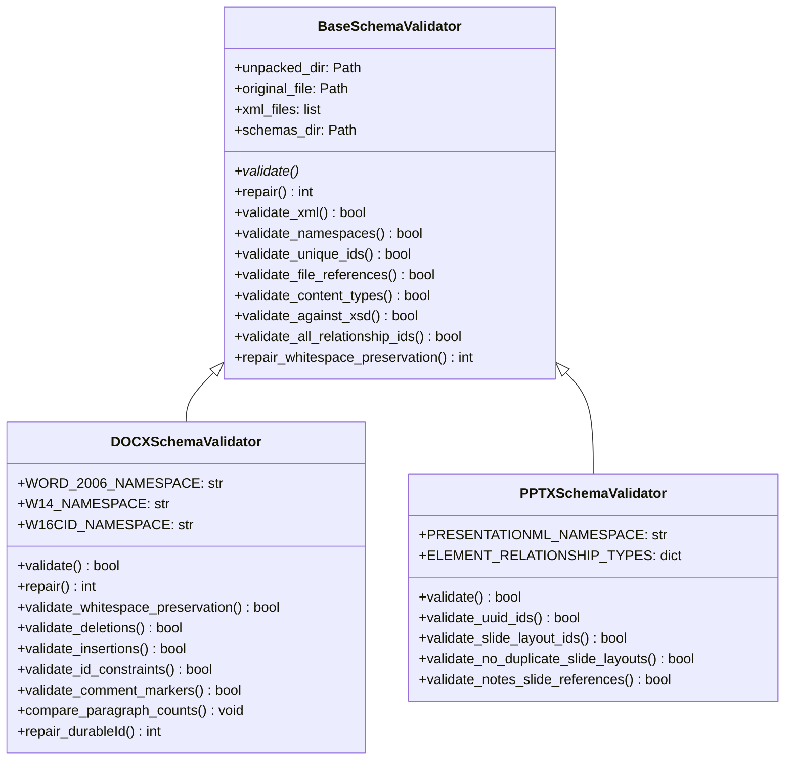
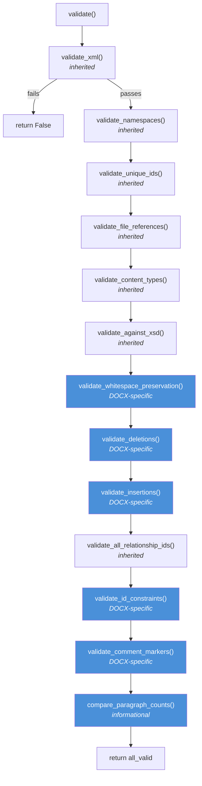
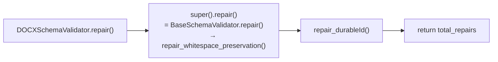
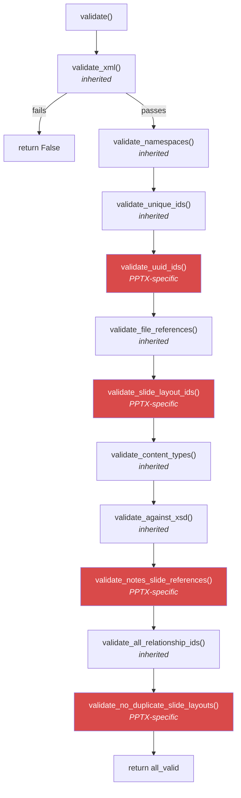
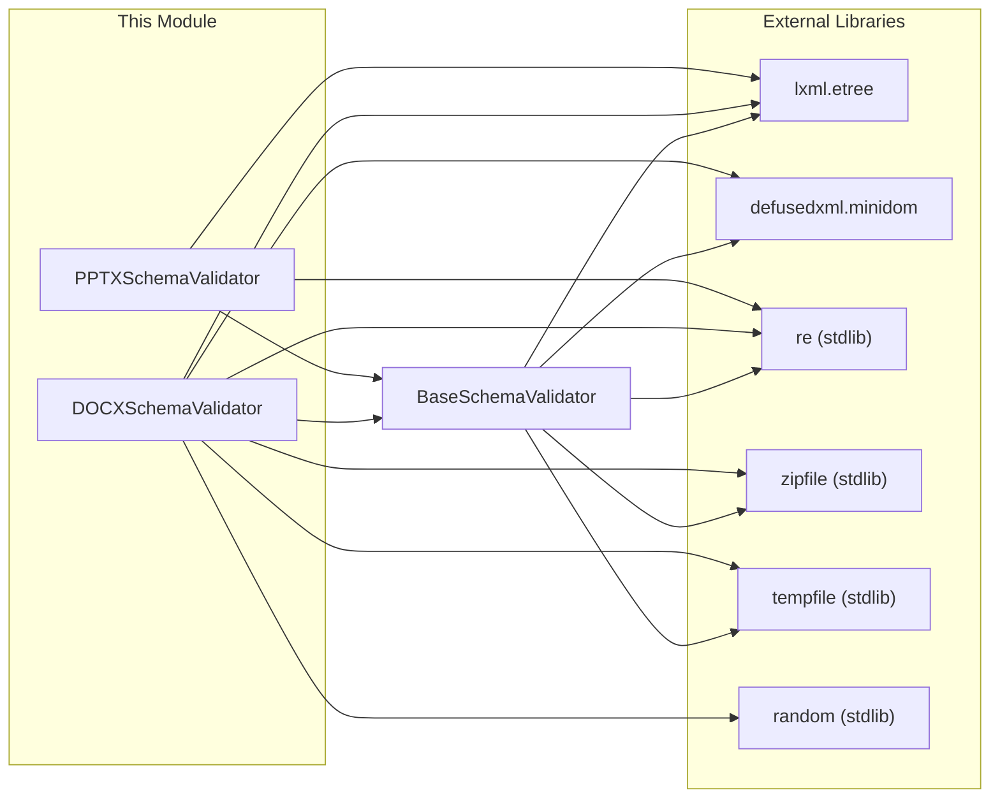
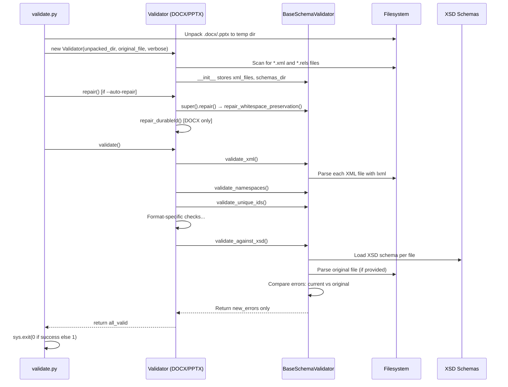
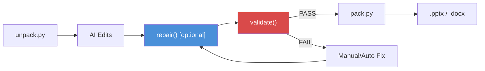

# pptx_office_validators_schema

## Introduction

The `pptx_office_validators_schema` module provides **format-specific schema validators** for Office Open XML (OOXML) documents. It contains two concrete validator classes — `DOCXSchemaValidator` and `PPTXSchemaValidator` — that extend the shared `BaseSchemaValidator` infrastructure to enforce the XML schema (XSD) and structural integrity rules specific to Word (`.docx`) and PowerPoint (`.pptx`) files respectively.

These validators are part of the broader `pptx_office_validators` family within the Anthropic doc-skills toolkit. They are invoked during the document generation pipeline to ensure that AI-generated or AI-modified Office documents are well-formed, schema-compliant, and will open correctly in Microsoft Office and other OOXML consumers.

> **Module Location:** `skills/ainxt_docskills/pptx/scripts/office/validators/`
>
> **Sibling Modules:**
> - [pptx_office_validators_base](pptx_office_validators_base.md) — `BaseSchemaValidator` providing shared validation/repair infrastructure
> - [pptx_office_validators_redlining](pptx_office_validators_redlining.md) — `RedliningValidator` for tracked-changes integrity
> - [pptx_office_validate](pptx_office_validate.md) — CLI entry point (`validate.py`) that orchestrates all validators

---

## Architecture Overview

### Inheritance & Delegation

Both validators in this module inherit from `BaseSchemaValidator` and override the `validate()` method to orchestrate a sequence of format-specific checks. They also override `repair()` to add format-specific auto-repair logic on top of the base class's whitespace-preservation repair.

---

## DOCXSchemaValidator

Validates Word Processing ML (`.docx`) documents against the OOXML schema and Word-specific structural rules.

### Namespace Constants

| Constant | URI | Purpose |
|---|---|---|
| `WORD_2006_NAMESPACE` | `http://schemas.openxmlformats.org/wordprocessingml/2006/main` | Core WordprocessingML namespace (`w:` prefix) |
| `W14_NAMESPACE` | `http://schemas.microsoft.com/office/word/2010/wordml` | Word 2010 extensions (`w14:` prefix, e.g. `paraId`) |
| `W16CID_NAMESPACE` | `http://schemas.microsoft.com/office/word/2016/wordml/cid` | Word 2016 content ID extensions (`w16cid:` prefix, e.g. `durableId`) |

### Validation Pipeline

The `validate()` method runs the following checks in sequence. If `validate_xml()` fails (malformed XML), the method returns `False` immediately. All subsequent checks run regardless of individual failures, and the overall result is the logical AND of all checks.

#### DOCX-Specific Validation Checks

| Method | What It Checks | Failure Impact |
|---|---|---|
| `validate_whitespace_preservation()` | Every `<w:t>` element with leading/trailing whitespace must have `xml:space="preserve"` | Text rendering corruption — leading/trailing spaces silently dropped |
| `validate_deletions()` | No `<w:t>` or `<w:instrText>` elements inside `<w:del>` (deleted text must use `<w:delText>`; deleted instructions must use `<w:delInstrText>`) | Schema violation; document may not open |
| `validate_insertions()` | No `<w:delText>` elements inside `<w:ins>` (unless also inside `<w:del>`) | Schema violation; tracked changes semantics broken |
| `validate_id_constraints()` | `w14:paraId` values must be `< 0x80000000` (hex); `w16cid:durableId` values must be `< 0x7FFFFFFF` (hex, or decimal in `numbering.xml`) | ID overflow; Office may reject the document |
| `validate_comment_markers()` | Every `commentRangeStart` has a matching `commentRangeEnd` (and vice versa); all comment markers reference existing comments in `comments.xml` | Orphaned markers; comments may not display |
| `compare_paragraph_counts()` | Compares paragraph count between the original and modified `document.xml` (informational only — does not affect pass/fail) | N/A — diagnostic output |

### Repair Pipeline

`repair_durableId()` scans all XML files for `w16cid:durableId` attributes that exceed the maximum allowed value (`0x7FFFFFFF`) or are non-numeric in `numbering.xml`. It replaces offending values with a random valid ID:
- In `numbering.xml`: decimal string (e.g. `"1234567890"`)
- In all other files: 8-digit uppercase hex string (e.g. `"0A1B2C3D"`)

---

## PPTXSchemaValidator

Validates Presentation ML (`.pptx`) documents against the OOXML schema and PowerPoint-specific structural rules.

### Namespace & Configuration Constants

| Constant | Value | Purpose |
|---|---|---|
| `PRESENTATIONML_NAMESPACE` | `http://schemas.openxmlformats.org/presentationml/2006/main` | Core PresentationML namespace (`p:` prefix) |
| `ELEMENT_RELATIONSHIP_TYPES` | Maps element tag names to expected relationship type keywords | Used by `validate_all_relationship_ids()` (inherited) to verify that `r:id` references point to the correct relationship type |

The `ELEMENT_RELATIONSHIP_TYPES` mapping:

| Element Tag | Expected Relationship Type |
|---|---|
| `sldid` | `slide` |
| `sldmasterid` | `slidemaster` |
| `notesmasterid` | `notesmaster` |
| `sldlayoutid` | `slidelayout` |
| `themeid` | `theme` |
| `tablestyleid` | `tablestyles` |

### Validation Pipeline

#### PPTX-Specific Validation Checks

| Method | What It Checks | Failure Impact |
|---|---|---|
| `validate_uuid_ids()` | Any attribute value that looks like a UUID (32 hex chars) must match the standard UUID pattern `XXXXXXXX-XXXX-XXXX-XXXX-XXXXXXXXXXXX` | Malformed UUIDs; Office may fail to resolve references |
| `validate_slide_layout_ids()` | Every `<p:sldLayoutId>` in a slide master must reference an `r:id` that exists in the slide master's `.rels` file and points to a `slideLayout` relationship | Broken layout references; slides may render with wrong or missing layouts |
| `validate_notes_slide_references()` | No notes slide file is referenced by more than one slide (each slide must have its own notes slide or none) | Shared notes slides; notes may appear on wrong slides |
| `validate_no_duplicate_slide_layouts()` | Each slide's `.rels` file contains at most one `slideLayout` relationship | Ambiguous layout; Office may pick the wrong layout or fail |

---

## Shared Infrastructure (Inherited)

Both validators rely heavily on the `BaseSchemaValidator` base class for common OOXML validation tasks. The following inherited methods are called by both `DOCXSchemaValidator.validate()` and `PPTXSchemaValidator.validate()`:

| Inherited Method | Description |
|---|---|
| `validate_xml()` | Parses every XML/rels file with `lxml.etree` to ensure well-formedness |
| `validate_namespaces()` | Checks that all namespace prefixes referenced in `mc:Ignorable` attributes are actually declared |
| `validate_unique_ids()` | Enforces uniqueness of IDs (file-scoped or global) for elements listed in `UNIQUE_ID_REQUIREMENTS` |
| `validate_file_references()` | Verifies all `.rels` targets resolve to existing files and all files are referenced |
| `validate_content_types()` | Ensures all content parts are declared in `[Content_Types].xml` |
| `validate_against_xsd()` | Validates each XML file against its corresponding XSD schema, reporting only *new* errors (not present in the original file) |
| `validate_all_relationship_ids()` | Cross-checks `r:id`, `r:embed`, and `r:link` attribute values against the corresponding `.rels` file |

> For full details on the shared infrastructure, see [pptx_office_validators_base](pptx_office_validators_base.md).

---

## Dependency Graph

---

## Data Flow

The following diagram illustrates how a document flows through the validation pipeline, from the CLI entry point through schema validation:

---

## Integration with the Document Pipeline

These validators are used within the Anthropic doc-skills PPTX pipeline. The typical workflow is:

1. **Unpack** — The `unpack.py` script extracts a `.pptx`/`.docx` file into a working directory of XML parts.
2. **Modify** — AI-generated edits are applied to the unpacked XML (e.g., adding slides, modifying text, inserting tracked changes).
3. **Validate** — The `validate.py` CLI (see [pptx_office_validate](pptx_office_validate.md)) instantiates the appropriate schema validator and runs all checks.
4. **Repair** (optional) — If `--auto-repair` is passed, common issues (whitespace preservation, durableId overflow) are automatically fixed before validation.
5. **Pack** — The `pack.py` script re-zips the validated XML parts back into a `.pptx`/`.docx` file.

### Related Skill Modules

| Module | Role |
|---|---|
| [pptx_office_validate](pptx_office_validate.md) | CLI entry point that selects and runs validators based on file type |
| [pptx_office_validators_base](pptx_office_validators_base.md) | `BaseSchemaValidator` — shared validation and repair infrastructure |
| [pptx_office_validators_redlining](pptx_office_validators_redlining.md) | `RedliningValidator` — verifies tracked changes preserve document semantics |
| `pptx_office_pack` | Re-packages validated XML parts into an Office file |
| `pptx_office_unpack` | Extracts Office file into a directory of XML parts |

---

## Cross-Module Duplication Note

The validators in this module are **duplicated** across multiple skill directories in the repository. Identical copies of `docx.py`, `pptx.py`, `base.py`, and `redlining.py` exist under:

- `skills/ainxt_docskills/pptx/scripts/office/validators/` ← **this module**
- `skills/ainxt_docskills/docx/scripts/office/validators/`
- `skills/ainxt_docskills/xlsx/scripts/office/validators/`
- `ABStudio/skills/ainxt-skills/pptx/scripts/office/validators/`
- `ABStudio/skills/ainxt-skills/docx/scripts/office/validators/`
- `ABStudio/skills/ainxt-skills/xlsx/scripts/office/validators/`

This duplication exists because each Office skill (docx, pptx, xlsx) is packaged as a self-contained unit. The documentation here covers the `pptx` variant; the behavior is identical across all copies.

---

## Key Design Decisions

### 1. Differential XSD Validation
The `validate_against_xsd()` method (inherited from `BaseSchemaValidator`) does not simply check whether the XML is valid against the XSD. Instead, it compares errors found in the **modified** file against errors in the **original** file and only reports **new** errors. This allows validation of documents that were already non-compliant before AI modification, focusing on regressions introduced by the editing process.

### 2. Format-Specific `ELEMENT_RELATIONSHIP_TYPES`
`PPTXSchemaValidator` populates `ELEMENT_RELATIONSHIP_TYPES` to enable type-aware relationship validation (inherited `validate_all_relationship_ids()`). `DOCXSchemaValidator` leaves this empty (`{}`), meaning it checks that `r:id` references exist but does not enforce type matching — this is appropriate because Word documents have more heterogeneous relationship types.

### 3. Informational vs. Blocking Checks
`compare_paragraph_counts()` in `DOCXSchemaValidator` is purely informational — it prints the paragraph count delta but does not affect the pass/fail result. This provides developers with a quick sanity check for unexpected structural changes without failing validation on legitimate additions/removals.

### 4. Repair Before Validate
The CLI supports `--auto-repair` which runs `repair()` before `validate()`. The repair pipeline is additive: `DOCXSchemaValidator.repair()` calls `super().repair()` first (whitespace preservation) and then adds `repair_durableId()`. `PPTXSchemaValidator` does not override `repair()`, so it inherits only the base whitespace repair.
