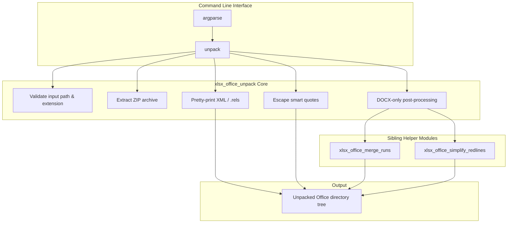
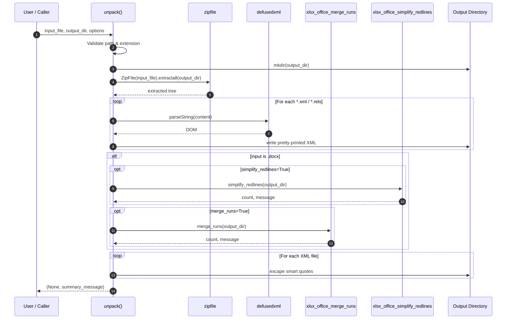
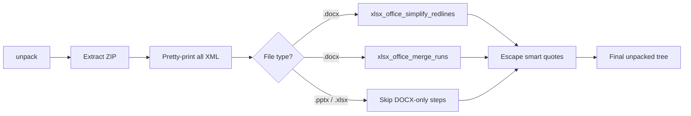
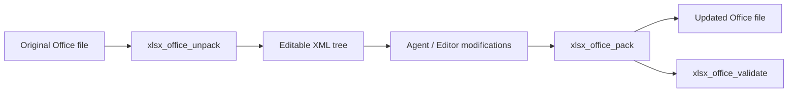

# xlsx_office_unpack

## Brief Introduction

The `xlsx_office_unpack` module provides a command-line utility and programmatic API for unpacking Microsoft Office Open XML files—**DOCX**, **PPTX**, and **XLSX**—into editable directory trees. It is part of the legacy `ainxt_docskills` XLSX skill suite and serves as the first step in an edit-roundtrip workflow: extract the ZIP archive, pretty-print all XML parts, normalize smart quotes, and (for DOCX only) optionally merge adjacent formatting runs and simplify redundant tracked changes.

This module is intentionally narrow in scope. It does not modify document semantics; it only prepares the on-disk representation so that downstream generators, validators, and diff tools can work with clean, human-readable XML.

---

## Comprehensive Documentation

### 1. Purpose and Core Functionality

Office Open XML files are ZIP archives containing a predictable hierarchy of XML files, relationship files (`.rels`), and embedded media. Before an agent or editor can safely modify one of these files, it is usually helpful to:

1. Extract the archive to a directory.
2. Re-format XML into a stable, diff-friendly layout.
3. Escape characters that can be mangled by naive XML serializers (curly/smart quotes).
4. For DOCX, collapse redundant `<w:r>` runs and adjacent tracked changes so that later edits operate on a cleaner document model.

`xlsx_office_unpack` performs exactly these steps. It exposes a single high-level function, `unpack()`, plus two small helpers for XML pretty-printing and smart-quote escaping. DOCX-specific post-processing is delegated to dedicated helper modules so that the unpacker itself stays format-agnostic for the extraction phase.

### 2. Architecture

The module is structured as a thin orchestration layer over the Python standard library (`zipfile`, `pathlib`, `argparse`) and `defusedxml` for safe XML parsing. DOCX-specific transformations are imported from sibling helper modules.



### 3. Component Reference

#### `unpack(input_file, output_directory, merge_runs=True, simplify_redlines=True)`

The main entry point. It returns a tuple `(None, message)` where `message` describes the result or any error encountered.

| Step | Description |
|------|-------------|
| Validate input | Checks that the file exists and has a `.docx`, `.pptx`, or `.xlsx` extension. |
| Create output dir | Ensures the target directory exists (`mkdir(parents=True, exist_ok=True)`). |
| Extract archive | Uses `zipfile.ZipFile.extractall()` to unpack the Office file. |
| Pretty-print XML | Walks all `*.xml` and `*.rels` files and rewrites them with `defusedxml.minidom.toprettyxml()`. |
| DOCX post-processing | If the input is `.docx`, optionally invokes `merge_runs` and `simplify_redlines`. |
| Escape smart quotes | Replaces curly quotes with numeric XML entities to prevent round-trip corruption. |

**Supported formats:** `.docx`, `.pptx`, `.xlsx`  
**DOCX-only options:** `merge_runs`, `simplify_redlines` (ignored for PPTX/XLSX)

#### `_pretty_print_xml(xml_file: Path)`

Reads an XML file, parses it with `defusedxml.minidom`, and writes it back using `toprettyxml(indent="  ", encoding="utf-8")`. Errors are silently swallowed so that a single malformed file does not abort the entire unpack operation.

#### `_escape_smart_quotes(xml_file: Path)`

Performs a text-level replacement of Unicode smart quotes with numeric character entities:

| Character | Entity |
|-----------|--------|
| `"` | `&#x201C;` |
| `"` | `&#x201D;` |
| `'` | `&#x2018;` |
| `'` | `&#x2019;` |

This preserves the visual character while avoiding common XML serialization issues where curly quotes are converted to ambiguous byte sequences.

### 4. Data Flow



### 5. Component Interaction

The unpacker does not directly manipulate DOM nodes for run merging or redline simplification. Instead, it delegates to the helper modules that own those responsibilities:

- **[xlsx_office_merge_runs](xlsx_office_merge_runs.md)** — Collapses adjacent `<w:r>` elements in `word/document.xml` that share identical formatting properties.
- **[xlsx_office_simplify_redlines](xlsx_office_simplify_redlines.md)** — Merges consecutive tracked insertions or deletions in `word/document.xml` when they originate from the same author.

Both helpers operate on the already pretty-printed `word/document.xml` and rewrite it in place. The unpacker then applies smart-quote escaping as a final pass over all XML files.



### 6. Process Flows

#### 6.1 CLI Usage

```bash
# Basic unpack
python unpack.py document.docx unpacked/

# Unpack without run merging or redline simplification
python unpack.py document.docx unpacked/ --merge-runs false --simplify-redlines false

# Unpack a spreadsheet or presentation
python unpack.py workbook.xlsx unpacked/
python unpack.py slides.pptx unpacked/
```

#### 6.2 Programmatic Usage

```python
from unpack import unpack

_, message = unpack(
    input_file="report.docx",
    output_directory="report_unpacked",
    merge_runs=True,
    simplify_redlines=True,
)
print(message)
```

#### 6.3 Error Handling

The function returns error information in the second tuple element rather than raising exceptions for expected failure modes:

- Missing input file
- Unsupported extension
- Corrupt / non-ZIP Office file
- Unexpected extraction or XML errors

When run from the command line, any message containing `"Error"` causes `sys.exit(1)`.

### 7. Dependencies

#### Direct dependencies

| Dependency | Purpose |
|------------|---------|
| `argparse` | Command-line argument parsing |
| `sys` | Exit status handling |
| `zipfile` | Office archive extraction |
| `pathlib` | Path manipulation |
| `defusedxml.minidom` | Safe XML parsing and pretty-printing |

#### Internal dependencies

| Module | Relationship |
|--------|--------------|
| [xlsx_office_merge_runs](xlsx_office_merge_runs.md) | DOCX run merging |
| [xlsx_office_simplify_redlines](xlsx_office_simplify_redlines.md) | DOCX tracked-change simplification |

#### Related modules in the round-trip workflow

| Module | Role |
|--------|------|
| [xlsx_office_pack](xlsx_office_pack.md) | Re-packs an unpacked directory back into a DOCX/PPTX/XLSX file |
| [xlsx_office_soffice](xlsx_office_soffice.md) | LibreOffice / soffice integration for format conversion |
| [xlsx_office_validate](xlsx_office_validate.md) | Validates an unpacked tree before packing |
| [xlsx_office_validators](xlsx_office_validators.md) | Schema validators for DOCX, PPTX, and redlining |
| [xlsx_recalc](xlsx_recalc.md) | Recalculates XLSX workbooks after edits |

### 8. How It Fits into the System

`xlsx_office_unpack` is one half of the **unpack → edit → pack** cycle used by the `ainxt_docskills` XLSX skill set. It is typically invoked before an LLM or script attempts to modify an Office document:



Because the module is format-agnostic for extraction but DOCX-aware for optional cleanup, it can be reused by any skill that needs to inspect or edit Office documents, including:

- Document generation and templating skills
- Redline / track-changes review skills
- Spreadsheet recalculation and data injection skills
- Presentation assembly skills

### 9. Design Notes and Limitations

- **Silent error handling in helpers:** `_pretty_print_xml` and `_escape_smart_quotes` swallow exceptions. This is intentional for robustness during bulk unpacking, but it means malformed XML may be left untouched without warning.
- **DOCX-only post-processing:** Run merging and redline simplification require `word/document.xml`, which exists only in DOCX files. For PPTX and XLSX these options are ignored.
- **Smart-quote escaping happens last:** This ensures that any newly introduced curly quotes from the pretty-printer or helper modules are also escaped.
- **No in-place modification:** The original Office file is never modified; all output is written to the specified directory.

### 10. Maintenance Considerations

- When adding new Office formats, extend the `suffix` check and update the error message.
- If additional DOCX cleanup passes are introduced, add them after pretty-printing but before smart-quote escaping, and consider delegating to a dedicated helper module to keep `unpack()` readable.
- The `defusedxml` dependency should be kept up to date to avoid known XML expansion attacks.
