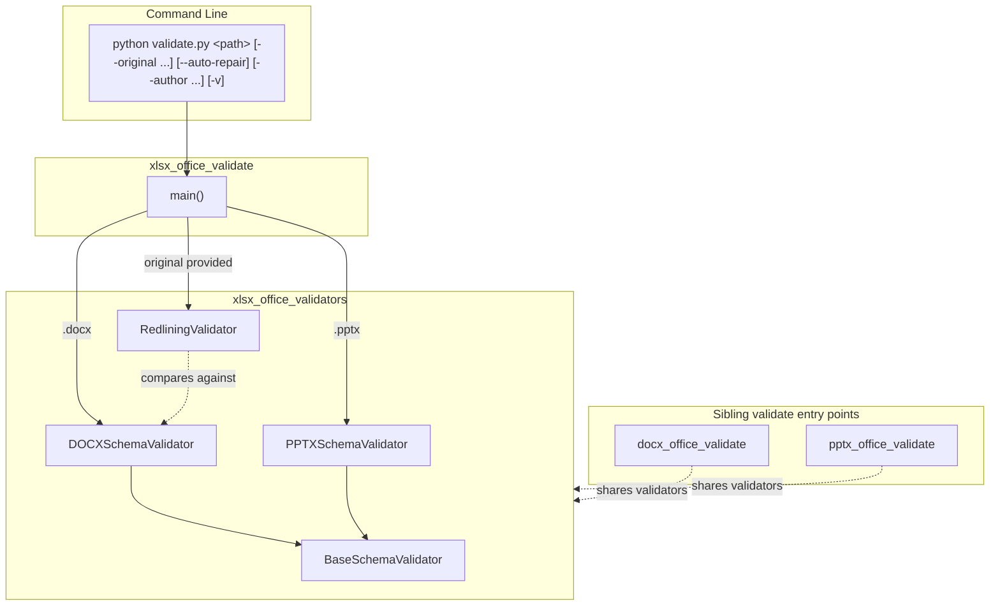
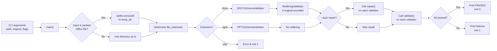
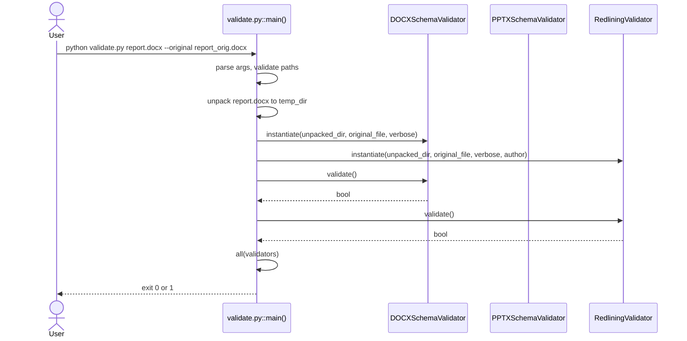
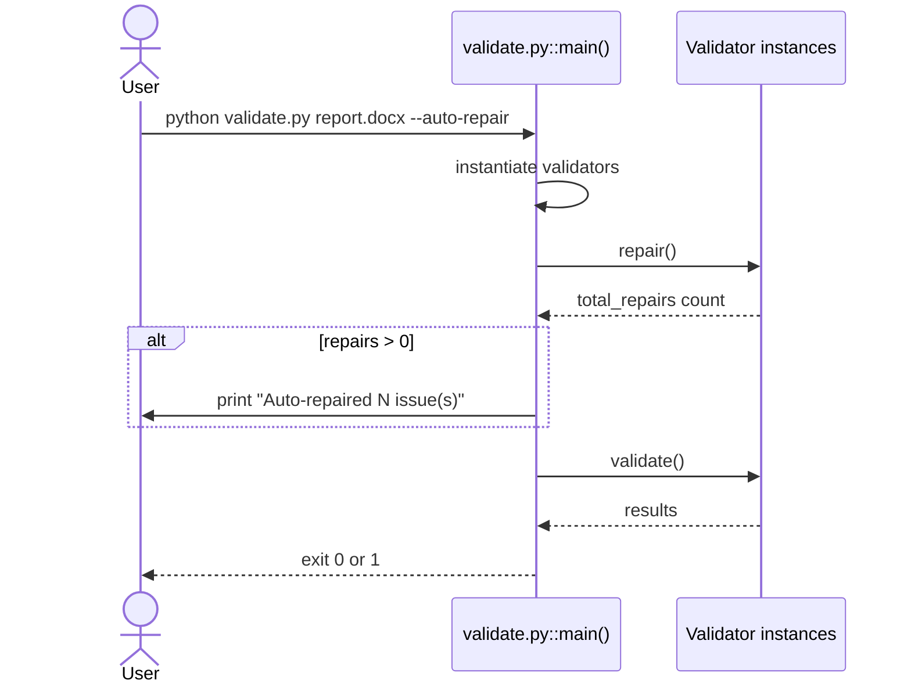
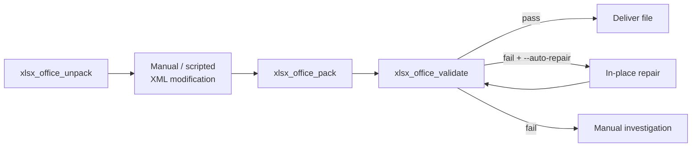

# xlsx_office_validate

## Introduction

`xlsx_office_validate` is a command-line validation entry point for Office Open XML (OOXML) documents. It lives inside the `xlsx` skill set under `skills/ainxt_docskills/xlsx/scripts/office/validate.py` and is responsible for checking whether a `.docx`, `.pptx`, or `.xlsx` file (or an already-unpacked OOXML directory) conforms to OOXML schema rules, package relationship rules, and—when an original file is supplied—redlining/tracked-change semantics.

> **Current limitation:** Although the module is located in the `xlsx` skill tree, the implementation currently **rejects `.xlsx` files** with the message `Validation not supported for file type .xlsx`. In practice, this module today acts as a thin orchestrator that delegates `.docx` validation to [xlsx_office_validators](xlsx_office_validators.md) (`DOCXSchemaValidator` and `RedliningValidator`) and `.pptx` validation to `PPTXSchemaValidator`. True `.xlsx` validation is a planned extension that would reuse the same validator framework.

This module is part of the broader document-processing skill ecosystem. It is typically invoked after an Office file has been generated or modified (for example by [xlsx_office_pack](xlsx_office_pack.md)) to catch corruption before the file is returned to a user or downstream tool.

---

## Module Overview

| Property | Value |
|----------|-------|
| **File** | `skills/ainxt_docskills/xlsx/scripts/office/validate.py` |
| **Entry point** | `main()` |
| **Input** | Path to an unpacked OOXML directory or a packed `.docx`/`.pptx`/`.xlsx` file |
| **Optional input** | Original file for redlining comparison, `--auto-repair`, `--author`, `--verbose` |
| **Output** | Human-readable validation report and process exit code (`0` = pass, `1` = fail) |
| **Supported formats today** | `.docx`, `.pptx` (`.xlsx` is explicitly rejected) |

The module is intentionally small: it parses CLI arguments, unpacks the Office file if necessary, instantiates the correct validator set, optionally runs auto-repair, and then runs validation. All domain-specific checks live in the validator classes so that they can be reused by sibling modules such as [docx_office_validate](docx_office_validate.md) and [pptx_office_validate](pptx_office_validate.md).

---

## Architecture



`main()` is the only public symbol in the file. It does not implement validation logic itself; instead it selects and runs validator objects. The validators are imported from the local `validators` package, which is documented in [xlsx_office_validators](xlsx_office_validators.md).

---

## Core Components

### `main()`

`main()` performs the following steps:

1. **Argument parsing** using `argparse`.
2. **Path validation** — ensures the supplied path exists and determines the Office file type.
3. **Original-file validation** (optional) — if `--original` is given, checks that it is a supported Office file.
4. **Unpacking** — if the input is a packed `.docx`/`.pptx`/`.xlsx`, extracts it to a temporary directory using `zipfile`.
5. **Validator selection** — based on the file extension:
   - `.docx`: `DOCXSchemaValidator` plus `RedliningValidator` when `--original` is supplied.
   - `.pptx`: `PPTXSchemaValidator` only.
   - `.xlsx`: prints an error and exits with code `1`.
6. **Auto-repair** (optional) — calls `repair()` on each validator when `--auto-repair` is set.
7. **Validation** — calls `validate()` on each validator and aggregates the result.
8. **Exit** — returns `0` if all validators pass, otherwise `1`.

The function is deliberately stateless and side-effect-free except for optional in-place repairs and the temporary unpack directory.

---

## Data Flow



The data that flows through the pipeline is the unpacked OOXML directory path plus the optional original file path. Each validator reads XML files from the unpacked directory and reports pass/fail status independently.

---

## Process Flows

### Validation Process



### Auto-Repair Process



---

## Dependencies

### Internal Dependencies

| Dependency | Module | Responsibility |
|------------|--------|----------------|
| `BaseSchemaValidator` | [xlsx_office_validators](xlsx_office_validators.md) | Shared base class with XML, namespace, ID, relationship, and XSD checks |
| `DOCXSchemaValidator` | [xlsx_office_validators](xlsx_office_validators.md) | Word-specific schema and tracked-change checks |
| `PPTXSchemaValidator` | [xlsx_office_validators](xlsx_office_validators.md) | PowerPoint-specific schema and slide-layout checks |
| `RedliningValidator` | [xlsx_office_validators](xlsx_office_validators.md) | Compares modified document against original after removing author's tracked changes |

### External Dependencies

| Package | Usage |
|---------|-------|
| `argparse` | CLI argument parsing |
| `tempfile` | Temporary directory for unpacking packed Office files |
| `zipfile` | Extracting `.docx`/`.pptx`/`.xlsx` archives |
| `pathlib.Path` | Path manipulation |
| `lxml` | XML parsing and XSD validation (used by validators) |
| `defusedxml` | Safe XML parsing during repair (used by validators) |

### Sibling Modules

- [docx_office_validate](docx_office_validate.md) — equivalent entry point in the `docx` skill tree.
- [pptx_office_validate](pptx_office_validate.md) — equivalent entry point in the `pptx` skill tree.
- [xlsx_office_pack](xlsx_office_pack.md) — packs an unpacked OOXML directory back into an Office file; often the next step after validation/repair.
- [xlsx_office_unpack](xlsx_office_unpack.md) — unpacks an Office file into an OOXML directory; often the step before validation.

---

## Command-Line Interface

```text
python validate.py <path> [--original <original_file>] [--auto-repair] [--author NAME] [-v]
```

| Argument | Description |
|----------|-------------|
| `path` | Unpacked OOXML directory or packed `.docx`/`.pptx`/`.xlsx` file |
| `--original` | Original Office file. When omitted, all XSD errors are reported and redlining validation is skipped. |
| `--auto-repair` | Automatically repair common issues such as oversized IDs and missing `xml:space="preserve"` |
| `--author` | Author name for redlining validation (default: `Claude`) |
| `-v`, `--verbose` | Enable verbose output |

### Examples

Validate a `.docx` file:

```bash
python skills/ainxt_docskills/xlsx/scripts/office/validate.py report.docx
```

Validate with an original file for redlining checks:

```bash
python skills/ainxt_docskills/xlsx/scripts/office/validate.py report.docx --original report_orig.docx --author Claude
```

Auto-repair and validate:

```bash
python skills/ainxt_docskills/xlsx/scripts/office/validate.py report.docx --auto-repair -v
```

Validate an already-unpacked directory:

```bash
python skills/ainxt_docskills/xlsx/scripts/office/validate.py ./unpacked_report --original report_orig.docx
```

---

## How It Fits into the System

`xlsx_office_validate` is one step in the document-modification pipeline used by the `ainxt_docskills` skill family:



In the larger ABStudio/agent ecosystem, these skills are invoked by backend tools and workers when agents generate or edit Office documents. Validation ensures that generated files are not corrupt before they are stored, emailed, or returned to the user interface. The exit-code contract (`0` = pass, `1` = fail) makes the module easy to call from shell scripts, worker jobs, or agent tool wrappers.

---

## Known Limitations and Future Work

- **`.xlsx` is not validated.** The `match` block in `main()` explicitly rejects `.xlsx` with `sys.exit(1)`. Adding `.xlsx` support would require:
  - An `XLSXSchemaValidator` subclass in [xlsx_office_validators](xlsx_office_validators.md).
  - Schema mappings for `xl/` (spreadsheetML) already defined in `BaseSchemaValidator.SCHEMA_MAPPINGS`.
  - Spreadsheet-specific checks for shared strings, worksheets, workbook relationships, and formula recalculation (see [xlsx_recalc](xlsx_recalc.md)).
- **Redlining is Word-only.** `RedliningValidator` is only appended for `.docx` files because it inspects `w:del`/`w:ins` elements in `word/document.xml`.
- **Repair is limited.** Auto-repair currently handles `paraId`/`durableId` overflow and missing whitespace preservation. It does not fix structural relationship errors or missing content-type declarations.

---

## References

- [xlsx_office_validators](xlsx_office_validators.md) — validator classes used by this module.
- [docx_office_validate](docx_office_validate.md) — equivalent entry point for Word documents.
- [pptx_office_validate](pptx_office_validate.md) — equivalent entry point for PowerPoint documents.
- [xlsx_office_pack](xlsx_office_pack.md) — packs an unpacked OOXML directory back into an Office file.
- [xlsx_office_unpack](xlsx_office_unpack.md) — unpacks an Office file into an OOXML directory.
- [xlsx_recalc](xlsx_recalc.md) — spreadsheet formula recalculation utility.
