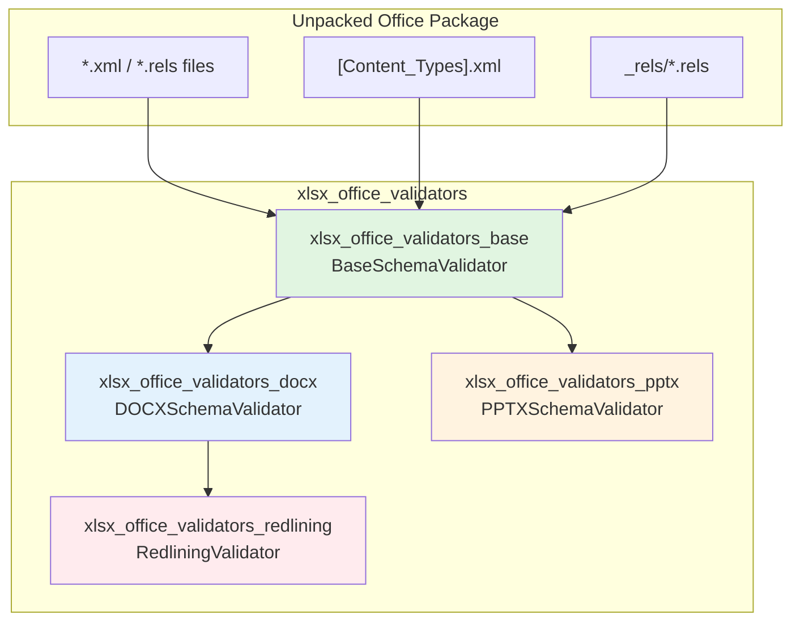
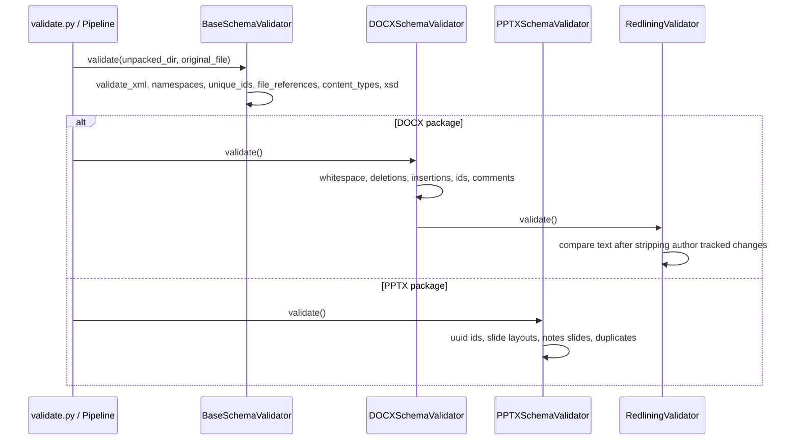

# xlsx_office_validators

The `xlsx_office_validators` module provides a suite of XML/OOXML validation tools used by the XLSX document-processing skill set. Despite its name, it ships reusable validators that are also applicable to Word (`DOCX`) and PowerPoint (`PPTX`) packages because all three formats share the same underlying Open Packaging Convention (OPC) and ISO/IEC 29500 schema foundations.

## Purpose

This module is responsible for checking that an unpacked Office document can be safely repacked into a valid `XLSX`/`DOCX`/`PPTX` file. It catches corruption early by verifying:

- XML well-formedness
- Namespace declarations
- Unique identifier constraints
- Relationship/file-reference integrity
- Content-type declarations
- XSD schema conformance
- Format-specific rules (Word redlining, PowerPoint slide layouts, etc.)

The validators are typically invoked from the parent `office/validate.py` entry point after a document has been unpacked by `office/unpack.py` and modified by other pipeline scripts.

## Architecture Overview



### Component Relationships

| Sub-module | File | Responsibility |
|------------|------|----------------|
| [xlsx_office_validators_base](../xlsx_office_validators_base.md) | `base.py` | Shared OPC/OOXML validation logic: XML well-formedness, namespaces, IDs, relationships, content types, XSD validation, and generic repairs. |
| [xlsx_office_validators_docx](../xlsx_office_validators_docx.md) | `docx.py` | Word-specific rules: whitespace preservation in `w:t`, deletion/insertion semantics, paragraph counts, `paraId`/`durableId` constraints, and comment markers. |
| [xlsx_office_validators_pptx](../xlsx_office_validators_pptx.md) | `pptx.py` | PowerPoint-specific rules: UUID IDs, slide-layout references, notes-slide uniqueness, and duplicate layout detection. |
| [xlsx_office_validators_redlining](../xlsx_office_validators_redlining.md) | `redlining.py` | Tracked-changes integrity for Word: ensures an author's modifications are correctly recorded as tracked changes. |

## High-Level Data Flow



## Integration with the Wider System

- **Parent pipeline**: The validators are called by `xlsx_office_validate` (`skills\ainxt_docskills\xlsx\scripts\office\validate.py`) after unpack/repair operations. See [xlsx_office_validate](xlsx_office_validate.md) for the orchestration layer.
- **Pack/unpack helpers**: The module relies on files produced by `xlsx_office_pack` and `xlsx_office_unpack`. See [xlsx_office_pack](xlsx_office_pack.md) and [xlsx_office_unpack](xlsx_office_unpack.md).
- **Shared skill family**: Equivalent validator modules exist for the DOCX and PPTX skill sets (`docx_office_validators`, `pptx_office_validators`). They share the same class hierarchy and schema mappings.
- **Schemas**: XSD files are expected under `office/schemas/` relative to the validator source files.

## Usage

Validators are not intended to be run directly. A typical caller pattern is:

```python
from skills.ainxt_docskills.xlsx.scripts.office.validators.docx import DOCXSchemaValidator

validator = DOCXSchemaValidator(unpacked_dir="/tmp/unpacked", original_file="/tmp/original.docx", verbose=True)
ok = validator.validate()
if not ok:
    raise RuntimeError("Document validation failed")
```

For repair-only workflows:

```python
repairs = validator.repair()
```

## Notes

- The module name contains `xlsx` because it lives in the XLSX skill tree, but the validators are generic across DOCX/PPTX/XLSX OPC packages.
- `RedliningValidator` is currently Word-specific and is invoked from `DOCXSchemaValidator.validate()`.
- All validators print human-readable `PASSED`/`FAILED` messages; they do not raise exceptions on validation failure unless the caller chooses to do so.
