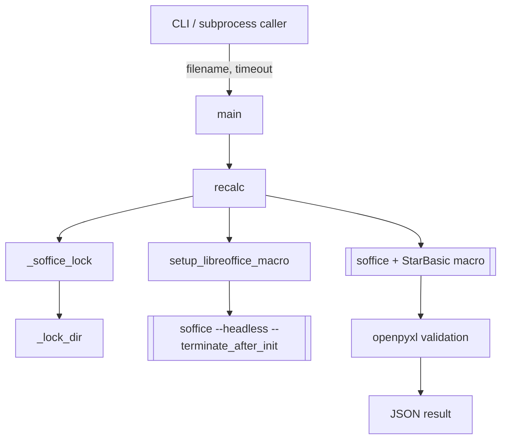
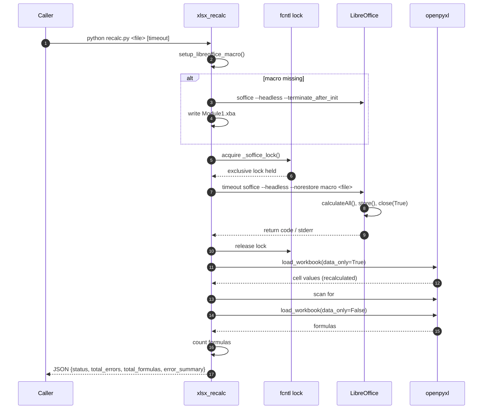
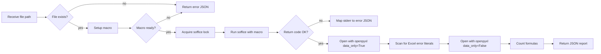

# xlsx_recalc

## Brief Introduction

`xlsx_recalc` is a standalone Python utility that forces a full formula recalculation of an `.xlsx` file using a headless LibreOffice instance, then validates the result with `openpyxl`. It is designed to run inside document-processing workers and skill pipelines where Excel files are generated or mutated by automated tools and must have their formulas refreshed before downstream consumption. The script is intentionally conservative: it serializes all LibreOffice invocations through a per-user file lock, installs a deterministic StarBasic macro, wraps the call with a platform-appropriate timeout, and returns a structured JSON report of any Excel error literals (e.g. `#VALUE!`, `#REF!`) found after recalculation.

---

## Purpose and Core Functionality

When an `.xlsx` file is created or edited programmatically, cached formula values can become stale or missing. Opening the file in a desktop spreadsheet application normally triggers recalculation, but headless pipelines do not have that luxury. `xlsx_recalc` solves this by:

1. **Installing a deterministic LibreOffice macro** (`RecalculateAndSave`) that calls `ThisComponent.calculateAll()`, `store()`, and `close(True)`.
2. **Acquiring a cross-process lock** so that only one LibreOffice process uses the shared user profile at a time, preventing profile corruption.
3. **Invoking LibreOffice headlessly** against the target workbook with a configurable timeout.
4. **Inspecting the saved workbook** with `openpyxl` to count formulas and detect Excel error literals.
5. **Emitting a JSON result** suitable for logging, worker status reporting, or conditional pipeline branching.

The module is a single file, `skills/ainxt_docskills/xlsx/scripts/recalc.py`, and is part of the legacy `ainxt_docskills` xlsx skill family. It is typically invoked as a subprocess from document workers or from higher-level xlsx pipeline scripts.

---

## Architecture

### High-level component layout



### Component responsibilities

| Component | Responsibility |
|-----------|----------------|
| `main` | Parse `sys.argv`, default timeout to 30 s, call `recalc`, print JSON, exit with non-zero on error. |
| `_lock_dir` | Return a private, mode-`0700` temp directory owned by the effective user to host the lockfile. |
| `_soffice_lock` | Acquire an exclusive `fcntl.flock` on the lockfile; degrade to no-op on Windows/macOS; raise `SofficeLockTimeout` if the lock cannot be acquired. |
| `setup_libreoffice_macro` | Ensure the StarBasic macro `RecalculateAndSave` exists in the user's LibreOffice profile, initializing the profile if necessary. |
| `recalc` | Orchestrate macro setup, lock acquisition, LibreOffice invocation, timeout handling, and post-recalculation validation. |

---

## Dependencies

### Internal dependencies

| Dependency | Module documentation | Role |
|------------|----------------------|------|
| `office.soffice.get_soffice_env` | [xlsx_office_soffice.md](xlsx_office_soffice.md) | Provides an environment dict that disables the GUI plugin (`SAL_USE_VCLPLUGIN=svp`) and, on Linux systems that lack a working Unix socket, preloads a compiled socket shim via `LD_PRELOAD`. |

### External dependencies

| Dependency | Purpose |
|------------|---------|
| `soffice` (LibreOffice) | Headless spreadsheet engine that executes the recalculation macro. |
| `openpyxl` | Read the recalculated workbook to count formulas and detect error literals. |
| `fcntl` (POSIX only) | Exclusive file locking for cross-process serialization. |
| `timeout` (Linux) / `gtimeout` (macOS) | Hard cap on the LibreOffice process lifetime. |

### Related modules

- [xlsx_skills.md](../agents/xlsx_skills.md) — newer `ABStudio/skills/ainxt-skills/xlsx` scripts that provide `xlsx_pipeline`, `xlsx_to_json`, and other structured xlsx operations.
- [docskills_legacy.md](../agents/docskills_legacy.md) — parent family of legacy `ainxt_docskills` document utilities (docx, pptx, xlsx, pdf).
- [xlsx_office_pack.md](xlsx_office_pack.md) / [xlsx_office_validate.md](xlsx_office_validate.md) — pack and validate helpers used when rebuilding xlsx archives.
- [document_processing.md](document_processing.md) — shared OCR and parsing infrastructure that may feed Excel files into this recalculation step.

---

## Data Flow



---

## Component Interactions

### Locking and serialization

LibreOffice's user profile is not safe for concurrent use. `xlsx_recalc` uses a two-layer defense:

1. **Private lock directory** (`_lock_dir`): creates `tempfile.gettempdir()/ainxt_soffice_<uid>` with mode `0700`. This prevents another local user from pre-creating or symlink-attacking a shared lock path.
2. **Exclusive file lock** (`_soffice_lock`): opens `_LOCK_PATH` with `O_RDWR | O_CREAT | O_NOFOLLOW` and mode `0600`, then acquires `LOCK_EX` with a configurable timeout (default 120 s). On non-POSIX platforms the lock degrades to a no-op so local development is not blocked.

If the lock cannot be acquired, the script raises `SofficeLockTimeout` and returns an error JSON rather than risk concurrent LibreOffice access.

### Macro installation

The StarBasic macro is written to the user's LibreOffice profile:

- macOS: `~/Library/Application Support/LibreOffice/4/user/basic/Standard/Module1.xba`
- Linux: `~/.config/libreoffice/4/user/basic/Standard/Module1.xba`

If the macro file does not exist or does not contain `RecalculateAndSave`, the script first runs `soffice --headless --terminate_after_init` (under the same lock) to initialize the profile directory, then writes the macro XML. The macro itself is idempotent: it calls `calculateAll()`, `store()`, and `close(True)` on the document passed as the final command-line argument.

### Timeout handling

The outer `subprocess.run` uses `timeout + 15` as a safety margin, but the actual LibreOffice process is wrapped with:

- `timeout <seconds>` on Linux
- `gtimeout <seconds>` on macOS if available

This ensures that a hung `soffice` process is killed by the OS timeout utility even if Python's own timeout is insufficient.

---

## Process Flows

### Normal recalculation flow



### Error classification

After recalculation, the script scans every cell in every sheet and looks for these Excel error literals:

- `#VALUE!`
- `#DIV/0!`
- `#REF!`
- `#NAME?`
- `#NULL!`
- `#NUM!`
- `#N/A`

For each error type found, the report includes the count and up to 20 cell locations (e.g. `Sheet1!B3`). The top-level `status` is `success` when `total_errors == 0`, otherwise `errors_found`.

---

## JSON Output Schema

```json
{
  "status": "success | errors_found",
  "total_errors": 0,
  "total_formulas": 42,
  "error_summary": {
    "#VALUE!": {
      "count": 1,
      "locations": ["Sheet1!B3"]
    }
  }
}
```

On failure, the script returns:

```json
{
  "error": "human-readable message"
}
```

and exits with code `2`.

---

## Security and Operational Notes

- **Profile isolation**: the lock directory is created with `0o700` and reopened with `O_NOFOLLOW` to mitigate symlink attacks in shared `/tmp` environments.
- **No concurrent LibreOffice access**: the `fcntl` lock guarantees that only one recalculation runs at a time per user profile, which is the primary corruption vector for headless LibreOffice.
- **Idempotent macro**: the macro is rewritten only if missing or incomplete, and its behavior is limited to calculate/store/close.
- **Platform portability**: locking and timeout wrapping adapt to Linux, macOS, and Windows (where locking becomes a no-op and timeout wrapping is skipped).
- **Resource safety**: the context manager in `_soffice_lock` releases the lock even if LibreOffice raises or times out.

---

## How It Fits into the System

`xlsx_recalc` sits at the bottom of the document-processing stack. It is not a user-facing API; it is a worker utility invoked by higher-level document skills and workers that produce or modify Excel files. In the broader architecture:

- [doc_generator.md](doc_generator.md) and document-generation workers may emit `.xlsx` files with formulas.
- [xlsx_skills.md](../agents/xlsx_skills.md) provides structured analysis and conversion tools that may run before or after recalculation.
- [docskills_legacy.md](../agents/docskills_legacy.md) groups this script with analogous docx/pptx/pdf utilities that share the same `office.soffice` helper and LibreOffice macro pattern.
- [workers.md](../workers/workers.md) (document/knowledge workers) are the typical callers that run this script in a sandboxed subprocess.

Because the script is self-contained and communicates only via JSON on stdout, it can be safely executed from any worker language or runtime.
