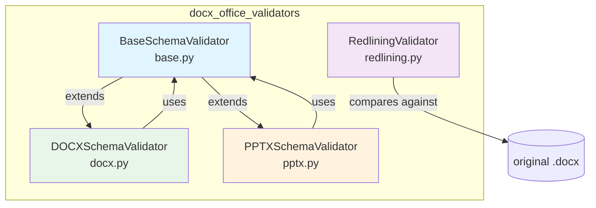
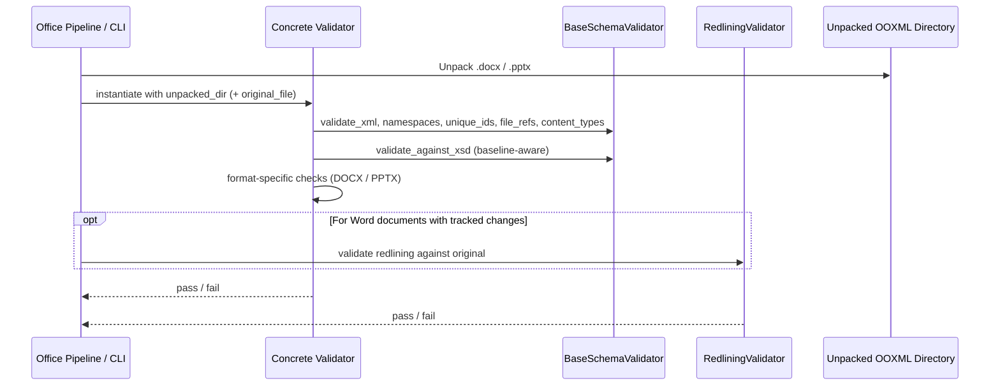
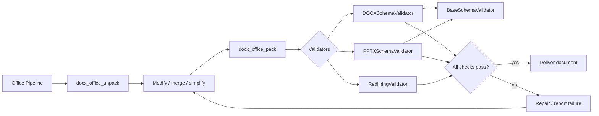

# docx_office_validators

## Overview

The `docx_office_validators` module provides schema and structural validation for Office Open XML (OOXML) documents, with a focus on Microsoft Word (`.docx`) and PowerPoint (`.pptx`) files. It is part of the `docskills_legacy` skill set used by the document-generation pipeline to ensure that produced or modified Office documents remain well-formed, internally consistent, and openable by end-user applications.

The module operates on **unpacked** OOXML packages (zip archives expanded into directories) and performs checks that mirror the constraints enforced by Word, PowerPoint, and the ECMA-376 / ISO/IEC 29500 specifications. In addition to schema validation, it repairs common whitespace-preservation issues and validates tracked changes (redlining) so that agent-generated edits do not silently corrupt document content.

## Purpose

- Detect malformed XML, missing relationships, duplicate identifiers, and incorrect content-type declarations before a document is repacked and delivered.
- Compare the modified document against an original baseline so that only pre-existing errors are ignored and **new** errors are surfaced.
- Validate that tracked changes authored by the agent are consistent with the original document text.
- Provide lightweight, automatic repairs for issues such as missing `xml:space="preserve"` attributes and out-of-range `durableId` values.

## Architecture

The module is organized as a small hierarchy of validators. A shared base class implements generic OOXML checks, while concrete subclasses add format-specific rules. A separate redlining validator handles tracked-change semantics.



### Data Flow

A typical validation run follows this flow:



## Sub-modules

| Sub-module | File | Responsibility | Documentation |
|------------|------|----------------|---------------|
| `docx_office_validators_base` | `validators/base.py` | Generic OOXML validation: XML well-formedness, namespaces, unique IDs, relationships, content types, XSD schema checks, baseline-aware error filtering, and common repairs. | [docx_office_validators_base.md](docx_office_validators_base.md) |
| `docx_office_validators_docx` | `validators/docx.py` | Word-specific validation: whitespace preservation, deletion/insertion tag rules, paragraph counts, `paraId` / `durableId` constraints, and comment marker consistency. | [docx_office_validators_docx.md](docx_office_validators_docx.md) |
| `docx_office_validators_pptx` | `validators/pptx.py` | PowerPoint-specific validation: UUID-like IDs, slide-layout references, duplicate layout relationships, and notes-slide reference uniqueness. | [docx_office_validators_pptx.md](docx_office_validators_pptx.md) |
| `docx_office_validators_redlining` | `validators/redlining.py` | Tracked-change validation: ensures the agent's insertions/deletions reconcile with the original document text. | [docx_office_validators_redlining.md](docx_office_validators_redlining.md) |

## Integration with the System

`docx_office_validators` is consumed by the broader document-generation and repair pipeline in `docskills_legacy`. The surrounding modules are responsible for unpacking OOXML archives, applying modifications, packing them back, and invoking the appropriate validator:

- **[docx_office_pack](docx_office_pack.md)** — repacks the validated XML tree into a `.docx` / `.pptx` / `.xlsx` archive and runs validation as a post-pack step.
- **[docx_office_unpack](docx_office_unpack.md)** — unpacks the original Office archive so validators can inspect individual XML parts.
- **[docx_office_soffice](docx_office_soffice.md)** — invokes LibreOffice / soffice for conversions that may precede or follow validation.
- **[docx_office_simplify_redlines](docx_office_simplify_redlines.md)** and **[docx_office_merge_runs](docx_office_merge_runs.md)** — pre-process tracked changes and run merging before the validator sees the document.
- **[docx_accept_changes](docx_accept_changes.md)** — accepts tracked changes, often the final step after validation passes.

The validators are not tied to a web framework; they are plain Python classes intended to be instantiated from worker scripts, skill pipelines, or unit tests.

## Common Usage Pattern

```python
from pathlib import Path
from skills.ainxt_docskills.docx.scripts.office.validators.docx import DOCXSchemaValidator
from skills.ainxt_docskills.docx.scripts.office.validators.redlining import RedliningValidator

unpacked = Path("/tmp/unpacked_docx")
original = Path("/tmp/original.docx")

schema_ok = DOCXSchemaValidator(unpacked, original_file=original, verbose=True).validate()
redline_ok = RedliningValidator(unpacked, original, verbose=True, author="Claude").validate()

if schema_ok and redline_ok:
    print("Document is valid")
else:
    print("Document validation failed")
```

## Key Design Decisions

1. **Baseline-aware XSD validation** — `BaseSchemaValidator` validates each XML part against the original file as well as the modified file. Errors that already existed in the original are ignored, so the validator only reports regressions introduced by the agent.
2. **Shared OOXML knowledge** — namespace constants, schema mappings, and ID uniqueness rules live in the base class, keeping DOCX/PPTX subclasses focused on format-specific rules.
3. **Repair before validation** — `repair()` methods fix common agent-generated issues (whitespace preservation, out-of-range IDs) so that minor mistakes do not fail the whole pipeline.
4. **Redlining as a separate concern** — tracked-change semantics are validated independently from schema correctness, because an agent can produce schema-valid XML that still changes the document text in unintended ways.

## Mermaid: Component Interaction


