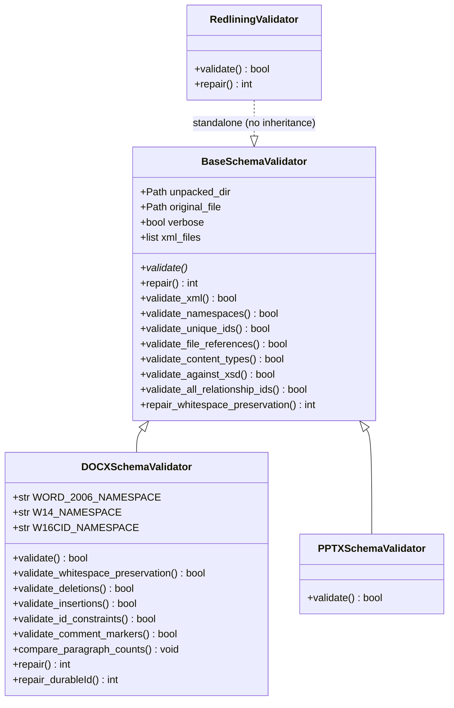
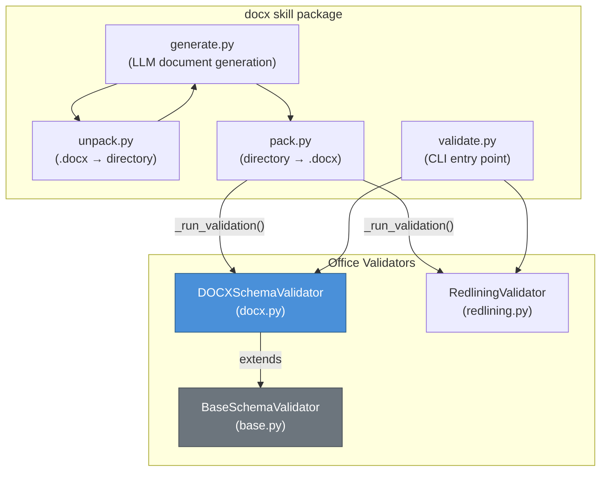
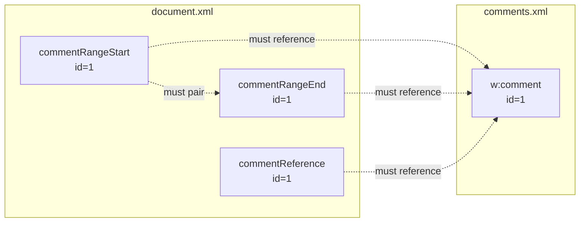
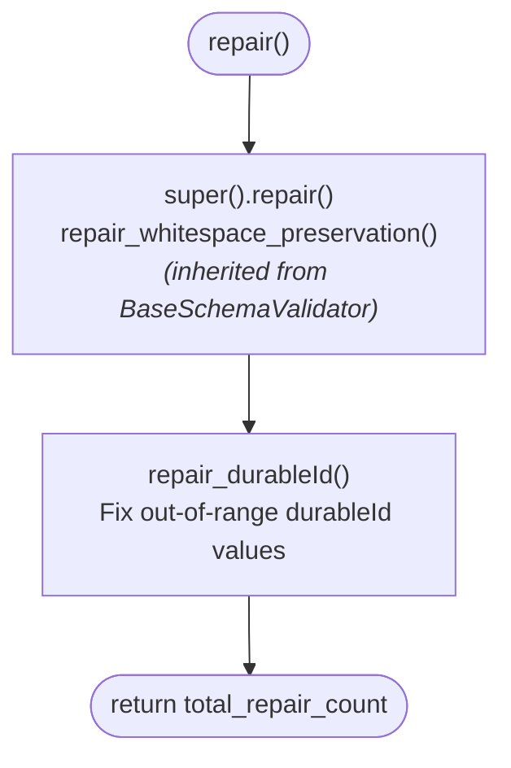
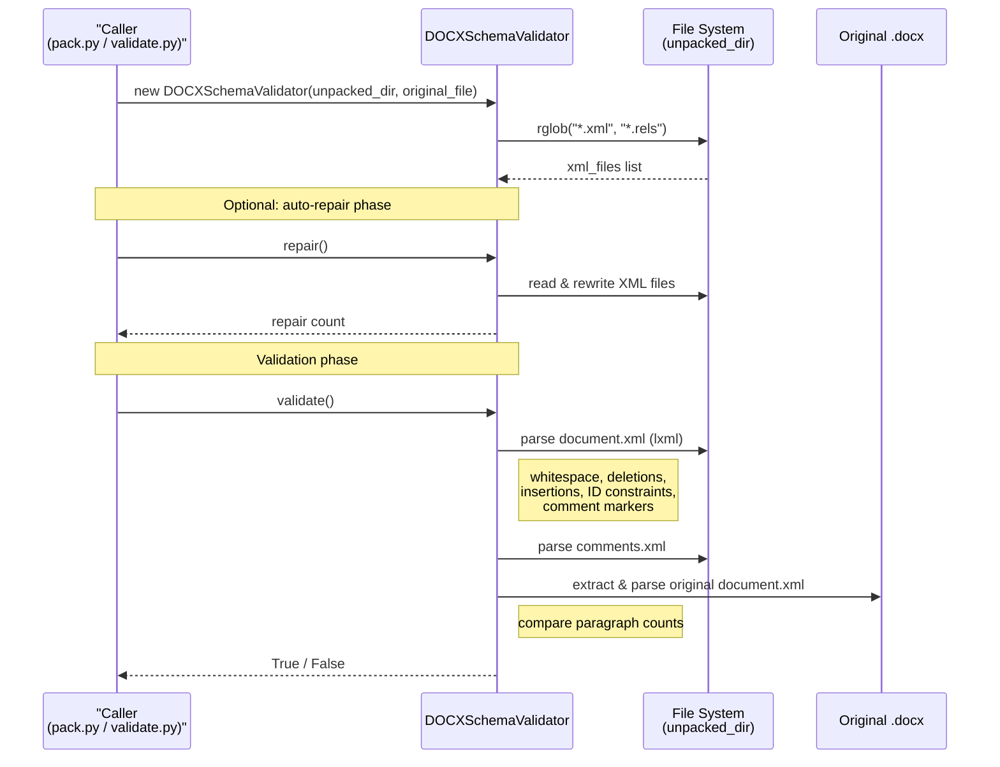

# DOCX Office Validators — DOCXSchemaValidator

## Overview

The `docx_office_validators_docx` module provides the `DOCXSchemaValidator` class, a specialised schema and structural validator for Word Processing ML (`.docx`) documents. It is part of the broader **Office validators** subsystem shared across the docx, pptx, and xlsx skill packages (see [docx_office_validators_base](docx_office_validators_base.md) for the base class).

`DOCXSchemaValidator` extends `BaseSchemaValidator` and adds Word-specific checks on top of the generic OOXML validation pipeline. Its primary role is to ensure that an unpacked `.docx` directory — typically produced by an LLM editing XML directly — conforms to the ECMA-376 / ISO/IEC 29500-4 specification before the document is re-packed into a `.docx` archive. This prevents corruption that would cause Microsoft Word, LibreOffice, or other consumers to reject or silently mangle the file.

---

## Architecture

### Class Hierarchy



### Where This Module Fits



The validator is invoked at two critical points:

1. **Pack pipeline** (`pack.py::_run_validation`) — Before re-zipping an unpacked directory into a `.docx`, the pack function runs `DOCXSchemaValidator` (and `RedliningValidator` when an original file is provided) to catch corruption introduced during XML editing.
2. **Standalone CLI** (`validate.py::main`) — Developers can run validation directly on an unpacked directory or a packed `.docx` file, optionally with `--auto-repair` to fix common issues automatically.

---

## Core Component: `DOCXSchemaValidator`

### Constructor

```python
DOCXSchemaValidator(unpacked_dir, original_file=None, verbose=False)
```

| Parameter | Type | Description |
|-----------|------|-------------|
| `unpacked_dir` | `str / Path` | Path to the unpacked `.docx` directory (containing `word/document.xml`, `[Content_Types].xml`, etc.) |
| `original_file` | `Path / None` | Path to the original `.docx` archive. When provided, XSD errors present in the original are suppressed (only *new* errors are reported) and paragraph-count comparison is enabled. |
| `verbose` | `bool` | When `True`, prints PASSED messages for each successful check. |

The constructor is inherited from `BaseSchemaValidator`, which scans `unpacked_dir` for all `*.xml` and `*.rels` files and stores them in `self.xml_files`.

### Namespaces

| Constant | URI | Purpose |
|----------|-----|---------|
| `WORD_2006_NAMESPACE` | `http://schemas.openxmlformats.org/wordprocessingml/2006/main` | The primary WordprocessingML namespace (`w:` prefix) |
| `W14_NAMESPACE` | `http://schemas.microsoft.com/office/word/2010/wordml` | Word 2010 extensions (`w14:` prefix), used for `paraId` attributes |
| `W16CID_NAMESPACE` | `http://schemas.microsoft.com/office/word/2016/wordml/cid` | Word 2016 content ID extensions (`w16cid:` prefix), used for `durableId` attributes |

---

## Validation Pipeline

The `validate()` method orchestrates a sequence of checks. Each check returns `True` (pass) or `False` (fail) and prints diagnostic output. The overall result is the logical AND of all checks.

```mermaid
flowchart TD
    Start(["validate()"]) --> XML["validate_xml()<br/>Well-formedness check<br/><i>(inherited)</i>"]
    XML --> NS["validate_namespaces()<br/>Namespace declarations<br/><i>(inherited)</i>"]
    NS --> UID["validate_unique_ids()<br/>ID uniqueness<br/><i>(inherited)</i>"]
    UID --> FRef["validate_file_references()<br/>.rels target integrity<br/><i>(inherited)</i>"]
    FRef --> CT["validate_content_types()<br/>[Content_Types].xml coverage<br/><i>(inherited)</i>"]
    CT --> XSD["validate_against_xsd()<br/>XSD schema conformance<br/><i>(inherited)</i>"]
    XSD --> WS["validate_whitespace_preservation()<br/>xml:space='preserve' on w:t"]
    WS --> Del["validate_deletions()<br/>No w:t inside w:del"]
    Del --> Ins["validate_insertions()<br/>No w:delText inside w:ins"]
    Ins --> RID["validate_all_relationship_ids()<br/>r:id reference validity<br/><i>(inherited)</i>"]
    RID --> IDC["validate_id_constraints()<br/>paraId / durableId bounds"]
    IDC --> Cmt["validate_comment_markers()<br/>Comment range pairing"]
    Cmt --> PC["compare_paragraph_counts()<br/>Original vs. modified<br/><i>(informational)</i>"]
    PC --> Result{"All passed?"}
    Result -->|Yes| Pass(["return True"])
    Result -->|No| Fail(["return False"])

    style WS fill:#4a90d9,color:#fff
    style Del fill:#4a90d9,color:#fff
    style Ins fill:#4a90d9,color:#fff
    style IDC fill:#4a90d9,color:#fff
    style Cmt fill:#4a90d9,color:#fff
    style PC fill:#4a90d9,color:#fff
```



> **Blue** nodes are DOCX-specific checks implemented in this module. **Grey** nodes are inherited from `BaseSchemaValidator` (see [docx_office_validators_base](docx_office_validators_base.md)).

### DOCX-Specific Validation Checks

#### 1. `validate_whitespace_preservation()`

Ensures that every `<w:t>` element whose text content **starts or ends with whitespace** (space, tab, newline, or carriage return) carries the `xml:space="preserve"` attribute. Without this attribute, XML parsers and Word consumers will collapse leading/trailing whitespace, silently altering document content.

**What it checks:**
- Iterates all `<w:t>` elements in `word/document.xml`
- Uses regex to detect leading/trailing whitespace characters
- Verifies `xml:space="preserve"` is present and set to `"preserve"`

**Common cause of failure:** An LLM generating `<w:t>` elements with leading/trailing spaces but omitting the preservation attribute.

#### 2. `validate_deletions()`

Ensures that tracked-change deletion elements (`<w:del>`) do not contain `<w:t>` or `<w:instrText>` child elements. Per the OOXML specification, deleted text must use `<w:delText>` (not `<w:t>`) and deleted field instructions must use `<w:delInstrText>` (not `<w:instrText>`).

**What it checks:**
- XPath `.//w:del//w:t` — flags any `<w:t>` nested inside `<w:del>`
- XPath `.//w:del//w:instrText` — flags any `<w:instrText>` nested inside `<w:del>`

**Common cause of failure:** An LLM wrapping deleted content in `<w:del>` but using `<w:t>` instead of `<w:delText>`.

#### 3. `validate_insertions()`

Ensures that tracked-change insertion elements (`<w:ins>`) do not contain `<w:delText>` elements (unless that `<w:delText>` is also inside a `<w:del>`). Inserted text should use `<w:t>`, not `<w:delText>`.

**What it checks:**
- XPath `.//w:ins//w:delText[not(ancestor::w:del)]` — flags `<w:delText>` inside `<w:ins>` that is not also inside a `<w:del>`

#### 4. `validate_id_constraints()`

Validates that `w14:paraId` and `w16cid:durableId` attribute values fall within the allowed numeric ranges defined by the OOXML specification.

| Attribute | File | Base | Max Value | Constraint |
|-----------|------|------|-----------|------------|
| `w14:paraId` | Any | Hex (16) | `0x80000000` | Must be `< 0x80000000` |
| `w16cid:durableId` | `numbering.xml` | Decimal (10) | `0x7FFFFFFF` | Must be `< 0x7FFFFFFF`, decimal |
| `w16cid:durableId` | Other files | Hex (16) | `0x7FFFFFFF` | Must be `< 0x7FFFFFFF`, hex |

**Common cause of failure:** An LLM generating IDs that exceed the 31-bit signed integer boundary, or using hex format in `numbering.xml` where decimal is required.

#### 5. `validate_comment_markers()`

Validates the integrity of comment reference markers in `word/document.xml` against `word/comments.xml`.

**What it checks:**
- Every `commentRangeEnd` has a matching `commentRangeStart` (and vice versa)
- Every `commentRangeStart`, `commentRangeEnd`, and `commentReference` ID references a real `<w:comment>` in `comments.xml`
- Reports orphaned ends, orphaned starts, and invalid references



#### 6. `compare_paragraph_counts()`

An **informational** check (does not affect pass/fail) that compares the number of `<w:p>` elements in the modified `document.xml` against the original `.docx` archive. Prints a delta summary such as:

```
Paragraphs: 42 → 45 (+3)
```

This helps developers quickly spot unexpected paragraph additions or removals during LLM-driven editing.

---

## Repair Pipeline

The `repair()` method extends the base repair logic with DOCX-specific fixes:



### `repair_durableId()`

Scans all XML files for `w16cid:durableId` attributes that violate the ID constraints (see `validate_id_constraints()` above) and replaces them with valid random values:

| File | Repair Strategy |
|------|-----------------|
| `numbering.xml` | Generates a random decimal integer in `[1, 0x7FFFFFFE]` |
| All other files | Generates a random hex string formatted as 8 uppercase hex digits (e.g., `0A1B2C3D`) |

Uses `defusedxml.minidom` for safe XML parsing during repair. Each repaired attribute prints a diagnostic line showing the old → new value.

---

## Data Flow



---

## Dependencies

### Internal Dependencies

| Dependency | Module | Relationship |
|------------|--------|--------------|
| `BaseSchemaValidator` | [docx_office_validators_base](docx_office_validators_base.md) | Parent class — provides `validate_xml`, `validate_namespaces`, `validate_unique_ids`, `validate_file_references`, `validate_content_types`, `validate_against_xsd`, `validate_all_relationship_ids`, and `repair_whitespace_preservation` |
| `RedliningValidator` | [docx_office_validators_redlining](docx_office_validators_redlining.md) | Sibling validator — runs alongside `DOCXSchemaValidator` in the pack/validate pipeline to verify tracked-change integrity |
| `PPTXSchemaValidator` | [docx_office_validators_pptx](docx_office_validators_pptx.md) | Sibling validator for PowerPoint files — shares the same base class and validation pipeline pattern |
| `pack.py::_run_validation` | docx skill `office/pack.py` | Primary consumer — invokes validation before re-packing |
| `validate.py::main` | docx skill `office/validate.py` | CLI consumer — standalone validation entry point |

### External Dependencies

| Library | Usage |
|---------|-------|
| `lxml.etree` | XML parsing, XPath queries, XSD schema validation |
| `defusedxml.minidom` | Safe XML DOM manipulation during repair operations |
| `zipfile` | Extracting original `.docx` for paragraph-count comparison |
| `tempfile` | Temporary directories for original-file extraction |
| `re` | Regex for whitespace detection in `validate_whitespace_preservation` |
| `random` | Generating replacement `durableId` values during repair |
| `pathlib.Path` | File-system path handling (inherited from base) |

---

## Usage Examples

### Standalone Validation via CLI

```bash
# Validate an unpacked directory against the original .docx
python validate.py /path/to/unpacked_dir --original /path/to/original.docx -v

# Validate and auto-repair
python validate.py /path/to/unpacked_dir --original /path/to/original.docx --auto-repair

# Validate a packed .docx directly (auto-unpacks to temp dir)
python validate.py /path/to/modified.docx --original /path/to/original.docx
```

### Programmatic Usage

```python
from office.validators.docx import DOCXSchemaValidator

validator = DOCXSchemaValidator(
    unpacked_dir="/path/to/unpacked_dir",
    original_file="/path/to/original.docx",
    verbose=True,
)

# Optional: auto-repair before validation
repairs = validator.repair()
if repairs:
    print(f"Repaired {repairs} issue(s)")

# Run full validation
if validator.validate():
    print("All validations PASSED!")
else:
    print("Validation FAILED — see output above")
```

### Integration in Pack Pipeline

The `pack()` function in `pack.py` automatically runs validation when both `validate=True` and `original_file` are provided:

```python
from office.pack import pack

result, message = pack(
    input_directory="/path/to/unpacked_dir",
    output_file="/path/to/output.docx",
    original_file="/path/to/original.docx",
    validate=True,
)
# If validation fails, pack() returns an error message and does not create the .docx
```

---

## Error Reporting

All validation methods follow a consistent reporting pattern:

- **On failure:** Prints `FAILED - Found {N} {check_type} violations:` followed by indented per-file error lines including relative path, line number, and a text preview.
- **On success (verbose):** Prints `PASSED - {description}`.
- **On success (non-verbose):** No output (silent pass).

Error messages include:
- File path relative to `unpacked_dir`
- Source line number (via `elem.sourceline`)
- A truncated `repr()` preview of the offending text content (max 50 characters)

---

## Key Design Decisions

1. **Incremental validation with original-file comparison** — When an `original_file` is provided, XSD validation only reports *new* errors not present in the original. This prevents false positives from pre-existing schema violations in real-world documents.

2. **Repair before validate pattern** — The pack pipeline calls `repair()` before `validate()`, allowing common issues (whitespace preservation, out-of-range IDs) to be auto-fixed without manual intervention.

3. **Informational vs. blocking checks** — `compare_paragraph_counts()` is deliberately non-blocking; it provides diagnostic insight without failing validation, since legitimate edits may add or remove paragraphs.

4. **Shared base for OOXML formats** — By inheriting from `BaseSchemaValidator`, the DOCX validator reuses the same XSD validation, namespace checking, and relationship-integrity logic as the PPTX and XLSX validators, ensuring consistency across Office document types.
