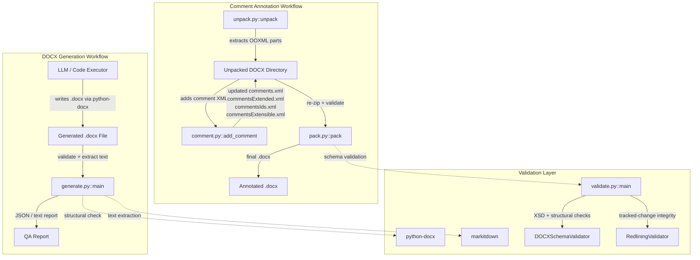
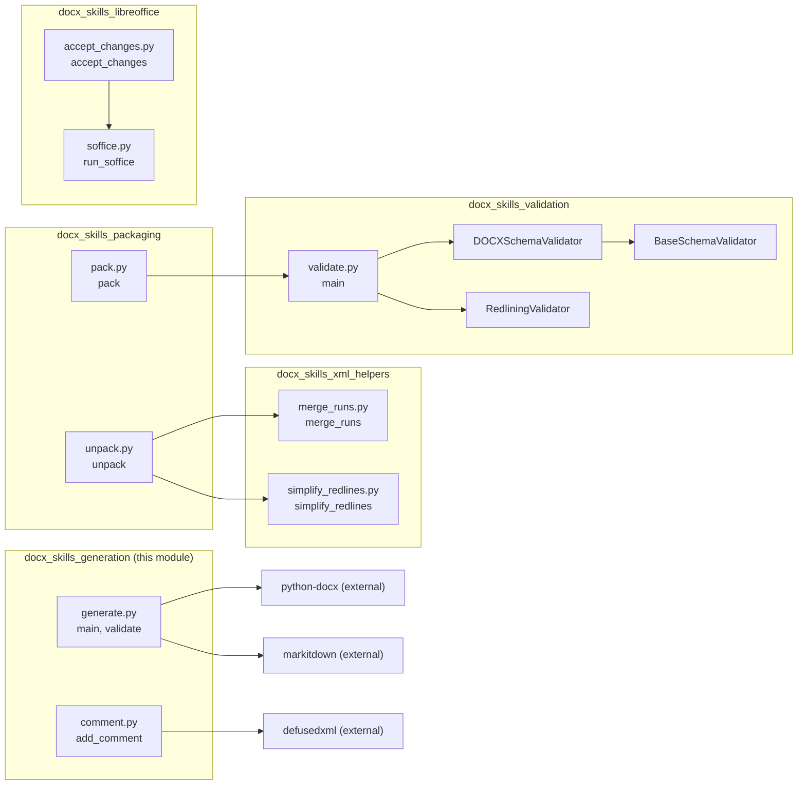
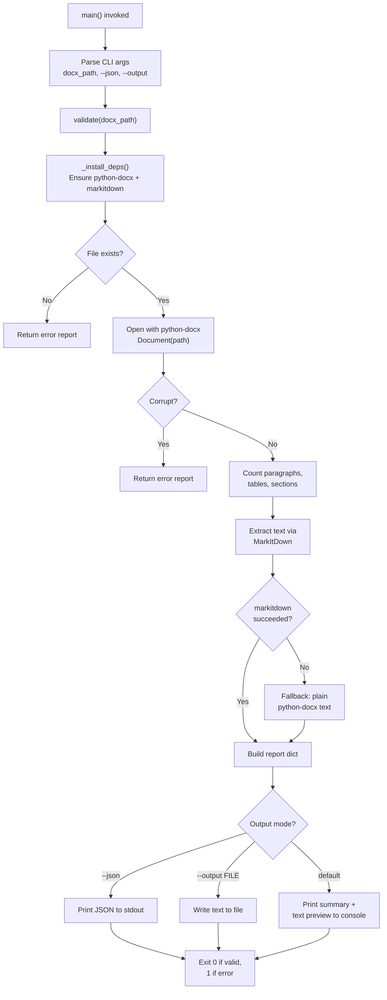
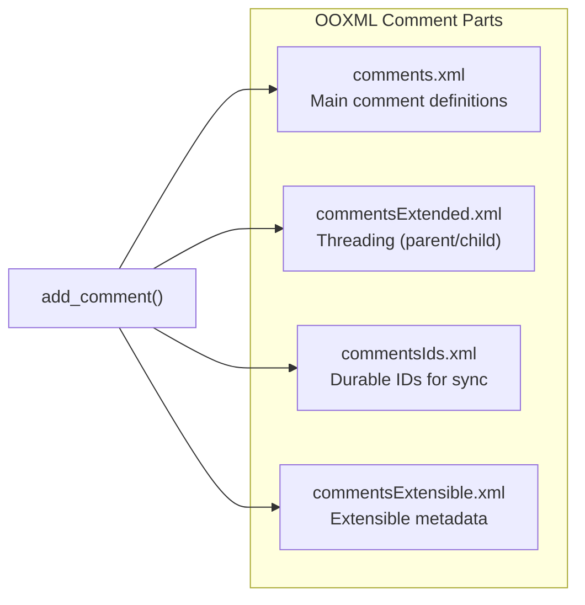
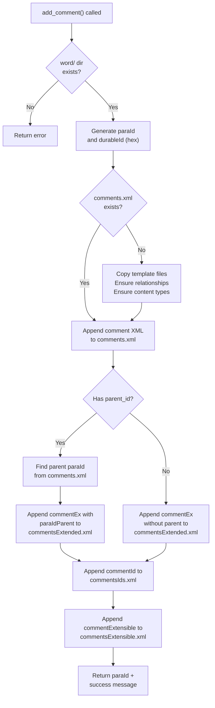
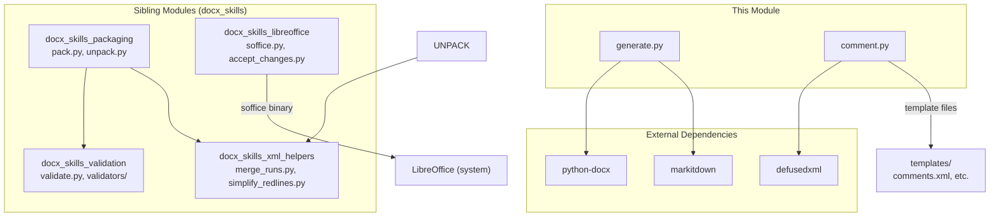

# DOCX Skills — Generation Module

## Overview

The `docx_skills_generation` module is the entry point for DOCX document creation and validation within the broader [docx_skills](docx_skills.md) subsystem. It provides two primary capabilities:

1. **Document Validation & QA** (`generate.py`) — Validates a generated `.docx` file for structural integrity, extracts its text content for quality assurance, and emits a structured report (JSON or plain text).
2. **Comment Annotation** (`comment.py`) — Programmatically adds Word comments (and threaded replies) to an unpacked DOCX directory by manipulating the OOXML comment parts (`comments.xml`, `commentsExtended.xml`, `commentsIds.xml`, `commentsExtensible.xml`).

Together, these scripts form the final step in the DOCX generation workflow: an LLM generates `python-docx` code inside a code executor, saves the `.docx` file, then invokes `generate.py` to confirm the file is well-formed and extract its text for content QA. The `comment.py` script is used when the workflow requires collaborative annotations or redlining feedback on the generated document.

---

## Architecture



### Component Relationships



---

## Core Components

### 1. `generate.py` — Document Validation & Text Extraction

**Entry point:** `main()`
**Core function:** `validate(docx_path: str) -> dict`

This script serves as the final QA gate in the DOCX generation pipeline. It is invoked as a subprocess from within a code executor after the LLM has generated the document.

#### Workflow



#### Report Structure

The `validate()` function returns a dictionary with the following fields:

| Field | Type | Description |
|---|---|---|
| `path` | `str` | Absolute resolved path to the `.docx` file |
| `valid` | `bool` | `True` if the file is well-formed and readable |
| `error` | `str \| None` | Error message if validation failed |
| `paragraph_count` | `int` | Number of paragraphs in the document |
| `table_count` | `int` | Number of tables |
| `section_count` | `int` | Number of sections |
| `text_preview` | `str` | First 500 characters of extracted text |
| `full_text` | `str` | Complete extracted text content |

#### Dependency Installation

The `_install_deps()` helper ensures `python-docx` and `markitdown` are available at runtime by attempting imports and falling back to `pip install` if needed. This allows the script to run in sandboxed code executor environments where dependencies may not be pre-installed.

#### Integration Pattern

The script is designed to be called from within a code executor sandbox. The absolute path to the script is injected into the system prompt as `GENERATE_SCRIPT` via the bundled scripts manifest. The typical invocation pattern is:

```python
result = subprocess.run(
    [sys.executable, GENERATE_SCRIPT, out_path, "--json"],
    capture_output=True, text=True,
)
report = json.loads(result.stdout)
```

---

### 2. `comment.py` — DOCX Comment Annotation

**Entry point:** `add_comment()`

This script adds Word comments (and threaded replies) to an unpacked DOCX directory. It manipulates four OOXML comment parts directly via XML DOM operations using `defusedxml` for safe parsing.

#### Comment XML Parts Managed



#### Workflow



#### Key Internal Functions

| Function | Purpose |
|---|---|
| `_generate_hex_id()` | Generates a random 8-character hex ID for `paraId` and `durableId` attributes |
| `_encode_smart_quotes(text)` | Replaces Unicode smart quotes with XML entity references |
| `_append_xml(xml_path, root_tag, content)` | Parses an XML file, appends content under the specified root tag, and writes back with smart-quote encoding |
| `_find_para_id(comments_path, comment_id)` | Looks up the `w14:paraId` of an existing comment by its `w:id` (used for reply threading) |
| `_ensure_comment_relationships(unpacked_dir)` | Adds missing `Relationship` entries in `document.xml.rels` for all four comment part types |
| `_ensure_comment_content_types(unpacked_dir)` | Adds missing `Override` entries in `[Content_Types].xml` for all four comment part types |

#### Comment XML Template

Each comment is rendered from the `COMMENT_XML` template string, which produces a `w:comment` element containing:
- A `w:annotationRef` run (standard comment reference marker)
- A text run with `CommentReference` style and black 20pt font

#### Marker Instructions

After `add_comment()` completes, the script prints XML marker templates that the caller must manually insert into `document.xml`:
- **Top-level comments:** `commentRangeStart` / `commentRangeEnd` / `commentReference` markers wrapping the commented content
- **Replies (threaded):** Nested `commentRangeStart` / `commentRangeEnd` markers inside the parent comment's range

Markers must be direct children of `w:p` elements, never inside `w:r` elements.

#### CLI Interface

```
python comment.py <unpacked_dir> <comment_id> <text> [--author NAME] [--initials X] [--parent PARENT_ID]
```

---

## Dependency Graph



---

## Data Flow: End-to-End DOCX Generation Pipeline

The following diagram shows how this module fits into the complete DOCX generation pipeline, from LLM prompt to final validated document:

```mermaid
sequenceDiagram
    participant LLM as LLM / Code Executor
    participant GEN as generate.py
    participant UNPACK as unpack.py
    participant COMMENT as comment.py
    participant PACK as pack.py
    participant VAL as validate.py
    participant DOCX_VALIDATOR as DOCXSchemaValidator
    participant REDLINE as RedliningValidator

    LLM->>LLM: Generate python-docx code
    LLM->>LLM: Execute code, save .docx to OUTPUT_DIR
    LLM->>GEN: subprocess: generate.py <path> --json
    GEN->>GEN: _install_deps() (python-docx, markitdown)
    GEN->>GEN: Open with python-docx, count elements
    GEN->>GEN: Extract text via markitdown
    GEN-->>LLM: JSON report {valid, paragraph_count, text_preview, ...}

    Note over LLM: If comments/redlining needed:

    LLM->>UNPACK: unpack.py <input.docx> <output_dir>
    UNPACK->>UNPACK: Extract ZIP, pretty-print XML
    UNPACK->>UNPACK: simplify_redlines() — merge tracked changes
    UNPACK->>UNPACK: merge_runs() — consolidate text runs
    UNPACK-->>LLM: Unpacked directory

    LLM->>COMMENT: comment.py <unpacked_dir> <id> <text> [--parent]
    COMMENT->>COMMENT: Ensure comment relationships & content types
    COMMENT->>COMMENT: Append to comments.xml, commentsExtended.xml, etc.
    COMMENT-->>LLM: paraId + marker instructions

    LLM->>LLM: Insert comment markers into document.xml

    LLM->>PACK: pack.py <unpacked_dir> <output.docx> --original <input.docx>
    PACK->>VAL: Run validation (if --original provided)
    VAL->>DOCX_VALIDATOR: XSD, namespaces, IDs, references, content types
    VAL->>REDLINE: Tracked-change integrity check
    DOCX_VALIDATOR-->>VAL: Pass/Fail
    REDLINE-->>VAL: Pass/Fail
    VAL-->>PACK: Validation result
    PACK->>PACK: Condense XML, re-zip to .docx
    PACK-->>LLM: Final validated .docx
```



---

## Integration with System Components

### Document Workers

The DOCX generation skills are consumed by the platform's document generation workers. See [document_knowledge_workers](document_knowledge_workers.md) for details on the worker layer.

- **`workers/doc_worker.py::convert_doc_job`** — RQ job that parses uploaded files and re-generates them in a target format using branded templates. The `generate.py` script is used as the final validation step.
- **`workers/doc_worker_agent.py::generate_doc_job`** — RQ entry point for pre-structured document generation (PDF/DOCX/PPTX/XLSX/TXT). Delegates to `doc_worker.py`.
- **`workers/doc_worker.py::_build_docx_prompt`** — (Deprecated) Legacy prompt builder for structured DOCX generation. All DOCX generation now routes through freeform prompts that produce `python-docx` code, which is then validated by `generate.py`.

### Sandbox Execution

The `generate.py` script is designed to run inside a sandboxed code executor. See the [sandbox](sandbox.md) module for details on the execution environment.

- **`sandbox/doc_executor.py::build_docx`** — Builds a DOCX file from code in a sandboxed environment. The output is subsequently validated by `generate.py`.

### Document Generation Tools

- **`tools/doc_generator.py::markdown_to_docx`** — A simpler alternative that renders markdown directly to `.docx` using `python-docx` without the full OOXML manipulation pipeline. This is used for lightweight document generation that doesn't require the unpack/comment/pack workflow.

### Skill Factory Pipeline

The skill factory pipeline ([skill_factory_pipeline](skill_factory_pipeline.md)) packages and manages these skills. The `generate.py` and `comment.py` scripts are bundled as part of the DOCX skill manifest, with `GENERATE_SCRIPT` injected into the system prompt for code executor access.

---

## Validation Details

When `pack.py` is called with `validate=True` and an `original_file`, it triggers the validation layer before packaging. The validation is performed by the [docx_skills_validation](docx_skills_validation.md) module, which includes:

### DOCXSchemaValidator Checks

| Check | Description |
|---|---|
| `validate_xml()` | All XML files are well-formed |
| `validate_namespaces()` | All namespace prefixes in `Ignorable` attributes are declared |
| `validate_unique_ids()` | Comment, bookmark, and other IDs are unique within their scope |
| `validate_file_references()` | All `.rels` targets exist; no unreferenced files |
| `validate_content_types()` | All parts are declared in `[Content_Types].xml` |
| `validate_against_xsd()` | XML conforms to ISO/IEC 29500 XSD schemas (only new errors flagged) |
| `validate_whitespace_preservation()` | `w:t` elements with leading/trailing whitespace have `xml:space="preserve"` |
| `validate_deletions()` | No `w:t` or `w:instrText` inside `w:del` (use `w:delText`/`w:delInstrText`) |
| `validate_insertions()` | No `w:delText` inside `w:ins` |
| `validate_all_relationship_ids()` | All `r:id`/`r:embed`/`r:link` references resolve to defined relationships |
| `validate_id_constraints()` | `paraId` < `0x80000000`; `durableId` < `0x7FFFFFFF` |
| `validate_comment_markers()` | `commentRangeStart`/`commentRangeEnd`/`commentReference` IDs are paired and reference existing comments |
| `compare_paragraph_counts()` | Reports paragraph count delta between original and modified document |

### RedliningValidator Checks

The `RedliningValidator` ensures that tracked changes by the specified author (default: "Claude") are properly formed. It works by:
1. Removing the author's `<w:ins>` elements (rejecting their insertions)
2. Converting the author's `<w:del>` elements back to regular text (restoring their deletions)
3. Comparing the resulting text with the original document's text
4. If they don't match, generating a `git diff --word-diff` to highlight discrepancies

This ensures that all modifications made by the AI agent are properly tracked as redlines, and that no untracked edits were introduced.

### Auto-Repair Capabilities

Both validators support an `--auto-repair` flag that automatically fixes common issues:
- **Whitespace preservation:** Adds `xml:space="preserve"` to `w:t` elements with leading/trailing whitespace
- **durableId constraints:** Regenerates `durableId` values that exceed the `0x7FFFFFFF` limit

---

## File Structure

```
ABStudio/skills/ainxt-skills/docx/scripts/
├── generate.py              # Document validation & text extraction (this module)
├── comment.py               # Comment annotation (this module)
├── templates/               # Template files for comment XML parts
│   ├── comments.xml
│   ├── commentsExtended.xml
│   ├── commentsIds.xml
│   └── commentsExtensible.xml
└── office/                  # Shared office utilities (sibling modules)
    ├── pack.py              # Re-zip unpacked dir to .docx
    ├── unpack.py            # Extract .docx to unpacked dir
    ├── soffice.py           # LibreOffice wrapper
    ├── accept_changes.py    # Accept all tracked changes via LibreOffice
    ├── validate.py          # CLI validation entry point
    ├── validators/
    │   ├── base.py          # BaseSchemaValidator
    │   ├── docx.py          # DOCXSchemaValidator
    │   ├── pptx.py          # PPTXSchemaValidator
    │   └── redlining.py     # RedliningValidator
    └── helpers/
        ├── merge_runs.py    # Consolidate adjacent text runs
        └── simplify_redlines.py  # Merge adjacent tracked changes
```

---

## Exit Codes

### `generate.py`

| Code | Meaning |
|---|---|
| `0` | File is valid and readable |
| `1` | File is missing, corrupt, or unreadable |

### `comment.py`

| Code | Meaning |
|---|---|
| `0` | Comment successfully added |
| `1` | Error (directory not found, parent comment not found, etc.) |

---

## Related Documentation

- [docx_skills](docx_skills.md) — Parent module containing all DOCX skill sub-modules
- [docx_skills_packaging](docx_skills_packaging.md) — Pack/unpack utilities for OOXML ZIP manipulation
- [docx_skills_validation](docx_skills_validation.md) — Schema and structural validators
- [docx_skills_xml_helpers](docx_skills_xml_helpers.md) — XML normalization helpers (merge runs, simplify redlines)
- [docx_skills_libreoffice](docx_skills_libreoffice.md) — LibreOffice integration (soffice wrapper, accept changes)
- [document_knowledge_workers](document_knowledge_workers.md) — Worker layer that invokes these skills
- [sandbox](sandbox.md) — Sandboxed code execution environment
- [skill_factory_pipeline](skill_factory_pipeline.md) — Skill packaging and distribution pipeline
