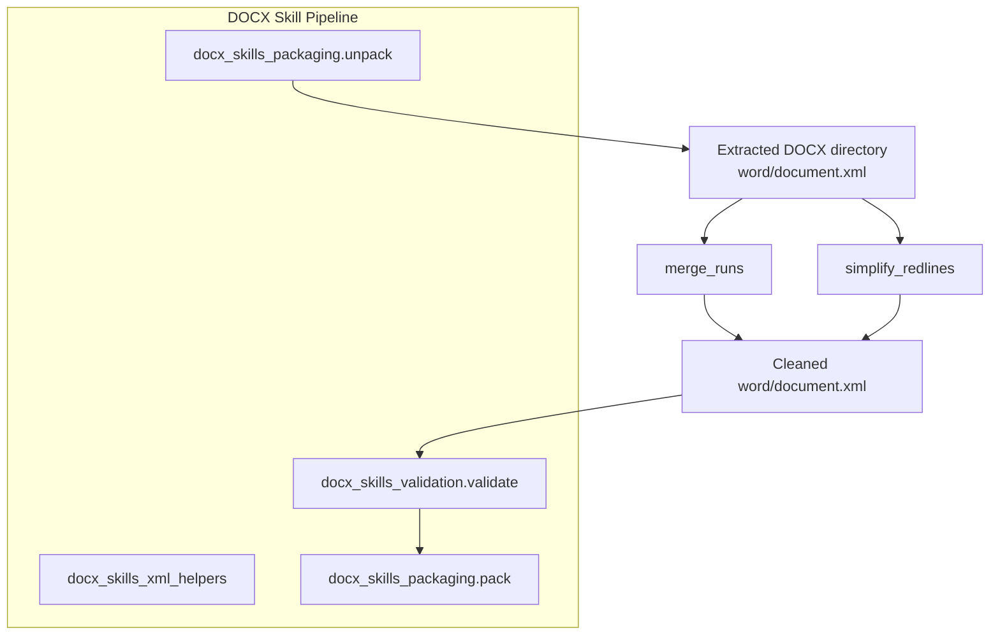
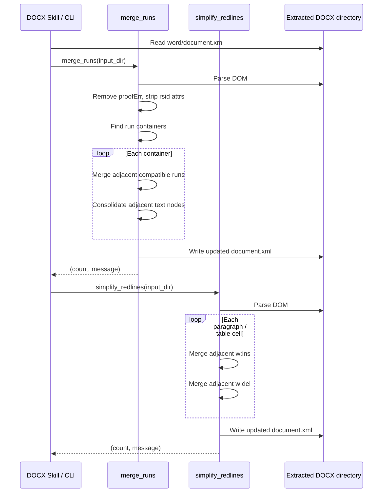
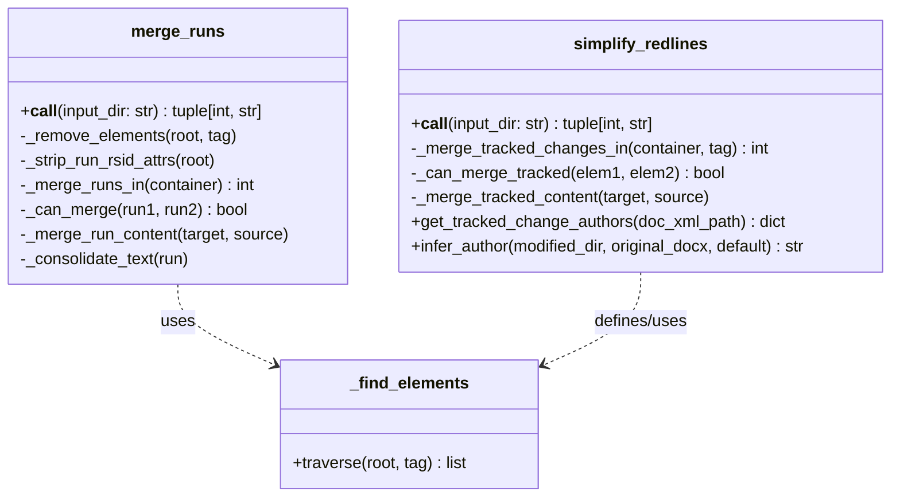
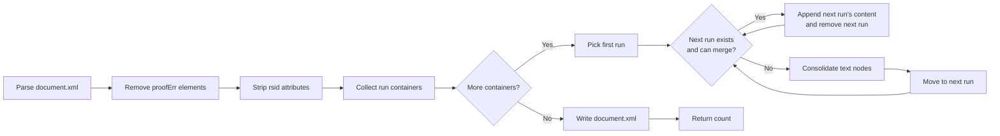
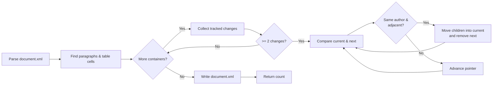

# docx_skills_xml_helpers

The `docx_skills_xml_helpers` module provides low-level XML manipulation utilities for DOCX (Office Open XML) documents. It is part of the [docx_skills](docx_skills.md) skill set and focuses on two primary concerns: merging adjacent text runs that share identical formatting, and simplifying tracked-change markup (redlines) by coalescing adjacent insertions or deletions from the same author. These helpers operate directly on the extracted `word/document.xml` tree using `defusedxml.minidom`, making them safe to run inside the DOCX packaging pipeline before the document is repacked.

---

## Overview

DOCX files are ZIP archives of XML files. When a skill generates or modifies a document, the resulting XML often contains redundant markup: consecutive `<w:r>` runs with the same formatting properties, or many small `<w:ins>` / `<w:del>` tracked-change wrappers produced during iterative edits. The helpers in this module reduce that noise, which improves rendering consistency, shrinks file size, and makes downstream validation and diffing more reliable.

The module is intentionally small and stateless. It exposes two public entry points:

- `merge_runs(input_dir)` — collapses adjacent runs with identical `<w:rPr>` properties.
- `simplify_redlines(input_dir)` — collapses adjacent `<w:ins>` or `<w:del>` elements from the same author.

Both functions accept a path to an **extracted** DOCX directory (i.e., a folder containing `word/document.xml`), mutate the XML in place, and return a `(count, message)` tuple suitable for logging or CLI output.

---

## Architecture

The helpers sit between the unpack and validation/pack stages. They are optional but recommended cleanup steps that improve the quality of generated DOCX files.

---

## Components

### `merge_runs(input_dir: str) -> tuple[int, str]`

Merges adjacent `<w:r>` elements that have identical `<w:rPr>` run properties. It works on runs inside paragraphs and inside tracked-change wrappers (`<w:ins>`, `<w:del>`).

**Key behaviors:**

- Removes `<w:proofErr>` elements (spell/grammar markers) because they prevent run merging.
- Strips `rsid*` attributes from runs; these are revision identifiers that do not affect rendering.
- Compares the full XML serialization of each run's `<w:rPr>` to decide whether two runs can be merged.
- After merging two runs, it also consolidates adjacent `<w:t>` text nodes inside the merged run and preserves `xml:space="preserve"` when whitespace is significant.

**Returns:**

- `(merge_count, "Merged {merge_count} runs")` on success.
- `(0, "Error: ...")` if the document XML is missing or parsing fails.

### `simplify_redlines(input_dir: str) -> tuple[int, str]`

Merges adjacent tracked-change elements of the same type (`<w:ins>` with `<w:ins>`, `<w:del>` with `<w:del>`) when they belong to the same author.

**Rules:**

- Only merges elements of the same tag name.
- Only merges when the `w:author` attribute matches (timestamps are ignored).
- Only merges truly adjacent elements, allowing only whitespace text nodes between them.
- Operates within paragraphs (`<w:p>`) and table cells (`<w:tc>`).

**Returns:**

- `(merge_count, "Simplified {merge_count} tracked changes")` on success.
- `(0, "Error: ...")` on failure.

### `infer_author(modified_dir: Path, original_docx: Path, default: str = "Claude") -> str`

Infers which author produced new tracked changes by comparing the author counts in a modified extracted document against the original `.docx` file.

**Behavior:**

- Collects all `w:author` values from `<w:ins>` and `<w:del>` elements in both the modified XML and the original DOCX.
- Returns the author whose count increased.
- Returns `default` if no tracked changes exist or no new changes are detected.
- Raises `ValueError` if multiple authors added new changes, because the caller cannot disambiguate them.

This is useful for validation or attribution workflows that need to know which agent/user produced the redlines.

### `_find_elements(root, tag: str) -> list`

Recursive helper that returns all element nodes whose local name matches the supplied tag, with or without a namespace prefix. It is used by both `merge_runs` and `simplify_redlines` to locate runs, paragraphs, table cells, and other elements regardless of whether the XML uses prefixes like `w:r` or `r`.

---

## Data Flow

Both helpers are independent and can be run in either order. In practice, `merge_runs` is often executed first so that formatting cleanup happens before tracked-change simplification.

---

## Component Interactions

The internal helpers (`_find_elements`, `_get_child`, `_get_children`, `_is_adjacent`, etc.) are not part of the public API but are essential for namespace-agnostic traversal of the DOCX XML tree.

---

## Process Flow: Run Merging

---

## Process Flow: Redline Simplification

---

## Dependencies

The module depends only on standard Python libraries and one third-party security-focused XML parser:

- `pathlib` — filesystem path handling.
- `xml.etree.ElementTree` — lightweight XML parsing for author inference.
- `zipfile` — reading original `.docx` files for author comparison.
- `defusedxml.minidom` — safe DOM parsing and serialization of untrusted DOCX XML.

There are no runtime dependencies on other modules in the repository, which makes these helpers easy to unit-test in isolation. They are consumed by the broader [docx_skills](docx_skills.md) pipeline, specifically by the packaging and validation stages described in [docx_skills_packaging](docx_skills_packaging.md) and [docx_skills_validation](docx_skills_validation.md).

---

## Integration in the Overall System

`docx_skills_xml_helpers` is one of the smallest but most specialized modules in the [shared_skills](shared_skills.md) layer. It supports the DOCX generation skills under [abstudio_backend](abstudio_backend.md) and the legacy `ainxt_docskills` tree. The cleaned XML it produces is ultimately consumed by:

- [docx_skills_packaging](docx_skills_packaging.md) — repacks the extracted directory back into a `.docx` file.
- [docx_skills_validation](docx_skills_validation.md) — validates the final package against DOCX schema constraints.
- [docx_skills_libreoffice](docx_skills_libreoffice.md) — may run LibreOffice on the cleaned document for PDF conversion or change acceptance.

Because the helpers are pure XML processors, they can also be reused by any other skill or worker that needs to post-process an extracted DOCX directory, such as the document-generation workers in [workers](workers.md).

---

## Error Handling

Both public functions use a defensive pattern:

1. Verify that `word/document.xml` exists.
2. Parse the XML inside a `try/except` block.
3. Return `(0, "Error: ...")` for any I/O or parsing failure.

This design lets callers decide whether to fail the entire pipeline or continue with a warning. The helpers never raise exceptions to the caller for expected error conditions.

---

## Related Documentation

- [docx_skills](docx_skills.md) — parent module for DOCX-specific skills.
- [docx_skills_generation](docx_skills_generation.md) — generation and comment entry points.
- [docx_skills_packaging](docx_skills_packaging.md) — packing and unpacking DOCX archives.
- [docx_skills_libreoffice](docx_skills_libreoffice.md) — LibreOffice integration for change acceptance.
- [docx_skills_validation](docx_skills_validation.md) — schema validation and redlining checks.
- [shared_skills](shared_skills.md) — overview of all reusable skill components.
