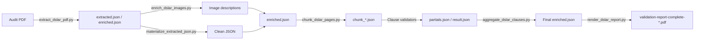
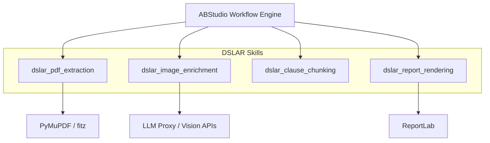

# DSLAR Skills Module

## Overview

The `dslar_skills` module is a specialized skill pack within the broader `shared_skills` ecosystem. It implements a deterministic, multi-stage pipeline for validating NPCI DL-SAR (Data Localization and Storage Audit Report) audit PDFs. The module extracts content from audit PDFs, enriches embedded images with vision model descriptions, validates the report against 13 canonical NPCI clauses, and renders a final validation report PDF.

This module is designed to operate as a set of standalone, script-based tools that are orchestrated by the ABStudio workflow engine. Each script is deterministic and stateless, reading from and writing to JSON artifacts in a shared workflow directory.

## Purpose

- Extract structured content (text, tables, images) from DL-SAR audit PDFs.
- Enrich image evidence with vision model descriptions for downstream clause validation.
- Split large audit reports into page-windowed chunks to fit LLM context limits.
- Validate the audit report against 13 canonical NPCI clauses, including the 68 data-element checklist for Clause 1.
- Aggregate partial clause results from parallel validation branches into a single deterministic output.
- Render a final, human-readable validation report PDF.

## Architecture

The module follows a linear pipeline architecture with a shared JSON artifact (`enriched.json`) as the primary data carrier between stages. Each stage is implemented as one or more Python scripts that can be invoked independently by the workflow engine.

### Data Flow

1. **PDF Extraction**: `extract_dslar_pdf.py` reads the source PDF and produces a JSON payload containing page-level text, tables, image metadata, and flattened sections.
2. **Image Enrichment**: `enrich_dslar_images.py` describes extracted images using a vision model. `materialize_extracted_json.py` cleans raw agent output into valid JSON.
3. **Clause Chunking**: `chunk_dslar_pages.py` splits the extracted content into page-windowed chunks and provides map-reduce helpers. Parallel clause validators produce per-chunk partials.
4. **Aggregation**: `aggregate_dslar_clauses.py` deterministically merges results from four parallel validation branches, ensuring exactly 13 ordered clause results.
5. **Report Rendering**: `render_dslar_report.py` reads the final `enriched.json` and produces a formatted PDF report.

## Sub-modules

| Sub-module | Purpose | Documentation |
|------------|---------|---------------|
| `dslar_pdf_extraction` | Extract text, tables, and image metadata from DL-SAR PDFs. | [dslar_pdf_extraction.md](dslar_pdf_extraction.md) |
| `dslar_image_enrichment` | Describe embedded images with vision models and clean raw agent JSON output. | [dslar_image_enrichment.md](dslar_image_enrichment.md) |
| `dslar_clause_chunking` | Split large reports into chunks and aggregate parallel clause validation results. | [dslar_clause_chunking.md](dslar_clause_chunking.md) |
| `dslar_report_rendering` | Render the final validation report PDF from enriched.json. | [dslar_report_rendering.md](dslar_report_rendering.md) |

## Module Dependencies

The `dslar_skills` module depends on the following external libraries and platform services:

- **PyMuPDF (`fitz`)**: Used for PDF parsing, text extraction, table detection, and image extraction.
- **ReportLab**: Used for PDF report generation in the rendering stage.
- **Vision/LLM APIs**: Used for image description via OpenAI-compatible or Gemini proxy endpoints. Authentication is resolved from environment variables (`LOCAL_LLM_MODEL`, `OPENAI_COMPATIBLE_BASE_URL`, `LLM_PROXY_TOKEN`, etc.).
- **ABStudio Workflow Engine**: Orchestrates the scripts, passes artifacts via `WORKFLOW_ARTIFACT_DIR`, and collects generated files from `OUTPUT_DIR`.

## Key Design Principles

- **Determinism**: Every script produces the same output for the same input. No non-deterministic LLM calls exist in the aggregation or rendering stages.
- **Resilience**: The aggregation script guarantees 13 ordered clause results even when parallel validation branches fail or run out of iteration budget.
- **Context Management**: Large PDFs are split into page-windowed chunks so each LLM turn stays within context limits.
- **Traceability**: Evidence references include page numbers and snippets, making the final report auditable.
- **UTF-8 Safety**: Scripts force UTF-8 output to avoid crashes on Windows consoles when handling non-ASCII audit content.

## Integration with the Broader System

The `dslar_skills` module is a leaf skill pack under `shared_skills`. It is consumed by the ABStudio backend workflow engine, which maps individual scripts to workflow nodes. The workflow engine handles:

- Passing the `WORKFLOW_ARTIFACT_DIR` and `OUTPUT_DIR` environment variables.
- Running parallel clause validation branches.
- Collecting generated PDFs from `OUTPUT_DIR` and serving them via `/generated-files/<name>`.

For more information on how skills are packaged and orchestrated, see the [shared_skills](shared_skills.md) module documentation.
