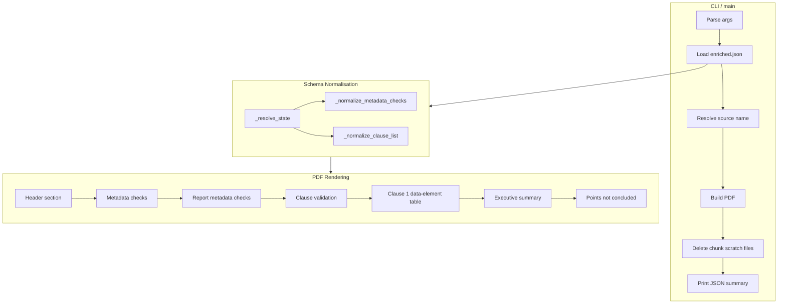
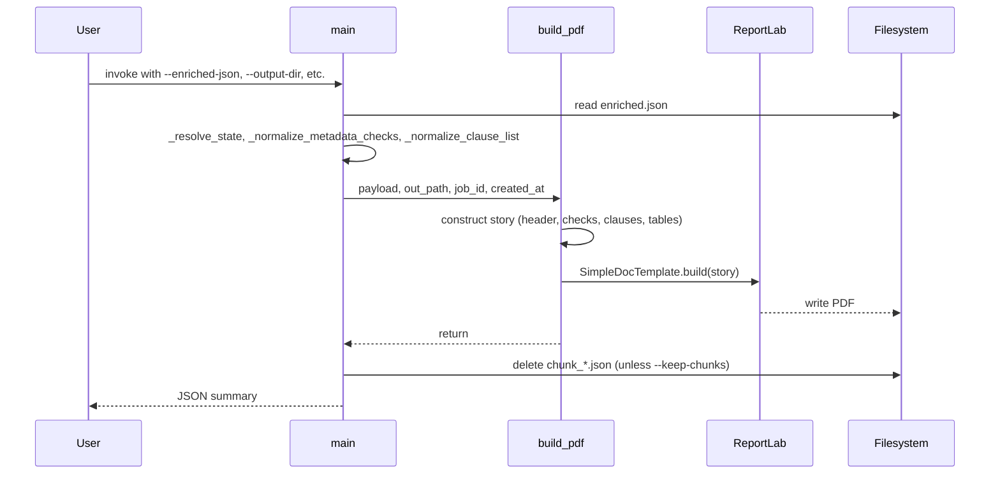

# dslar_skills_dslar_report_rendering

## Brief Introduction

The `dslar_skills_dslar_report_rendering` module is the final, deterministic stage of the NPCI DL-SAR (Data Localisation – Security Audit Report) skill pipeline. It takes the enriched JSON produced by upstream validation agents and renders a single, canonical "Validation Report" PDF. The renderer contains no LLM calls; it only reads the structured state written by decision-maker nodes and formats it into a printable, downloadable report.

This module is part of the larger `dslar_skills` family under `shared_skills`. For the complete end-to-end flow, see the sibling modules:

- [dslar_skills_dslar_pdf_extraction](dslar_skills_dslar_pdf_extraction.md) – extracts text and metadata from the source PDF.
- [dslar_skills_dslar_image_enrichment](dslar_skills_dslar_image_enrichment.md) – enriches extracted image records with vision-model descriptions.
- [dslar_skills_dslar_clause_chunking](dslar_skills_dslar_clause_chunking.md) – splits, validates, and aggregates clause-level results.

## Core Components

| Component | File | Responsibility |
|-----------|------|----------------|
| `main` | `ABStudio/skills/ainxt-skills/dslar-report-pdf/scripts/render_dslar_report.py` | CLI entry point that loads `enriched.json`, builds the PDF, and emits a JSON summary. |
| `build_pdf` | Same file | Layout engine that converts the normalized payload into a ReportLab PDF document. |
| `_resolve_state` / `_normalize_metadata_checks` / `_normalize_clause_list` | Same file | Schema-normalisation helpers that tolerate multiple upstream payload shapes. |
| `_kv_table` / `_status_table` / `_data_elements_table` | Same file | ReportLab table builders for header metadata, status checks, and the NPCI data-element checklist. |
| `delete_chunks` | Same file | Optional cleanup of intermediate `chunk_*.json` scratch files after a successful render. |

## Architecture

### Module Position in the DSLAR Pipeline


The rendering module is intentionally the last step. It trusts the upstream agents to have already made all validation decisions (verdict, clause presence, satisfactory flags, evidence references). Its only job is to present those decisions in a fixed, audit-friendly layout.

### Internal Component Layout



## Data Flow

1. **Input**: `enriched.json` is read from `--enriched-json`. It may contain the final report state either at the top level or nested under `final_report`.
2. **Normalisation**: `_resolve_state` merges the two possible layouts, preferring whichever copy carries real data. Metadata checks and clause results are normalised into ordered lists regardless of whether upstream stored them as dicts or lists.
3. **Layout**: `build_pdf` constructs a ReportLab story with:
   - Title, verdict badge, and header metadata table.
   - Metadata checks (DLSAR mode) and report metadata checks (report mode).
   - Clause validation section, including the 13 canonical clauses.
   - A detailed NPCI data-element checklist table for Clause 1.
   - Executive summary and points not concluded.
4. **Output**: The PDF is written to `--output-dir` with the deterministic name `validation-report-complete-<source>.pdf`.
5. **Cleanup**: Unless `--keep-chunks` is set, intermediate `chunk_*.json` files in the artifact directory are deleted.
6. **Summary**: A compact JSON object is printed to stdout containing the filename, path, number of deleted chunks, verdict, and validation type.



## Component Interactions

### `main`

- Validates that `enriched.json` exists.
- Resolves the output directory and source name.
- Calls `build_pdf` to produce the report.
- Calls `delete_chunks` for scratch-file cleanup.
- Prints the JSON summary.

### `build_pdf`

- Uses `_resolve_state` to obtain a unified payload.
- Builds header rows, metadata tables, and clause blocks.
- For Clause 1, delegates to `_data_elements_table` to render the 68-row NPCI checklist.
- Adds page decorations (footer title and page number) via the `_decorate` callback.

### Normalisation Helpers

- `_resolve_state`: Merges top-level and `final_report` payload shapes.
- `_normalize_metadata_checks`: Accepts either a dict keyed by check name or a list of check objects; returns an ordered list of `(label, value)` tuples.
- `_normalize_clause_list`: Accepts either a list of clause dicts or a dict keyed by clause id; always returns a sorted list.

### Table Builders

- `_kv_table`: Two-column key/value table with a tinted label column.
- `_status_table`: Two-column table whose value cell is colour-coded by status word (Passed/Failed/Inconclusive, present/not present).
- `_data_elements_table`: Wrapped, zebra-striped table for the NPCI data-element checklist with colour-coded status.

## Report Layout

The generated PDF reproduces the canonical "Validation Report" layout:

```
Validation Report
  Verdict / Validation Type / Report Detail / Job ID / Created At
Metadata Checks            (dlsar mode)
Report Metadata Checks     (report mode)
Clause Validation (13 clauses)
  #N Name -- present/not concluded, Satisfactory, Evidence
  Clause 1 -- Data elements (NPCI checklist)   (68 Sr. rows)
Points Not Concluded
```

### Visual Design

- **Brand colour**: `#1F3B73` for headings and table headers.
- **Brand light**: `#E8EDF6` for zebra striping and label backgrounds.
- **Status colours**:
  - Passed / present / yes: `#1B7F3B` (green)
  - Failed / not present / no: `#B00020` (red)
  - Inconclusive / not concluded: `#B8860B` (amber)
  - N/A: `#6B6B6B` (grey)
- **Page size**: A4 with 18 mm side margins and 16 mm top/bottom margins.
- **Footer**: "NPCI DL-SAR Validation Report" on the left, page number on the right.

## CLI Reference

```bash
python render_dslar_report.py \
    --enriched-json <path/to/enriched.json> \
    --output-dir <OUTPUT_DIR> \
    [--artifact-dir <WORKFLOW_ARTIFACT_DIR>] \
    [--source-name <original_pdf_name>] \
    [--job-id <id>] \
    [--created-at <str>] \
    [--keep-chunks]
```

### Arguments

| Argument | Required | Default | Description |
|----------|----------|---------|-------------|
| `--enriched-json` | Yes | — | Path to the enriched JSON payload. |
| `--output-dir` | No | `OUTPUT_DIR` env var or `enriched.json` parent | Directory where the PDF is written. |
| `--artifact-dir` | No | `WORKFLOW_ARTIFACT_DIR` env var or `enriched.json` parent | Directory containing `chunk_*.json` scratch files. |
| `--source-name` | No | Resolved from payload | Original source PDF name used in the output filename. |
| `--job-id` | No | Resolved from payload | Job identifier shown in the header. |
| `--created-at` | No | Resolved from payload | Timestamp shown in the header. |
| `--keep-chunks` | No | False | If set, intermediate chunk files are not deleted. |

### Output Summary

On success, the script prints a JSON object to stdout:

```json
{
  "pdf_filename": "validation-report-complete-<source>.pdf",
  "pdf_path": "<absolute/path>",
  "chunks_deleted": 0,
  "verdict": "...",
  "validation_type": "..."
}
```

## Schema Tolerance

The renderer is designed to be resilient to upstream schema drift. It handles:

- `verdict` vs `final_verdict`
- Top-level fields vs nested under `final_report`
- `metadata_checks` as a dict or a list of objects
- `report_metadata_checks` as a dict or a list of objects
- `clause_results` as a list or a dict keyed by clause id
- `executive_summary` vs `summary`
- `issue_date_valid` vs `issue_date_validity` aliased to a single row
- Missing or malformed evidence references

## Integration with the Platform

The script is normally invoked by the ABStudio code-executor step of a DSLAR workflow. It writes the PDF into `OUTPUT_DIR`, which the platform auto-collects into `GENERATED_FILES_DIR` and serves back as a `/generated-files/<name>` download link. The script does not construct public URLs itself.

For how the platform collects generated files and serves them, see [abstudio_backend](abstudio_backend.md).

## Dependencies

- Python standard library: `argparse`, `json`, `os`, `re`, `sys`, `pathlib`, `typing`
- Third-party: `reportlab` (PDF generation)

## Error Handling

- If `enriched.json` is missing, the script exits with code `2` and prints `{"error": "..."}`.
- If `enriched.json` is unreadable or not a JSON object, the script exits with code `2`.
- PDF build failures propagate as exceptions.
- Chunk deletion failures are silently ignored.

## Related Documentation

- [dslar_skills_dslar_pdf_extraction](dslar_skills_dslar_pdf_extraction.md)
- [dslar_skills_dslar_image_enrichment](dslar_skills_dslar_image_enrichment.md)
- [dslar_skills_dslar_clause_chunking](dslar_skills_dslar_clause_chunking.md)
- [shared_skills](shared_skills.md)
- [abstudio_backend](abstudio_backend.md)
