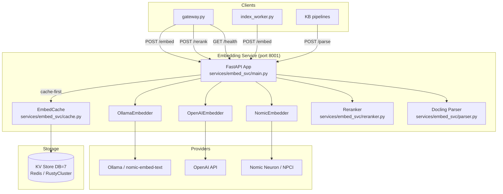
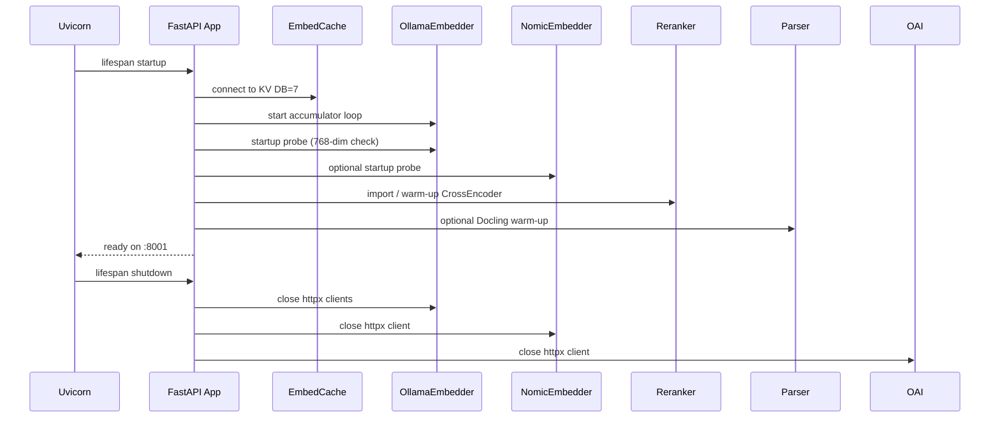
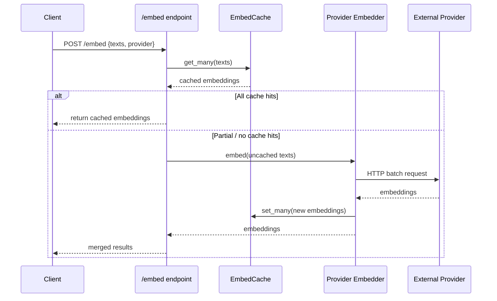
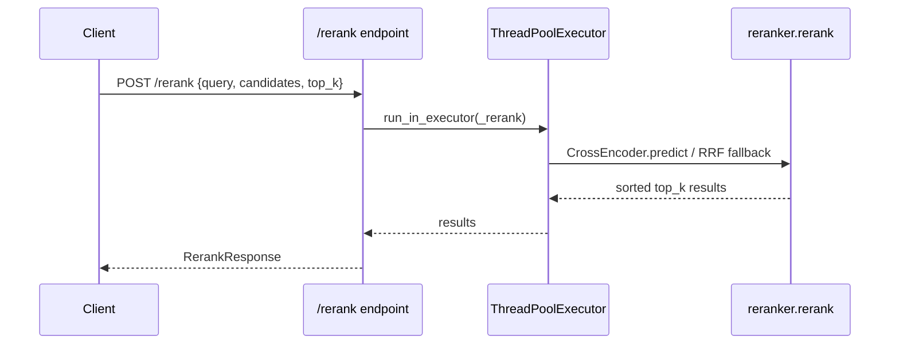

# Embedding Service

## Overview

The **Embedding Service** (`services/embed_svc`) is a dedicated FastAPI microservice that provides text embedding, semantic reranking, and optional document parsing capabilities to the AiNxt platform. It runs on port `8001` and is designed as a single-worker asyncio service with a shared Redis-backed cache, enabling horizontal scaling behind a load balancer.

The service abstracts away the complexity of multiple embedding providers (Ollama, OpenAI, Nomic/Neuron) and exposes a uniform HTTP API used by upstream consumers such as the [gateway](gateway.md), [index workers](workers.md), and knowledge-base pipelines.

## Purpose

- Generate dense vector embeddings for text chunks, queries, and documents.
- Cache embeddings in a platform KV store (Redis or RustyCluster, DB=7) to avoid redundant provider calls.
- Rerank retrieval candidates using a cross-encoder model (BGE by default) with an RRF fallback.
- Optionally parse uploaded documents (PDF, DOCX, HTML, PPTX) into markdown via Docling + PaddleOCR.
- Provide health and diagnostics endpoints for monitoring provider connectivity, cache status, and queue depth.

## Architecture

## Service Lifecycle

## API Endpoints

| Method | Path | Description |
|--------|------|-------------|
| `POST` | `/embed` | Return vector embeddings for a list of texts. Provider can be `ollama`, `openai`, or `nomic`. |
| `POST` | `/rerank` | Score and reorder candidate chunks for a query. |
| `POST` | `/parse` | Convert base64-encoded documents to markdown (requires `PARSE_SVC_ENABLED=1`). |
| `GET`  | `/health` | Report status of Ollama, Nomic, cache, reranker, and parse service. |

## Sub-modules

The service is organized into focused sub-modules:

| Sub-module | File(s) | Responsibility |
|------------|---------|----------------|
| [Embedding Cache](embedding_service_cache.md) | `cache.py` | SHA256-keyed KV cache for embedding vectors with TTL and batch operations. |
| [Embedding Providers](embedding_service_embedders.md) | `embedder.py` | Provider-specific embedders: Ollama (batched accumulator), OpenAI, and Nomic/Neuron. |
| [Reranker](embedding_service_reranker.md) | `reranker.py` | Cross-encoder reranking with noise filtering, candidate capping, and RRF fallback. |

The FastAPI application in `main.py` wires these sub-modules together, handles request/response models, performs startup probes, and exposes the health endpoint.

## Data Flow

### Embedding Request

### Rerank Request

## Configuration

Key environment variables (defined in `services/embed_svc/config.py`):

| Variable | Purpose |
|----------|---------|
| `EMBED_SVC_PORT` | HTTP port (default 8001). |
| `OLLAMA_URL` / `OLLAMA_URLS` | Ollama instance(s) for local embeddings. |
| `OLLAMA_MODEL` | Model name, e.g. `nomic-embed-text`. |
| `OLLAMA_WORKERS` | Number of concurrent sub-batches dispatched per mega-batch. |
| `BATCH_SIZE` | Texts per sub-batch sent to Ollama. |
| `OPENAI_API_KEY` / `OPENAI_MODEL` / `OPENAI_DIMS` | OpenAI `text-embedding-3-small` settings. |
| `NOMIC_EMBED_URL` / `NOMIC_EMBED_API_KEY` / `NOMIC_EMBED_MODEL` | Nomic/Neuron OpenAI-compatible endpoint. |
| `EMBED_CACHE_TTL` | Redis TTL for cached vectors. |
| `RERANKER_MODEL` / `RERANKER_VARIANT` | Cross-encoder model selection. |
| `PARSE_SVC_ENABLED` | Toggle Docling + PaddleOCR document parsing. |

## Dependencies

- **KV store**: Uses the platform's async KV abstraction (`core.kv.async_get_kv`) configured for DB=7 (`RDB_EMBED`). See [shared_core](shared_core.md) for the KV layer.
- **Logging**: Uses `core.logger` from [shared_core](shared_core.md).
- **Document parsing**: Delegates to `core.docling_parser` and a local `parser` module when `PARSE_SVC_ENABLED=1`.
- **Upstream callers**: [gateway](gateway.md) (chat, indexing, KB search), [workers](workers.md) (`index_worker.py`, `kb_entity_worker.py`), and ABStudio backend APIs.

## Operational Notes

- **Single worker recommended**: The Ollama embedder relies on one asyncio accumulator loop; run multiple service instances behind a load balancer for scale.
- **Shared cache**: Because embeddings are keyed by SHA256 of the original text, horizontal instances share cache hits via Redis/RustyCluster.
- **Backpressure**: Pending texts are enqueued with `put()` (blocking) rather than `put_nowait()`, so upstream workers slow down instead of receiving 500 errors.
- **Graceful degradation**: Ollama sub-batch failures fall back to per-text calls; Nomic failures return zero vectors; reranker failures fall back to RRF.
- **Observability**: Optional OpenTelemetry FastAPI instrumentation exports spans when `OTLP_ENDPOINT` and `ENABLE_TRACING=1` are set.
