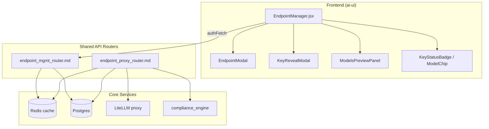
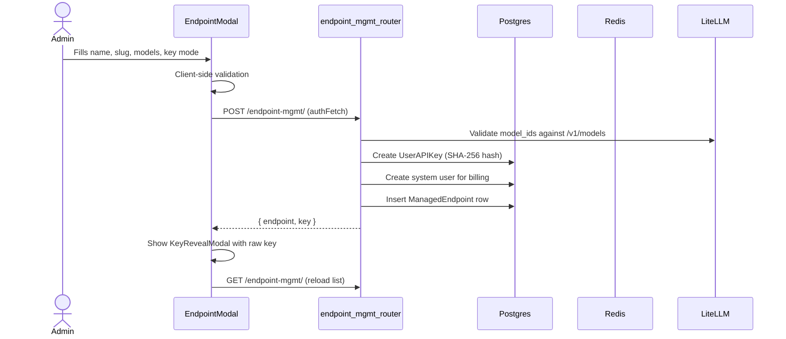
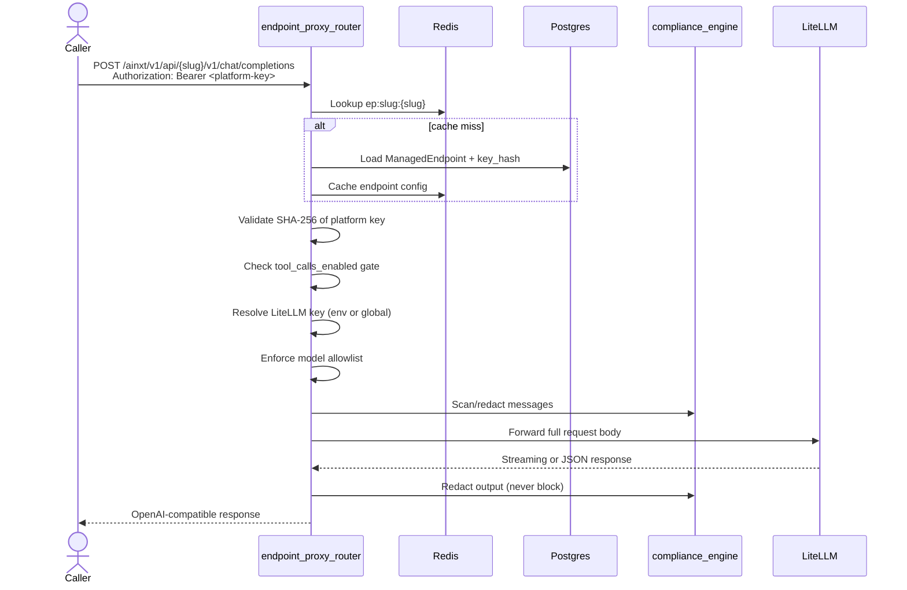

# Endpoint Manager Module

## Brief Introduction

The **Endpoint Manager** module provides an administrative React UI for creating and managing named, OpenAI-compatible proxy endpoints. Each endpoint is exposed under a team-specific URL path (e.g. `/ainxt/v1/api/{slug}/v1/chat/completions`) and is protected by a platform-generated API key. The module lets administrators control which local LiteLLM models an endpoint may use, whether tool calls are allowed, whether a team-specific LiteLLM virtual key is forwarded, and whether the endpoint is active.

This document focuses on the frontend management surface. For the backend management API, see [`endpoint_mgmt_router.md`](endpoint_mgmt_router.md). For the runtime proxy that serves the actual chat completions and model listing calls, see [`endpoint_proxy_router.md`](endpoint_proxy_router.md).

---

## Core Functionality

| Capability | Description |
|------------|-------------|
| **Create endpoint** | Define a name, URL slug, description, allowed models, tool-call policy, and LiteLLM key mode. A platform API key is generated once and shown in a reveal modal. |
| **Edit endpoint** | Update name, description, model allowlist, tool-call flag, and LiteLLM key mode. The slug is immutable after creation. |
| **Enable / disable** | Toggle the endpoint on or off; disabled endpoints return `404` at runtime. |
| **Regenerate key** | Revoke the current platform API key and issue a new one. The old key stops working immediately. |
| **Delete endpoint** | Remove the endpoint, revoke its key, and suspend its system user. |
| **Preview allowed models** | Expand an inline panel to see the model allowlist for an endpoint. |
| **Env-key health warning** | Surfaces endpoints whose team-specific LiteLLM env variable is not configured. |

---

## Architecture



### Component Breakdown

| Component | Responsibility |
|-----------|----------------|
| `EndpointManager` | Main page. Loads endpoints, renders the table, handles toggles, deletion, key regeneration, and modal state. Guards the page to admins only. |
| `EndpointModal` | Create / edit form. Validates name, slug, model selection, and env-key name. Auto-generates slug and env-key name from the endpoint name. |
| `KeyRevealModal` | One-time display of a freshly generated or regenerated API key with copy-to-clipboard. |
| `ModelsPreviewPanel` | Inline expansion showing the selected model allowlist as chips. |
| `KeyStatusBadge` | Small badge indicating whether the endpoint currently has an active platform key. |
| `ModelChip` | Reusable pill for a single model identifier. |

---

## Dependencies

### Frontend Dependencies

| Dependency | Module / File | Purpose |
|------------|---------------|---------|
| `authFetch` | [`config.js`](config.md) | Authenticated fetch wrapper that includes credentials and a correlation header. |
| `usePermission` | [`usePermission.js`](usePermission.md) | Determines whether the current user is an admin; non-admins are blocked from the page. |
| `useToast` / `useConfirm` | [`DialogProvider.jsx`](DialogProvider.md) | Toast notifications and confirmation dialogs for destructive actions. |
| `lucide-react` | External | Iconography. |

### Backend Dependencies

| Dependency | Module | Purpose |
|------------|--------|---------|
| Management API | [`endpoint_mgmt_router.md`](endpoint_mgmt_router.md) | CRUD, toggle, key regeneration, and model preview for managed endpoints. |
| Proxy API | [`endpoint_proxy_router.md`](endpoint_proxy_router.md) | Serves `/{slug}/v1/chat/completions` and `/{slug}/v1/models` at runtime. |
| Local model catalog | [`gateway_local_llm.md`](gateway_local_llm.md) | Validates selected models against the LiteLLM model list. |
| API key store | [`api_keys_router.md`](api_keys_router.md) / `UserAPIKey` | Platform keys are stored and revoked using the same mechanism as CLI keys. |
| Compliance engine | [`compliance_engine.md`](compliance_engine.md) | Scans and redacts PCI/PII in proxy requests. |

---

## Data Flow

### Creating an Endpoint



### Runtime Chat Completions Request



---

## Key Concepts

### Platform API Key vs. LiteLLM Key

| Key | Stored | Returned | Purpose |
|-----|--------|----------|---------|
| **Platform API key** | SHA-256 hash in `user_api_keys` | Raw value shown **once** after create/regenerate | Caller authenticates to the endpoint proxy. |
| **LiteLLM key** | Env variable or global config only; never returned | Never returned | Used by the gateway to call LiteLLM on the caller's behalf. |

The separation lets administrators hand out endpoint-specific platform keys to teams while the gateway controls which LiteLLM virtual key (team-specific or global) is forwarded.

### LiteLLM Key Modes

- **Global key** (`use_env_key=false`): The gateway forwards the global `LOCAL_LLM_API_KEY`. Useful for simple deployments or shared budgets.
- **Team env key** (`use_env_key=true`): The gateway reads `os.getenv(env_key_name)` and forwards that LiteLLM virtual key. This enables per-team model restrictions and budgets inside LiteLLM. The UI warns if the env variable is missing.

### Model Allowlist

- Admins select allowed models from the local LiteLLM catalog.
- An empty selection means **no restriction**; the proxy falls back to the models LiteLLM reports for the resolved key.
- At runtime, requests using a model outside the allowlist are rejected with `403`.

### Tool Call Gating

Each endpoint has a `tool_calls_enabled` flag. When disabled, requests containing `tools` or `tool_choice` are rejected with `400` before reaching LiteLLM.

---

## Security & Compliance

- **Admin-only access**: The UI uses `usePermission(user).isAdmin` to block non-administrators.
- **Key hashing**: Raw platform keys are never stored; only SHA-256 hashes are kept.
- **One-time reveal**: The raw key is shown only in `KeyRevealModal` immediately after creation or regeneration.
- **Input/output scanning**: The proxy scans messages for PCI/PII and can block or redact. See [`compliance_engine.md`](compliance_engine.md).
- **Authorization**: Runtime requests require `Authorization: Bearer <platform-key>` and are validated against the stored hash.

---

## Process Flows

### Enable / Disable an Endpoint

```mermaid
flowchart LR
    A[Admin clicks status toggle] --> B{Confirm?}
    B -->|Yes| C[PATCH /endpoint-mgmt/{id}/toggle]
    C --> D[Flip enabled flag in DB]
    D --> E[Invalidate Redis cache]
    E --> F[Reload endpoint list]
```

### Regenerate an API Key

```mermaid
flowchart LR
    A[Admin clicks regenerate] --> B{Confirm?}
    B -->|Yes| C[POST /endpoint-mgmt/{id}/regenerate-key]
    C --> D[Revoke old UserAPIKey]
    D --> E[Generate new key pair]
    E --> F[Update endpoint.api_key_id]
    F --> G[Invalidate cache]
    G --> H[Show KeyRevealModal]
```

### Delete an Endpoint

```mermaid
flowchart LR
    A[Admin clicks delete] --> B{Confirm?}
    B -->|Yes| C[DELETE /endpoint-mgmt/{id}]
    C --> D[Delete ManagedEndpoint row]
    D --> E[Revoke UserAPIKey]
    E --> F[Suspend system user]
    F --> G[Invalidate cache]
```

---

## Integration with the Wider System

- **Billing / audit**: Each endpoint owns a deterministic system user (`endpoint-{slug}@system.ainxt`). Usage through the proxy is attributed to that user, so team-level spend and audit trails can be tracked.
- **API key management**: Endpoint keys live in the same `UserAPIKey` table as CLI keys and share revocation, hashing, and prefix-display semantics. See [`api_keys_router.md`](api_keys_router.md).
- **Model governance**: The model allowlist is validated against the local LiteLLM catalog, which is provided by [`gateway_local_llm.md`](gateway_local_llm.md).
- **Compliance**: Proxy requests are scanned by the shared compliance engine, the same engine used by the main gateway chat path. See [`compliance_engine.md`](compliance_engine.md).

---

## File Reference

| File | Role |
|------|------|
| `ai-ui/src/components/EndpointManager.jsx` | Main React component and sub-components for the admin UI. |
| `routers/endpoint_mgmt_router.py` | Backend CRUD, toggle, key regeneration, and model preview. |
| `routers/endpoint_proxy_router.py` | Runtime OpenAI-compatible proxy for managed endpoints. |
