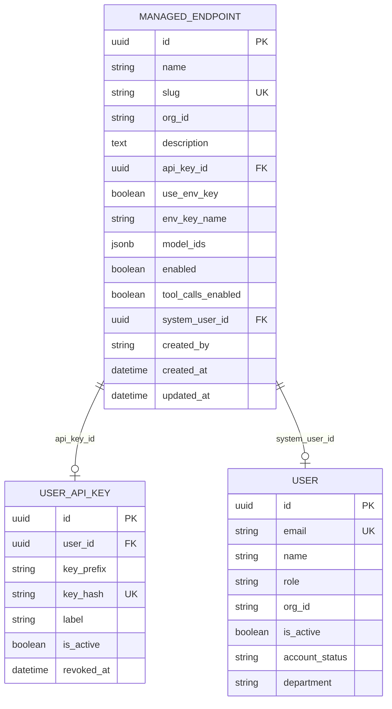
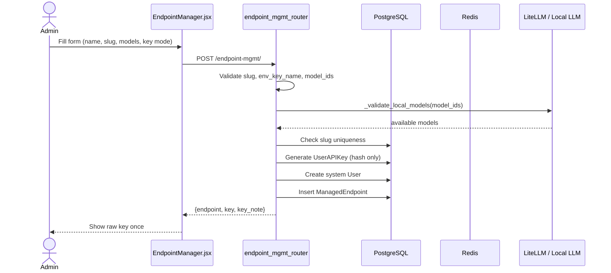
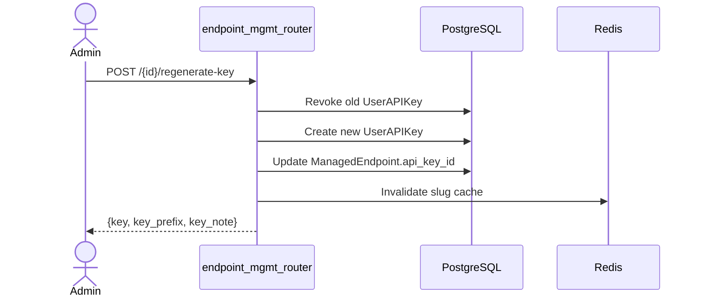
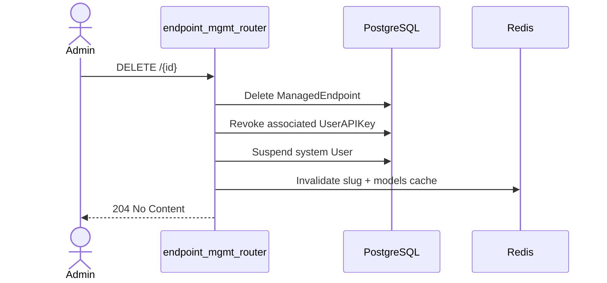

# Endpoint Management Router

The `endpoint_mgmt_router` module provides the administrative API for creating and managing named, OpenAI-compatible proxy endpoints. Each endpoint exposes a dedicated URL path (e.g. `/ainxt/v1/api/{slug}/v1/chat/completions`) that external callers can use with a platform-generated API key, while the platform forwards traffic to a LiteLLM backend using either a global or team-specific virtual key.

This router is strictly admin-facing. It handles the lifecycle of endpoint records, their associated API keys, model allowlists, and LiteLLM key configuration. The actual request proxying is implemented by [`endpoint_proxy_router`](endpoint_proxy_router.md).

---

## Core Responsibilities

- **Endpoint CRUD**: Create, list, retrieve, update, and delete `ManagedEndpoint` records.
- **API key lifecycle**: Generate platform API keys, regenerate them, and revoke them on deletion.
- **LiteLLM backend key selection**: Toggle between a global key (`LOCAL_LLM_API_KEY`) and a team-specific environment variable.
- **Model allowlist management**: Restrict each endpoint to a subset of known local models.
- **Operational controls**: Enable/disable endpoints, enable/disable tool calls, and preview accessible models.
- **Cache invalidation**: Clear Redis cache entries when endpoint configuration changes.

---

## Architecture Overview

```mermaid
flowchart TB
    subgraph Admin["Admin Client (ai-ui)"]
        EM["EndpointManager.jsx"]
    end

    subgraph Gateway["Platform Gateway"]
        EPMR["endpoint_mgmt_router<br/>(admin CRUD)"]
        EPPR["endpoint_proxy_router<br/>(request proxy)"]
        AKR["api_keys_router<br/>(key generation pattern)"]
        LLLM["gateway_local_llm<br/>(model catalog)"]
    end

    subgraph Data["Data Layer"]
        DB[(PostgreSQL)]
        KV[(Redis)]
    end

    subgraph Backend["LiteLLM / Local LLM"]
        LLM["LiteLLM Proxy"]
    end

    EM -->|POST /endpoint-mgmt/| EPMR
    EM -->|GET /endpoint-mgmt/| EPMR
    EM -->|PUT /endpoint-mgmt/{id}| EPMR
    EM -->|DELETE /endpoint-mgmt/{id}| EPMR
    EM -->|PATCH /endpoint-mgmt/{id}/toggle| EPMR
    EM -->|POST /endpoint-mgmt/{id}/regenerate-key| EPMR
    EM -->|GET /endpoint-mgmt/{id}/preview-models| EPMR

    EPMR -->|reads/writes| DB
    EPMR -->|invalidates| KV
    EPMR -.->|mirrors key pattern| AKR
    EPMR -.->|validates models| LLLM

    EPPR -->|resolves config| KV
    EPPR -->|forwards requests| LLM

    style EPMR fill:#e1f5fe
    style EPPR fill:#fff3e0

```

The management router and proxy router are intentionally separated:

- `endpoint_mgmt_router` is authenticated by admin JWT and performs writes to the database.
- `endpoint_proxy_router` is authenticated by the endpoint-specific API key and performs request forwarding.

For details on how requests are proxied, see [`endpoint_proxy_router.md`](endpoint_proxy_router.md).

---

## Data Model

The router operates on three primary tables:

| Table | Purpose | Key Fields |
|-------|---------|------------|
| `managed_endpoints` | Stores endpoint configuration | `id`, `name`, `slug`, `api_key_id`, `use_env_key`, `env_key_name`, `model_ids`, `enabled`, `tool_calls_enabled`, `system_user_id` |
| `user_api_keys` | Stores the platform API key hash | `id`, `user_id`, `key_prefix`, `key_hash`, `label`, `is_active`, `revoked_at` |
| `users` | System user that owns endpoint usage | `id`, `email`, `name`, `org_id`, `is_active`, `account_status` |

### Relationships



The `api_key_id` foreign key uses `ON DELETE SET NULL`, so deleting an endpoint does not cascade-delete the key row. Instead, the router explicitly revokes the key by setting `is_active = False` and `revoked_at`. This preserves audit history.

For more on user API key patterns, see [`api_keys_router.md`](api_keys_router.md).

---

## Core Components

### `_get_db()`

FastAPI dependency that yields a SQLAlchemy `SessionLocal` and closes it after the request.

### `_generate_endpoint_key(slug, admin_user_id, db)`

Generates a platform API key for a new endpoint. The raw key follows the format `ainxt-{slug8}-{uuid4_hex}` and is returned only once. The SHA-256 hash is stored in `user_api_keys` with label `endpoint:{slug}`. This mirrors the CLI key generation pattern in [`api_keys_router.py`](api_keys_router.md).

### `_create_system_user(slug, name, org_id, db)`

Creates a deterministic system user (`endpoint-{slug}@system.ainxt`) that owns the endpoint's usage for billing and audit purposes.

### `_invalidate_slug_cache(slug)`

Deletes Redis cache keys `ep:slug:{slug}` and `ep:models:{slug}` so the proxy router picks up changes immediately.

### `_resolve_litellm_key(ep)` / `_fetch_models_for_key(api_key)`

Helpers used by `preview_models` to select the correct LiteLLM key and call LiteLLM's `/v1/models` endpoint.

### `_validate_local_models(model_ids)`

Validates that every model in the allowlist exists in the local LiteLLM catalog via [`gateway_local_llm`](gateway_local_llm.md). Returns HTTP 422 for unknown models and HTTP 503 if the catalog is unreachable.

### `_ep_out(ep, db)`

Serializes a `ManagedEndpoint` for API responses. Exposes `key_prefix` and `key_active` for display but never exposes `key_hash`, `api_key_id`, or raw keys.

### Pydantic Schemas

- **`EndpointCreate`**: Validates `name`, `slug` (lowercase alphanumeric + hyphens, 3–50 chars), `env_key_name` (uppercase + underscores), and enforces `env_key_name` when `use_env_key=True`.
- **`EndpointUpdate`**: Same validators for partial updates. `slug` is immutable after creation.

---

## Route Reference

| Method | Path | Summary | Auth |
|--------|------|---------|------|
| GET | `/endpoint-mgmt/` | List all endpoints | Admin JWT |
| POST | `/endpoint-mgmt/` | Create endpoint | Admin JWT |
| GET | `/endpoint-mgmt/{id}` | Get one endpoint | Admin JWT |
| PUT | `/endpoint-mgmt/{id}` | Update endpoint | Admin JWT |
| DELETE | `/endpoint-mgmt/{id}` | Delete endpoint | Admin JWT |
| PATCH | `/endpoint-mgmt/{id}/toggle` | Enable/disable endpoint | Admin JWT |
| POST | `/endpoint-mgmt/{id}/regenerate-key` | Rotate platform API key | Admin JWT |
| GET | `/endpoint-mgmt/{id}/preview-models` | Preview LiteLLM models | Admin JWT |

The proxy URLs consumed by callers are **not** part of this router:

- `POST /ainxt/v1/api/{slug}/v1/chat/completions`
- `GET /ainxt/v1/api/{slug}/v1/models`

Those are handled by [`endpoint_proxy_router`](endpoint_proxy_router.md).

---

## Key Lifecycle Flows

### Creating an Endpoint



### Regenerating a Key



### Deleting an Endpoint



---

## LiteLLM Key Modes

Each endpoint can operate in one of two modes:

| Mode | `use_env_key` | LiteLLM key source | Use case |
|------|---------------|-------------------|----------|
| Global | `False` | `LOCAL_LLM_API_KEY` env var | Simple deployments, shared key |
| Team-specific | `True` | `os.getenv(env_key_name)` | Per-team virtual keys, budgets, and model restrictions |

When `use_env_key=True`, the router validates that `env_key_name` is set and warns at creation time if the environment variable is missing. Runtime requests return HTTP 503 if the variable is unset.

---

## Model Allowlists

- `model_ids` is a JSONB list of local model IDs.
- When `null` or empty, the endpoint imposes no platform-side model restriction; LiteLLM's own per-key controls apply.
- When populated, callers may only use those models. The proxy router enforces this at request time.
- During creation/update, the router validates every model against the live local model catalog via [`gateway_local_llm`](gateway_local_llm.md).

---

## Security & Compliance

- **Admin-only access**: All routes require `require_admin` from [`auth.dependencies`](auth_dependencies.md).
- **Key storage**: Only SHA-256 hashes are stored. Raw keys are returned exactly once.
- **Key display**: Responses include only `key_prefix` (e.g. `ainxt-lxpendp-f47ac1`) for UI hints.
- **Revocation**: Deleting or regenerating an endpoint immediately revokes the old key.
- **System user**: Endpoint usage is attributed to a dedicated system user for billing and audit isolation.
- **Compliance scanning**: Input/output scanning happens in the proxy router, not the management router. See [`endpoint_proxy_router.md`](endpoint_proxy_router.md) for details.

---

## Frontend Integration

The admin UI is implemented in [`ai-ui/src/components/EndpointManager.jsx`](ai_ui_frontend_endpoint_manager.md). It provides:

- A table of endpoints with status, key prefix, LiteLLM mode, and model preview.
- A create/edit modal (`EndpointModal`) with slug auto-generation, model selection, and env-key toggling.
- Key reveal modal shown once after creation or regeneration.
- Inline toggles for endpoint status and tool-call allowance.

---

## Configuration

| Environment Variable | Purpose |
|----------------------|---------|
| `LOCAL_LLM_BASE_URL` / `LITELLM_BASE_URL` | Base URL of the LiteLLM proxy |
| `LOCAL_LLM_API_KEY` / `LITELLM_API_KEY` | Global LiteLLM key used when `use_env_key=False` |
| Team-specific variables (e.g. `LXP_LITELLM_API_KEY`) | LiteLLM virtual key used when `use_env_key=True` |

---

## Error Handling

| HTTP Status | Scenario |
|-------------|----------|
| 401 / 403 | Missing admin JWT or non-admin user |
| 409 | Duplicate slug |
| 422 | Invalid slug, env key name, missing `env_key_name` with `use_env_key=True`, or unknown model IDs |
| 502 | LiteLLM returned an error while fetching models |
| 503 | `use_env_key=True` but the env var is not set, or local model catalog unreachable |

---

## Related Modules

- [`endpoint_proxy_router.md`](endpoint_proxy_router.md) — Handles OpenAI-compatible request proxying for each endpoint slug.
- [`api_keys_router.md`](api_keys_router.md) — User-facing CLI/API key management; the endpoint router mirrors its key generation pattern.
- [`gateway_local_llm.md`](gateway_local_llm.md) — Local LLM gateway and model catalog used for allowlist validation.
- [`model_governance_router.md`](model_governance_router.md) — Platform-wide model permissions (complementary to per-endpoint allowlists).
- [`auth_dependencies.md`](auth_dependencies.md) — Admin authentication dependency.
