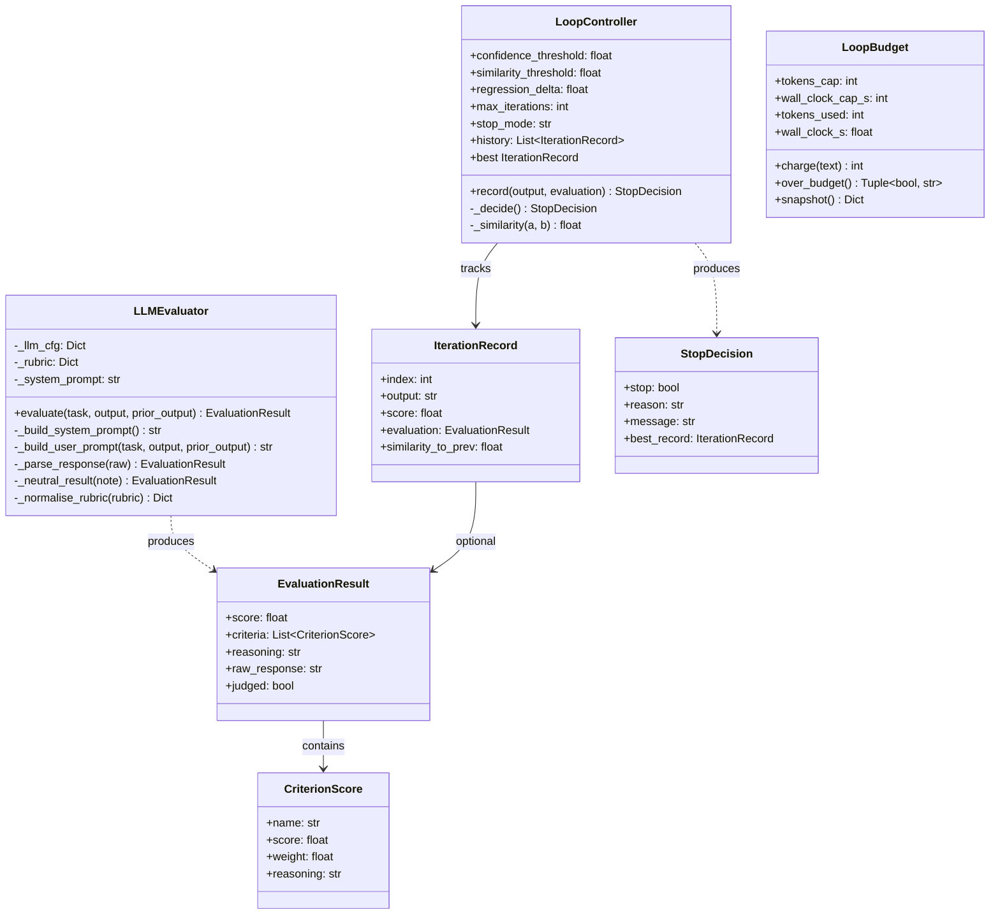
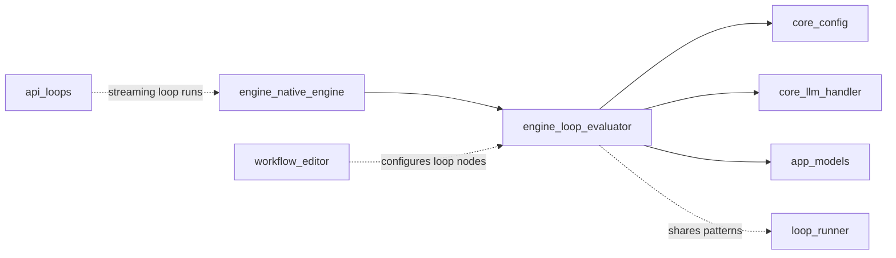
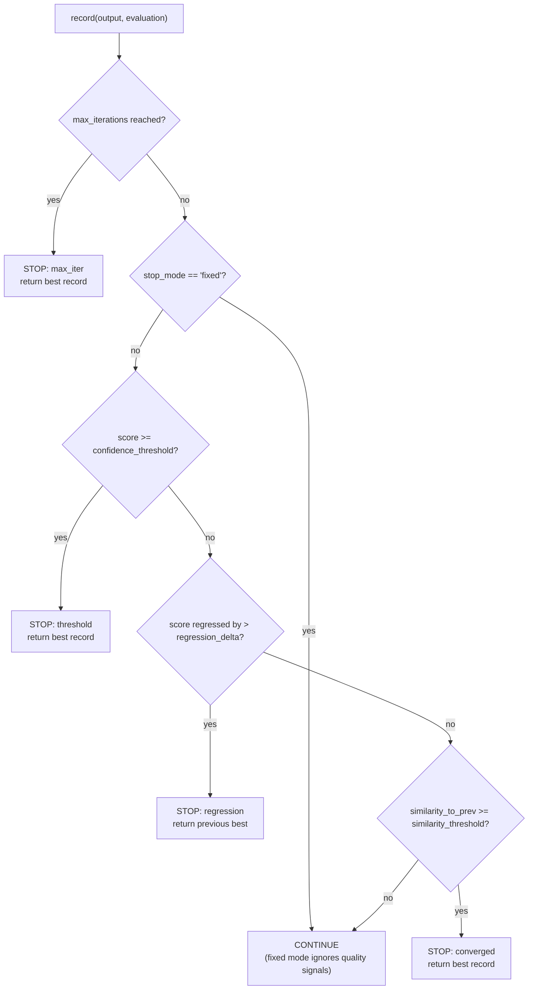
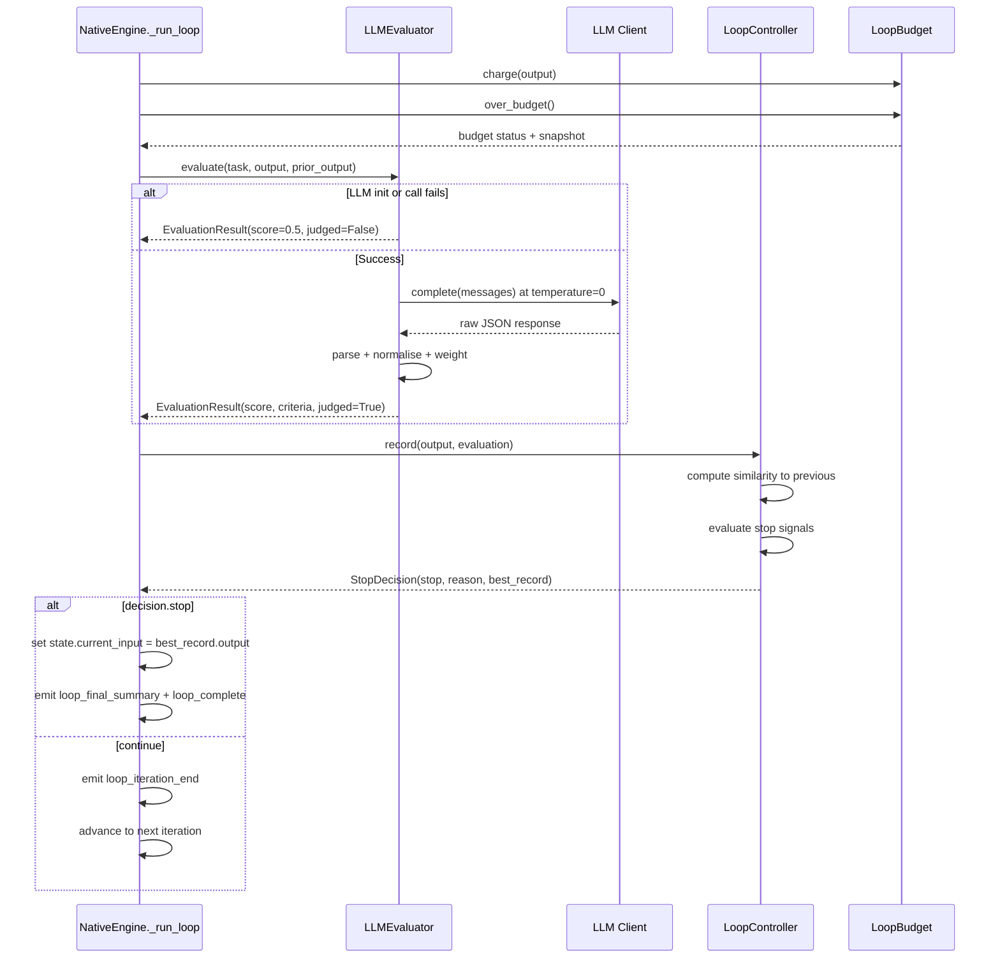
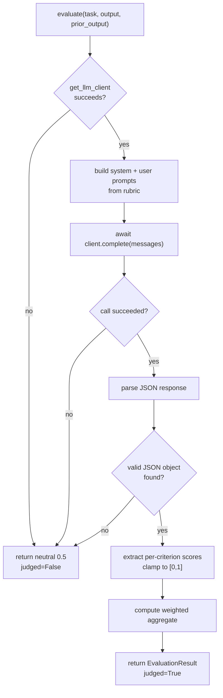
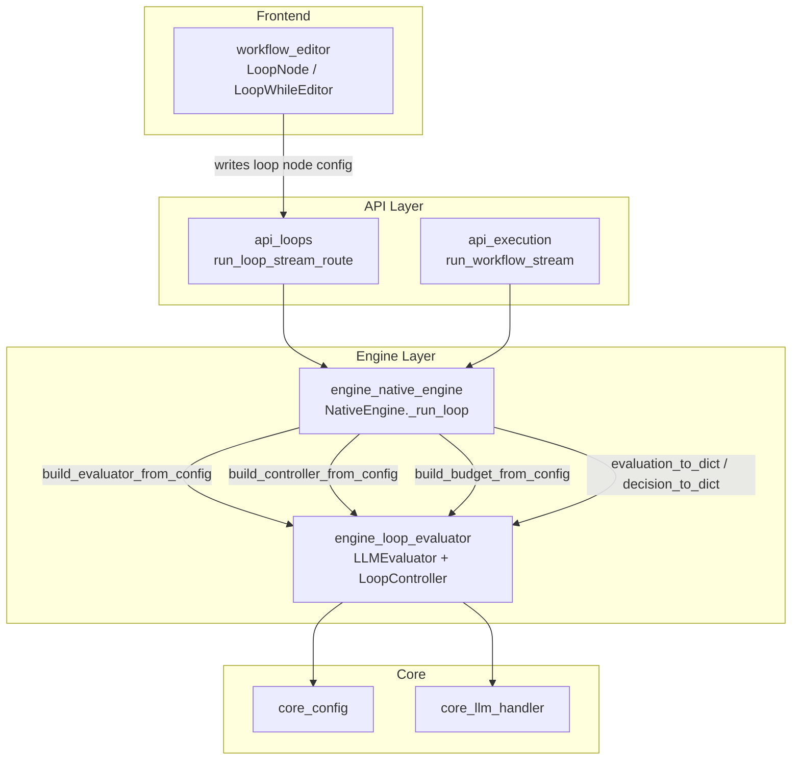

# Engine Loop Evaluator

## Introduction

The `engine_loop_evaluator` module provides **independent LLM-as-judge confidence scoring** and a **hybrid loop-termination policy** for Build Studio's `while`-mode loop nodes. It replaces the earlier approach of trusting a single self-reported `score` value from the body agent — a signal that is prone to LLM overconfidence and drift — with two layered defences:

1. **`LLMEvaluator`** — an independent, rubric-driven judge that scores the body agent's output at `temperature=0` with a strict JSON contract and chain-of-thought-anchored reasoning.
2. **`LoopController`** — a stateful stop policy that combines four signals: confidence threshold, semantic similarity (via `difflib`), regression detection, and a hard `maxIterations` cap.

The module is designed to be **opt-in and backwards compatible**: existing workflows that do not set `useLlmEvaluator` continue to use the body agent's self-reported score unchanged. Only the new loop-node configuration keys activate the enhanced code path.

> **Source file:** `ABStudio/backend/app/engine/loop_evaluator.py`

---

## Architecture Overview



### Module Dependencies



The module depends on:

- **[core_config](core_config.md)** — `factory_model`, `fill_blank_llm_fields`, `openai_compatible_base_url`, `openai_compatible_api_key` for resolving the judge's LLM endpoint.
- **[core_llm_handler](core_llm_handler.md)** — `Message`, `get_llm_client` for provider-agnostic LLM calls (OpenAI / Ollama / vLLM / LiteLLM).
- **[app_models](app_models.md)** — `LLMConfig` dataclass for constructing the LLM client.

It is consumed by:

- **[engine_native_engine](engine_native_engine.md)** — `NativeEngine._run_loop` imports the factory helpers and uses `LLMEvaluator` / `LoopController` / `LoopBudget` during `while`-mode loop execution.

It is configured by:

- **[workflow_editor](workflow_editor.md)** — the frontend `LoopNode`, `LoopWhileEditor`, and `LoopItemsPicker` components write the loop-node configuration keys that activate this module.

---

## Core Components

### LLMEvaluator

An independent LLM-as-judge that scores body-agent output against a fixed rubric. Key anti-hallucination practices:

| Practice | Purpose |
|---|---|
| `temperature=0` forced on the judge config | Deterministic scoring regardless of the generator's temperature |
| Reasoning required **before** the numeric score | Chain-of-thought anchoring — the analysis drives the score, not the reverse |
| Strict single-JSON-object output contract | Parseable, structured result; no free-form prose |
| Each criterion scored **independently** then weighted | A single "vibe" assessment cannot dominate the final number |
| Neutral `0.5` fallback on any failure | The loop can still progress on similarity / max-iter signals when the judge is unhealthy |

#### Default Rubric

The default rubric is deliberately generic so it works for prose, code, planning artifacts, and structured JSON alike:

| Criterion | Weight | Description |
|---|---|---|
| `relevance` | 0.20 | Content matches the requested topic and stays on-scope |
| `accuracy` | 0.20 | Facts, figures, and technical claims are correct and internally consistent |
| `completeness` | 0.20 | Covers every key aspect; no dropped requirements or placeholders |
| `structure` | 0.15 | Clear organisation suited to the artifact type |
| `coherence` | 0.15 | Logical flow between sections; no abrupt jumps or contradictions |
| `depth` | 0.10 | Sufficient technical detail — not too shallow, not padded |

Weights are normalised to sum to `1.0` via `_normalise_rubric`, so users can pass raw values like `{"a": 3, "b": 1}` (treated as 0.75 / 0.25) without manual math.

#### Response Parsing

The parser tolerates a markdown code fence (```` ```json ... ``` ````) but never invents missing fields. A malformed response degrades to a neutral `0.5` score rather than producing a confident-looking number from nothing. Missing criteria are scored `0.0` with an explanatory reasoning string so the user can see which criteria the judge dropped.

#### Configuration Overrides

- **`evaluatorRubric` as a dict** — replaces or extends the default rubric with custom weighted criteria.
- **`evaluatorRubric` as a string** — fully replaces the built-in system prompt (for advanced workflows that need domain knowledge the rubric alone cannot express).
- **`evaluatorLlmConfig` as a dict** — overrides individual LLM config fields (model, base URL, API key) for the judge. Empty-string values are skipped so an unset UI dropdown doesn't wipe out the inherited model.

---

### LoopController

A stateful, framework-agnostic termination policy for `while`-mode loops. The caller is responsible for running the body agent and the evaluator; the controller handles bookkeeping and stop decisions only, making it easy to unit-test deterministically.

#### Stop Signals (evaluated in order)



| Signal | Condition | Stop Reason | Notes |
|---|---|---|---|
| Hard cap | `len(history) >= max_iterations` | `max_iter` | Always honoured first, regardless of `stop_mode` |
| Confidence threshold | `score >= confidence_threshold` | `threshold` | Primary exit signal when evaluator is enabled |
| Regression detection | `current_score < previous_score - regression_delta` | `regression` | Only checked when both records were actually judged (`judged=True`) |
| Similarity convergence | `difflib ratio >= similarity_threshold` | `converged` | Only meaningful with a prior iteration; gated on `judged=True` |
| Continue | None of the above | `continue` | Loop keeps iterating |

#### Stop Modes

- **`adaptive`** (default) — honours every signal. Recommended for most use cases.
- **`fixed`** — runs exactly `max_iterations` rounds and ignores threshold/similarity/regression. Matches the legacy "Run fixed number of times" UX. Still tracks `best_record` so callers can return the best output rather than mechanically the last one.

#### Best Record Tracking

The controller always tracks the highest-scoring iteration via the `best` property. This means even if a later iteration degrades, the caller can return the **best** output — a free quality win that doesn't change the iteration count.

#### Similarity Calculation

Uses `difflib.SequenceMatcher` (stdlib) so the module works in air-gapped deployments without an embeddings endpoint. Inputs are whitespace-normalised and capped at 8,000 characters per side to keep per-iteration latency bounded.

---

### LoopBudget

A small, standalone token + wall-clock accumulator for loop runs. Token counts are **estimated** using the `len(text) // 4` heuristic (same approach used in [loop_runner](loop_runner.md)'s `BudgetMeter`). This is sufficient for a "stop runaway loops" guardrail.

| Method | Purpose |
|---|---|
| `charge(text)` | Add an iteration's output to the token tally; returns the increment |
| `over_budget()` | Refresh wall-clock and report whether either cap has tripped; returns `(over, reason)` where reason is `"tokens"` / `"wall_clock"` / `""` |
| `snapshot()` | Plain dict for the `budget_consumed` SSE payload |

When neither cap is set, `build_budget_from_config` returns `None` and the loop runs uncapped (the existing behaviour for every workflow saved before this feature existed).

---

### Factory Helpers

These functions read raw loop-node configuration dicts and construct the corresponding objects. They are the primary integration point used by [engine_native_engine](engine_native_engine.md).

#### `build_evaluator_from_config(loop_cfg, llm_cfg)`

- Returns `None` when `useLlmEvaluator` is falsy — the legacy path where the body's self-reported score is used as-is.
- Resolves the judge's LLM config with this precedence (low → high):
  1. Inherited body LLM config
  2. `OPENAI_COMPATIBLE_*` env defaults (only filling unset fields)
  3. Per-loop `evaluatorLlmConfig` override

#### `build_controller_from_config(loop_cfg)`

- All keys are optional; missing keys fall back to module defaults.
- When `confidenceThreshold` is absent from the payload, falls back to the numeric threshold from the `LoopWhileEditor` condition row (e.g. `Confidence Score > 0.85` → `0.85`).

#### `build_budget_from_config(loop_cfg)`

- Returns `None` when the node carries no `budget` config.
- A single cap is fine; the unset one is treated as effectively infinite.

#### `verifier_timeout_from_config(loop_cfg)`

- Reads `verify.timeout_s` — the per-iteration judge call timeout.
- Returns `None` when unset so the judge call is awaited without a wrapper.

---

### Serialization Helpers

These functions render evaluation data into plain dicts for SSE payloads and database rows. String fields are capped to prevent a chatty judge from bloating the SSE stream.

| Function | Caps |
|---|---|
| `evaluation_to_dict(ev)` | `reasoning` → 500 chars, per-criterion `reasoning` → 300 chars |
| `record_to_dict(rec)` | `output_preview` → 400 chars |
| `decision_to_dict(decision)` | Nested `best_record` via `record_to_dict` |

---

## Data Flow: Loop Execution Integration

The following sequence diagram shows how `NativeEngine._run_loop` orchestrates the evaluator and controller during a single `while`-mode loop iteration:



### Self-Eval Path (Evaluator Disabled)

When `useLlmEvaluator` is off but the loop is in `while` mode, `NativeEngine._run_loop` still constructs a `LoopController` and feeds the body agent's self-reported score into it via an `EvaluationResult` with `judged=False`. In this path:

- Only the **confidence threshold** and **hard maxIterations cap** gate the loop.
- Regression detection and similarity convergence are **disabled** (they require `judged=True`).
- This matches the user's mental model: "iterate until the condition value is met, or maxIter hits."

### LLM-Judge Path (Evaluator Enabled)

When `useLlmEvaluator` is on, the independent judge's verdict **overrides** the raw case expression. The controller's stop decision determines `will_continue`, and the judge's score replaces the body's self-reported score in the persisted iteration summary.

---

## Evaluator Process Flow



---

## Configuration Reference

All configuration keys are optional. Missing keys fall back to module defaults.

| Key | Type | Default | Description |
|---|---|---|---|
| `useLlmEvaluator` | bool | `false` | Activates the independent LLM judge. When `false`, the body's self-reported score is used. |
| `confidenceThreshold` | float | `0.85` | Exit when `score >= this`. Falls back to `LoopWhileEditor` condition value when absent. |
| `similarityThreshold` | float | `0.95` | Exit when `difflib` ratio between consecutive outputs `>= this`. |
| `regressionDelta` | float | `0.05` | If `current_score < previous_score - this`, return the previous best. |
| `maxIterations` | int | `5` | Hard cap on iterations. Always honoured. |
| `stopMode` | str | `"adaptive"` | `"fixed"` runs exactly `maxIterations` rounds; `"adaptive"` honours all signals. |
| `evaluatorRubric` | dict \| str | `DEFAULT_RUBRIC` | Dict replaces rubric criteria; str replaces the entire system prompt. |
| `evaluatorLlmConfig` | dict | inherited | Per-loop LLM config override for the judge (model, base URL, API key). |
| `evaluatorTask` | str | derived | Task description passed to the judge. Falls back to `task` / `description` / default. |
| `budget.tokens_cap` | int | unset | Token estimate cap. When unset, no token limit. |
| `budget.wall_clock_cap_s` | int | unset | Wall-clock cap in seconds. When unset, no time limit. |
| `verify.timeout_s` | float | unset | Per-iteration judge call timeout. When unset, no wrapper. |

---

## Error Handling and Resilience

The module is designed so that **evaluator failures never crash a workflow run**. Every failure path degrades gracefully:

| Failure | Behaviour |
|---|---|
| LLM client init error | Returns `EvaluationResult(score=0.5, judged=False)` with a note |
| LLM call error | Returns neutral `0.5` result; loop continues on similarity / max-iter signals |
| Empty evaluator response | Returns neutral `0.5` result |
| JSON parse error | Returns neutral `0.5` result with the raw snippet for debugging |
| Missing criterion in judge output | Scored `0.0` with reasoning `"evaluator did not score this criterion"` |
| Score out of `[0, 1]` range | Clamped to `[0, 1]` |
| Judge timeout (`verify.timeout_s`) | `NativeEngine` catches `asyncio.TimeoutError`, emits `verifier_fail`, and falls back to case-based decision |
| Budget cap tripped | Loop stops and returns the best-scoring iteration so far |

All warnings are logged via the shared `core.logger` with the `[AGENT]` prefix.

---

## How This Module Fits Into the System



### Relationship to Other Loop Systems

This module is **distinct** from the governed outer-loop system in [loop_runner](loop_runner.md) and [loop_models](loop_models.md):

- **`engine_loop_evaluator`** — serves the **canvas Loop node** in Build Studio workflows. It is a lightweight, self-contained evaluator + controller that runs inside `NativeEngine._run_loop` for `while`-mode loops. Its `LoopBudget` is a simple accumulator with no goal/ctx precedence.
- **[loop_runner](loop_runner.md)** — serves the **governed outer loop** with `LoopRunner`, `ProofEvaluator`, `VerifierAgent`, `BudgetMeter`, `ReflectionWriter`, and `AgentMemory`. That system has richer semantics (goals, triggers, inbox triage, proof checks) and its own `BudgetMeter` with goal/ctx precedence.

The in-graph **evaluation gate** node (`evaluation_gate` type) in `NativeEngine` uses a separate helper (`evaluate_llm_judge` from [loop_runner](loop_runner.md)), not this module. See [engine_native_engine](engine_native_engine.md) for details.

### SSE Events

The `NativeEngine._run_loop` method emits the following SSE events that carry data produced by this module. See [engine_native_engine](engine_native_engine.md) for the full event catalogue:

| Event | Source Data |
|---|---|
| `loop_evaluation` | `evaluation_to_dict(evaluation)` + `decision_to_dict(decision)` |
| `verifier_started` / `verifier_pass` / `verifier_fail` | Judge lifecycle, score, and stop reason |
| `budget_consumed` | `LoopBudget.snapshot()` |
| `loop_iteration_summary` | Score (judge or self-reported) + changes |
| `loop_final_summary` | Aggregated iteration scores, delta, budget halt info |

---

## Key Design Decisions

1. **No new dependencies** — uses stdlib `difflib` for similarity so the module works in air-gapped deployments without an embeddings endpoint.
2. **Pure-async** — uses the same `get_llm_client` / `Message` types as the rest of the engine, wiring the evaluator through the same provider abstraction the generator uses.
3. **Backwards compatible** — callers that don't construct a controller or evaluator keep their existing behaviour. Only the new optional loop-config keys activate the new code path.
4. **Best-output guarantee** — the controller always tracks the highest-scoring iteration, so even in `fixed` mode or on regression, the caller can return the best artifact rather than the last one.
5. **LLM config inheritance** — loop nodes don't expose a model picker in the UI, so `NativeEngine._resolve_judge_llm_cfg` walks the loop's body subgraph to find the first agent with a real model configured and inherits its LLM config. This guarantees the judge speaks to the same endpoint the body agents use.

---

## References

- [engine_native_engine](engine_native_engine.md) — `NativeEngine._run_loop` integration, SSE event emission, and `_resolve_judge_llm_cfg`
- [loop_runner](loop_runner.md) — governed outer-loop system with `ProofEvaluator`, `BudgetMeter`, `ReflectionWriter`
- [loop_models](loop_models.md) — loop domain models (`VerificationVerdict`, `VerifySpec`, `ProofCheck`, etc.)
- [core_config](core_config.md) — `factory_model`, `fill_blank_llm_fields`, `openai_compatible_*` helpers
- [core_llm_handler](core_llm_handler.md) — `Message`, `get_llm_client`, `FallbackLLMClient`
- [app_models](app_models.md) — `LLMConfig` dataclass
- [workflow_editor](workflow_editor.md) — `LoopNode`, `LoopWhileEditor`, `LoopItemsPicker` frontend components
- [api_loops](api_loops.md) — `run_loop_stream_route` API endpoint
