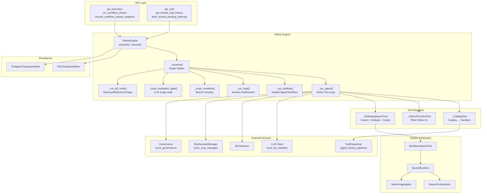
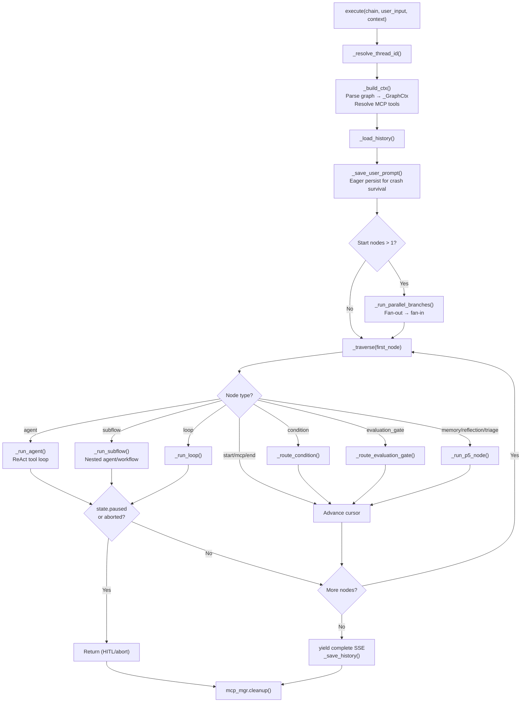
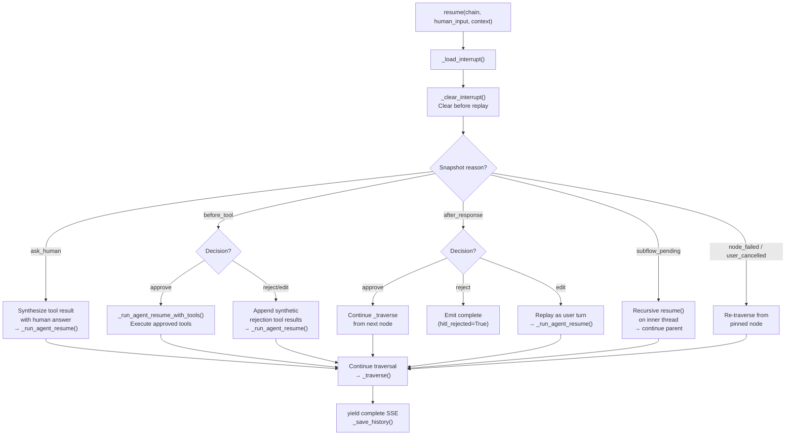
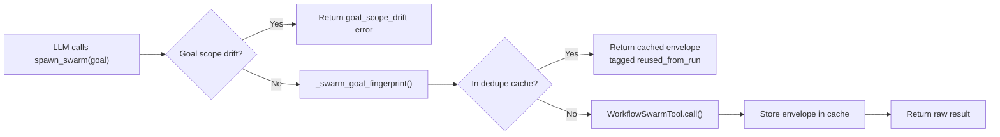
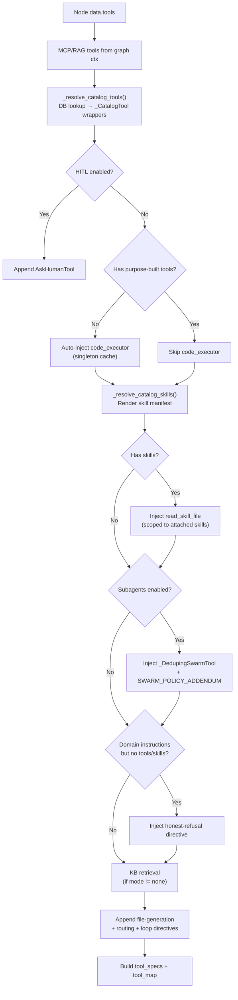
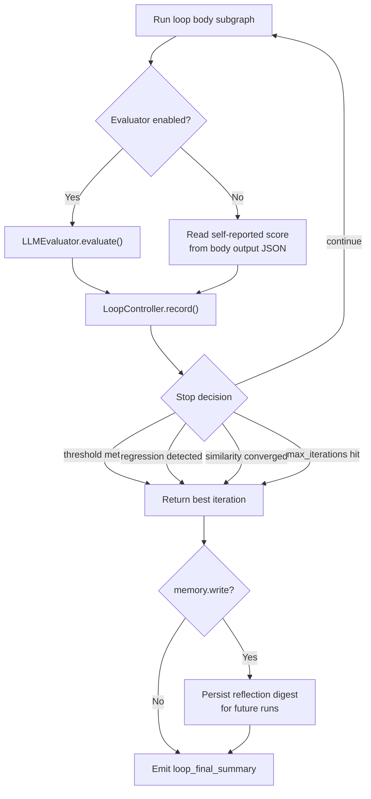
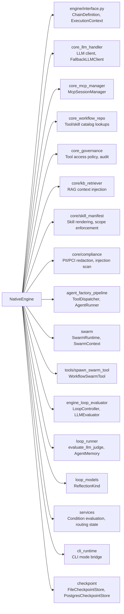

# Native Engine (`engine_native_engine`)

## 1. Introduction

The **NativeEngine** is the pure-Python workflow orchestration engine for ABStudio's Build Studio. It executes multi-agent workflow graphs — sequential chains, parallel fan-out/fan-in branches, condition routing, evaluation gates, and iterative loops — without any dependency on LangGraph or similar external orchestration frameworks. The engine drives a ReAct-style tool-calling loop per agent node, streams results to the client via Server-Sent Events (SSE), and persists state for Human-in-the-Loop (HITL) interrupts, crash recovery, and chat history.

The module lives at `ABStudio/backend/app/engine/native_engine.py` and is the central execution surface invoked by the [API Execution](api_execution.md) endpoints (`run_workflow_stream`, `resume_workflow_stream_endpoint`).

---

## 2. Architecture Overview

---

## 3. Core Components

### 3.1 NativeEngine

The primary class — a stateful orchestrator that implements the `OrchestrationEngine` interface. It manages:

| Responsibility | Key Methods |
|---|---|
| **Lifecycle** | `startup()`, `shutdown()` — initialises checkpoint store (Postgres or file fallback) and warms singleton tool cache |
| **Execution** | `execute()` — runs a workflow graph from the Start node, streaming SSE events |
| **Resume** | `resume()` — rehydrates a paused/failed run from a persisted snapshot and continues traversal |
| **History** | `get_history()`, `list_threads()`, `delete_thread()` — chat thread management |
| **HITL** | `get_pending_interrupt()`, `clear_pending_interrupt()` — interrupt snapshot inspection |
| **Health** | `health()` — engine + store status |

#### Execution Flow

#### Resume Flow

The `resume()` method handles five distinct pause reasons, each with different replay semantics:

### 3.2 Tool Wrappers

All tool wrappers share a common contract: `name`, `description`, `async call(arguments) -> str`, and `to_function_spec() -> dict`.

#### `_CatalogTool`

Wraps tools stored in the `tools_catalog` database table. Dispatches execution to `ToolDispatcher` (from [agent_factory_pipeline](agent_factory_pipeline.md)), which runs the tool's Python source in a subprocess sandbox with a 300s timeout and 1MB stdout cap.

Key features:
- **Skill scope enforcement**: When wrapping `read_skill_file`, enforces an allowlist of attached skill names via `enforce_read_skill_file_scope()` — the LLM cannot read unattached skills by guessing names.
- **Lazy import**: `ToolDispatcher` is imported at call time to avoid circular imports during engine startup.

#### `_PythonFunctionTool`

Wraps a plain synchronous Python function as a callable tool. Runs the function via `asyncio.to_thread()` with up to `ENGINE_MAX_ATTEMPTS` retries on transient exceptions. Deterministic errors short-circuit immediately.

#### `_DedupingSwarmTool`

A transparent adapter around `WorkflowSwarmTool` that provides two critical guardrails for swarm delegation within workflow runs:

1. **Goal-scope drift detection**: Before invoking the swarm, checks whether the LLM's `goal` text references domains outside the node's authorised scope (derived from attached tool prefixes + instruction-mentioned domains). Out-of-scope goals are rejected with a structured `goal_scope_drift` error, preventing cross-domain swarm spawning (e.g., a GitLab node spawning Jira subagents).

2. **Per-run deduplication**: Fingerprints each goal via SHA-256 (normalised text + hints) and caches the swarm envelope on the per-run `_GraphCtx`. Sibling nodes that emit semantically identical goals receive the cached envelope tagged with `reused_from_run`, eliminating redundant swarm executions. Cache is bounded by `_DEDUPE_CACHE_MAX` (default 64).

### 3.3 `_collect_gen`

A simple async utility that drains an `AsyncIterator` into a list. Used internally for collecting generator outputs.

---

## 4. Graph Traversal

The `_traverse()` method is the graph walker that drives execution node-by-node. It handles:

| Node Type | Behaviour |
|---|---|
| `agent` | Runs the ReAct tool-calling loop via `_run_agent()` |
| `subflow` | Dispatches into a saved agent or workflow via `_run_subflow()` |
| `condition` | Evaluates cases top-to-bottom, routes to the matched branch via `_route_condition()` |
| `evaluation_gate` | Runs an LLM judge on the upstream output, routes to `pass` or `fail` handle via `_route_evaluation_gate()` |
| `loop` | Iterates the loop body subgraph via `_run_loop()` |
| `memory_read` / `memory_write` / `reflection_writer` / `triage` | P5 palette nodes for loop engineering via `_run_p5_node()` |
| `start` / `mcp` | Pass-through to first successor |
| `end` | Terminates traversal |

### Parallel Branches

When a node has multiple outgoing edges, the engine detects fan-out/fan-in structure and runs branches concurrently via `_run_parallel_branches()`. Each branch forks the `_ExecState`, runs independently, and results are merged back at the fan-in node. Generated files from all branches are deduplicated by `download_url`.

---

## 5. Agent Execution (`_run_agent`)

The ReAct tool-calling loop is the heart of agent node execution. Each iteration:

1. **Streams LLM response** with tool specifications
2. **Checks for HITL interrupts** (`ask_human`, `before_tool`)
3. **Executes tool calls** with concurrent swarm event draining
4. **Applies compliance gates** (input redaction, output redaction, injection scanning)
5. **Enforces tool ordering** (code_executor is last resort)
6. **Collects generated files** from tool results

### Tool Resolution Pipeline

### Compliance & Security Gates

The engine implements a multi-layer compliance pipeline (FR-T0-1 / FR-T0-2):

| Gate | Stage | Behaviour |
|---|---|---|
| **Compliance-in** | Before prompt construction | Scans node input for PII/PCI. Blocking types (PAN/CVV) abort the run; non-blocking types are redacted. |
| **Compliance-out** | After agent output / tool results / subflow output | Redacts PII/PCI from output. Never blocks — only redacts. |
| **Injection scan** | On tool results and evaluation-gate artifacts | Detects prompt-injection attempts. When policy=block, aborts the node. |

### Swarm Integration

When subagents are enabled (per-node pin or run-level flag), the engine injects a `_DedupingSwarmTool` wrapping `WorkflowSwarmTool`. The swarm runtime:

- Uses the parent agent's configured model for orchestrator, aggregator, and workers
- Streams live `subagent_start` / `subagent_complete` SSE events via an `asyncio.Queue` drained concurrently with the tool call
- Supports strict scoping (only parent-attached tools enter the manifest) and instruction-declared extra domains
- Falls back gracefully: on `plan_validation_failed`, emits a `swarm_fallback` SSE and instructs the parent LLM to proceed directly with its own tools

### CLI Mode

When `ABSTUDIO_CLI_MODE` is enabled, agent nodes can optionally route through a spawned `ainxt` CLI process instead of the in-process ReAct loop (`_run_agent_via_cli`). HITL nodes and `spawn_swarm` stay native. An emergency fallback to the in-process engine is available via `ABSTUDIO_CLI_EMERGENCY_FALLBACK`.

---

## 6. Loop Execution (`_run_loop`)

Loop nodes support three modes with optional LLM-judge evaluation:

| Mode | Stop Condition | Config |
|---|---|---|
| `for_each` | Iterate over resolved items list | `itemsExpression` (e.g., `input.issues`) |
| `while` | Case expressions evaluated after each body run (do-while semantics) | `cases[]` with field/operator/value |
| `count` | Fixed iteration count | `count` integer |

### Hybrid Stop Policy

When `useLlmEvaluator` is enabled, an `LLMEvaluator` (from [engine_loop_evaluator](engine_loop_evaluator.md)) scores each iteration against a rubric. A `LoopController` applies a multi-signal termination policy:

### Cross-Run Memory

Loops with `memory.read` load prior-run reflection digests from the checkpoint store and expose them to body agents via `{{loop.prior_lessons}}`. Loops with `memory.write` persist a compact digest after each run, keyed by `(workflow_id, node_id)`.

### Budget Guards

Optional token and wall-clock caps (`build_budget_from_config`) halt runaway loops and return the best-scoring iteration. A per-iteration judge timeout (`verifier_timeout_from_config`) degrades to a neutral score on a hung evaluator.

---

## 7. HITL (Human-in-the-Loop)

The engine supports four HITL modes per agent node, configured via `data.hitlMode`:

| Mode | Trigger | Snapshot Reason |
|---|---|---|
| `ask_human` | LLM calls the `ask_human` tool | `ask_human` |
| `before_tool` | Before any non-HITL tool execution | `before_tool` |
| `after_response` | After agent produces final text | `after_response` |
| `both` | Before tools AND after response | Either |

### Snapshot Persistence

On pause, the engine serialises the full execution state (`_ExecState`) plus context into a JSON snapshot via `_build_interrupt_snapshot()`. This is persisted to the `pending_interrupts` table (Postgres) or the file store. The snapshot includes:

- Full LLM message list (including pending tool calls)
- Execution trace, generated files, usage stats
- Node ID, HITL mode, workflow/user identity
- Extra metadata (ask_human payload, pending tool calls, agent output)

### Failure Recovery

When a node fails (LLM error, retry exhaustion, uncaught exception) or the user cancels mid-run, the engine persists a `node_failed` or `user_cancelled` snapshot pinned to the failing node. On the next `/resume-stream` call, the engine re-executes just that node and continues downstream. Supplementary text from the user is merged into the node's input.

---

## 8. Durable Step Tracking (FR-T0-3)

Every node execution is tracked via `_durable_step()`:

- **`run_steps` table**: Upserted per step with `status` (running/completed/blocked), `input_snapshot`, and `output_ref`. Enables deterministic re-drive on crash.
- **`run_events` table**: Append-only ordered event log. One row per SSE event, enabling exact replay of routing decisions.

Both writes are fire-and-forget via `_schedule_persist()` — a store hiccup never stalls the live SSE stream.

---

## 9. Persistence Layer

The engine uses a `CheckpointStore` abstraction with two implementations:

| Store | When Used | Tables / Schema |
|---|---|---|
| `PostgresCheckpointStore` | `POSTGRES_HOST` is set | `chat_threads`, `pending_interrupts`, `chat_thread_node_outputs`, `loop_iterations`, `loop_lessons`, `condition_routings`, `hitl_decisions`, `run_steps`, `run_events` |
| `FileCheckpointStore` | Fallback (no Postgres) | Single JSON file with nested structure |

See [checkpoint](checkpoint.md) for detailed store documentation.

---

## 10. Dependencies

### Key Module References

| Module | Purpose |
|---|---|
| [engine_loop_evaluator](engine_loop_evaluator.md) | `LoopController` (hybrid stop policy) and `LLMEvaluator` (rubric-based LLM judge) |
| [loop_runner](loop_runner.md) | `evaluate_llm_judge` for evaluation gates, `AgentMemory` / `MemoryReadHandler` / `ReflectionWriter` for P5 nodes |
| [loop_models](loop_models.md) | `ReflectionKind` enum, `ActionSpec`, `VerifySpec` and other loop data models |
| [agent_factory_pipeline](agent_factory_pipeline.md) | `ToolDispatcher` (sandbox execution), `AgentRunner` (subflow agent execution) |
| [swarm](swarm.md) | `SwarmRuntime`, `SwarmContext`, `SwarmOrchestrator`, `SwarmAggregator` for subagent delegation |
| [core_llm_handler](core_llm_handler.md) | `FallbackLLMClient`, `OpenAIClient`, `Message` for LLM communication |
| [core_mcp_manager](core_mcp_manager.md) | `McpSessionManager` for MCP tool resolution |
| [core_workflow_repo](core_workflow_repo.md) | `get_tool()`, `get_skill()`, `list_skill_files()` for catalog lookups |
| [core_governance](core_governance.md) | `check_tool_access()`, `audit_event()` for tool policy enforcement |
| [checkpoint](checkpoint.md) | `FileCheckpointStore`, `PostgresCheckpointStore` for state persistence |
| [app_models](app_models.md) | `Workflow`, `RunRequest`, `ResumeRequest` data models |
| [api_execution](api_execution.md) | HTTP endpoints that invoke the engine |
| [api_chat](api_chat.md) | Chat thread history and interrupt management endpoints |

---

## 11. SSE Event Reference

The engine emits the following SSE event types during execution:

| Event | When | Key Payload |
|---|---|---|
| `start` | Run begins | `thread_id` |
| `agent_start` | Terminal agent node begins | `agent`, `node_id` |
| `agent_progress` | Intermediate agent node begins/ends | `agent`, `node_id`, `status` |
| `agent_token` | Streaming token from terminal agent | `agent`, `node_id`, `token` |
| `agent_complete` | Terminal agent finishes | `agent`, `node_id`, `output`, `generated_files`, `usage` |
| `agent_usage` | Per-agent token usage | `agent`, `node_id`, `model`, `usage` |
| `agent_retry` | LLM retrying after transient failure | `agent`, `model`, `attempt`, `error` |
| `agent_fallback` | LLM fell back to secondary model | `primary_model`, `fallback_model`, `reason` |
| `agent_warning` | Non-fatal warning (e.g., truncated stream) | `agent`, `message` |
| `tool_call_start` | Tool invocation begins | `agent`, `tool_name`, `arguments` |
| `tool_call_result` | Tool invocation completes | `agent`, `tool_name`, `result` |
| `kb_retrieval` | KB context retrieved | `agent`, `node_id`, `mode`, `chunks`, `confidence` |
| `compliance_verdict` | Compliance scan result | Finding details |
| `injection_detected` | Injection scan result | Finding details |
| `condition_flash` | Condition node entered | `node_id` |
| `condition_routed` | Condition routing decision | `node_id`, `matched_case`, `next_node` |
| `evaluation_gate_passed` / `evaluation_gate_failed` | Judge gate verdict | `node_id`, `score`, `threshold`, `critique` |
| `loop_iteration_start` / `loop_iteration_end` | Loop iteration boundaries | `node_id`, `index`, `total` |
| `loop_iteration_summary` | Per-iteration score/changes | `node_id`, `index`, `score`, `changes` |
| `loop_condition_eval` | While-mode condition evaluation | `node_id`, `case_results`, `will_continue` |
| `loop_evaluation` | LLM judge verdict | `node_id`, `evaluation`, `decision` |
| `loop_final_summary` | Loop completion summary | `iterations`, `initial_score`, `final_score`, `delta` |
| `loop_complete` | Loop node finished | `node_id`, `total_iterations` |
| `verifier_started` / `verifier_pass` / `verifier_fail` | Judge/verifier lifecycle | `node_id`, `index`, `score` |
| `memory_read` / `memory_write` / `reflection_written` | P5 node events | `node_id`, `loop_id` |
| `triage_started` / `triage_completed` | Triage node events | `node_id`, `inbox_size` |
| `hitl_interrupt` | HITL pause | `reason`, `thread_id`, `node_id`, payload |
| `hitl_resumed` | HITL resume | `thread_id`, `decision`, `reason` |
| `workflow_retrying` | Failure/cancel recovery | `thread_id`, `node_id`, `reason` |
| `swarm_plan` / `swarm_complete` / `swarm_fallback` | Swarm lifecycle | `run_id`, `node_id` |
| `subagent_start` / `subagent_complete` | Swarm worker lifecycle | `call_id`, `alias`, `agent_id` |
| `budget_consumed` | Loop budget tracking | `node_id`, `index`, token/wall-clock snapshot |
| `complete` | Run finishes successfully | `output`, `execution_trace`, `generated_files`, `usage` |
| `error` | Run fails | `message`, `node_id`, `retryable` |

---

## 12. Configuration

### Environment Variables

| Variable | Default | Purpose |
|---|---|---|
| `POSTGRES_HOST` | (unset) | Enables Postgres checkpoint store |
| `AGENT_MAX_ITER` | `20` | Max ReAct loop iterations per agent |
| `AGENT_MAX_ITER_HARD_CAP` | (code constant) | Absolute upper bound on iterations |
| `ENGINE_MAX_ATTEMPTS` | (code constant) | LLM/tool retry attempts on transient failures |
| `SWARM_DEDUPE_CACHE_MAX` | `64` | Max unique swarm goals cached per run |
| `AGENT_TOOL_TIMEOUT` | `300` | ToolDispatcher sandbox timeout (seconds) |
| `TOOL_MAX_ATTEMPTS` | `5` | Tool dispatch retry attempts |
| `ABSTUDIO_CLI_MODE` | (unset) | Route agent nodes through `ainxt` CLI |
| `ABSTUDIO_CLI_EMERGENCY_FALLBACK` | (unset) | Fall back to in-process engine on CLI failure |
| `RUNTIME_ARTIFACTS_DIR` | (code default) | Root directory for per-run workflow artifacts |

### Per-Node Configuration (via `data` dict)

| Field | Type | Purpose |
|---|---|---|
| `instructions` | string | Agent system prompt |
| `modelName` / `llm_config.model_name` | string | LLM model override |
| `tools` | list | Attached catalog tools |
| `skills` | list | Attached catalog skills |
| `hitlMode` | string | HITL mode: `off`, `ask_human`, `before_tool`, `after_response`, `both` |
| `maxIterations` | int | Per-node ReAct loop cap |
| `knowledge` | dict | Per-node KB retrieval config |
| `disable_subagents` | bool | Force-off swarm delegation |
| `enable_subagents` | bool | Force-on swarm delegation (hard gate) |
| `useLlmEvaluator` | bool | Enable LLM judge for loops |
| `confidenceThreshold` | float | Loop stop threshold |
| `memory` | dict | Loop cross-run memory config (`read`, `write`) |
