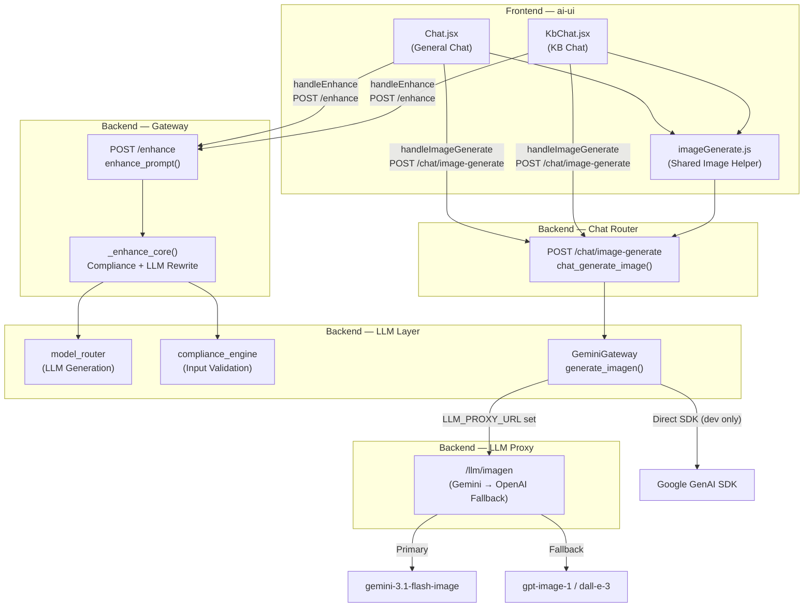
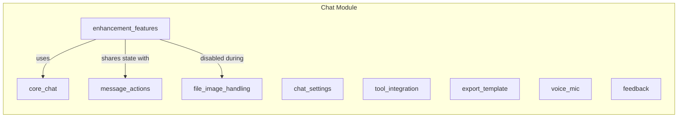
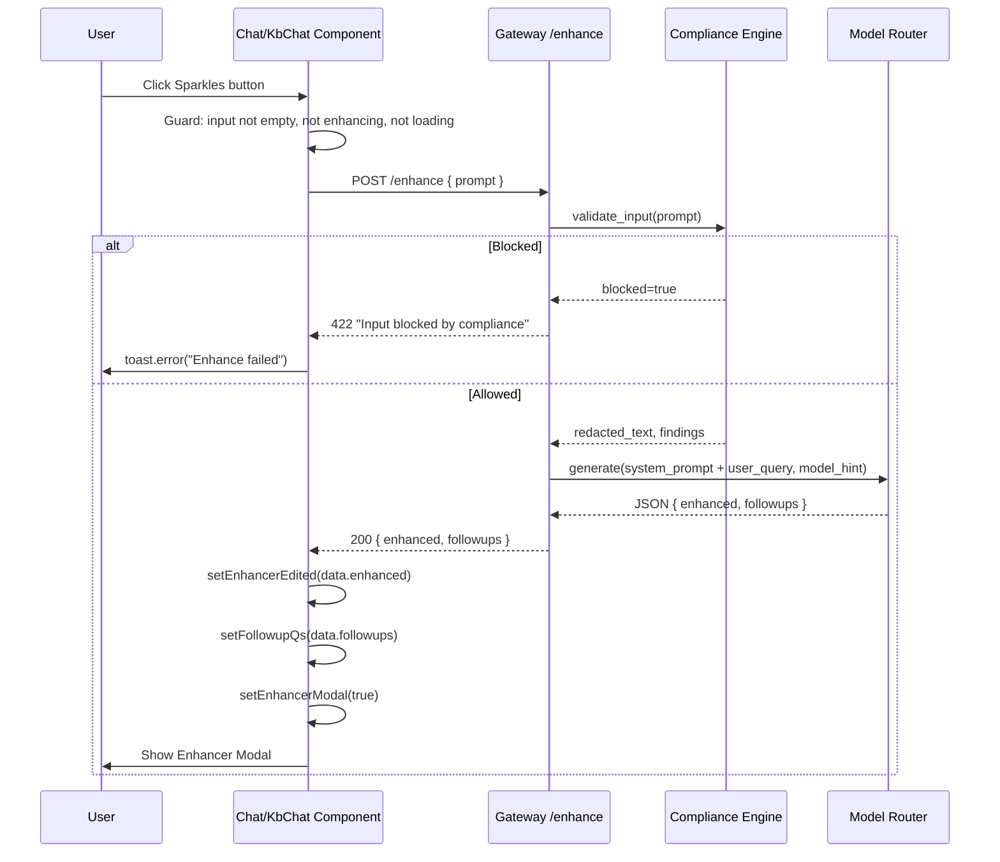
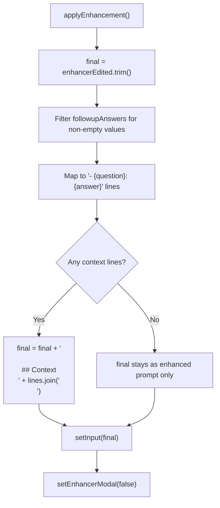
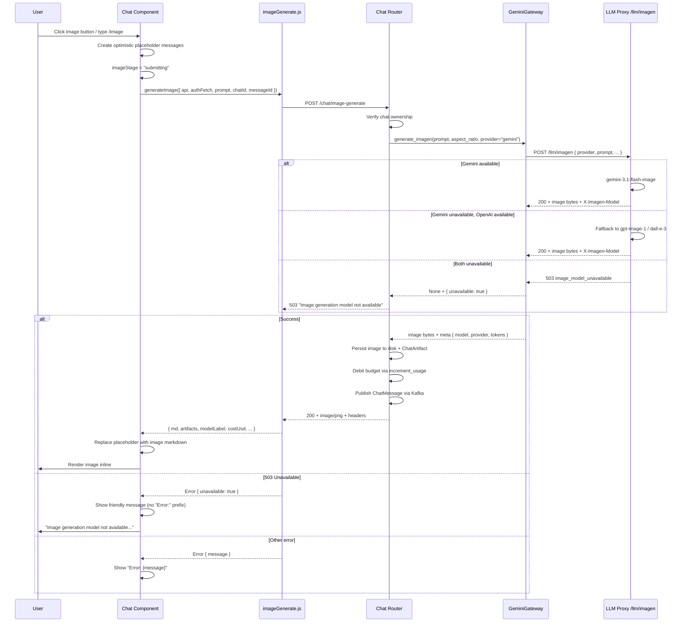
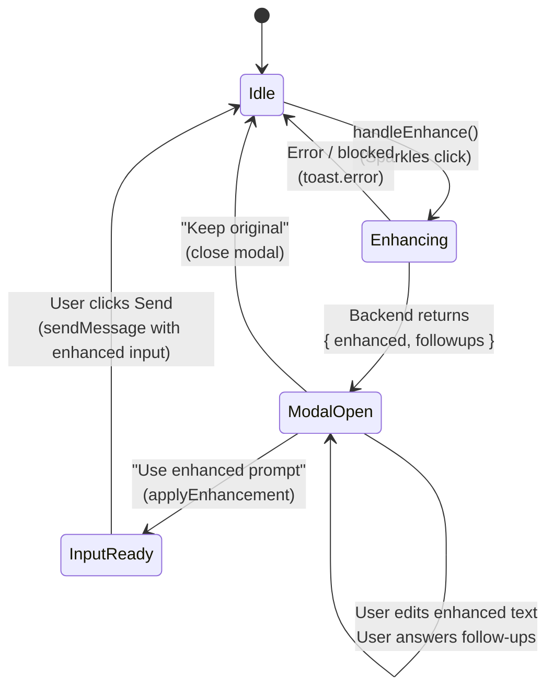
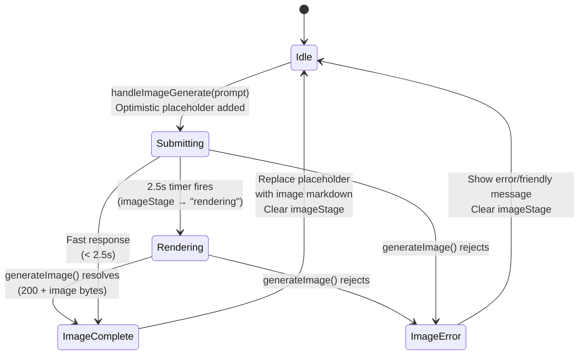
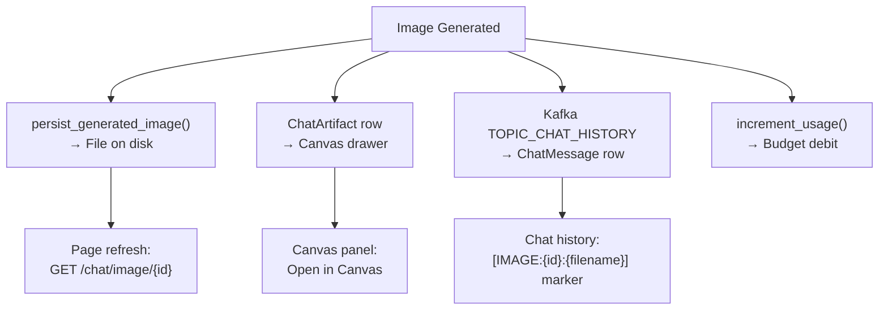

# Enhancement Features Module

## Overview

The **Enhancement Features** module provides AI-powered prompt enhancement and inline image generation capabilities for the platform's chat interfaces. It spans two frontend chat surfaces — the general-purpose **Chat** component (`ai-ui/src/components/Chat.jsx`) and the **Knowledge Base Chat** component (`ai-ui/src/components/KbChat.jsx`) — and connects to backend services in the **Gateway** (`gateway.py`) and **Chat Router** (`routers/chat_router.py`) for LLM-driven prompt rewriting and Gemini-based image generation.

The module consists of three core feature areas:

| Feature | Components | Surfaces |
|---|---|---|
| **Prompt Enhancement** | `handleEnhance`, `applyEnhancement` | Chat.jsx, KbChat.jsx |
| **Inline Image Generation** | `handleImageGenerate` | Chat.jsx, KbChat.jsx |
| **Doc-Intent JSON Extraction** | `_tryExtractJSON` | KbChat.jsx |

---

## Architecture



### Module Position in the System

The enhancement features are **sub-features** of the broader chat experience. They are not standalone modules but rather capability groups embedded within the Chat and KbChat components:



> **See also:** [chat.md](chat.md) for the full Chat component architecture, [kb_chat.md](kb_chat.md) for the KbChat component.

---

## Component Documentation

### 1. Prompt Enhancement

The prompt enhancement feature allows users to click a **Sparkles** (✨) toolbar button to have an LLM rewrite their raw input into a well-structured prompt, optionally suggesting follow-up questions whose answers are appended as context.

#### `handleEnhance()`

**Location:** `ai-ui/src/components/Chat.jsx` (line ~3450) and `ai-ui/src/components/KbChat.jsx` (line ~2515)

**Purpose:** Sends the current input text to the backend `POST /enhance` endpoint, receives an enhanced prompt and optional follow-up questions, and opens the Enhancer Modal for user review.

**Flow:**



**Key behaviors:**
- **Guard conditions:** The function early-returns if the input is empty, an enhancement is already in progress (`enhancing` state), or the chat is actively loading/streaming (`loading` state).
- **Backend compliance:** The gateway's `_enhance_core()` runs the prompt through `compliance_engine.validate_input()` before forwarding to the LLM. Blocked inputs return HTTP 422.
- **Model hint:** The backend uses `ENHANCE_MODEL_HINT` env var (default `"mini"`) to select the LLM tier for enhancement.
- **System prompt:** The backend constructs a detailed system prompt that instructs the LLM to detect audience type (TECHNICAL / NON_TECHNICAL / MIXED), preserve original intent, and produce structured output with sections: Objective, Requirements, Context, Assumptions, Expected Output Format, and Follow-up Questions.
- **JSON response:** The LLM returns `{"enhanced": "<prompt>", "followups": ["q1", "q2", "q3"]}`. The backend strips markdown code fences before parsing.
- **Error handling:** On any failure (network, non-OK response, parse error), a toast notification `"Enhance failed"` is shown. The `enhancing` flag is always reset in the `finally` block.

**State variables consumed:**
| Variable | Type | Purpose |
|---|---|---|
| `input` | `string` | Current textarea content |
| `enhancing` | `boolean` | Loading spinner on the Sparkles button |
| `loading` | `boolean` | Global chat loading state |

**State variables set:**
| Variable | Type | Purpose |
|---|---|---|
| `enhancerEdited` | `string` | Editable enhanced prompt shown in modal |
| `followupQs` | `string[]` | Follow-up questions rendered in modal |
| `followupAnswers` | `object` | Map of question → user answer |
| `enhancerModal` | `boolean` | Controls modal visibility |

---

#### `applyEnhancement()`

**Location:** `ai-ui/src/components/Chat.jsx` (line ~3473) and `ai-ui/src/components/KbChat.jsx` (line ~2538)

**Purpose:** Takes the user-edited enhanced prompt and any answered follow-up questions, assembles them into a final prompt string, replaces the chat input, and closes the Enhancer Modal.

**Logic:**



**Key behaviors:**
- The enhanced prompt text is **user-editable** — the modal renders a `<textarea>` bound to `enhancerEdited`, so the user can refine the LLM's output before applying.
- Follow-up question answers are optional. Only questions with non-empty answers are included.
- Context is appended under a `## Context` markdown heading with bullet-point format (`- Question: Answer`).
- The final string replaces the chat input textarea content. The user then clicks **Send** to submit it through the normal `sendMessage()` flow.

**Identical implementation in both Chat.jsx and KbChat.jsx:** The `handleEnhance` and `applyEnhancement` functions are byte-for-byte identical across both components. This is noted in the KbChat source comments as intentional duplication pending extraction into a shared `useChatSend` hook.

---

#### Enhancer Modal UI

The modal (rendered when `enhancerModal === true`) provides:

1. **Header:** Sparkles icon + "Enhanced Prompt" title, with a close (×) button.
2. **Enhanced Question textarea:** A 5-row editable textarea where the user can modify the LLM-generated prompt.
3. **Follow-up Questions section** (conditional on `followupQs.length > 0`): Each question is rendered as a label with a text input below it. The user can optionally answer any subset.
4. **Footer:** "Keep original" button (closes modal without applying) and "Use enhanced prompt" button (calls `applyEnhancement()`).

---

### 2. Inline Image Generation

#### `handleImageGenerate(prompt)`

**Location:** `ai-ui/src/components/Chat.jsx` (line ~1646)

**Purpose:** Generates an image from a text prompt using the Gemini image model (`gemini-3.1-flash-image`), displaying it inline as an assistant message in the chat. This is the explicit "make me an image" toolbar shortcut.

**Trigger points:**
- **Toolbar button:** The Wand2 (🪄) icon in the chat toolbar (present in both Chat.jsx and KbChat.jsx).
- **Slash command:** Typing `/image <prompt>`, `/img <prompt>`, or `/imagine <prompt>` in the input (handled in `sendMessage()` which delegates to `handleImageGenerate`).
- **KbChat toolbar:** The Wand2 button in KbChat's toolbar, which either generates immediately (if input has text) or inserts `/image ` prefix.

**Flow:**



**Key behaviors:**

- **Optimistic UI:** Two messages are immediately added to the chat — a user bubble with the trimmed prompt and an assistant bubble with `streaming: true` and `imageStage: "submitting"`. This gives instant feedback before the API call completes.

- **Progressive spinner stages:** The `imageStage` field drives a specialized `AiNxtSpinner`:
  - `"submitting"` — initial state, shown immediately
  - `"rendering"` — auto-promoted after 2.5 seconds via `setTimeout` to show progress during the single-round-trip API call (no SSE streaming for images)
  - `undefined` — cleared on completion or error

- **Model pinning:** Image generation **always** uses `gemini-3.1-flash-image` server-side, regardless of the user's selected chat model. The model selector is disabled during image generation (`imageGenerating` state). This is because it's the only image-capable model on the platform.

- **Latency measurement:** Prefers server-measured latency from the `X-Latency-Sec` response header (monotonic `perf_counter()` on the backend) so the live latency chip matches the persisted value after page refresh. Falls back to a client-side `performance.now()` stopwatch for older backends.

- **Metadata propagation:** The response headers carry cost, token, and model metadata that populate the `MessageMeta` footer beneath the image:
  - `X-Model-Label` — actual model id (e.g., `gemini-3.1-flash-image` or `gpt-image-1` after fallback)
  - `X-Cost-USD` — per-token cost (Gemini) or flat per-image rate (OpenAI fallback)
  - `X-Input-Tokens` / `X-Output-Tokens` — token counts (0 for OpenAI images)
  - `X-Token-Usage` — total tokens
  - `X-Artifact-Id` — Canvas artifact ID for "Open in Canvas" functionality

- **Error handling:**
  - **503 (both providers unavailable):** Rendered as a clean chat reply without the scary `"Error:"` prefix — e.g., `"Image generation model not available — please try again later."`
  - **Other errors:** Rendered with `"Error: "` prefix for visibility.
  - The `_imgRenderTimer` is always cleared in the `finally` block to prevent orphaned stage transitions.

- **Async safety:** The `activeChatId` is snapshotted into `imgChatId` at the start to prevent state updates from landing on the wrong chat if the user switches tabs during generation. The `cancelledChatsRef` is reset to `false` for the snapshot chat to mark a fresh turn.

- **Loading state management:** `setLoading(true, imgChatId)` and `setImageGenerating(true)` are set at the start. Both are cleared in the `finally` block. The Send/Stop button is disabled during image generation (Stop is intentionally not offered for images — single-shot render, no cooperative cancel).

**Shared helper — `generateImage()`:**

Located in `ai-ui/src/utils/imageGenerate.js`, this function encapsulates the HTTP call to `POST /chat/image-generate`, response header parsing, and blob-to-data-URL conversion. It returns a structured object:

```javascript
{
  md:        "",  // Markdown for inline rendering
  artifacts: [{ id, title: "Generated image", type: "html" }], // Canvas artifact metadata
  modelLabel: "gemini-3.1-flash-image",                        // Actual model from X-Model-Label
  costUsd:    0.000123,                                        // From X-Cost-USD
  inTok:      15,                                              // From X-Input-Tokens
  outTok:     0,                                               // From X-Output-Tokens
  tokenUsage: 15,                                              // From X-Token-Usage
  latencySec: 3.456,                                           // From X-Latency-Sec
}
```

---

### 3. Doc-Intent JSON Extraction

#### `_tryExtractJSON(text)`

**Location:** `ai-ui/src/components/KbChat.jsx` (line ~183)

**Purpose:** A brace-depth scanner that extracts the first balanced JSON object containing an `"is_doc"` key from a text string. Used by the KbChat doc-intent classifier to parse the local model's JSON response.

**Algorithm:**

```mermaid
flowchart TD
    Start["_tryExtractJSON(text)"] --> FindBrace["Find first '{' in text"]
    FindBrace --> CheckStart{Found?}
    CheckStart -->|No| ReturnNull["return null"]
    CheckStart -->|Yes| InitState["depth=0, inStr=false, esc=false"]
    InitState --> Loop["For each char from start..."]
    Loop --> EscCheck{esc?}
    EscCheck -->|Yes| ResetEsc["esc=false, continue"]
    EscCheck -->|No| BackslashCheck{char == '\\'?}
    BackslashCheck -->|Yes| SetEsc["esc=true, continue"]
    BackslashCheck -->|No | QuoteCheck{char == '\"'?}
    QuoteCheck -->|Yes| ToggleStr["inStr = !inStr, continue"]
    QuoteCheck -->|No| InStrCheck{inStr?}
    InStrCheck -->|Yes| Continue["continue (skip structure chars)"]
    InStrCheck -->|No| OpenBrace{char == '{'?}
    OpenBrace -->|Yes| IncDepth["depth++"]
    OpenBrace -->|No| CloseBrace{char == '}'?}
    CloseBrace -->|Yes| DecDepth["depth--"]
    CloseBrace -->|No| Continue2["continue"]
    DecDepth --> DepthZero{depth == 0?}
    DepthZero -->|No| Continue2
    DepthZero -->|Yes| Extract["candidate = text.slice(start, i+1)"]
    Extract --> HasIsDoc{Contains '"is_doc"'?}
    HasIsDoc -->|No| ReturnNull2["return null"]
    HasIsDoc -->|Yes| Parse["JSON.parse(candidate)"]
    Parse --> ParseOK{Parsed?}
    ParseOK -->|Yes| ReturnObj["return parsed object"]
    ParseOK -->|No| ReturnNull3["return null"]
```

**Key behaviors:**
- **String-aware:** Tracks whether the scanner is inside a quoted string (`inStr`) so braces inside string literals don't affect depth counting.
- **Escape-aware:** Handles escaped characters (`\"`, `\\`) so escaped quotes don't toggle the string state.
- **`is_doc` gate:** Only accepts JSON objects that contain the `"is_doc"` key — this prevents false positives from unrelated JSON in the model's response.
- **KbChat-specific:** In KbChat, the `classifyDocIntent()` function always returns `{ is_doc: false, format: null }` (line ~1623), making `_tryExtractJSON` effectively inert. It remains in the codebase as part of the shared classifier infrastructure that is active in Chat.jsx's `sendMessage()` flow.

> **Note:** In KbChat, document generation is intentionally disabled — KB chats are text/voice-only conversations against the indexed corpus. The `_tryExtractJSON` function and the `DOC_CLASSIFIER_SYS_PROMPT` constant are retained for structural parity with Chat.jsx but are not exercised in the KB chat path.

---

## Data Flow: Enhancement Feature State Machine



## Data Flow: Image Generation State Machine



---

## Dependencies

### Frontend Dependencies

```mermaid
graph TD
    subgraph "Enhancement Features"
        HandleEnhance["handleEnhance"]
        ApplyEnhancement["applyEnhancement"]
        HandleImageGen["handleImageGenerate"]
        TryExtractJSON["_tryExtractJSON"]
    end

    subgraph "External Imports"
        AuthFetch["authFetch<br/>(config.js)"]
        API["API_BASE<br/>(config.js)"]
        Toast["useToast<br/>(DialogProvider)"]
        GenerateImg["generateImage<br/>(imageGenerate.js)"]
    end

    subgraph "Shared State (Chat/KbChat)"
        InputState["input / setInput"]
        LoadingState["loading / setLoading"]
        EnhancingState["enhancing / setEnhancing"]
        EnhancerModalState["enhancerModal / setEnhancerModal"]
        EnhancerEditedState["enhancerEdited / setEnhancerEdited"]
        FollowupQsState["followupQs / setFollowupQs"]
        FollowupAnswersState["followupAnswers / setFollowupAnswers"]
        ChatsState["chats / setChats"]
        ActiveChatId["activeChatId"]
        ImageGenState["imageGenerating / setImageGenerating"]
        CancelledRef["cancelledChatsRef"]
    end

    HandleEnhance --> AuthFetch
    HandleEnhance --> API
    HandleEnhance --> Toast
    HandleEnhance --> InputState
    HandleEnhance --> EnhancingState
    HandleEnhance --> LoadingState
    HandleEnhance --> EnhancerEditedState
    HandleEnhance --> FollowupQsState
    HandleEnhance --> FollowupAnswersState
    HandleEnhance --> EnhancerModalState

    ApplyEnhancement --> EnhancerEditedState
    ApplyEnhancement --> FollowupAnswersState
    ApplyEnhancement --> InputState
    ApplyEnhancement --> EnhancerModalState

    HandleImageGen --> GenerateImg
    HandleImageGen --> ChatsState
    HandleImageGen --> ActiveChatId
    HandleImageGen --> CancelledRef
    HandleImageGen --> LoadingState
    HandleImageGen --> ImageGenState

    GenerateImg --> AuthFetch
    GenerateImg --> API
```



### Backend Dependencies

| Component | Module | Purpose |
|---|---|---|
| `enhance_prompt` / `_enhance_core` | `gateway.py` | HTTP endpoint + shared logic for prompt enhancement |
| `compliance_engine` | `agents/compliance_engine.py` | Input validation / PII redaction before LLM call |
| `model_router` | `models/model_router.py` | LLM generation with model hint routing |
| `chat_generate_image` | `routers/chat_router.py` | HTTP endpoint for image generation |
| `GeminiGateway.generate_imagen` | `gateway_gemini.py` | Image generation with proxy routing + fallback |
| `persist_generated_image` | `services/image_store.py` | Disk persistence of generated images |
| `increment_usage` | `store/budget_store.py` | Budget debit for image generation cost |
| `produce` / `TOPIC_CHAT_HISTORY` | `core/kafka_producer.py` | Async persistence of image chat messages |

> **See also:** [gateway.md](gateway.md) for the full gateway architecture, [shared_core.md](shared_core.md) for compliance engine and model router details.

---

## Cross-Component Interaction

### Chat.jsx vs. KbChat.jsx: Enhancement Feature Parity

The enhancement features are intentionally duplicated across both chat surfaces. The following table documents the parity:

| Feature | Chat.jsx | KbChat.jsx | Notes |
|---|---|---|---|
| `handleEnhance()` | ✅ Identical | ✅ Identical | Same `POST /enhance` call, same state management |
| `applyEnhancement()` | ✅ Identical | ✅ Identical | Same context-line assembly logic |
| Enhancer Modal UI | ✅ Identical | ✅ Identical | Same modal markup and styling |
| `handleImageGenerate()` | ✅ Full implementation | ✅ Full implementation | Present in both; KbChat has Wand2 toolbar button |
| `_tryExtractJSON()` | ❌ Not present | ✅ Present | KbChat-specific; inert due to `classifyDocIntent` always returning `is_doc: false` |
| Image toolbar button | ✅ ImageIcon | ✅ Wand2 | Different icons but same functionality |

The source code explicitly notes this duplication:

> *"SYNC WITH Chat.jsx sendMessage — any change to sendMessage here must also be applied in Chat.jsx until a shared `useChatSend` hook is extracted."*

### Interaction with Other Chat Sub-Features

```mermaid
graph LR
    subgraph "Enhancement Features"
        HE["handleEnhance"]
        AE["applyEnhancement"]
        HIG["handleImageGenerate"]
    end

    subgraph "Core Chat"
        SM["sendMessage"]
        SG["stopGeneration"]
    end

    subgraph "File/Image Handling"
        HIS["handleImageSelect"]
        FU["handleFileUpload"]
    end

    subgraph "Message Actions"
        HR["handleRegenerate"]
        HC["handleContinue"]
    end

    subgraph "Chat Settings"
        SCS["setChatScope"]
        SCRM["setChatRagMode"]
    end

    HE -->|"disables during"| SM
    HE -->|"checks"| SG
    AE -->|"feeds into"| SM
    HIG -->|"disables"| SM
    HIG -->|"disables"| SG
    HIG -->|"disables model selector"| SCS
    SM -->|"can delegate to"| HIG
```



**Key interactions:**
- **`handleEnhance` → `sendMessage`:** The enhance button is disabled when `loading` is true (a message is streaming). After `applyEnhancement` sets the input, the user manually clicks Send to trigger `sendMessage`.
- **`handleImageGenerate` → `sendMessage`:** The `sendMessage` function checks for `/image` slash commands and delegates to `handleImageGenerate`. During image generation, the Send button is disabled and the model selector is locked.
- **`handleImageGenerate` → `stopGeneration`:** Stop is intentionally **not** offered during image generation. The button reverts to a disabled Send icon. This is because image generation is a single HTTP round-trip (no SSE stream to cooperatively cancel).

---

## Configuration

### Environment Variables

| Variable | Default | Purpose |
|---|---|---|
| `ENHANCE_MODEL_HINT` | `"mini"` | LLM model tier for prompt enhancement. Allowed: `simple`, `mini`, `medium`, `complex`, `haiku`, `gemini`, `deep`, `solution` |
| `LLM_PROXY_URL` | _(unset)_ | When set, all image generation calls route through `{LLM_PROXY_URL}/llm/imagen`. When unset, direct Gemini SDK is used (dev only). |
| `GEMINI_IMAGE_MODEL` | `gemini-3.1-flash-image` | Image generation model ID (from model registry) |
| `GEMINI_API_KEY` | _(required)_ | Google Gemini API key for direct SDK path |

### Constants

| Constant | Location | Value | Purpose |
|---|---|---|---|
| `IMAGE_GEN_ENDPOINT` | `imageGenerate.js` | `"/chat/image-generate"` | Backend image generation endpoint |
| `IMAGE_DEFAULT_RATIO` | `imageGenerate.js` | `"16:9"` | Default aspect ratio for generated images |
| `IMAGE_ARTIFACT_TITLE` | `imageGenerate.js` | `"Generated image"` | Title for Canvas artifacts |
| `DOC_CLASSIFIER_SYS_PROMPT` | `KbChat.jsx` | _(string)_ | System prompt for doc-intent classification (inert in KbChat) |

---

## Error Handling Summary

| Scenario | Frontend Behavior | Backend Behavior |
|---|---|---|
| Enhance: empty input | Early return (no API call) | N/A |
| Enhance: compliance blocked | `toast.error("Enhance failed")` | HTTP 422 with blocked reason |
| Enhance: LLM failure | `toast.error("Enhance failed")` | Falls back to original prompt, empty followups |
| Image: both providers unavailable | Friendly message (no "Error:" prefix) | HTTP 503 with detail message |
| Image: generic failure | `"Error: {message}"` in chat | HTTP 502 with error detail |
| Image: chat ownership mismatch | Error rendered in chat | HTTP 403 "not your chat" |
| Image: unauthenticated | Error rendered in chat | HTTP 401 "unauthenticated" |
| `_tryExtractJSON`: no valid JSON | Returns `null` | N/A (client-side only) |

---

## Persistence & Budget

### Image Generation Persistence

Generated images are persisted through multiple channels to ensure survival across page refreshes:



### Cost Calculation

| Provider | Model | Cost Model |
|---|---|---|
| Gemini | `gemini-3.1-flash-image` | Per-token (input + output) using Gemini usage_metadata |
| OpenAI (fallback) | `gpt-image-1` | Flat $0.04 per image |
| OpenAI (fallback) | `dall-e-3` | Flat $0.08 per image (HD quality) |

> Budget debiting is fire-and-forget — image generation is never blocked by a budget ledger write failure. The cost is logged for reconciliation.
