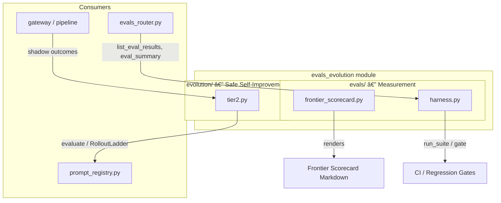
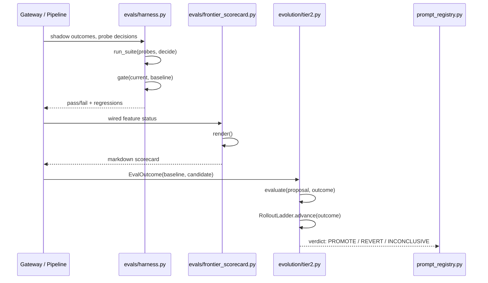

# evals_evolution Module

## Introduction

The `evals_evolution` module provides the **measurement and safe self-improvement infrastructure** for the AiNxt platform. It is intentionally split into two complementary concerns:

1. **Evaluation (`evals/`)** — deterministic, reproducible probes and scorecards that gate whether the system is meeting its architectural claims.
2. **Evolution (`evolution/`)** — a Tier-2 auto-improvement engine that proposes changes, measures them against baselines, and automatically reverts regressions.

Together these components implement the "evaluate first, evolve safely" loop described in the architecture docs. The module is **pure stdlib** by design: it contains no runtime side effects, no I/O, and no production behavior changes. It only *measures* and *decides*.

## Purpose

- Turn vague "frontier feel" claims into an inspectable, honest scorecard.
- Provide a reusable probe grammar and deterministic judge for any subsystem suite.
- Gate CI/regression decisions against recorded baselines with direction-aware comparisons.
- Enable safe, reversible auto-improvement of evolvable knobs (router weights, source reweighting, prompt variants) via shadow testing and staged rollouts.

## Architecture Overview

### Design Principles

| Principle | How it is enforced |
|-----------|-------------------|
| **Deterministic-first** | Default judge in `harness.py` is equality; probes pass on decisions, not prose. |
| **Honest scoring** | `frontier_scorecard.py` marks patterns `FULL` only when behavior is genuinely wired and default-on. |
| **Fail-safe** | A probe that raises counts as a fail, never crashing the run. |
| **Reversible evolution** | `tier2.py` never applies changes; it only signals `PROMOTE`, `REVERT`, or `INCONCLUSIVE`. |
| **Pure stdlib** | No external dependencies; importable in bare environments and fully testable. |

## Sub-modules

### 1. Evaluation Framework (`evals/`)

The evaluation sub-module contains two complementary tools:

- **`frontier_scorecard.py`** — Re-scores the seven frontier architectural patterns against the actual wired reality after PIPELINE_V2. Produces a markdown scorecard with honest `FULL` / `PARTIAL` / `GAP` ratings.
- **`harness.py`** — A reusable probe grammar with six probe types, a `run_suite` executor, and a `gate` function for baseline-aware CI decisions.

See [evals_evolution_evaluation.md](evals_evolution_evaluation.md) for detailed component documentation.

### 2. Tier-2 Evolution Engine (`evolution/`)

The evolution sub-module generalizes the proven prompt_registry auto-rollback rule into a pure decision engine:

- **`tier2.py`** — Defines `Proposal`, `EvalOutcome`, `Verdict`, `Direction`, and `RolloutLadder`. Evaluates candidate changes against baselines and drives staged rollouts (`offline → shadow → ab → default`) with automatic revert on regression.

See [evals_evolution_tier2.md](evals_evolution_tier2.md) for detailed component documentation.

## Data Flow

## Integration with the Rest of the System

| Related Module | Relationship |
|----------------|--------------|
| `shared_core` (`core/prompt_registry.py`) | The Tier-2 engine generalizes prompt_registry's auto-rollback rule. |
| `shared_api_routers` (`routers/evals_router.py`) | Serves evaluation results, summaries, and trends produced by the eval harness. |
| `gateway` | Provides shadow-captured outcomes and conversation state used by scorecard and evolution. |
| `abstudio_backend` (`app/engine/loop_evaluator.py`, `app/loop/runner.py`) | Agentic loop depth and verification outcomes feed into frontier-pattern scoring. |
| `ai_ui_frontend` (`components/EvalsDashboard.jsx`) | Displays evaluation summaries and trend visualizations to users. |

## Key Files

| File | Responsibility |
|------|----------------|
| `evals/frontier_scorecard.py` | Honest markdown scorecard of frontier-pattern parity. |
| `evals/harness.py` | Probe grammar, suite runner, and baseline gate. |
| `evolution/tier2.py` | Tier-2 evolution decision engine and staged rollout ladder. |

## Documentation Map

- [evals_evolution_evaluation.md](evals_evolution_evaluation.md) — Detailed documentation for the `evals/` measurement framework.
- [evals_evolution_tier2.md](evals_evolution_tier2.md) — Detailed documentation for the `evolution/` Tier-2 self-improvement engine.
