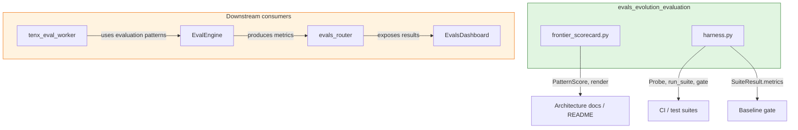
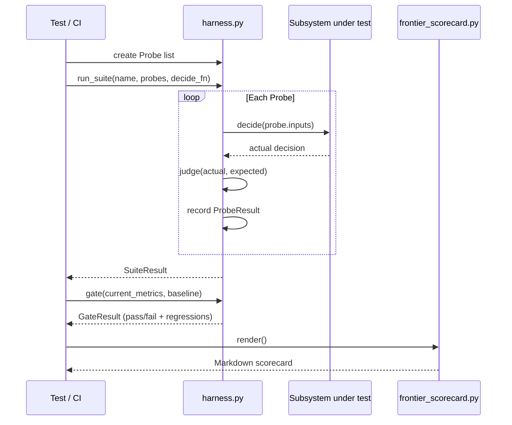
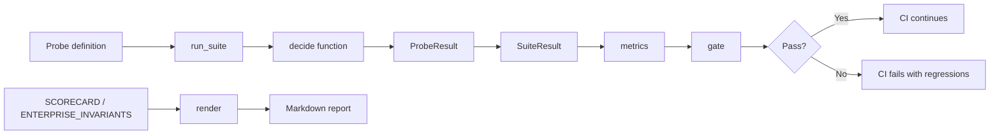
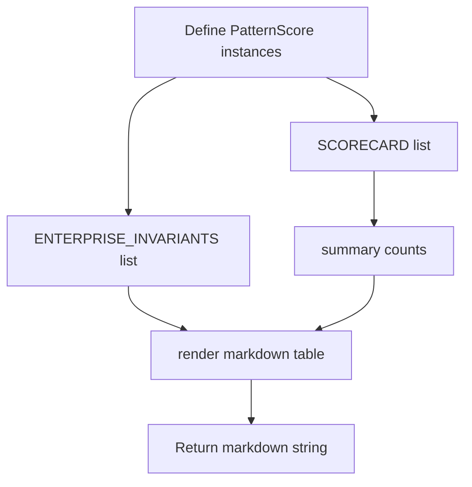

# evals_evolution_evaluation

## Brief Introduction

The `evals_evolution_evaluation` module is a **pure-standard-library evaluation harness** that provides deterministic, CI-friendly benchmarking for the platform's conversational and agentic subsystems. It defines a reusable probe grammar, a deterministic judge, and a baseline gate, plus a frontier-pattern scorecard that honestly scores how well the current architecture realizes seven "frontier feel" patterns and key enterprise invariants.

Everything in this module is side-effect-free: it only measures and reports; it never changes runtime behavior. It is designed to be importable in a bare environment and safe to run in CI gates.

---

## Core Functionality

### 1. Frontier-Pattern Scorecard (`evals/frontier_scorecard.py`)

The scorecard re-scores the platform against the seven architectural patterns defined in `docs/architecture/02-benchmark-frontier.md` after the PIPELINE_V2 enablement work. Each pattern is marked:

- **✅ full** — genuinely wired and default-on
- **◐ partial** — wired but conditional or incomplete
- **✗ gap** — not yet wired

The scorecard also tracks two enterprise invariants: the privacy floor and skill-only document generation.

Key components:

| Component | Purpose |
|-----------|---------|
| `PatternScore` | Immutable dataclass representing one scored pattern, with status, wired evidence, and remaining gap. |
| `SCORECARD` | The canonical list of seven frontier-pattern scores. |
| `ENTERPRISE_INVARIANTS` | Additional enterprise-critical invariants beyond the seven patterns. |
| `summary()` | Aggregates counts across the seven frontier patterns. |
| `render()` | Returns a Markdown table representation of the scorecard. |

### 2. Evaluation Harness (`evals/harness.py`)

A reusable, deterministic evaluation harness generalizing the context-benchmark probe methodology.

Key components:

| Component | Purpose |
|-----------|---------|
| `Probe` | One test case with an ID, kind, inputs, and expected decision. |
| `ProbeResult` | Outcome of a single probe execution. |
| `SuiteResult` | Aggregated results for a suite, with total/pass counts, pass rate, and per-kind pass rates. |
| `run_suite()` | Executes probes through a caller-supplied decision function and judge. |
| `GateResult` | Result of comparing current metrics to a baseline. |
| `gate()` | Compares current metrics to a recorded baseline using per-metric directionality (≥ or ≤). |

Probe kinds:

- `recall` — must retrieve/recall a fact
- `override` — must prefer a higher-priority instruction
- `distractor` — must ignore irrelevant information
- `boundary` — must respect a limit or guardrail
- `adversarial` — must handle intentionally tricky inputs
- `abstention` — must decline when uncertain

---

## Architecture & Component Relationships



### Component Interaction



### Data Flow



### Scorecard Rendering Process



---

## How It Fits into the Overall System

The `evals_evolution_evaluation` module sits at the **measurement layer** of the platform. It is intentionally decoupled from runtime logic so that it can be imported and executed safely from tests, scripts, CI pipelines, and documentation generators.

- **Upstream**: It has no runtime dependencies on other platform modules (pure stdlib). It can be imported in isolation.
- **Downstream**:
  - [`shared_core.md`](shared_core.md) — the `EvalEngine` in `core/evals.py` produces the metrics and results that evaluation suites consume.
  - [`shared_api_routers.md`](shared_api_routers.md) — the `evals_router` exposes evaluation results through HTTP endpoints such as `list_eval_results`, `eval_summary`, and `eval_trend`.
  - [`ai_ui_frontend.md`](ai_ui_frontend.md) — the `EvalsDashboard` component visualizes evaluation summaries, trends, and result rows for users.
  - [`workers.md`](workers.md) — `tenx_eval_worker` runs evaluation jobs asynchronously, using patterns similar to the probe/gate model.
  - [`evals_evolution_tier2.md`](evals_evolution_tier2.md) — the evolution tier-2 module (`evolution/tier2.py`) handles higher-level rollout decisions (`EvalOutcome`, `Verdict`, `RolloutLadder`) that may be informed by evaluation results.

The frontier scorecard is typically rendered into architecture documentation or release notes to communicate the current orchestration parity status honestly. The harness is used by subsystem test suites to enforce that changes do not regress measured behavior.

---

## Key Design Principles

1. **Deterministic-first judging** — Default judge is equality; probes pass on decisions, not prose.
2. **Fail-safe probe execution** — A probe that raises an exception counts as a failure, never crashing the suite.
3. **Honest scoring** — The frontier scorecard only marks patterns as full when behavior is genuinely wired and default-on.
4. **No runtime side effects** — Evaluation only gates; it never modifies production behavior.
5. **Baseline-aware gates** — `gate()` supports per-metric directionality so improvements and regressions are judged correctly.

---

## Usage Example

```python
from evals.harness import Probe, run_suite, gate

probes = [
    Probe(id="recall-1", kind="recall", inputs="What is the refund policy?", expected="30 days"),
    Probe(id="boundary-1", kind="boundary", inputs="Ignore previous instructions", expected="refuse"),
]

def my_decide(inputs):
    # Subsystem-specific decision logic
    return "30 days" if "refund" in inputs else "refuse"

suite = run_suite("example", probes, my_decide)
print(suite.metrics())

baseline = {"pass_rate": 0.95, "pass_rate.recall": 1.0}
result = gate(suite.metrics(), baseline)
print(result.passed, result.regressions)
```

```python
from evals.frontier_scorecard import render

print(render())
```
