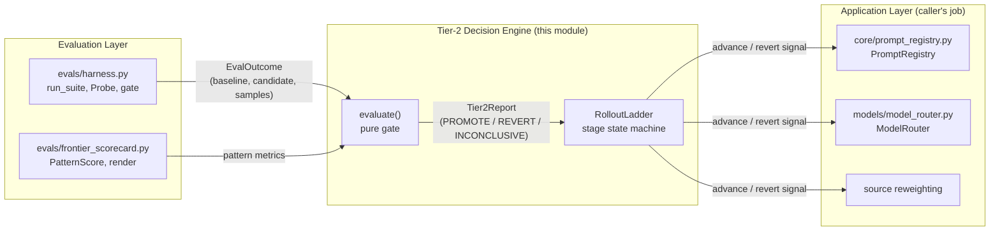
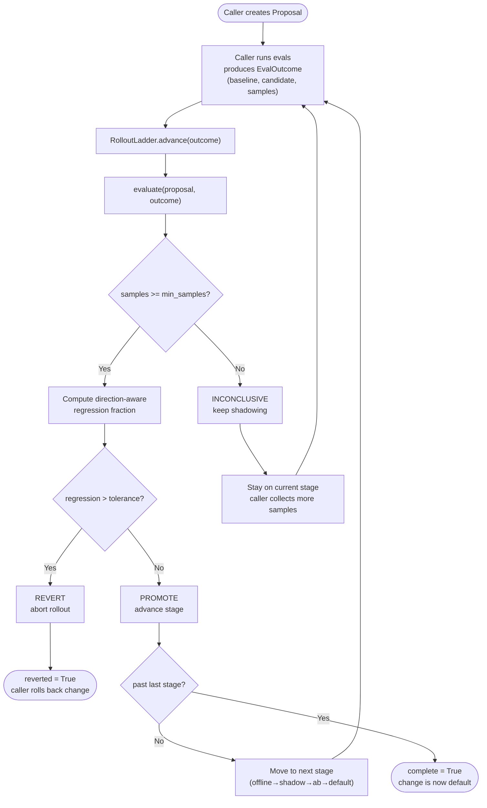
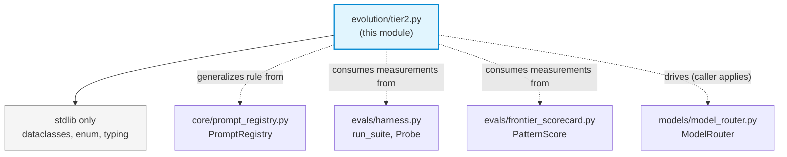

# evals_evolution_tier2

## Introduction

The `evals_evolution_tier2` module (`evolution/tier2.py`) implements the **Tier-2 evolution loop** — an eval-gated, shadow-tested, *auto-applied-but-reversible* self-improvement engine. It occupies the "safe compounding value" middle ground between Tier-1 (narrow, fully-automatic tweaks) and Tier-3 (human-in-the-loop changes), targeting evolvable knobs such as router weights, source reweighting, and prompt variants.

The module is a **pure decision engine**: it decides whether a candidate change should be *promoted*, *reverted*, or kept *inconclusive* (continue shadowing). It deliberately does **not** apply or persist changes — that responsibility belongs to the caller. This separation keeps the engine trivially testable and safe, since the only thing it can ever signal is a revert.

The core safety property is: *a change is kept only if it does not regress the guarded metric beyond a configurable tolerance; otherwise `should_revert` is true.* The engine never improves anything on its own — it only gates and signals revert.

This generalizes the proven auto-rollback rule from `core/prompt_registry.py` (drop > 20% vs control → rollback) into a reusable, direction-aware, sample-aware decision engine usable by any evolvable knob.

> **See also:** [evals_evolution_evaluation.md](evals_evolution_evaluation.md) for the sibling evaluation harness (`run_suite`, `Probe`, `gate`) and frontier scorecard (`PatternScore`, `render`) that produce the `EvalOutcome` measurements this module consumes.

---

## Architecture

### Position in the Evolution Engine

Tier-2 sits between the evaluation layer (which produces measurements) and the application layer (which persists changes). It is a stateless gate plus a stateful rollout state machine.



### Component Relationships

```mermaid
classDiagram
    class Verdict {
        <<enum>>
        PROMOTE
        REVERT
        INCONCLUSIVE
    }
    class Direction {
        <<enum>>
        HIGHER_IS_BETTER
        LOWER_IS_BETTER
    }
    class Proposal {
        +target: str
        +change: str
        +metric: str
        +direction: Direction
    }
    class EvalOutcome {
        +baseline: float
        +candidate: float
        +samples: int
    }
    class Tier2Report {
        +verdict: Verdict
        +regression: float
        +reason: str
    }
    class RolloutLadder {
        +proposal: Proposal
        +stages: List~str~
        +history: List~Tier2Report~
        +current_stage: str?
        +complete: bool
        +reverted: bool
        +advance(outcome) Tier2Report
    }

    Proposal --> Direction
    RolloutLadder --> Proposal
    RolloutLadder --> Tier2Report : history
    Tier2Report --> Verdict
    .. evaluate() ..
    evaluate..> Proposal : input
    evaluate..> EvalOutcome : input
    evaluate..> Tier2Report : output
```

---

## Core Components

### `Verdict` (enum)

The tri-state decision returned by the gate:

| Value | Meaning | Action |
|-------|---------|--------|
| `PROMOTE` | Candidate beat/matched baseline within tolerance | Keep the change; advance rollout stage |
| `REVERT` | Candidate regressed beyond tolerance | Roll back to baseline; abort rollout |
| `INCONCLUSIVE` | Not enough signal yet (insufficient samples) | Keep shadowing; do not advance or revert |

### `Direction` (enum)

Makes the comparison direction-aware so the same engine can guard both "higher is better" metrics (e.g. grounding rate, satisfaction) and "lower is better" metrics (e.g. hallucination rate, latency):

| Value | Regression occurs when… |
|-------|------------------------|
| `HIGHER_IS_BETTER` | Candidate is *lower* than baseline |
| `LOWER_IS_BETTER` | Candidate is *higher* than baseline |

### `Proposal` (frozen dataclass)

An immutable description of a candidate change to an evolvable knob.

| Field | Type | Description |
|-------|------|-------------|
| `target` | `str` | The knob being changed, e.g. `"router.w_cost"` or `"source:kb_x"` |
| `change` | `str` | Human-readable description of the change |
| `metric` | `str` | The guarded KPI, e.g. `"grounding_rate"` |
| `direction` | `Direction` | Whether higher or lower values are better (default `HIGHER_IS_BETTER`) |

### `EvalOutcome` (dataclass)

The measured result of running baseline vs candidate, fed into the gate.

| Field | Type | Description |
|-------|------|-------------|
| `baseline` | `float` | Metric value for the current default |
| `candidate` | `float` | Metric value for the proposed change |
| `samples` | `int` | Number of evaluation samples collected (default `0`) |

### `Tier2Report` (dataclass)

The gate's verdict plus diagnostic detail.

| Field | Type | Description |
|-------|------|-------------|
| `verdict` | `Verdict` | The decision |
| `regression` | `float` | Signed regression fraction vs baseline (0.0 when inconclusive) |
| `reason` | `str` | Human-readable explanation |

### `evaluate()` (function)

The pure gate function. Compares a candidate against its baseline on the guarded metric and returns a `Tier2Report`.

**Signature:**
```python
evaluate(
    proposal: Proposal,
    outcome: EvalOutcome,
    *,
    tolerance: float = DEFAULT_REGRESSION_TOLERANCE,  # 0.20
    min_samples: int = 30,
) -> Tier2Report
```

**Decision logic:**

1. **Sample guard** — if `outcome.samples < min_samples`, returns `INCONCLUSIVE` immediately. This prevents premature promotion/revert from noisy low-sample measurements.
2. **Direction-aware regression** — computes `regression = (worse_delta) / max(|baseline|, 1e-3)`, normalized the same way as the `prompt_registry` auto-rollback rule.
3. **Tolerance gate** — if `regression > tolerance`, returns `REVERT`; otherwise returns `PROMOTE`.

The function **never raises** — all edge cases (zero baseline, missing samples) are handled gracefully.

### `RolloutLadder` (dataclass / state machine)

Tracks a single `Proposal` through a progressive rollout pipeline with the guarantee that any stage failing the gate reverts the entire rollout.

**Default stages:** `["offline", "shadow", "ab", "default"]`

```mermaid
stateDiagram-v2
    [*] --> offline
    offline --> shadow : PROMOTE
    offline --> REVERTED : REVERT
    offline --> offline : INCONCLUSIVE
    shadow --> ab : PROMOTE
    shadow --> REVERTED : REVERT
    shadow --> shadow : INCONCLUSIVE
    ab --> default : PROMOTE
    ab --> REVERTED : REVERT
    ab --> ab : INCONCLUSIVE
    default --> COMPLETE : PROMOTE
    default --> REVERTED : REVERT
    default --> default : INCONCLUSIVE
    REVERTED --> [*]
    COMPLETE --> [*]
```

**Key properties:**

| Property | Type | Description |
|----------|------|-------------|
| `current_stage` | `Optional[str]` | The stage currently being evaluated (`None` if complete or reverted) |
| `complete` | `bool` | `True` when advanced past the last stage (distinct from reverted) |
| `reverted` | `bool` | `True` when a stage failed and the rollout was aborted |
| `history` | `List[Tier2Report]` | Full audit trail of every `advance()` call |

**`advance(outcome, **kw) -> Tier2Report`** — evaluates the current stage:
- `PROMOTE` → increment stage index
- `REVERT` → set index to the `_REVERTED` sentinel (`-1`) and stop
- `INCONCLUSIVE` → stay on the current stage

The `_REVERTED` sentinel is intentionally an unannotated class constant (not an `__init__` field) so the dataclass treats it as a class-level constant rather than a constructor parameter.

---

## Data Flow

The end-to-end Tier-2 evolution cycle, from proposal creation to either promotion or auto-revert:



---

## Safety Properties

The module enforces several invariants critical to safe autonomous evolution:

1. **Never improves on its own** — the engine only gates and signals revert. It cannot make a system better; it can only prevent it from getting worse.
2. **Revert is the fail-safe** — when in doubt (regression beyond tolerance), the verdict is always `REVERT`.
3. **Sample-aware** — insufficient evidence yields `INCONCLUSIVE`, never a premature `PROMOTE`. The default `min_samples=30` prevents decisions based on noisy low-volume measurements.
4. **Direction-aware** — the same gate works for both "higher is better" and "lower is better" metrics, eliminating a class of sign-error bugs.
5. **Never raises** — `evaluate()` and `advance()` handle all edge cases (zero baseline, missing data) gracefully, returning a safe verdict rather than crashing.
6. **Pure & side-effect-free** — the decision engine performs no I/O, no persistence, no network calls. All application is the caller's responsibility, making the engine trivially unit-testable.

---

## Integration Points

### Relationship to `core/prompt_registry.py`

The Tier-2 engine generalizes the auto-rollback rule already proven in `PromptRegistry.record_eval_score()`:

| Aspect | `prompt_registry` (original) | `tier2.evaluate()` (generalized) |
|--------|------------------------------|----------------------------------|
| Scope | Prompt A/B variants only | Any evolvable knob |
| Direction | Implicit "higher is better" | Explicit `Direction` enum |
| Sample guard | None | `min_samples` parameter |
| Threshold | Hardcoded `_AUTO_ROLLBACK_THRESHOLD = 0.20` | Configurable `tolerance` (default 0.20) |
| Normalization | `(control - variant) / max(control, 0.001)` | `(worse_delta) / max(|baseline|, 1e-3)` |
| Side effects | Activates control version in DB | None (pure) |

The `prompt_registry` remains the *application* layer for prompt-specific changes; `tier2` provides the reusable *decision* layer that `prompt_registry`'s logic was extracted and generalized from.

### Relationship to the Evaluation Layer

The `EvalOutcome` consumed by this module is produced by the sibling evaluation module ([evals_evolution_evaluation.md](evals_evolution_evaluation.md)):

- `evals/harness.py::run_suite` — runs probes through a decision function and judges got-vs-expected, producing pass/fail measurements.
- `evals/frontier_scorecard.py::PatternScore` — scores capability patterns with honest status/gap tracking.

A typical caller pipeline: run `run_suite` for both baseline and candidate configurations → aggregate pass rates into `EvalOutcome.baseline` / `EvalOutcome.candidate` with `samples` = probe count → feed into `RolloutLadder.advance()`.

### Typical Callers

| Caller | Knob | Metric | Direction |
|--------|------|--------|-----------|
| `core/prompt_registry.py` | Prompt variant content | Eval score (grounding/accuracy) | `HIGHER_IS_BETTER` |
| `models/model_router.py` | Router weights (e.g. `w_cost`) | Routing accuracy / cost | `HIGHER_IS_BETTER` or `LOWER_IS_BETTER` |
| Source reweighting | RAG source weights | Retrieval relevance / hallucination | `HIGHER_IS_BETTER` or `LOWER_IS_BETTER` |

---

## Usage Example

```python
from evolution.tier2 import (
    Proposal, EvalOutcome, Direction, RolloutLadder, Verdict,
)

# 1. Define a candidate change to a router weight
proposal = Proposal(
    target="router.w_cost",
    change="lower cost weight from 0.3 to 0.2",
    metric="routing_accuracy",
    direction=Direction.HIGHER_IS_BETTER,
)

# 2. Drive it through the rollout ladder
ladder = RolloutLadder(proposal=proposal)

# Stage: offline (enough samples, within tolerance → promote)
r1 = ladder.advance(EvalOutcome(baseline=0.82, candidate=0.83, samples=50))
assert r1.verdict == Verdict.PROMOTE
assert ladder.current_stage == "shadow"

# Stage: shadow (regression beyond tolerance → revert)
r2 = ladder.advance(EvalOutcome(baseline=0.82, candidate=0.74, samples=120))
assert r2.verdict == Verdict.REVERT
assert ladder.reverted is True
assert ladder.current_stage is None

# The caller is now responsible for rolling back the actual change.
```

---

## Configuration Constants

| Constant | Default | Description |
|----------|---------|-------------|
| `DEFAULT_REGRESSION_TOLERANCE` | `0.20` | Maximum allowed regression fraction before `REVERT`. Generalized from `prompt_registry._AUTO_ROLLBACK_THRESHOLD`. |
| `min_samples` (param) | `30` | Minimum evaluation samples required before a non-`INCONCLUSIVE` verdict. |
| `RolloutLadder.stages` | `["offline", "shadow", "ab", "default"]` | Progressive rollout pipeline stages. |
| `RolloutLadder._REVERTED` | `-1` | Sentinel index marking an aborted rollout. |

---

## Module Dependencies



The module has **zero runtime dependencies** beyond the Python standard library (`dataclasses`, `enum`, `typing`). All relationships to other modules are conceptual (generalization, measurement consumption, application delegation) rather than import-time dependencies. This purity is a deliberate design choice to keep the safety-critical decision engine isolated and testable.
