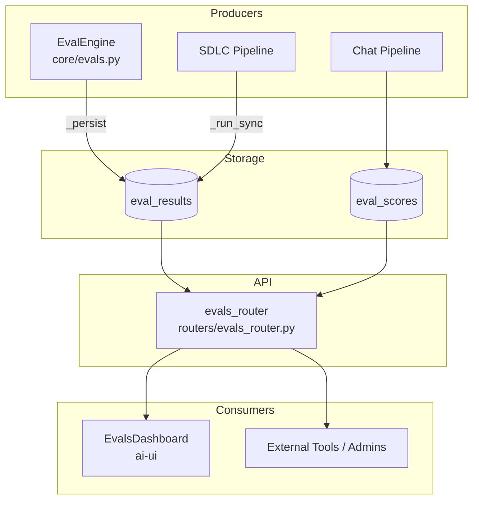
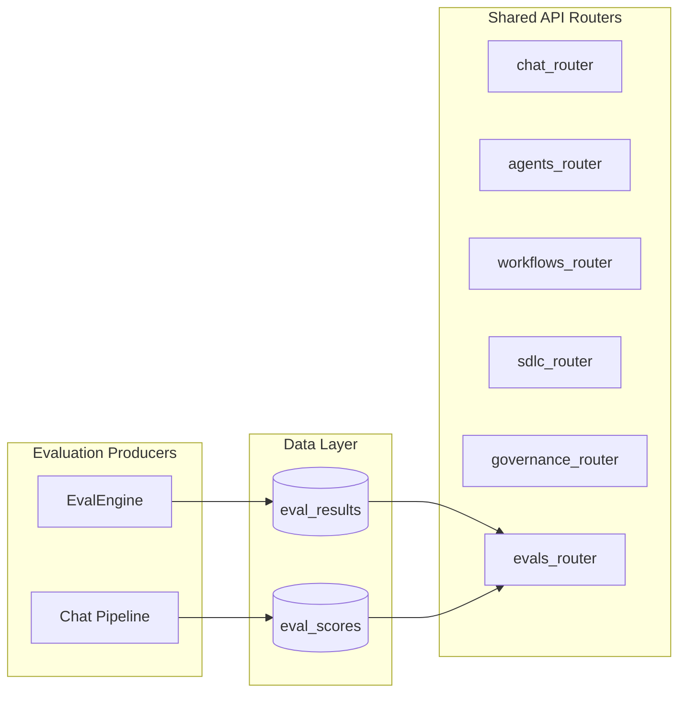
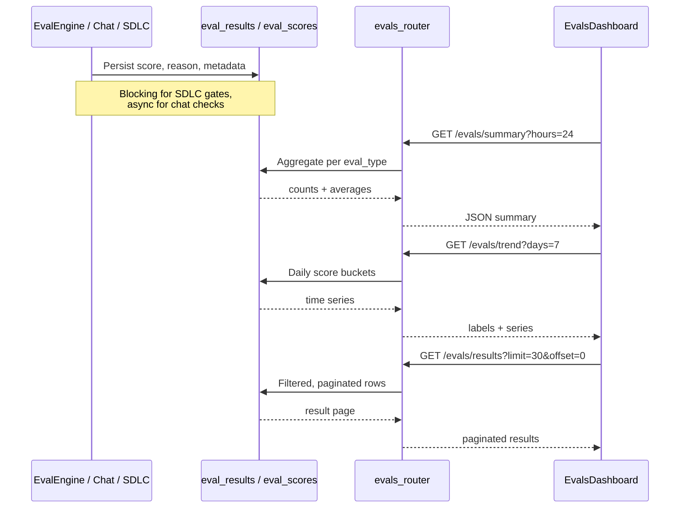
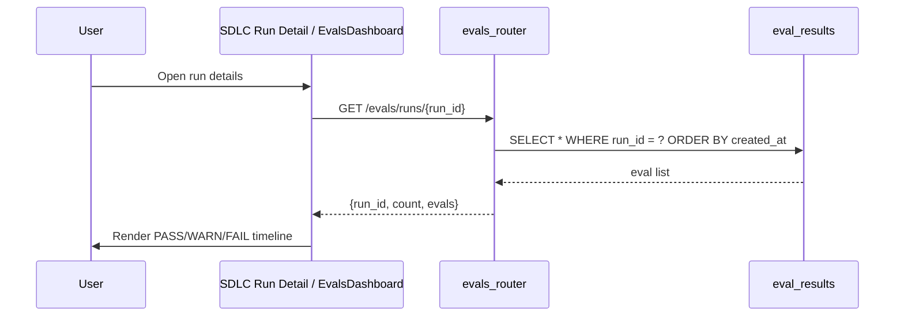
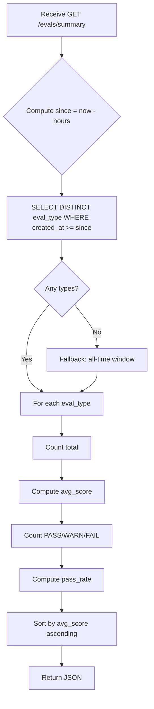
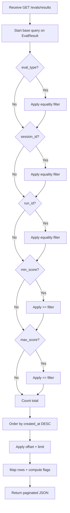

# `evals_router` — Evaluation Observability API

## Brief Introduction

`evals_router` exposes a read-only observability surface for the platform's LLM-as-judge evaluation results. It lets operators, dashboards, and downstream tooling inspect how well the system's AI outputs are performing across dimensions such as groundedness, relevance, code quality, retrieval quality, and SDLC pipeline gates. The router does not run evaluations itself; it queries the persistent `eval_results` and `eval_scores` tables that are populated by [`EvalEngine`](core_evals.md) and the chat pipeline.

This module is part of the shared API router layer and is consumed primarily by the [`EvalsDashboard`](ai_ui_frontend_evals_dashboard.md) in `ai-ui`.

---

## Core Functionality

The router provides five HTTP endpoints under the `/evals` prefix:

| Endpoint | Purpose |
|----------|---------|
| `GET /evals/results` | Paginated list of individual evaluation records with filtering by type, session, run, and score range. |
| `GET /evals/summary` | Aggregate statistics per `eval_type` for a configurable lookback window. |
| `GET /evals/trend` | Daily average scores per `eval_type` for trend sparklines. |
| `GET /evals/chat-quality` | Per-day grounding and completeness metrics from the `eval_scores` table. |
| `GET /evals/runs/{run_id}` | All evaluation results associated with a specific SDLC run. |

All endpoints are stateless and rely on SQLAlchemy sessions obtained via `_get_db()`.

---

## Architecture

### Component Overview

### Module Placement

`evals_router` sits in the `shared_api_routers` branch of the module tree, alongside routers for chat, agents, workflows, governance, and SDLC. It is a pure read API: evaluation execution, scoring logic, and persistence are handled elsewhere.

---

## Component Relationships

### `_get_db`

Dependency-injected SQLAlchemy session factory. It imports `SessionLocal` lazily from [`db.database`](shared_core_database.md) to avoid circular imports and yields a session that is closed in a `finally` block.

### `list_eval_results`

Returns a paginated, filterable list of rows from the `EvalResult` model. Supported filters:

- `eval_type` — exact match on the evaluation category.
- `session_id` — chat session identifier.
- `run_id` — SDLC or workflow run identifier.
- `min_score` / `max_score` — inclusive score bounds (0.0–1.0).
- `limit` / `offset` — pagination controls.

Each result is enriched with a computed `flag` derived from the score:

| Score Range | Flag |
|-------------|------|
| `score >= 0.70` | `PASS` |
| `0.40 <= score < 0.70` | `WARN` |
| `score < 0.40` | `FAIL` |

### `eval_summary`

Aggregates `PASS`, `WARN`, `FAIL` counts and average scores per `eval_type` over a lookback window (default 24 hours, max 720 hours). If the requested window contains no data, it falls back to all-time records to avoid returning an empty dashboard.

### `eval_trend`

Builds daily average score series per `eval_type` for the last N days (default 7, max 30). Days without data emit `None` so that sparklines can render gaps correctly. The date labels are returned oldest-to-newest.

### `chat_quality_summary`

Queries the `eval_scores` table directly with raw SQL to return per-day aggregates:

- `avg_grounding`
- `avg_completeness`
- `avg_chunks`
- `total_responses`
- `responses_with_context`

Optional `user_id` filter allows per-user drill-down. Errors are caught and returned with an empty row set rather than raising.

### `evals_for_run`

Returns every `EvalResult` row for a given `run_id`, ordered chronologically. This is used by the SDLC run detail view to show which quality gates passed or failed during a run.

---

## Data Flow

### Evaluation Result Lifecycle

### SDLC Run Drill-Down Flow

---

## Dependencies

### Direct Dependencies

| Dependency | Role |
|------------|------|
| `fastapi.APIRouter`, `Depends`, `Query` | HTTP routing and dependency injection. |
| `sqlalchemy` / `sqlalchemy.func` | ORM queries and aggregation. |
| `db.database.SessionLocal` | Database session factory. |
| `db.models.EvalResult` | ORM model for `eval_results` table. |
| `eval_scores` table | Raw SQL target for chat quality metrics. |

### Upstream Producers

| Module | Responsibility |
|--------|----------------|
| [`core/evals.py`](core_evals.md) | `EvalEngine` runs LLM-as-judge prompts and persists results. |
| [`evals/harness.py`](evals_evolution_evaluation.md) | Deterministic probe-based evaluation harness. |
| Chat pipeline | Populates `eval_scores` with per-response grounding/completeness. |
| SDLC pipeline | Calls blocking `EvalEngine` gates and stores run-scoped results. |

### Downstream Consumers

| Module | Responsibility |
|--------|----------------|
| [`ai-ui/src/components/EvalsDashboard.jsx`](ai_ui_frontend_evals_dashboard.md) | Primary UI for summary cards, trend sparklines, and result tables. |
| Admin / external tools | May call `/evals/results` or `/evals/runs/{run_id}` for audits. |

---

## Process Flows

### Summary Aggregation

### Result Listing with Filters

---

## Scoring Semantics

The router uses a fixed three-band scoring interpretation that is consistent with the thresholds used by [`EvalEngine`](core_evals.md):

- **PASS** (`>= 0.70`) — Output meets quality expectations.
- **WARN** (`0.40 <= score < 0.70`) — Output is acceptable but has notable issues.
- **FAIL** (`< 0.40`) — Output does not meet quality expectations; may trigger retries in SDLC.

These bands are applied in `list_eval_results`, `eval_summary`, and `evals_for_run`.

---

## Error Handling

- Database session leaks are prevented by the `try/finally` pattern in `_get_db`.
- `chat_quality_summary` wraps the raw SQL query in a broad `try/except` and returns a graceful `{rows: [], error: ...}` response if the `eval_scores` table is missing or the query fails.
- Other endpoints allow SQLAlchemy exceptions to propagate and be handled by the global FastAPI exception handlers.

---

## Integration with the Overall System

`evals_router` is the observability window into the platform's automated quality layer. It does not define what "quality" means or how it is measured; those responsibilities live in [`EvalEngine`](core_evals.md), the chat pipeline, and the SDLC pipeline. Instead, this router normalizes and exposes the resulting data so that:

- The [`EvalsDashboard`](ai_ui_frontend_evals_dashboard.md) can surface trends and regressions.
- Operators can audit individual responses and SDLC runs.
- Downstream automation can consume `/evals/results` or `/evals/runs/{run_id}` for reporting.

Because the router is read-only, it can be scaled independently of the evaluation producers and does not affect the latency of chat or SDLC execution.
