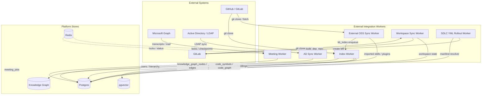
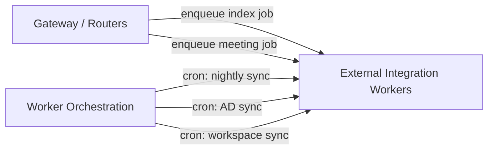
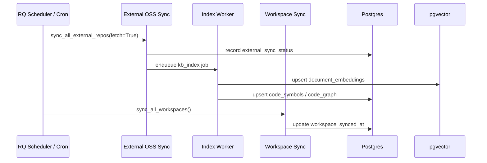

# External Integration Workers

The `external_integration_workers` module is a collection of background RQ/cron workers that bridge AiNxt with external systems and data sources. These workers keep the platform's knowledge base, skill catalog, workspaces, user directory, SDLC manifests, and meeting integrations up to date without blocking the main request path.

## Purpose

This module is responsible for:

- **Importing external OSS resources** (skills, security harnesses, plugins, knowledge bases) from upstream GitHub repositories.
- **Indexing code repositories** into `pgvector` and the unified knowledge graph for semantic search, symbol lookup, and SDLC reasoning.
- **Synchronizing local workspaces** used by the SDLC/build pipeline and dependency resolver.
- **Rolling out `.sdlc.yml` build manifests** to repositories that do not yet have one.
- **Automating post-meeting workflows** (transcript fetch, MoM generation, distribution) via Microsoft Graph.
- **Mirroring the corporate directory** from LDAP/Active Directory into Postgres for RBAC, hierarchy, and product membership.

All workers are designed to be idempotent, failure-isolated per task, and safe to run in both connected and air-gapped environments where applicable.

## Architecture Overview

### Worker Orchestration

These workers are typically invoked from `workers/start_workers.py` (worker orchestration) or scheduled via RQ cron. They are not directly exposed as HTTP endpoints; instead, gateway routers and other workers enqueue jobs for them.

## Sub-modules

| Sub-module | File | Responsibility | Documentation |
|------------|------|----------------|---------------|
| External OSS Sync | `workers/external_sync_worker.py` | Vendors and imports OSS skills, security skills, KB docs, and plugin catalogs from upstream repos. | [external_integration_workers_oss_sync](external_integration_workers_oss_sync.md) |
| Codebase Indexing | `workers/index_worker.py` | Clones or reads local repos, chunks code with tree-sitter, enriches with LLM descriptions, embeds via `embed_svc`, and upserts into pgvector + knowledge graph. | [external_integration_workers_codebase_indexing](external_integration_workers_codebase_indexing.md) |
| Workspace Synchronization | `workers/workspace_sync_worker.py` | Keeps `/workspaces/{repo}` fresh, materializes per-run workspaces, builds missing dependencies, and evicts stale checkouts. | [external_integration_workers_workspace_sync](external_integration_workers_workspace_sync.md) |
| SDLC Manifest Rollout | `workers/sdlc_yml_rollout_worker.py` | Generates `.sdlc.yml` files for repos that lack them and opens GitLab MRs. | [external_integration_workers_sdlc_manifest](external_integration_workers_sdlc_manifest.md) |
| Meeting Integration | `workers/meeting_worker.py` | Claims, transcribes, summarizes, redacts, and distributes meeting minutes via Microsoft Graph. | [external_integration_workers_meeting](external_integration_workers_meeting.md) |
| AD Directory Sync | `workers/ad_sync.py` | Nightly LDAP/AD mirror into Postgres for users, bands, hierarchy, and product auto-membership. | [external_integration_workers_ad_sync](external_integration_workers_ad_sync.md) |

## Data Flow

## Dependencies

The module relies on several shared platform components:

- **[shared_core](shared_core.md)** — `core.config`, `core.logger`, `core.job_queue`, `core.kv`, `models.model_router`, `agents.compliance_engine`, `core.graph_audit`, `core.platform_credentials`, `core.build_manifest_resolver`.
- **[shared_integrations](shared_integrations.md)** — `connectors` adapters and `tools.gitlab_tools` for GitLab API calls; `integrations.graph_app_client` and `services.meeting_transcript` for meeting automation.
- **[auth](shared_core.md#authentication)** — `auth/ldap_handler.py` for AD sync.
- **[db](shared_core.md#database)** — `db.database` for Postgres/pgvector sessions and SQLAlchemy engines.
- **[embedding_service](embedding_service.md)** — `services/embed_svc` called by the index worker for vector generation.
- **[workers](workers.md)** — orchestrated by `workers/start_workers.py` and shares Redis queues with other worker groups.

## Operational Notes

- **Air-gapped support**: `external_sync_worker.py` supports `fetch=False` to import from a pre-vendored snapshot without network access.
- **Idempotency**: Indexing uses content-hash deduplication; workspace sync uses hard resets; AD sync uses email-keyed upserts.
- **Failure isolation**: Each repo/meeting/user is processed independently; one failure does not abort the batch.
- **Observability**: All workers log via `core.logger` and update status tables (`repo_index_status`, `meeting_jobs`, `external_sync_status`) so progress can be monitored.
