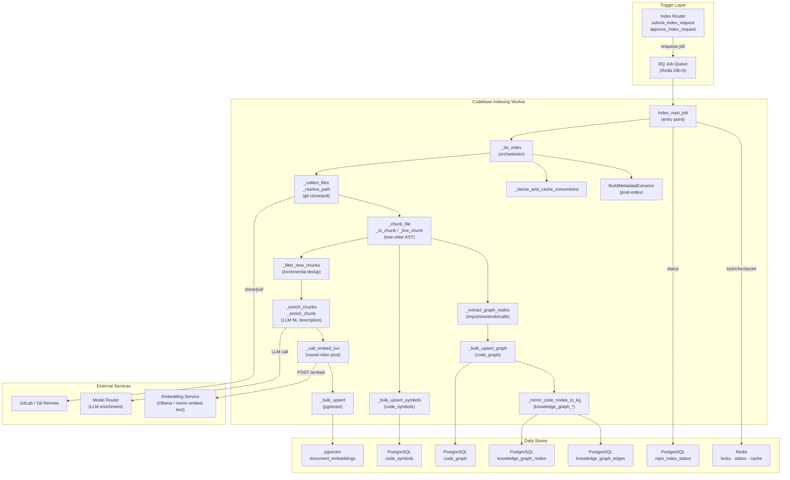
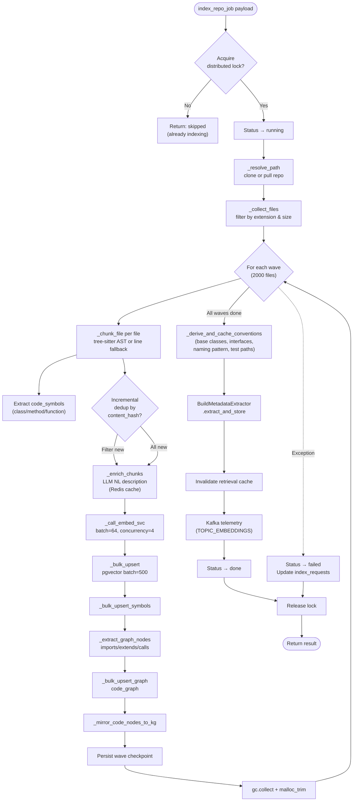
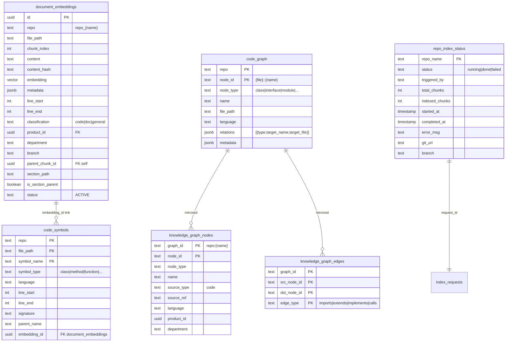
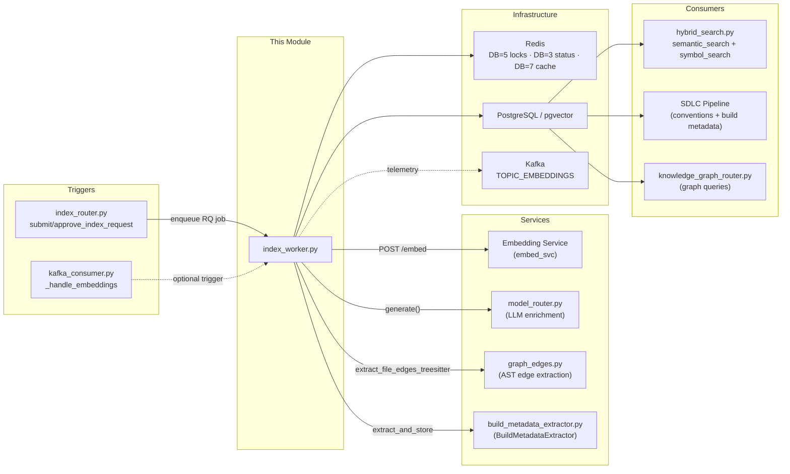
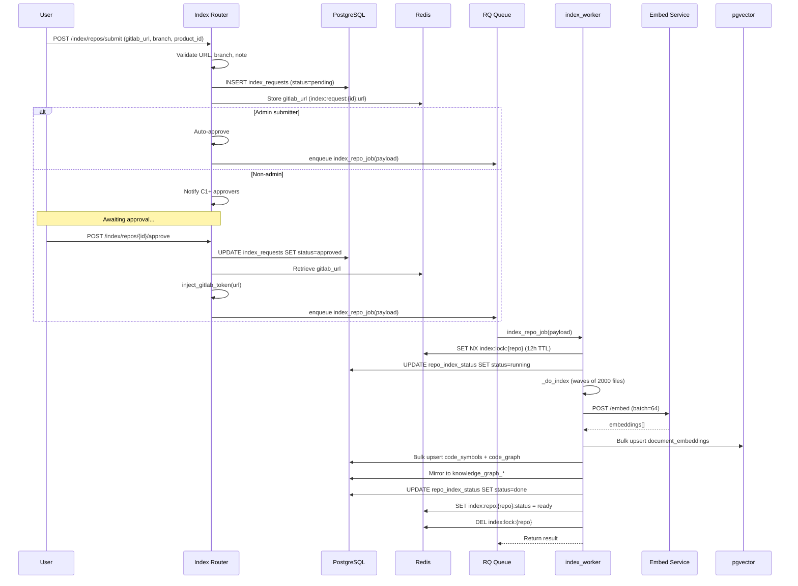

# External Integration Workers — Codebase Indexing

## 1. Introduction

The **Codebase Indexing** worker (`workers/index_worker.py`) is the core engine that transforms source-code repositories into searchable vector embeddings, structured code symbols, and a navigable code knowledge graph. It is one of six sub-modules within the [External Integration Workers](external_integration_workers.md) group and serves as the foundation for all code-aware retrieval, SDLC pipeline context, and semantic code search across the platform.

When a repository is submitted for indexing (via the [Index Router](shared_api_routers.md) → approval flow), an RQ job is enqueued that clones the repo, parses every supported source file with tree-sitter, enriches code chunks with LLM-generated natural-language descriptions, generates vector embeddings via the [Embedding Service](embedding_service.md), and persists everything into pgvector, `code_symbols`, `code_graph`, and the unified `knowledge_graph_nodes`/`knowledge_graph_edges` tables.

---

## 2. Architecture Overview

---

## 3. Core Components

### 3.1 `index_repo_job` — Entry Point

The RQ job handler that orchestrates the entire indexing lifecycle. It is invoked with a payload containing `repo_name`, `repo_path` (local path or GitLab HTTPS URL), `branch`, `triggered_by`, `drop_index`, `file_filter`, `product_id`, and `department`.

**Responsibilities:**

| Phase | Action |
|-------|--------|
| **Distributed Lock** | Acquires a Redis `SET NX` lock (`index:lock:{repo_name}`) with a 12-hour TTL to prevent duplicate concurrent runs. Stores metadata (request_id, triggered_by, started_at, branch) in the lock value. |
| **Lock Renewal** | Spawns a daemon thread (`_start_lock_renewal`) that renews the lock every 30 minutes, preventing expiry during 10+ hour indexing runs on large repos. |
| **Status Tracking** | Updates `repo_index_status` table and Redis status keys (`index:repo:{name}:status`) at each phase transition (running → done/failed). |
| **Core Indexing** | Delegates to `_do_index()` for the full pipeline. |
| **Post-Index Hooks** | Runs `BuildMetadataExtractor` to detect build tool/language, invalidates retrieval cache, emits Kafka telemetry, and syncs Redis status. |
| **Cleanup** | Releases the distributed lock in a `finally` block, ensuring cleanup even on failure. |

**Key design decisions:**
- Git remote URLs have embedded credentials stripped before persistence (`strip_gitlab_token`) so per-user PATs are never leaked into shared state.
- Trace context (request_id, chat_context, span_id) is restored from the payload for consistent cross-service logging.

### 3.2 `_mirror_code_nodes_to_kg` — Knowledge Graph Mirroring

Mirrors `code_graph` nodes into the unified `knowledge_graph_nodes` and `knowledge_graph_edges` tables, attaching RBAC scoping metadata (`product_id`, `department`). This makes code structure discoverable alongside document-based knowledge graph nodes.

**Process:**
1. Constructs `graph_id = "repo:{repo_name}"` as the graph namespace.
2. Builds a `name → node_id` lookup map to resolve bare target names (e.g., `"ModelRouter"`) to their full `"{file}::{name}"` node IDs, ensuring edges connect properly during multi-hop traversal.
3. Inserts node rows with `source_type = 'code'`, `source_ref = file_path`, and language metadata.
4. Derives edges from each node's `relations` list (imports, extends, implements, calls), resolving `dst_node_id` to the known node ID or falling back to the bare name for external/undiscovered targets.
5. Uses `ON CONFLICT DO UPDATE` for nodes and `ON CONFLICT DO NOTHING` for edges, making the operation idempotent across re-indexes.
6. All operations are best-effort and non-fatal — a KG mirror failure never blocks the indexing run.

---

## 4. Internal Pipeline (Detailed)

### 4.1 File Collection & Git Resolution

`_resolve_path` handles two modes:
- **Local path**: Returns the directory directly (used by workspace sync and desktop indexing).
- **Git URL**: Clones (shallow `--depth=1`) or pulls the specified branch into `REPO_CLONE_ROOT/{repo_name}/{branch_slug}`. Each branch gets its own subdirectory to prevent cross-branch clobbering. All interactive git prompts are disabled (`GIT_TERMINAL_PROMPT=0`, `GIT_ASKPASS=/bin/false`).

`_collect_files` walks the directory tree, skipping common non-source directories (`.git`, `node_modules`, `__pycache__`, `target`, etc.) and filtering by `SUPPORTED_EXT` (30+ extensions) and `MAX_FILE_BYTES` (512 KB).

### 4.2 Tree-Sitter AST Chunking

The chunking strategy uses **tree-sitter** for AST-aware splitting at definition boundaries, with a line-based fallback when tree-sitter is unavailable.

**Supported languages** (20+): Java, Kotlin, Scala, Groovy, Python, JavaScript, TypeScript, TSX, Go, Rust, C, C++, C#, Ruby, PHP, Swift, Bash, SQL, plus config formats (YAML, JSON, XML, Markdown).

**`_ts_chunk` process:**
1. Parses source into a tree-sitter AST.
2. Walks the tree, identifying definition nodes (function declarations, class declarations, interface declarations, etc.) per language-specific `_DEFINITION_NODES` sets.
3. Each definition becomes:
   - A **chunk** in `document_embeddings` (for semantic search) with `section_path = "{file} > {Symbol}"`.
   - A **symbol** in `code_symbols` (for exact lookup) with type, signature, parent name, and line range.
4. Leftover lines (imports, module-level code) are chunked via line-based fallback.
5. When a file produces ≥2 chunks, a **file-outline parent chunk** is prepended (index 0) with `is_section_parent = True`, enabling parent-expansion during hybrid retrieval (same pattern as KB document chunking).

### 4.3 Incremental Deduplication

`_filter_new_chunks` queries `document_embeddings` for existing `content_hash` values matching the current batch, returning only chunks not yet indexed. This makes re-indexing after small file changes efficient — only modified files generate new chunks.

### 4.4 LLM Enrichment

`_enrich_chunks` enriches eligible code chunks (code extensions, ≥4 chars) with a 1–3 sentence natural-language description generated by the LLM (default model: `haiku`). This dramatically improves semantic search — queries like *"how is retry handled?"* match chunks implementing retry logic even if the word "retry" never appears in the code.

**Caching:** Descriptions are cached in Redis (DB=7, key `enrich_desc:{MD5}`, TTL=7 days), so re-indexing the same repo skips all LLM calls. Runs with `ENRICH_CONCURRENCY=8` threads to keep the LLM queue full.

### 4.5 Embedding & Vector Storage

`_call_embed_svc` sends batches of 64 texts to the [Embedding Service](embedding_service.md) via HTTP POST `/embed`. It uses a **round-robin URL pool** (`EMBED_SVC_URLS`) for horizontal scaling across multiple embed service instances, with exponential backoff retry on 5xx/network errors (up to 5 minutes).

`_bulk_upsert` inserts embeddings into pgvector in batches of 500 rows using `ON CONFLICT (repo, file_path, chunk_index) DO UPDATE`. It includes:
- Content sanitization (null byte stripping, truncation to 1000 chars for nomic-embed-text compatibility).
- Content-hash deduplication within the batch.
- SAVEPOINT-based per-row fallback for content-hash constraint violations.
- Metadata scoping (`product_id`, `department`, `branch`) for RBAC-filtered retrieval.
- Section-aware parent linkage (`parent_chunk_id`, `section_path`, `is_section_parent`).

### 4.6 Code Knowledge Graph

`_extract_graph_nodes` builds graph nodes for class/interface/module-level symbols and extracts four relation types:

| Relation | Source | Example |
|----------|--------|---------|
| `imports` | Import statements (file-wide) | `import com.example.Service` → imports `Service` |
| `extends` | Class declaration header | `class Dog extends Animal` → extends `Animal` |
| `implements` | Class declaration header | `class ServiceImpl implements IService` → implements `IService` |
| `calls` | Instantiation/static-call patterns in class body | `new RetryHandler()` → calls `RetryHandler` |

**Dual extraction modes** (WS-6, flag-gated via `SDLC_GRAPH_EDGE_MODE`):
- **`regex`** (default): Language-specific regex patterns for imports, extends, implements, and calls.
- **`treesitter`**: AST-based extraction via [graph_edges worker](external_integration_workers.md), with per-file regex fallback when AST extraction returns no edges.

### 4.7 Wave-Based Processing & Checkpointing

Files are processed in **waves of 2000** to bound peak RAM. After each wave:
- Memory is explicitly released (`gc.collect()` + `malloc_trim(0)`) to prevent Python arena fragmentation.
- A **wave checkpoint** is persisted to Redis (`index:checkpoint:{repo_name}`, TTL=48h) recording the completed wave number.
- On restart (e.g., after a worker crash), the job resumes from the last checkpoint, skipping the chunk-delete phase if it was already done.

### 4.8 Post-Index: Conventions Derivation

`_derive_and_cache_conventions` queries the freshly built `code_graph` to derive and cache codebase conventions in Redis (`sdlc:conventions:{repo_name}`, TTL=24h):

| Convention | Derivation |
|------------|------------|
| `base_classes` | Top 10 most-extended class names |
| `interfaces` | Top 10 most-implemented interface names |
| `common_imports` | Top 20 most-imported targets |
| `naming_pattern` | `snake_case` / `camelCase` / `mixed` (heuristic from symbol names) |
| `test_file_pattern` | Detected test directory prefix (e.g., `src/test/java`) |

These conventions are consumed by the SDLC pipeline to generate code that matches the repo's existing patterns.

### 4.9 Post-Index: Build Metadata Extraction

After indexing completes, `BuildMetadataExtractor.extract_and_store` reads build files (pom.xml, build.gradle, package.json, go.mod, Cargo.toml, pyproject.toml, .sdlc.yml, .gitlab-ci.yml, Makefile) from indexed chunks and detects the build tool, language, language version, build command, and test command. This metadata is stored in `repo_build_metadata` and used by the SDLC pipeline to configure sandbox execution environments.

---

## 5. Data Model

---

## 6. Dependency Map

### Key Dependencies

| Dependency | Role | Reference |
|------------|------|-----------|
| **Embedding Service** | Generates vector embeddings via Ollama/nomic-embed-text | [embedding_service.md](embedding_service.md) |
| **Model Router** | LLM calls for code chunk enrichment (NL descriptions) | [shared_core.md](shared_core.md) |
| **graph_edges worker** | Optional AST-based edge extraction (WS-6 flag-gated) | [external_integration_workers.md](external_integration_workers.md) |
| **BuildMetadataExtractor** | Post-index build tool/language detection | [shared_core.md](shared_core.md) |
| **Redis** | Distributed locks (DB=5), index status (DB=3), enrichment cache (DB=7), retrieval cache invalidation | — |
| **pgvector** | Vector storage and similarity search | [database.md](database.md) |
| **Index Router** | Submits and approves indexing requests, enqueues RQ jobs | [shared_api_routers.md](shared_api_routers.md) |
| **Kafka Consumer** | Optional event-driven trigger via `_handle_embeddings` | [kafka_event_consumer.md](kafka_event_consumer.md) |

### Downstream Consumers

| Consumer | Usage | Reference |
|----------|-------|-----------|
| **hybrid_search.py** | `semantic_search` queries pgvector; `symbol_search` queries `code_symbols` for exact-match retrieval | [shared_core.md](shared_core.md) |
| **SDLC Pipeline** | Reads cached conventions (`sdlc:conventions:{repo}`) and build metadata for code generation | [sdlc_pipeline_workers.md](sdlc_pipeline_workers.md) |
| **Knowledge Graph Router** | Queries `knowledge_graph_nodes`/`edges` for code structure exploration | [shared_api_routers.md](shared_api_routers.md) |
| **Gateway codebase_search** | Serves indexed code to chat/agent workflows | [gateway.md](gateway.md) |

---

## 7. Scaling & Reliability

### 7.1 Horizontal Scaling

| Mechanism | Detail |
|-----------|--------|
| **Per-repo distributed locks** | Each repo has its own Redis lock — no cross-repo contention. 100+ repos can index in parallel. |
| **Embed service URL pool** | `EMBED_SVC_URLS` env var allows round-robin across multiple embed service instances. |
| **Wave-based processing** | 2000-file waves bound peak RAM to ~1 GB per wave, enabling 100k+ file repos. |
| **Batch operations** | Embeddings (64/batch), pgvector inserts (500/batch), graph upserts (500/batch) minimize DB round-trips. |
| **Concurrent embedding** | `EMBED_CONCURRENCY=4` threads keep the embed service queue full (64 × 4 = 256 texts in-flight). |

### 7.2 Fault Tolerance

| Mechanism | Detail |
|-----------|--------|
| **Wave checkpointing** | Redis checkpoint (`index:checkpoint:{repo}`, TTL=48h) allows resume from last completed wave after crash. |
| **Lock renewal** | Daemon thread renews the 12-hour lock every 30 minutes, preventing premature expiry. |
| **Non-fatal graph/KG** | Knowledge graph extraction and mirroring failures are logged but never block indexing. |
| **Non-fatal enrichment** | LLM enrichment failures fall back to original chunk content. |
| **Non-fatal conventions** | Conventions derivation failures are logged and skipped. |
| **Embed service retry** | Exponential backoff (up to 5 min) on 5xx/network errors; immediate fail on 4xx. |
| **SAVEPOINT fallback** | pgvector upsert uses SAVEPOINT-based per-row retry for content-hash collisions. |

### 7.3 Incremental Re-Indexing

- **Content-hash dedup**: Only chunks with new content hashes are embedded and stored.
- **File filter**: `payload["file_filter"]` allows re-indexing specific files only.
- **Drop index**: `payload["drop_index"]=True` performs a full re-index (deletes all existing chunks, symbols, and graph nodes for the repo).
- **Retrieval cache invalidation**: After re-index, all `hybrid_retrieval:v2:*` cache entries are deleted so queries immediately see fresh results.

---

## 8. Configuration Reference

| Environment Variable | Default | Description |
|---------------------|---------|-------------|
| `EMBED_SVC_URL` | — | Single embed service URL (fallback) |
| `EMBED_SVC_URLS` | — | Comma-separated pool of embed service URLs (round-robin) |
| `ENRICH_MODEL` | `haiku` | LLM model for code chunk enrichment |
| `REPO_CLONE_ROOT` | `/tmp/ainxt_repos` | Root directory for git clones |
| `SDLC_GRAPH_EDGE_MODE` | `regex` | Edge extraction mode: `regex` or `treesitter` |
| `REDIS_HOST` | — | Redis host (for conventions cache) |
| `REDIS_PORT` | — | Redis port |

### Internal Constants

| Constant | Value | Description |
|----------|-------|-------------|
| `LOCK_TTL` | 43200 (12h) | Distributed lock TTL |
| `CHUNK_SIZE` | 512 tokens | Chunk size (approximated as chars/4) |
| `CHUNK_OVERLAP` | 64 tokens | Overlap between chunks |
| `BATCH_EMBED` | 64 | Texts per embed service call |
| `BATCH_INSERT` | 500 | Rows per pgvector INSERT |
| `EMBED_CONCURRENCY` | 4 | Concurrent embed threads |
| `ENRICH_CONCURRENCY` | 8 | Concurrent LLM enrichment threads |
| `ENRICH_CONTENT_MAX` | 1000 | Max chars stored per enriched chunk |
| `ENRICH_CACHE_TTL` | 7 days | Redis cache TTL for enrichment descriptions |
| `FILE_WAVE` | 2000 | Files processed per wave |
| `MAX_FILE_BYTES` | 512 KB | Skip files larger than this |
| `_EMBED_SPLIT_CHARS` | 2000 | Split chunks longer than this before embedding |
| `_EMBED_MAX_CHARS` | 1000 | Truncate text before sending to nomic-embed-text |

---

## 9. Trigger & Approval Flow

---

## 10. Related Documentation

| Topic | Document |
|-------|----------|
| External Integration Workers (parent group) | [external_integration_workers.md](external_integration_workers.md) |
| Index Router API (submit/approve/status) | [shared_api_routers.md](shared_api_routers.md) |
| Embedding Service | [embedding_service.md](embedding_service.md) |
| Hybrid Search (semantic + symbol retrieval) | [shared_core.md](shared_core.md) |
| Database schema (pgvector, code_symbols, code_graph) | [database.md](database.md) |
| Kafka Consumer (event-driven triggers) | [kafka_event_consumer.md](kafka_event_consumer.md) |
| Worker Orchestration (start_workers) | [worker_orchestration.md](worker_orchestration.md) |
| SDLC Pipeline Workers (consumes conventions + build metadata) | [sdlc_pipeline_workers.md](sdlc_pipeline_workers.md) |
| Gateway (codebase_search endpoint) | [gateway.md](gateway.md) |
