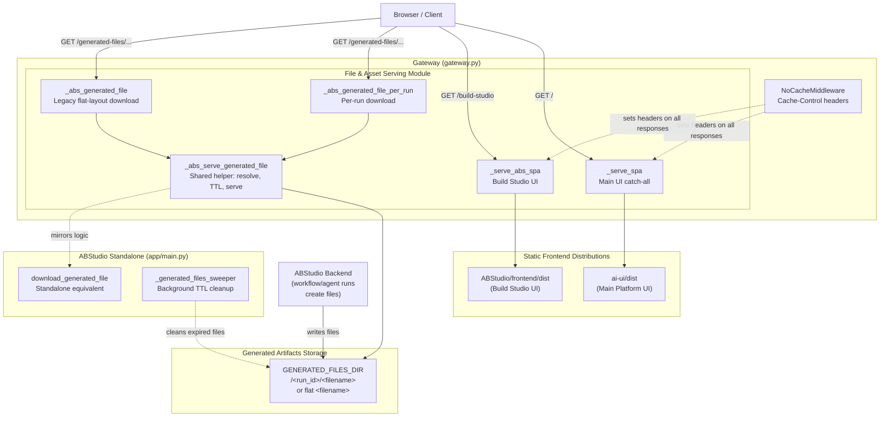
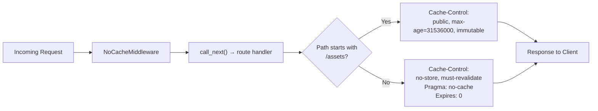
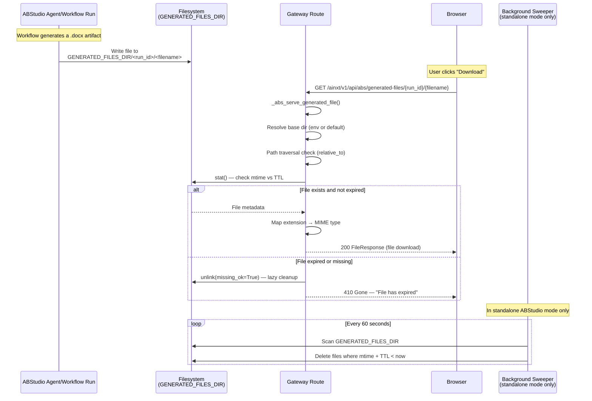
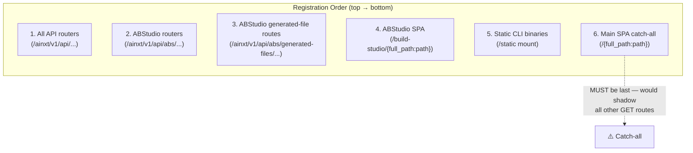

# File & Asset Serving Module

## Overview

The **File & Asset Serving** module is a sub-module of the [Gateway](#) (`gateway.py`) responsible for serving static front-end Single-Page Applications (SPAs) and downloadable generated artifacts to end users. It bridges the gap between the backend API surface and the browser by:

1. **Serving two distinct SPAs** — the main AiNxt platform UI (`ai-ui/dist`) and the ABStudio / Build Studio UI (`ABStudio/frontend/dist`) — with correct cache-control semantics.
2. **Serving generated files** (`.docx`, `.pptx`, `.pdf`, `.md`, `.txt`) produced by ABStudio workflow and agent runs, with TTL-based expiration and path-traversal protection.

All routes in this module are registered on the main FastAPI `app` object in `gateway.py` and are intentionally placed **after** every API route so that the SPA catch-all (`/{full_path:path}`) does not shadow API endpoints.

---

## Architecture

---

## Core Components

### 1. `_serve_spa` — Main Platform UI Catch-All

| Attribute | Detail |
|---|---|
| **Route** | `GET /{full_path:path}` |
| **Source dir** | `ai-ui/dist` (relative to `gateway.py`) |
| **Registration** | Bottom of `gateway.py` — **must** be the last route registered so it never shadows API endpoints |
| **Schema** | Hidden (`include_in_schema=False`) |

**Behaviour:**

1. If `full_path` resolves to an existing file inside `_ui_dist`, serve that file directly (e.g. `sw.js`, `manifest.json`). Cache headers are delegated to `NoCacheMiddleware`.
2. Otherwise, fall back to `index.html` with explicit `no-store, must-revalidate` headers so the browser always fetches the latest SPA shell.

> **Why explicit headers on the fallback?** `NoCacheMiddleware` already applies `no-store` globally, but the SPA fallback sets them redundantly as a defence-in-depth measure — it should be impossible to accidentally serve a stale `index.html`.

**Static assets mount:** Vite-hashed bundles under `/assets` are mounted via `StaticFiles` and receive `public, max-age=31536000, immutable` from `NoCacheMiddleware` (the hash changes on every rebuild, so stale files are never served after deployment).

---

### 2. `_serve_abs_spa` — Build Studio UI

| Attribute | Detail |
|---|---|
| **Routes** | `GET /build-studio` and `GET /build-studio/{full_path:path}` |
| **Source dir** | `ABStudio/frontend/dist` |
| **Condition** | Only registered if the `_abs_dist` directory exists at startup |

**Behaviour:** Identical pattern to `_serve_spa` — serve named static files if they exist, otherwise fall back to `index.html` with no-cache headers. Build Studio assets under `/ainxt/v1/api/abs/assets` are mounted separately via `StaticFiles`.

---

### 3. `_abs_serve_generated_file` — Shared Artifact Helper

> This is the internal workhorse used by both generated-file route handlers. It is **not** a route itself.

**Responsibilities:**

| Step | Detail |
|---|---|
| **Base resolution** | Reads `GENERATED_FILES_DIR` → `ABS_GENERATED_FILES_DIR` → default `ABStudio/tmp`. Resolves to an absolute path and creates the directory if missing. |
| **Path traversal guard** | Resolves the target path and verifies it is inside the base directory via `Path.relative_to()`. Returns `400 Invalid filename` on violation. |
| **TTL check** | Compares `time.time() - file.st_mtime` against `GENERATED_FILES_TTL_SECONDS` (default `86400` = 24 h). Expired or missing files are deleted (best-effort) and a `410 Gone` is returned. |
| **Media type mapping** | Maps file extensions to MIME types for correct browser/download behaviour. |
| **Response** | Returns a `FileResponse` with the resolved path, media type, and original filename. |

**Supported media types:**

| Extension | MIME Type |
|---|---|
| `.pptx` | `application/vnd.openxmlformats-officedocument.presentationml.presentation` |
| `.docx` | `application/vnd.openxmlformats-officedocument.wordprocessingml.document` |
| `.pdf` | `application/pdf` |
| `.md` | `text/markdown` |
| `.txt` | `text/plain` |
| *(other)* | `application/octet-stream` |

---

### 4. `_abs_generated_file_per_run` — Per-Run Artifact Download

| Attribute | Detail |
|---|---|
| **Route** | `GET /ainxt/v1/api/abs/generated-files/{run_id}/{filename}` |
| **Tags** | `build-studio` (hidden from OpenAPI schema) |
| **File layout** | `GENERATED_FILES_DIR/<run_id>/<filename>` |

This is the **current** download route. Files are organized into per-run subdirectories so the original filename stays clean in URLs and download prompts. It delegates to `_abs_serve_generated_file` with the relative path `{run_id}/{filename}`.

> **Historical note:** Commit `18dc0a42` changed `platform_tools.py` to store generated files in a per-run subdirectory, but `gateway.py` was not updated at the time. This caused `404 Not Found` when users clicked "Download" on a generated `.docx`. This route was added to fix that gap.

---

### 5. `_abs_generated_file` — Legacy Flat-Layout Download

| Attribute | Detail |
|---|---|
| **Route** | `GET /ainxt/v1/api/abs/generated-files/{filename}` |
| **Tags** | `build-studio` (hidden from OpenAPI schema) |
| **File layout** | `GENERATED_FILES_DIR/<filename>` (flat, no run subdirectory) |

Kept for backward compatibility during the transition from flat layout to per-run subdirectories. New files always use the per-run route. Delegates to `_abs_serve_generated_file` with just `{filename}` as the relative path.

---

## Caching Strategy

Caching is governed by `NoCacheMiddleware` (part of the [Security & Governance](security_and_governance.md) module), which wraps every response:

| Path pattern | Cache policy | Rationale |
|---|---|---|
| `/assets/*` | Immutable, 1 year | Vite content-hashes filenames; hash changes on rebuild so stale files are never served |
| Everything else (API, SPA shell, generated files) | No-store | Ensures fresh API data and latest `index.html` on every load |

The SPA fallback handlers (`_serve_spa`, `_serve_abs_spa`) **also** set no-cache headers explicitly on the `index.html` response as a defence-in-depth measure.

---

## Data Flow: Generated File Lifecycle

---

## Relationship to ABStudio Standalone Mode

The gateway-embedded serving paths **mirror** the logic in ABStudio's standalone FastAPI app (`ABStudio/backend/app/main.py`). This dual-path design ensures identical behaviour whether ABStudio runs standalone (port 8002) or embedded under the gateway (port 8000):

| Concern | Gateway (`gateway.py`) | Standalone (`app/main.py`) |
|---|---|---|
| Per-run download route | `_abs_generated_file_per_run` | *(not present — flat layout only)* |
| Flat download route | `_abs_generated_file` | `download_generated_file` |
| Shared helper | `_abs_serve_generated_file` | Inline in `download_generated_file` |
| TTL check | Inline in helper | `_is_expired()` function |
| Background sweeper | *(not running)* | `_generated_files_sweeper()` (60 s interval) |
| Auth | None (public route) | `Depends(require_access)` |

> **Key difference:** The gateway routes are **unauthenticated** (they serve files by opaque run ID/filename), while the standalone `download_generated_file` requires an authenticated user. The gateway relies on the unguessability of run IDs and the short TTL window for access control.

---

## Environment Variables

| Variable | Default | Purpose |
|---|---|---|
| `GENERATED_FILES_DIR` | `ABStudio/tmp` (relative to `gateway.py`) | Primary directory for generated artifacts |
| `ABS_GENERATED_FILES_DIR` | *(falls back to `GENERATED_FILES_DIR`)* | ABStudio-specific override for generated artifacts |
| `GENERATED_FILES_TTL_SECONDS` | `86400` (24 hours) | Time-to-live for generated files, measured from file mtime |

---

## Route Registration Order

Route registration order in `gateway.py` is critical because FastAPI matches routes in registration order:

The SPA catch-all `GET /{full_path:path}` matches **every** GET path. If it were registered before any API route, it would intercept and shadow them. This is why all file-serving routes are defined at the very bottom of `gateway.py`.

---

## Dependencies

### Internal Dependencies

| Dependency | Module | Role |
|---|---|---|
| `NoCacheMiddleware` | [Security & Governance](security_and_governance.md) | Sets `Cache-Control` headers on all responses |
| `FastAPI` / `FileResponse` / `StaticFiles` | FastAPI / Starlette | HTTP response and static file serving primitives |
| ABStudio routers | [ABStudio Backend](app_main.md) | API routers mounted under `/abs` prefix that create the generated files |

### External Dependencies

| Dependency | Role |
|---|---|
| `pathlib.Path` | Path resolution and traversal protection |
| `os` / `os.path` | Environment variable reads and path construction |
| `time` | TTL calculation via file mtime |

---

## Security Considerations

1. **Path traversal prevention:** `_abs_serve_generated_file` resolves the target path and verifies it is inside the base directory using `Path.relative_to()`. Any attempt to escape the base directory (e.g. `../../etc/passwd`) returns `400 Invalid filename`.

2. **TTL-based access window:** Generated files are only available for `GENERATED_FILES_TTL_SECONDS` (default 24 h). Expired files are lazily deleted on access and proactively cleaned by the background sweeper (in standalone mode). This limits the window during which a stale download URL remains valid.

3. **No authentication on gateway routes:** The gateway-embedded generated-file routes do not require authentication. Access control relies on the unguessability of run IDs and the short TTL. The standalone ABStudio equivalent does require authentication via `Depends(require_access)`.

4. **No-cache for SPA shell:** The `index.html` fallback always includes `no-store, must-revalidate` headers, ensuring users receive the latest SPA bundle after deployments without needing a hard refresh.

---

## Related Documentation

- [Security & Governance](security_and_governance.md) — `NoCacheMiddleware`, rate limiting, and request authentication
- [Health & Monitoring](health_and_monitoring.md) — Gateway health endpoints including ABStudio health check
- [app_main](app_main.md) — ABStudio standalone FastAPI app with the original `download_generated_file` route and background sweeper
- [api_execution](api_execution.md) — ABStudio workflow execution routes that generate downloadable artifacts
