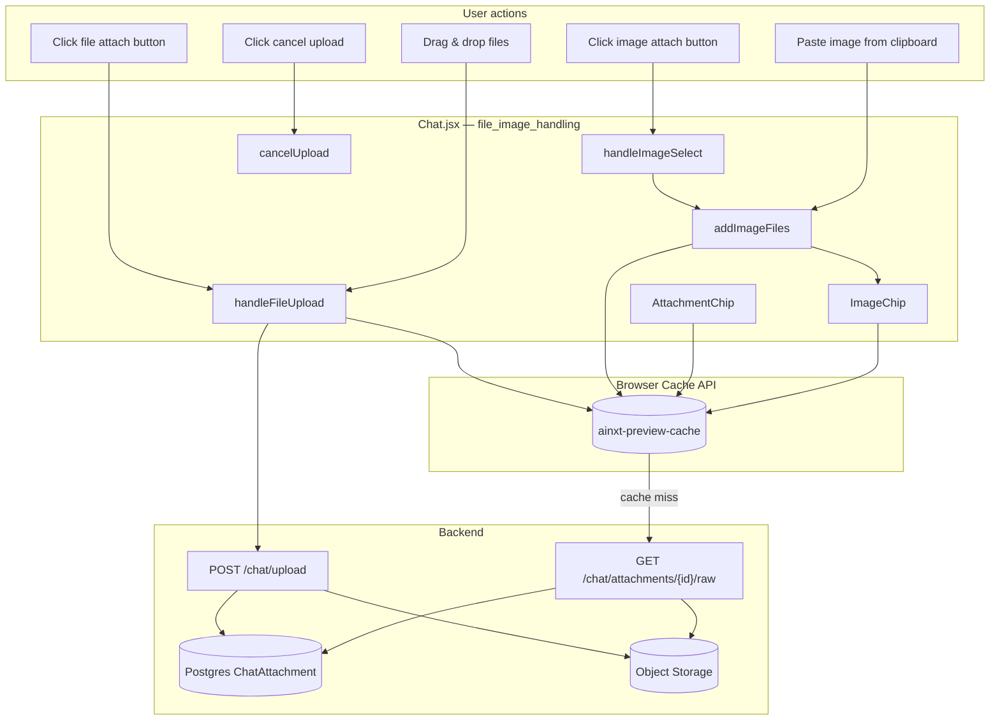
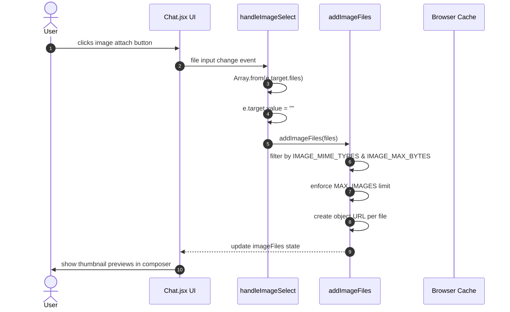
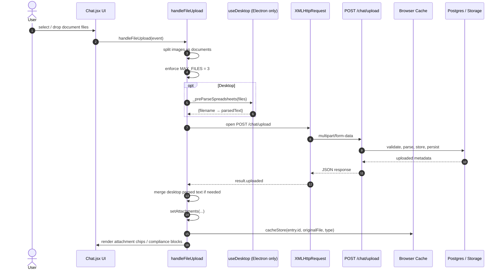
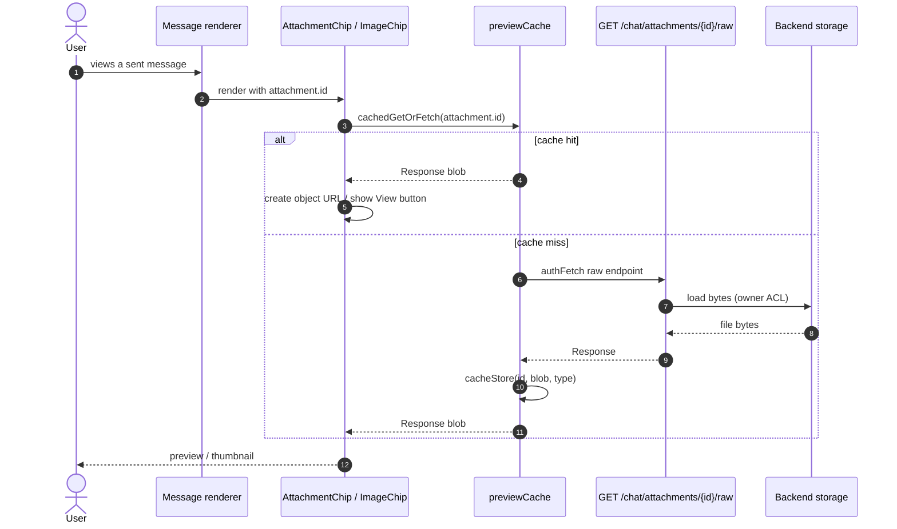
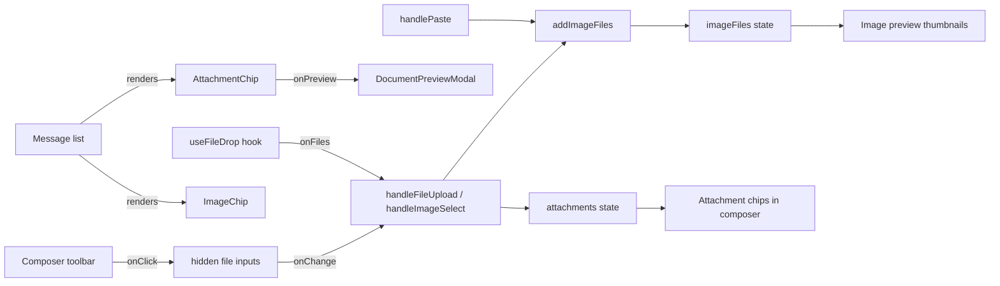

# File & Image Handling

## Brief Introduction

The `file_image_handling` module is a sub-module of the AI-UI chat experience (`ai-ui/src/components/Chat.jsx`). It is responsible for every client-side operation that lets a user attach, preview, upload, and render files and images inside a chat turn. The module covers:

- Selecting images via a file picker (`handleImageSelect`).
- Uploading documents and images to the backend (`handleFileUpload`).
- Cancelling an in-flight upload (`cancelUpload`).
- Rendering cache-aware attachment chips for documents (`AttachmentChip`).
- Rendering cache-aware thumbnails for images (`ImageChip`).

The design is intentionally cache-first: after a file is uploaded, its raw bytes are stored in the browser's Cache API. Subsequent previews (including after a page refresh) are served locally, with an authenticated server fallback for cross-device or expired scenarios.

> **Scope note:** This document focuses on the chat-specific file/image handling in `Chat.jsx`. The Knowledge Base chat variant (`KbChat.jsx`) reuses a very similar pattern; see [kb_chat_file_image_handling](kb_chat_file_image_handling.md) for its specifics. The backend upload/preview API is documented in [chat_router](chat_router.md).

---

## Architecture & Component Relationships

### Where it lives

```text
ai-ui_frontend
└── chat
    └── file_image_handling (current module)
        └── ai-ui/src/components/Chat.jsx
            ├── handleImageSelect
            ├── AttachmentChip
            ├── ImageChip
            └── cancelUpload
```

The module is part of the larger `Chat` component. It does not expose its own route; it is rendered inline inside the chat message list and composer toolbar.

### High-level architecture



### Component responsibilities

| Component | Type | Responsibility |
|-----------|------|----------------|
| `handleImageSelect` | Event handler | Reads files from a hidden `<input type="file">`, resets the input, and forwards valid image files to `addImageFiles`. |
| `addImageFiles` | Helper (`useCallback`) | Validates MIME type and size, enforces `MAX_IMAGES`, creates object URLs for live previews, and returns the count added. |
| `handleFileUpload` | Async handler | Splits selected files into images and documents, uploads documents via `XMLHttpRequest`, handles progress, parses desktop spreadsheets locally, caches uploaded bytes, and surfaces compliance blocks. |
| `cancelUpload` | Handler | Aborts the in-flight `XMLHttpRequest`, resets upload UI state, and notifies the user. |
| `AttachmentChip` | React component | Renders a document chip. Checks the preview cache; if available shows a clickable "View" button, otherwise shows an expired notice. |
| `ImageChip` | React component | Renders an image thumbnail by reading the blob from the preview cache and creating an object URL. Shows loading / expired states. |

---

## Data Flow

### 1. Image selection flow



### 2. Document upload flow



### 3. Preview / render flow (after send or on reload)



---

## Component Interaction

### Within `Chat.jsx`



### External dependencies

| Dependency | Module | Role |
|------------|--------|------|
| `useFileDrop` | [useFileDrop](useFileDrop.md) | Provides drag-and-drop registration and file filtering. |
| `previewCache` | [previewCache](previewCache.md) | Browser Cache API wrapper (`cacheStore`, `cachedGet`, `cachedGetOrFetch`). |
| `useDesktop` / `readFileSpreadsheet` | [useDesktop](useDesktop.md) | Pre-parses Excel files on the Electron desktop. |
| `DocumentPreviewModal` | [document_preview](document_preview.md) | Full-screen preview modal for documents and images. |
| `authFetch`, `API_BASE` | [config](config.md) | Authenticated HTTP client and base URL. |
| `chat_router` backend | [chat_router](chat_router.md) | `POST /chat/upload` and `GET /chat/attachments/{id}/raw`. |

---

## Key Constants & Constraints

| Constant | Value | Meaning |
|----------|-------|---------|
| `MAX_FILES` | 3 | Maximum document files per upload batch. |
| `MAX_IMAGES` | defined elsewhere | Maximum images attached to a single turn. |
| `IMAGE_MIME_TYPES` | `image/jpeg`, `image/png`, `image/gif`, `image/webp` | Allowed image uploads. |
| `IMAGE_MAX_BYTES` | 10 MB | Per-image size limit. |
| `ACCEPTED_DROP_MIME_TYPES` | PDF, DOCX, XLSX, CSV, TXT, HTML, JSON, XML, images, etc. | Allowed drag-and-drop file types. |
| Cache name | `ainxt-preview-cache` | Browser Cache API store. |
| Cache TTL | 7 days (`MAX_AGE_MS`) | Entries older than this are treated as expired. |

---

## Process Flows

### Upload cancellation

```mermaid
flowchart LR
    A[User clicks cancel] --> B[cancelUpload]
    B --> C[uploadXhrRef.current.abort]
    B --> D[setUploading false]
    B --> E[setUploadProgress 0]
    B --> F[setUploadPhase "uploading"]
    B --> G[toast.info "Upload cancelled"]
```

When `handleFileUpload` rejects with `"Upload cancelled"`, the catch block intentionally does **not** render an error card.

### Compliance block handling

If the backend marks a file as `blocked`, `handleFileUpload` injects a synthetic message with `role: "compliance_block"` into the chat. The message renderer then shows a red card listing the detected sensitive data types. This is separate from the normal attachment chips.

---

## How It Fits into the Overall System

The `file_image_handling` module sits at the boundary between the user and the backend chat pipeline:

1. **Input surface** — It is one of several ways the user can provide context to the LLM (alongside typed text, voice, prompt templates, and KB scope).
2. **Backend integration** — Uploaded documents are parsed server-side (`parse_file_structured`), optionally scanned for PCI/PII, stored in object storage, and persisted in `ChatAttachment`. The parsed text is returned to the UI and included in subsequent `/ask` calls via `attachment_ids`.
3. **Vision integration** — Images selected via `handleImageSelect` are sent to `POST /ask/image` as multipart data, enabling vision-model queries.
4. **Cross-session durability** — By caching bytes locally and falling back to the authenticated raw endpoint, previews survive page refresh, re-login, and (for server-fallback cases) cross-device access.
5. **Desktop parity** — The `_preParseSpreadsheets` path ensures the Electron desktop client populates `parsed_text` immediately, matching the web experience where the server parses Excel files.

---

## References

- Parent chat module: [chat](chat.md)
- Related KB chat file handling: [kb_chat_file_image_handling](kb_chat_file_image_handling.md)
- Backend upload/preview API: [chat_router](chat_router.md)
- Browser cache utility: [previewCache](previewCache.md)
- Drag-and-drop hook: [useFileDrop](useFileDrop.md)
- Document preview modal: [document_preview](document_preview.md)
- Desktop helpers: [useDesktop](useDesktop.md)
- Authenticated fetch config: [config](config.md)
