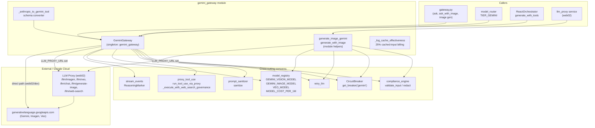
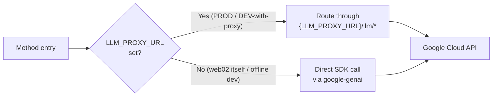
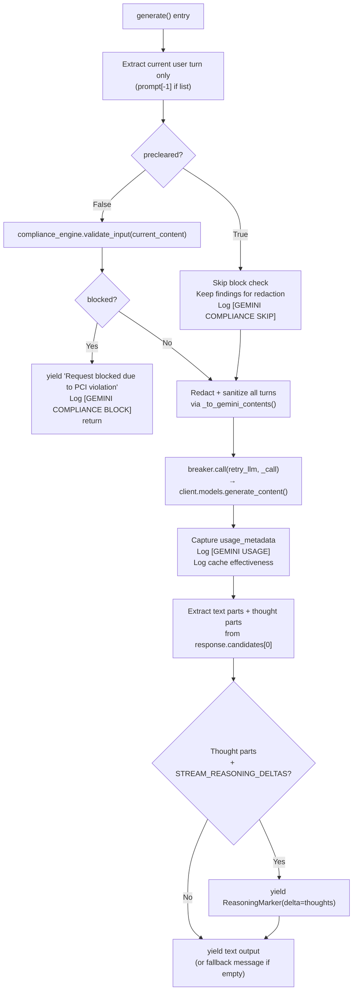
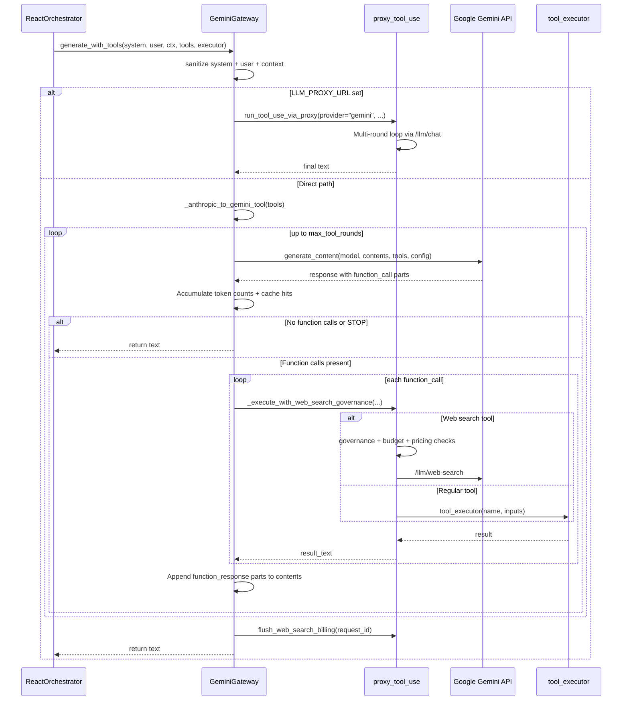
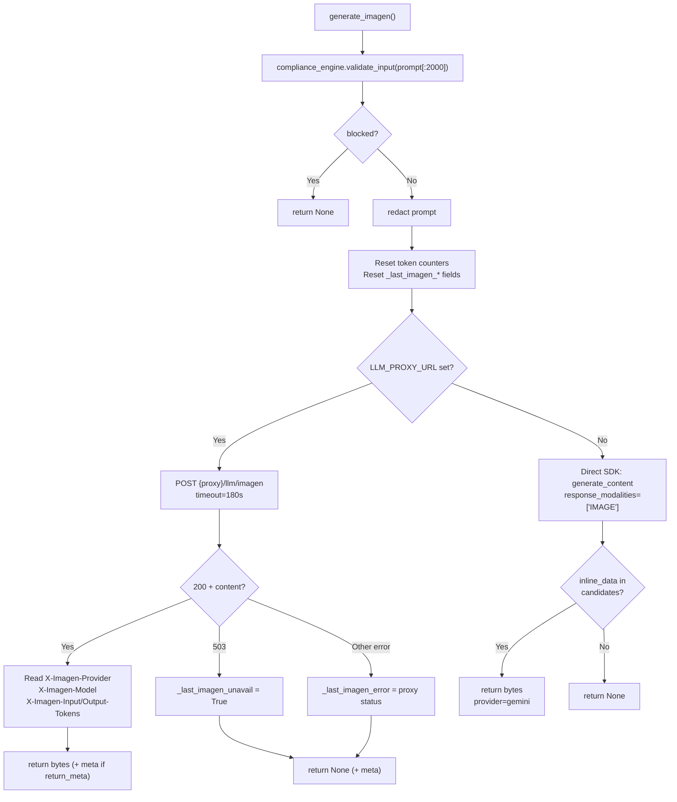
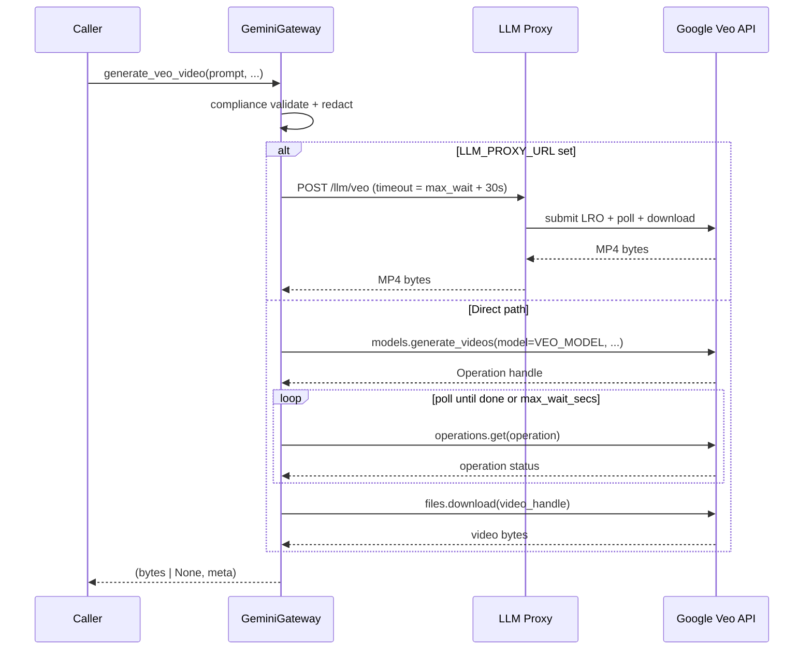
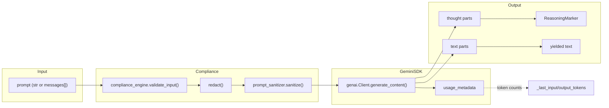
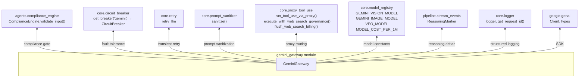
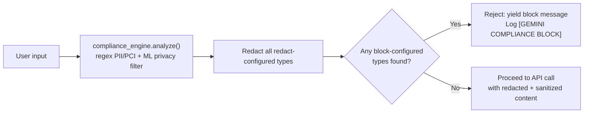
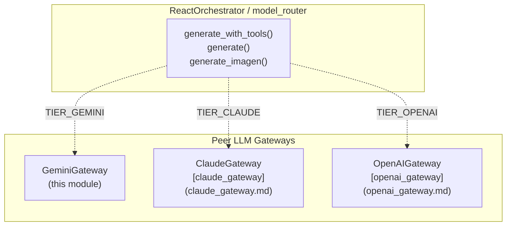

# Gemini Gateway

> Production gateway to Google's Gemini family of models (text, vision, tool-use, Imagen image generation, and Veo video generation) for the NPCI / RBI platform. Enforces PCI/PII compliance, routes all cloud egress through the LLM proxy, and exposes a uniform interface that is swappable with the Claude and OpenAI gateways.

## 1. Introduction

The `gemini_gateway` module (`gateway_gemini.py`) is the single integration point between the platform and Google's `google-genai` SDK. It is one of three peer LLM gateways — alongside [claude_gateway](claude_gateway.md) and [openai_gateway](openai_gateway.md) — that implement the same surface area so the [model router](shared_core.md) and `ReactOrchestrator` can swap providers without changing call sites.

The gateway is responsible for:

| Concern | How it is handled |
|---|---|
| **Text generation** | `generate()` — streaming, multi-turn, with thinking-model reasoning deltas |
| **Tool-use / function calling** | `generate_with_tools()` — non-streaming multi-round loop, Anthropic→Gemini schema conversion |
| **Image generation** | `generate_imagen()` — Imagen via proxy with OpenAI fallback chain |
| **Video generation** | `generate_veo_video()` — Veo 3.1 long-running operation with polling |
| **Vision (text + image)** | `generate_with_image()` — inline image + prompt to Gemini vision model |
| **PCI / PII compliance** | `compliance_engine.validate_input()` gate on every entry point; redaction always runs |
| **Fault tolerance** | `CircuitBreaker` (per-provider) + `retry_llm` wrapping every SDK call |
| **Cloud egress** | Hard-routed through `LLM_PROXY_URL` when set; direct SDK only on web02 / offline dev |
| **Cost observability** | Real token counts from `usage_metadata`; cache-effectiveness logging at 25% cached-input rate |

## 2. Architecture



### Routing policy

Every method in this gateway follows the same two-path routing rule:



- **Proxy path** — All outbound cloud calls go through the LLM proxy service (web02), which is the *only* process with cloud egress. The proxy implements provider fallback chains (e.g. Gemini Imagen → OpenAI gpt-image-1 → DALL·E 3) internally.
- **Direct path** — Only reachable when running *inside* the `llm_proxy` service itself, or in true offline dev with no proxy configured. Production gateways always have `LLM_PROXY_URL` set and never enter this branch.

## 3. Core Components

### 3.1 `GeminiGateway` class

The primary class, instantiated once as the module-level singleton `gemini_gateway`. Holds the `genai.Client` and exposes real token-count accessors (`_last_input_tokens`, `_last_output_tokens`) that the chat router reads after each call to build token/cost chips.

#### `__init__()`

- Reads `GEMINI_API_KEY` from the environment (raises `RuntimeError` if unset).
- Creates a `genai.Client(api_key=...)` — no HTTP proxy needed because the gateway runs on web02 which has direct firewall-allowlisted access to `generativelanguage.googleapis.com`.
- Resets `_last_input_tokens` / `_last_output_tokens` to `0`.

#### `generate(prompt, precleared=False, precleared_findings=None, model=None) -> Generator[str]`

Streaming text generation. Accepts either a plain `str` (single turn) or a `list[dict]` (multi-turn OpenAI-format messages array).

**Compliance contract:**



Key design decisions:

- **Current-turn-only compliance** — The compliance check runs on the *last user message only*, never on the flattened multi-turn history. Re-evaluating prior turns would produce false-positive PCI blocks on benign new prompts.
- **Precleared mode** — When the `/ask` handler in `gateway.py` has already run `validate_input()`, it passes `precleared=True` with the findings from that first pass. This avoids false-positive PCI blocks caused by ML nondeterminism combined with gateway-injected tone/cross-chat prefixes on the last message. Redaction *still* runs using the precleared findings.
- **Thinking-model support** — Gemini 2.5 thinking models emit "thought" parts (`part.thought == True`). These are surfaced as first-class `ReasoningMarker` reasoning deltas (emitted *before* the answer) instead of being silently discarded. Controlled by `STREAM_REASONING_DELTAS` env var (default `"true"`).
- **Robust text extraction** — Instead of relying on `response.text` (which returns `None` when only thought parts exist or content is safety-filtered), the method iterates `response.candidates[0].content.parts` directly.

#### `generate_with_tools(system_prompt, user_message, context, tools, tool_executor, model, max_tokens, max_tool_rounds) -> str`

Non-streaming tool-use loop using Gemini function calling. Mirrors `ClaudeGateway.generate_with_tools()` so `ReactOrchestrator` can swap gateways without changing call sites.



Key behaviours:

- **Schema conversion** — Tool schemas arrive in Anthropic format (`input_schema` key). The `_anthropic_to_gemini_tool()` helper converts them to a single Gemini `Tool` object containing `FunctionDeclaration` entries, recursively building `Schema` objects for nested types.
- **Web-search governance** — Tool execution is wrapped by `_execute_with_web_search_governance()`, which applies governance checks, pricing lookups, and budget gating for web-search tools. Non-web-search tools pass through directly to `tool_executor`.
- **Budget exhaustion** — If a web-search budget is exhausted mid-loop, `_WebSearchBudgetExhausted` is raised, billing is flushed, and a user-facing message is returned.
- **Final no-tools round** — On the last iteration (`round_num == max_tool_rounds`), tools are omitted from the config to force a text-only response.
- **Cache tracking** — Per-round cache hits are accumulated and logged; total cache effectiveness is emitted at loop completion.

#### `generate_imagen(prompt, aspect_ratio, number_of_images, style_suffix, provider, return_meta) -> bytes | None | tuple`

Text-to-image generation. Primary attempt uses the Gemini image model (from `GEMINI_IMAGE_MODEL` in the registry), with automatic fallback to OpenAI's `gpt-image-1` then `dall-e-3` implemented inside the LLM proxy's `/llm/imagen` handler.



- **`return_meta=True`** — Returns `(bytes | None, meta_dict)` so the caller can read which provider/model *actually* produced the image (post-fallback). The meta dict contains `provider`, `model`, `unavailable`, and `error`.
- **Error surfacing** — `_last_imagen_error` and `_last_imagen_unavail` are stashed on the instance so the chat router can render a friendly "Image generation model not available" reply (for 503) instead of an opaque 5xx.
- **Token accounting** — Real token usage is relayed via `X-Imagen-Input-Tokens` / `X-Imagen-Output-Tokens` headers (proxy path) or `usage_metadata` (direct path). OpenAI-fallback images legitimately report `0/0` — values are never faked.

#### `generate_veo_video(prompt, aspect_ratio, duration_secs, poll_interval_secs, max_wait_secs) -> tuple[bytes | None, dict]`

Text-to-video generation via Google Veo 3.1 (preview). Veo is a Long-Running Operation (LRO): submit → poll → download.



- Returns `(mp4_bytes, meta)` on success or `(None, meta)` on failure, where `meta` contains `{mime, duration, model, error?}`.
- Wall-clock capped by `max_wait_secs` (default 300s) to bound LRO polling on errant operations.
- SDK attribute names vary across `google-genai` revisions — the code defensively checks `video_bytes`, `data`, and `bytes` on the file handle.

#### `redact(text, findings)`

Simple PII redaction: replaces each finding's `value` with `"[REDACTED]"` in the text. Used internally by all generation methods.

#### `_to_gemini_contents(prompt, sanitize_fn, redact_fn, findings)` *(static)*

Converts a `str` or OpenAI-format messages list into Gemini's `contents` format. Maps `"user"` → `"user"` and `"assistant"` → `"model"` roles. Each message's content is sanitized and redacted before being wrapped in `gtypes.Content` / `gtypes.Part`.

### 3.2 Module-level helpers

| Function | Purpose |
|---|---|
| `generate_image_gemini(prompt)` | Thin wrapper around `gemini_gateway.generate_imagen(prompt)` — returns `bytes \| None`. |
| `generate_with_image(prompt, image_b64, mime_type, system_prompt, _gateway)` | Sends a prompt + inline base64 image to the Gemini vision model. Routes through `{LLM_PROXY_URL}/llm/generate-image` when the proxy is configured (unless `_gateway` is injected by the proxy itself). Returns full response text (non-streamed). |
| `_anthropic_to_gemini_tool(tools)` | Converts a list of Anthropic-format tool schemas (`input_schema`) into a single Gemini `Tool` with `FunctionDeclaration` entries. Recursively builds `Schema` objects, mapping type strings (`string`→`STRING`, `integer`→`INTEGER`, etc.). |
| `_log_cache_effectiveness(...)` | Emits a structured `[CACHE EFFECTIVENESS]` log line. Derives per-token cost from `MODEL_COST_PER_1M` and computes savings based on Gemini's 25% cached-input billing rate (`_GEMINI_CACHE_READ_RATIO = 0.25`). Always emitted so zero-cache calls are visible. |

### 3.3 Module-level singleton

```python
gemini_gateway = GeminiGateway()
```

A single shared instance used by all callers. Token-count accessors (`_last_input_tokens`, `_last_output_tokens`) on this instance are read by the chat router after each call.

## 4. Data Flow

### 4.1 Text generation data flow



### 4.2 Token & cost observability

Every API call captures real token counts from Gemini's `usage_metadata`:

| Field | Source | Usage |
|---|---|---|
| `prompt_token_count` | `usage_metadata` | `_last_input_tokens` |
| `candidates_token_count` | `usage_metadata` | `_last_output_tokens` |
| `cached_content_token_count` | `usage_metadata` | Cache-effectiveness logging |
| `thoughts_token_count` | `usage_metadata` | Logged for thinking models |
| `total_token_count` | `usage_metadata` | Logged for diagnostics |

Cache savings are computed as: `cache_read × input_rate × (1 - 0.25) / 1,000,000` USD, where `input_rate` comes from `MODEL_COST_PER_1M[model][0]`.

## 5. Dependencies



### Dependency details

| Dependency | Role | Reference |
|---|---|---|
| `google.genai` | Official Google Gemini SDK — `Client`, `types.Content`, `types.Part`, `types.FunctionDeclaration`, `types.Schema`, `types.Tool` | — |
| `agents.compliance_engine` | `compliance_engine.validate_input()` runs regex + ML PII/PCI detection; returns `{blocked, findings, redacted_text, ...}`. Block-configured types reject the request; redact-configured types are masked. | [shared_core](shared_core.md) → `agent_system` |
| `core.circuit_breaker` | `get_breaker("gemini")` returns a per-provider `CircuitBreaker` with Redis-persisted state (CLOSED → OPEN → HALF_OPEN). Wraps every SDK call via `breaker.call(retry_llm, _call)`. | [shared_core](shared_core.md) → `core_infrastructure` |
| `core.retry` | `retry_llm` provides exponential-backoff retry for transient API failures, composed inside the circuit breaker call. | [shared_core](shared_core.md) → `core_infrastructure` |
| `core.prompt_sanitizer` | `sanitize()` strips prompt-injection vectors and normalizes content before it reaches the model. | [shared_core](shared_core.md) → `core_infrastructure` |
| `core.proxy_tool_use` | `run_tool_use_via_proxy()` drives multi-round tool-use through the proxy's `/llm/chat`. `_execute_with_web_search_governance()` applies governance, pricing, and budget gating for web-search tools. `flush_web_search_billing()` writes accumulated billing at loop end. | [shared_core](shared_core.md) → `core_infrastructure` |
| `core.model_registry` | Source of truth for model IDs (`GEMINI_VISION_MODEL`, `GEMINI_IMAGE_MODEL`, `VEO_MODEL`) and per-model pricing (`MODEL_COST_PER_1M`). Env-overridable without code changes. | [shared_core](shared_core.md) → `core_infrastructure` |
| `pipeline.stream_events` | `ReasoningMarker` — a streaming event type that surfaces Gemini thinking-model "thought" parts as first-class reasoning deltas to the UI. | [shared_core](shared_core.md) → `pipeline` |
| `core.logger` | Structured logging with request-ID correlation via `get_request_id()`. | [shared_core](shared_core.md) → `core_infrastructure` |

## 6. Configuration

### Environment variables

| Variable | Default | Description |
|---|---|---|
| `GEMINI_API_KEY` | *(required)* | Google Gemini API key. Raises `RuntimeError` at init if unset. |
| `LLM_PROXY_URL` | *(unset)* | Base URL of the LLM proxy service. When set, all cloud calls route through `{LLM_PROXY_URL}/llm/*`. When unset, direct SDK calls are made (web02 / offline dev only). |
| `STREAM_REASONING_DELTAS` | `"true"` | When `"true"`, Gemini thinking-model thought parts are emitted as `ReasoningMarker` events before the answer. Fail-safe: wrapped in try/except so it can never break the answer path. |
| `GEMINI_VISION_MODEL` | *(registry default)* | Override the vision model ID used by `MODEL` and `generate_with_image()`. |
| `GEMINI_IMAGE_MODEL` | *(registry default)* | Override the image-generation model ID used by `generate_imagen()` direct path. |
| `VEO_MODEL` | *(registry default)* | Override the Veo video model ID used by `generate_veo_video()`. |
| `LLM_TIMEOUT_SEC` | `"300"` | HTTP timeout (seconds) for proxy calls in `generate_with_image()`. |
| `CIRCUIT_BREAKER_DISABLED` | *(unset)* | When set to `"1"`/`"true"`/`"yes"`, the circuit breaker is bypassed entirely. |

### Module-level constants

| Constant | Value | Description |
|---|---|---|
| `MODEL` | `GEMINI_VISION_MODEL` | Default model for `generate()` when caller passes no `model`. Aliases to the image-capable model so legacy vision callers still hit it. |
| `_STREAM_REASONING_DELTAS` | `True` (env opt-out) | Controls whether thought parts are emitted as reasoning deltas. |
| `_GEMINI_CACHE_READ_RATIO` | `0.25` | Gemini context caching bills cached tokens at 25% of the normal input rate. Used in cache-effectiveness savings calculations. |

## 7. Security & Compliance

### Compliance gate

Every public entry point in this module runs `compliance_engine.validate_input()` on the user-facing text before any API call is made:



- **Input validation** — Runs on the *current user turn only* (not flattened history) to avoid false-positive PCI blocks from re-evaluating prior turns.
- **Precleared mode** — The `/ask` handler in `gateway.py` pre-validates and passes `precleared=True` with findings. The block decision is skipped (avoiding ML nondeterminism false positives), but redaction still runs.
- **Redaction** — Always runs, even in precleared mode. Findings values are replaced with `"[REDACTED]"`.
- **Sanitization** — `prompt_sanitizer.sanitize()` runs on every content part after redaction.
- **Image/video prompts** — `generate_imagen()` and `generate_veo_video()` validate `prompt[:2000]` before generation.

### Cloud egress security

The proxy-routing architecture enforces that **no process other than the LLM proxy (web02) has cloud egress**:

- When `LLM_PROXY_URL` is set, all outbound calls go through the proxy. A "fallback" direct call from app01 would fail with a confusing TLS/DNS error, so failures are surfaced rather than masked.
- The direct SDK path is only reachable when running inside the `llm_proxy` service itself or in offline dev.

## 8. Integration with Peer Gateways

The `GeminiGateway` implements the same interface as its peers, enabling provider-agnostic swapping:



- `generate_with_tools()` accepts the same arguments as `ClaudeGateway.generate_with_tools()` — `ReactOrchestrator` can swap gateways without changing call sites.
- Tool schemas arrive in Anthropic format (`input_schema`) and are converted internally via `_anthropic_to_gemini_tool()`.
- The LLM proxy service ([llm_proxy](llm_proxy.md)) has its own `GeminiGateway` instance (`services/llm_proxy/gateway_gemini.py`) for direct SDK calls when it is the proxy itself.

## 9. Error Handling

| Scenario | Behaviour |
|---|---|
| `GEMINI_API_KEY` unset | `RuntimeError` at `__init__` — gateway cannot start. |
| Compliance block | Yields `"Request blocked due to PCI violation"` and returns. Logs `[GEMINI COMPLIANCE BLOCK]` with blocked types and input shape. |
| Circuit breaker OPEN | `breaker.call()` raises `RuntimeError` — fast-fails until recovery timeout. |
| Empty response (no text parts) | Yields a friendly fallback: `"I'm sorry, I couldn't generate a response..."`. Logs `[GEMINI EMPTY]` with candidate/finish_reason diagnostics. |
| Tool-use max rounds exceeded | Returns `"[ERROR: max tool-use rounds exceeded]"` after flushing web-search billing. |
| Imagen proxy 503 | Sets `_last_imagen_unavail = True`; returns `None`. Chat router renders friendly "model not available" message. |
| Imagen proxy other error | Sets `_last_imagen_error`; returns `None`. |
| Veo timeout | Returns `(None, meta)` with `meta["error"] = "timeout after {max_wait_secs}s"`. |
| General exception | Logs full exception with `request_id` and truncated repr; yields `"\nError generating response"` (text path) or returns error string (tool-use path). |

## 10. Related Documentation

| Module | Relationship |
|---|---|
| [claude_gateway](claude_gateway.md) | Peer gateway implementing the same interface for Anthropic Claude models. |
| [openai_gateway](openai_gateway.md) | Peer gateway implementing the same interface for OpenAI models. |
| [llm_proxy](llm_proxy.md) | The proxy service that handles cloud egress, provider fallback chains, and web-search execution. Contains its own `GeminiGateway` instance for direct calls. |
| [gateway](gateway.md) | The main API gateway (`gateway.py`) that calls `GeminiGateway` for `ask`, `ask_with_image`, and image generation endpoints. |
| [shared_core](shared_core.md) | Contains `compliance_engine`, `circuit_breaker`, `retry`, `prompt_sanitizer`, `proxy_tool_use`, `model_registry`, `logger`, and `pipeline.stream_events` — all cross-cutting dependencies of this module. |
| [local_llm_gateway](local_llm_gateway.md) / [ollama_gateway](ollama_gateway.md) | Local/on-prem model gateways for offline or cost-sensitive workloads. |
