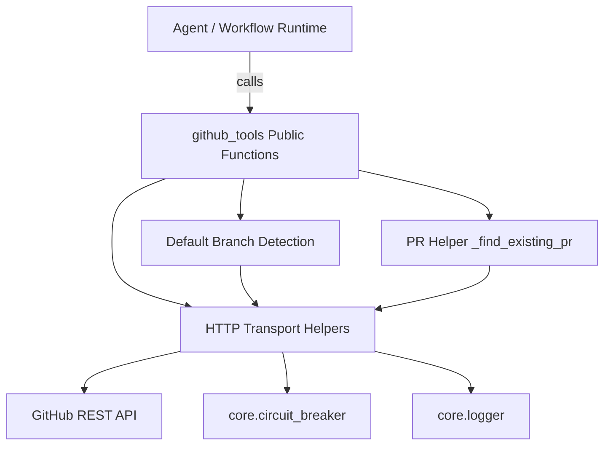
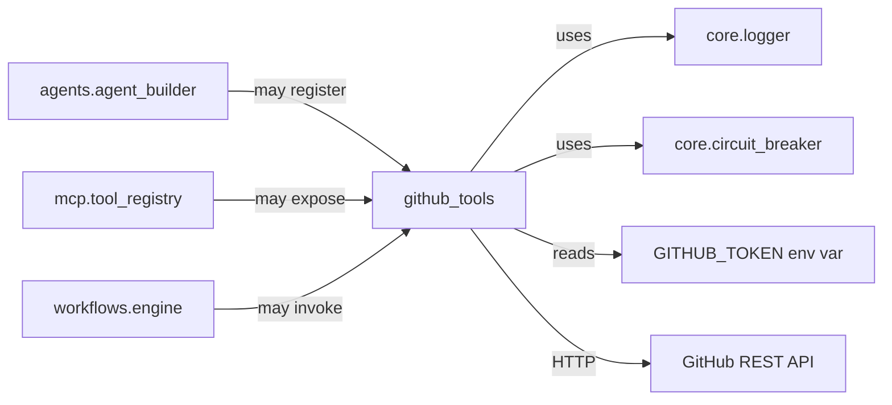
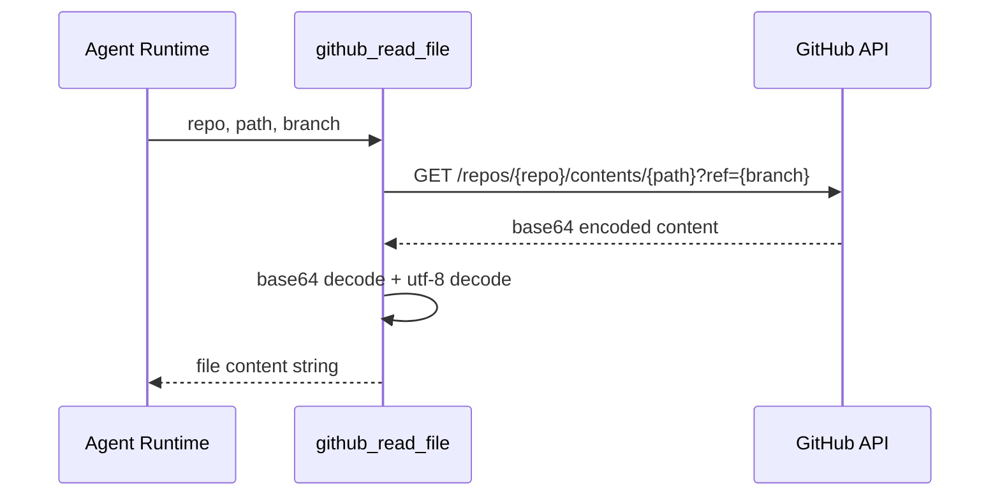
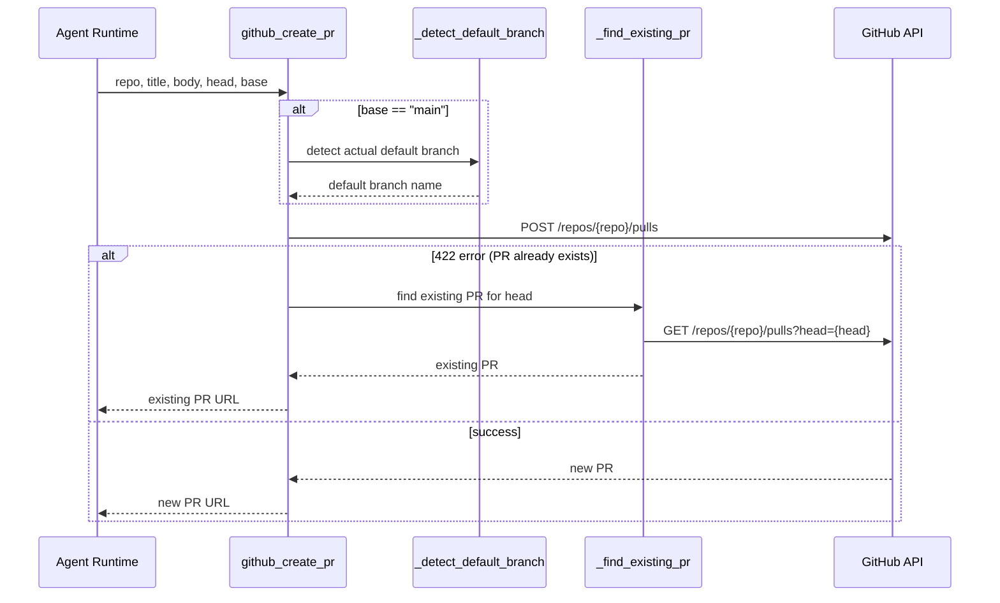
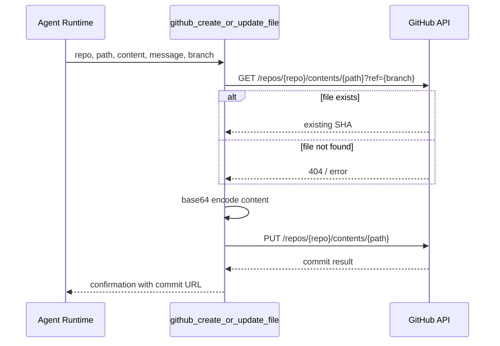

# GitHub Tools Module

## Brief Introduction

The `github_tools` module provides a Python-based integration layer with the GitHub REST API, enabling agents and workflows in the NPCI Agentic Platform to read from and write to GitHub repositories. It exposes a collection of tool functions that cover common repository operations such as reading files, listing and creating issues, managing pull requests (PRs), creating branches, posting reviews, and linking PRs to external work items like Jira.

The module is designed to be consumed directly by the agentic runtime as callable tools. It relies on a `GITHUB_TOKEN` environment variable for authentication, uses standard library `urllib` for HTTP communication, and wraps outbound calls with a circuit breaker for resilience.

---

## Core Functionality

### 1. Repository File Operations

| Function | Purpose |
|----------|---------|
| `github_read_file(repo, path, branch)` | Reads a file's contents from a repository branch. |
| `github_create_or_update_file(repo, path, content, message, branch)` | Creates a new file or updates an existing one with a commit. |

### 2. Issue Management

| Function | Purpose |
|----------|---------|
| `github_list_issues(repo, state, limit)` | Lists repository issues filtered by state. |
| `github_create_issue(repo, title, body, labels)` | Creates a new issue with optional labels. |

### 3. Pull Request Lifecycle

| Function | Purpose |
|----------|---------|
| `github_list_prs(repo, state, limit)` | Lists pull requests filtered by state. |
| `github_create_pr(repo, title, body, head, base)` | Creates a PR; idempotent if a PR already exists for the branch. |
| `github_get_pr(repo, pr_number)` | Retrieves details for a specific PR. |
| `github_get_pr_files(repo, pr_number, max_files)` | Returns changed files with unified diff patches. |
| `github_get_pr_reviews(repo, pr_number)` | Fetches official PR reviews (APPROVE, REQUEST_CHANGES, COMMENT). |
| `github_get_pr_review_comments(repo, pr_number)` | Fetches inline and general PR comments. |
| `github_reply_to_review_comment(repo, pr_number, comment_id, body)` | Replies to a specific inline review comment. |
| `github_create_pr_review(repo, pr_number, body, event, comments)` | Submits an official PR review with optional inline comments. |
| `github_merge_pr(repo, pr_number, merge_method)` | Merges a PR using merge, squash, or rebase strategy. |

### 4. Branch & Commit Operations

| Function | Purpose |
|----------|---------|
| `github_create_branch(repo, branch, from_branch)` | Creates a new branch from a source branch; idempotent. |

### 5. Cross-System Linking

| Function | Purpose |
|----------|---------|
| `github_link_pr_to_jira(repo, pr_number, jira_key)` | Posts a Jira reference comment on a PR. |

---

## Architecture

### Module Structure

```
tools/github_tools.py
├── HTTP Transport Layer
│   ├── _headers()              # Authorization + API version headers
│   ├── _get(path)              # GET with circuit breaker
│   ├── _post(path, payload)    # POST with circuit breaker
│   ├── _patch(path, payload)   # PATCH helper
│   └── _put_gh(path, payload)  # PUT helper
├── Default Branch Detection
│   ├── _DEFAULT_BRANCH_CACHE   # In-process cache
│   ├── _CANDIDATE_BRANCHES     # main, master, develop, dev
│   └── _detect_default_branch(repo)
├── PR Helpers
│   └── _find_existing_pr(repo, head)
└── Public Tool Functions
    ├── File tools
    ├── Issue tools
    ├── PR tools
    ├── Branch tools
    └── Jira linking tools
```

### Component Relationships



### Dependency Diagram



---

## Data Flow

### Read File Flow



### Create Pull Request Flow



### Create or Update File Flow



---

## Resilience & Error Handling

The module implements several resilience patterns:

1. **Circuit Breaker**: All `_get` and `_post` calls are wrapped via `get_breaker("github")` from [core.circuit_breaker](core_circuit_breaker.md). When the circuit is open, calls fail fast and return a structured error.

2. **Idempotency**: 
   - `github_create_pr` detects existing PRs for the same head branch and returns them instead of failing.
   - `github_create_branch` reuses an existing branch if it already exists.

3. **Default Branch Auto-Detection**: Functions that default to `main` will probe `main`, `master`, `develop`, and `dev` to find the repository's actual default branch, caching the result in-process.

4. **Graceful Degradation**: Functions return human-readable error strings rather than raising exceptions, making them safe for agent consumption.

---

## Configuration

| Setting | Source | Description |
|---------|--------|-------------|
| `GITHUB_TOKEN` | Environment variable | Bearer token for GitHub API authentication. |
| GitHub API version | Hardcoded header | `2022-11-28` via `X-GitHub-Api-Version`. |
| Request timeout | Hardcoded | 10 seconds for GET/POST/PATCH/PUT; 15 seconds for merge. |
| Default branch candidates | Hardcoded tuple | `("main", "master", "develop", "dev")`. |

---

## Integration with the Broader System

The `github_tools` module sits within the `shared_integrations` layer of the platform, alongside similar tool modules such as [gitlab_tools](gitlab_tools.md), [jira_tools](jira_tools.md), and [confluence_tools](confluence_tools.md). It is typically consumed in one or more of the following ways:

- **Agent Builder**: The [agents.agent_builder](agent_system.md) may register GitHub tools so that agents can perform repository operations autonomously.
- **MCP Tool Registry**: The [mcp.tool_registry](mcp_system.md) can expose these functions as Model Context Protocol tools.
- **Workflow Engine**: The [workflows.engine](workflow_system.md) can invoke GitHub tools as steps in automated workflows.
- **SDLC Pipeline**: The [shared_core_sdlc_pipeline](shared_core_sdlc_pipeline.md) may use GitHub tools to create PRs, post reviews, and merge code during governance pipelines.

---

## API Reference

### `_headers()`
Builds request headers including the GitHub API version and optional authorization token.

### `_get(path: str) -> dict`
Performs a GET request to the GitHub API with circuit breaker protection.

### `_post(path: str, payload: dict) -> dict`
Performs a POST request to the GitHub API with circuit breaker protection.

### `_patch(path: str, payload: dict) -> dict`
Performs a PATCH request to the GitHub API.

### `_put_gh(path: str, payload: dict) -> dict`
Performs a PUT request to the GitHub API.

### `_detect_default_branch(repo: str) -> str`
Detects and caches the default branch for a repository.

### `_find_existing_pr(repo: str, head: str) -> dict | None`
Finds an existing open PR for a given head branch.

### `github_read_file(repo: str, path: str, branch: str = "main") -> str`
Reads a file from a repository branch.

### `github_list_issues(repo: str, state: str = "open", limit: int = 20) -> str`
Lists issues in a repository.

### `github_create_issue(repo: str, title: str, body: str = "", labels: list = None) -> str`
Creates a new issue.

### `github_list_prs(repo: str, state: str = "open", limit: int = 20) -> str`
Lists pull requests in a repository.

### `github_create_pr(repo: str, title: str, body: str, head: str, base: str = "main") -> str`
Creates a pull request, with idempotent handling for existing PRs.

### `github_get_pr(repo: str, pr_number: int) -> str`
Retrieves details for a specific pull request.

### `github_get_pr_files(repo: str, pr_number: int, max_files: int = 20) -> list`
Returns changed files and their unified diff patches for a PR.

### `github_get_pr_reviews(repo: str, pr_number: int) -> str`
Fetches official reviews on a PR.

### `github_get_pr_review_comments(repo: str, pr_number: int) -> str`
Fetches inline and general comments on a PR.

### `github_reply_to_review_comment(repo: str, pr_number: int, comment_id: int, body: str) -> str`
Replies to a specific inline review comment.

### `github_create_pr_review(repo: str, pr_number: int, body: str, event: str = "COMMENT", comments: list = None) -> str`
Submits an official PR review with optional inline comments.

### `github_merge_pr(repo: str, pr_number: int, merge_method: str = "squash") -> str`
Merges a pull request.

### `github_create_branch(repo: str, branch: str, from_branch: str = "main") -> str`
Creates a new branch from a source branch.

### `github_create_or_update_file(repo: str, path: str, content: str, message: str, branch: str = "main") -> str`
Creates or updates a file in a repository.

### `github_link_pr_to_jira(repo: str, pr_number: int, jira_key: str) -> str`
Posts a Jira reference comment on a PR.

---

## Related Modules

- [core_circuit_breaker](core_circuit_breaker.md) — Resilience wrapper used by HTTP helpers.
- [core_logger](core_logger.md) — Logging infrastructure.
- [gitlab_tools](gitlab_tools.md) — Equivalent integration for GitLab.
- [jira_tools](jira_tools.md) — Jira integration; used for cross-linking work items.
- [agent_system](agent_system.md) — Agent framework that may register these tools.
- [mcp_system](mcp_system.md) — MCP registry that may expose these tools.
- [workflow_system](workflow_system.md) — Workflow engine that may invoke these tools.
- [shared_core_sdlc_pipeline](shared_core_sdlc_pipeline.md) — SDLC automation that may use these tools.
