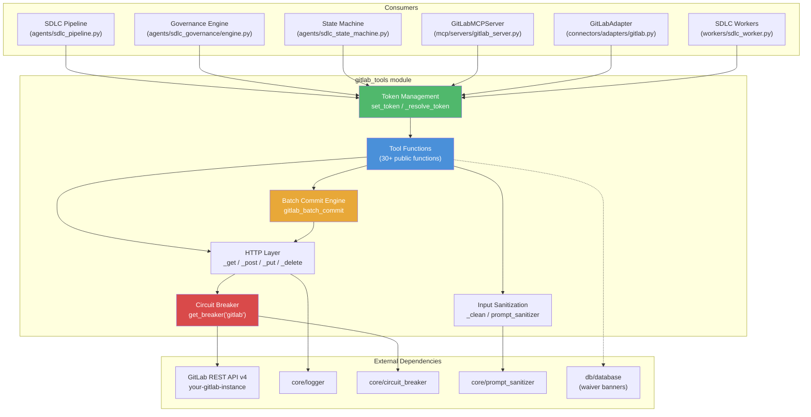
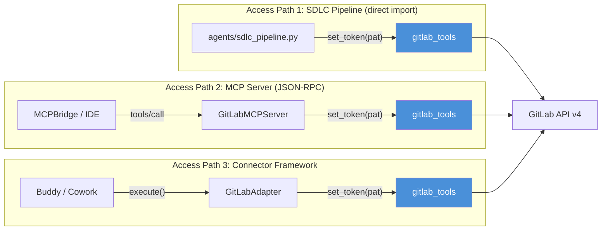
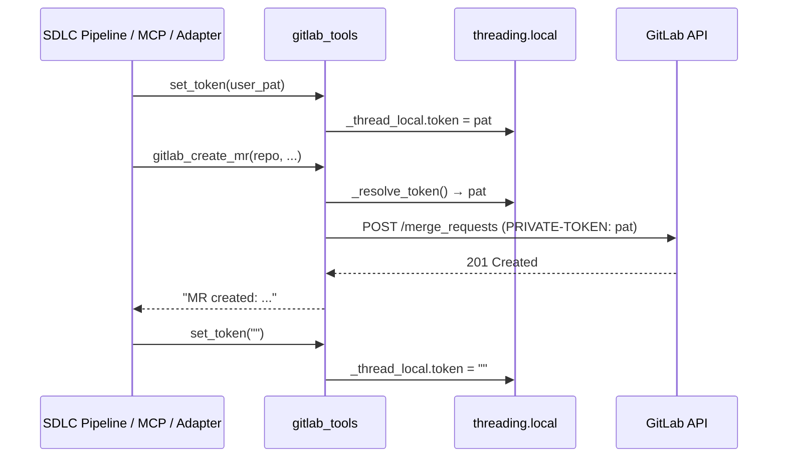
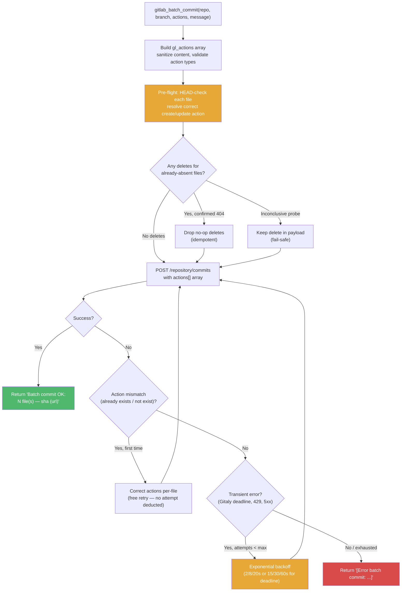
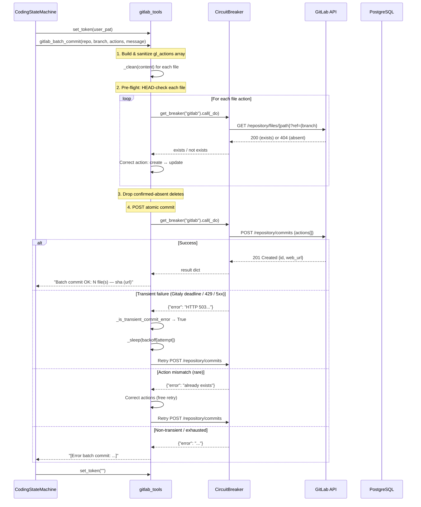
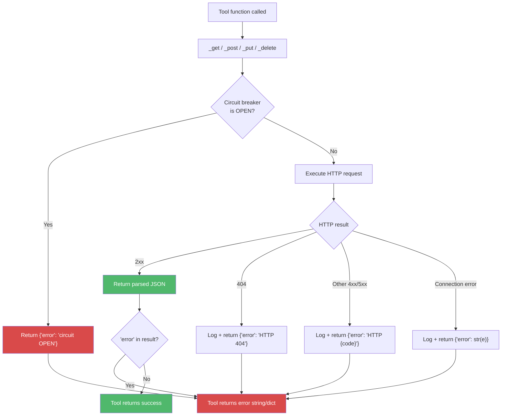

# GitLab Tools Module

## Introduction

The `gitlab_tools` module (`tools/gitlab_tools.py`) is the **single shared GitLab REST API v4 client** for the entire NPCI Agentic Platform. It provides read and write access to GitLab repositories, merge requests, issues, branches, commits, and code review workflows. Every subsystem that needs to interact with GitLab — the SDLC pipeline, the MCP server layer, the connector framework, and the governance engine — routes through this module rather than implementing its own HTTP client.

The module is designed around three core principles:

1. **Thread-safe per-user token injection** — concurrent workers each operate under their own GitLab Personal Access Token (PAT) via a `threading.local()` store, avoiding unsafe process-wide `os.environ` mutation.
2. **Resilience by default** — all HTTP calls are wrapped in a named circuit breaker (`"gitlab"`) and the atomic batch-commit path includes multi-attempt retry with exponential backoff for transient Gitaly/rate-limit/5xx failures.
3. **Idempotency** — branch creation, MR creation, and batch commits are all idempotent, enabling safe retries and resumption of interrupted SDLC runs.

---

## Architecture Overview

### Module Position in the System

The `gitlab_tools` module sits at the **integration boundary** between the platform's agent/SDLC orchestration layer and the external GitLab instance. It is consumed through three distinct access paths:

---

## Core Components

### 1. Token Management

| Function | Visibility | Description |
|---|---|---|
| `set_token(token)` | Public | Sets a per-thread GitLab PAT. Normalizes `"user:REAL_TOKEN"` format by stripping the prefix. Called by the SDLC pipeline, MCP server, and connector adapter before any tool invocation. |
| `_resolve_token()` | Internal | Returns the active token: thread-local first, `GITLAB_TOKEN` env var as fallback. |

The thread-local pattern is critical for multi-tenant safety. When the SDLC pipeline resolves a user's PAT from `user_tokens`, it calls `set_token()` on the worker thread. All subsequent `gitlab_tools` calls on that thread authenticate as that user. The token is cleared (`set_token("")`) in a `finally` block by every consumer to prevent cross-request leakage.

### 2. HTTP Layer

Four low-level helpers (`_get`, `_post`, `_put`, `_delete`) provide the transport foundation. Each:

- Constructs the full URL against `_GITLAB_API` (`{GITLAB_URL}/api/v4`)
- Attaches authentication headers via `_headers()` (injects `PRIVATE-TOKEN`)
- Routes through `get_breaker("gitlab").call()` for circuit-breaker protection
- Honors `HTTPS_PROXY` via a custom urllib opener
- Returns `{"error": "..."}` dicts on failure (never raises for HTTP errors)
- Logs all requests with token presence/length (never the token itself)

| Helper | HTTP Method | Timeout | Circuit Breaker |
|---|---|---|---|
| `_get(path)` | GET | 300s | `"gitlab"` |
| `_post(path, payload)` | POST | 300s | `"gitlab"` |
| `_put(path, payload)` | PUT | 300s | `"gitlab"` |
| `_delete(path)` | DELETE | 60s | `"gitlab"` |

> **See also:** [shared_core.md](shared_core.md) for the `CircuitBreaker` implementation details (CLOSED → OPEN → HALF_OPEN state machine with Redis-backed persistence).

### 3. Input Sanitization

The `_clean(text)` function strips control and breaking characters from all text destined for the GitLab API (issue titles, MR descriptions, commit messages, comment bodies). It delegates to `core.prompt_sanitizer.sanitize()`, which performs a two-pass O(n) normalization: CRLF normalization followed by non-whitelisted character stripping. This prevents injection of control characters that could break GitLab's markdown rendering or API parsing.

### 4. Tool Functions

The module exposes 30+ public tool functions organized into functional categories:

#### 4.1 Project & Repository Operations

| Function | Returns | Description |
|---|---|---|
| `gitlab_get_project(repo)` | `dict` | Project metadata: id, name, default_branch, visibility, web_url, star/fork counts |
| `gitlab_list_projects(limit, membership, search)` | `list[dict]` | Projects accessible to the authenticated user |
| `gitlab_list_commits(repo, ref_name, limit)` | `list[dict]` | Recent commits on a branch/tag/SHA |
| `gitlab_read_file(repo, path, branch)` | `str` | Decoded file content (handles base64 encoding) |
| `gitlab_search_code(repo, query, max_results)` | `str` | Code search via GitLab blobs API (scope=blobs) |
| `gitlab_get_project_clone_url(repo)` | `str` | Bare HTTPS clone URL for standalone governance clones |
| `_get_file_tree(repo, branch)` | `list[str]` | Recursive file tree (handles pagination) |
| `_detect_default_branch(repo)` | `str` | Cached default branch detection (falls back to `"main"`) |

#### 4.2 Cross-Project "My Work" Tools

These are the **only** tools that require no `repo` argument — they hit instance-wide endpoints scoped to the authenticated user.

| Function | Returns | Description |
|---|---|---|
| `gitlab_list_my_mrs(scope, state, limit)` | `list[dict]` | User's MRs across ALL projects (`assigned_to_me` / `created_by_me` / `all`) |
| `gitlab_list_my_issues(scope, state, limit)` | `list[dict]` | User's issues across ALL projects |

The helper `_ref_project(row)` extracts the `namespace/project` path from instance-wide API responses by parsing `references.full` (stripping `!` or `#` suffixes) or falling back to `web_url` parsing.

#### 4.3 Branch Operations

| Function | Returns | Description |
|---|---|---|
| `gitlab_create_branch(repo, branch, from_branch)` | `str` | Idempotent branch creation (reuses if exists) |
| `gitlab_delete_branch(repo, branch)` | `str` | Idempotent branch deletion (404 treated as success) |

#### 4.4 File Operations

| Function | Returns | Description |
|---|---|---|
| `gitlab_create_or_update_file(repo, path, content, message, branch)` | `str` | Create or update a single file via commit (auto-detects POST vs PUT) |
| `gitlab_apply_patch(repo, path, search, replace, branch, message)` | `str` | Surgical SEARCH/REPLACE patch — reads file, finds exact `search` block, replaces, commits |

`gitlab_apply_patch` is the preferred method for modifying existing files in the SDLC pipeline. It preserves all unchanged code and fails loudly with a `[PatchError]` prefix if the search block is not found (whitespace must match exactly).

#### 4.5 Atomic Batch Commit

`gitlab_batch_commit` is the **most critical** function in the module — it replaces the per-file commit loop that left SDLC runs half-committed when a single Gitaly "4:Deadline Exceeded" hit mid-loop. Key design decisions:

- **Atomicity**: Uses GitLab's Commits API with an `actions[]` array — either every file lands or none do.
- **Pre-flight correction**: HEAD-checks each file before the first attempt to resolve the correct `create` vs `update` action, eliminating 400 errors from misclassified `is_new` flags.
- **Delete safety**: A delete for an already-absent file is dropped only on a **confirmed 404**. Inconclusive probes (5xx, auth failures, circuit-open) keep the delete in the payload — a wrong create/update is self-correcting, but a silently dropped delete is unrecoverable.
- **Retry with backoff**: Transient failures (Gitaly deadline, 429, 5xx, connection errors) trigger exponential backoff. Gitaly deadline errors use a longer schedule (`[15, 30, 60]`s) than generic errors (`[2, 8, 20]`s).
- **Free action correction**: A mid-run action mismatch (rare after pre-flight) triggers a per-file correction that doesn't count against the retry budget.
- **Configurable retries**: `SDLC_COMMIT_RETRIES` env var (default 3), read at call time for no-restart overrides.

#### 4.6 Merge Request Operations

| Function | Returns | Description |
|---|---|---|
| `gitlab_list_mrs(repo, state, limit)` | `str` | Formatted list of MRs in a project |
| `gitlab_create_mr(repo, title, body, head, base, draft)` | `str` | Idempotent MR creation (handles 409, returns existing MR) |
| `gitlab_get_mr(repo, mr_iid)` | `str` | MR details (title, state, branches, author, body) |
| `gitlab_get_mr_files(repo, mr_iid, max_files)` | `list[dict]` | Changed files with diffs, additions/deletions counts |
| `gitlab_get_mr_diff(repo, mr_iid)` | `tuple` | `(diff_text, changed_files, source_branch, target_branch)` for standalone governance |
| `gitlab_get_mr_diff_notes(repo, mr_iid)` | `list[dict]` | Discussion notes with diff `position` preserved (file paths, line numbers) |
| `gitlab_merge_mr(repo, mr_iid, merge_method)` | `str` | Merge an MR (squash/merge/rebase) |
| `gitlab_set_mr_draft(repo, mr_iid, draft)` | `dict` | Flip draft state by rewriting title with/without "Draft: " prefix |
| `gitlab_branch_has_changes(repo, base, head)` | `Optional[bool]` | True if head has ≥1 file diff over base; None if undetermined (fail-open) |
| `gitlab_compare(repo, from_ref, to_ref)` | `dict` | Raw GitLab compare API payload |

#### 4.7 MR Review & Comment Operations

| Function | Returns | Description |
|---|---|---|
| `gitlab_comment_on_mr(repo, mr_iid, body)` | `str` | Post a note on an MR |
| `gitlab_get_mr_review_comments(repo, mr_iid)` | `str` | Formatted list of human review notes (skips system/bot comments) |
| `gitlab_get_mr_reviews(repo, mr_iid)` | `str` | Approval state (approved_by list, approved flag) |
| `gitlab_reply_to_review_comment(repo, mr_iid, note_id, body)` | `str` | Reply to a note thread (finds discussion ID, falls back to top-level note) |
| `gitlab_create_mr_review(repo, mr_iid, body, event, comments)` | `str` | Post review note with APPROVE/REQUEST_CHANGES/COMMENT event |
| `gitlab_link_mr_to_jira(repo, mr_iid, jira_key)` | `str` | Add Jira reference as MR comment (links to npcI Atlassian) |

#### 4.8 Governance Note Operations

| Function | Returns | Description |
|---|---|---|
| `gitlab_post_governance_note(project, mr_iid, report_md)` | `str` | Idempotent governance review note — finds prior note by `## Governance Review` marker and updates in place, or creates new |

This function is used by `workers/sdlc_worker.py::run_governance_review_job` for standalone repo/MR governance reviews. The stable marker (`_GOVERNANCE_NOTE_MARKER = "## Governance Review"`) ensures repeated runs update the same note rather than stacking duplicates.

#### 4.9 Issue Operations

| Function | Returns | Description |
|---|---|---|
| `gitlab_list_issues(repo, state, limit)` | `str` | Formatted list of issues in a project |
| `gitlab_create_issue(repo, title, body, labels)` | `str` | Create a new issue |

#### 4.10 CI Integration

| Function | Returns | Description |
|---|---|---|
| `gitlab_set_commit_status(repo, work_dir, state, description, context)` | `None` | Post commit status (pending/running/success/failed/canceled) — resolves HEAD SHA via `git rev-parse` in `work_dir` |

---

## Dependency Graph

```mermaid
graph TD
    GT["tools/gitlab_tools.py"]

    GT -->|"logging"| LOG["core/logger.py<br/>(logger)"]
    GT -->|"circuit breaker"| CB["core/circuit_breaker.py<br/>(get_breaker)"]
    GT -->|"text sanitization"| SAN["core/prompt_sanitizer.py<br/>(sanitize)"]
    GT -->|"waiver banners (best-effort)"| DB["db/database.py<br/>(SessionLocal)"]

    GT -.->|"consumed by"| SDLC["agents/sdlc_pipeline.py"]
    GT -.->|"consumed by"| SM["agents/sdlc_state_machine.py"]
    GT -.->|"consumed by"| GOV["agents/sdlc_governance/engine.py"]
    GT -.->|"consumed by"| WORKER["workers/sdlc_worker.py"]
    GT -.->|"consumed by"| MCP["mcp/servers/gitlab_server.py"]
    GT -.->|"consumed by"| ADAPTER["connectors/adapters/gitlab.py"]
    GT -.->|"consumed by"| PATCH["agents/sdlc_patch_engine.py"]
    GT -.->|"consumed by"| CODER["agents/sdlc_coder_tools.py"]

    style GT fill:#4a90d9,color:#fff,stroke:#2a6db0,stroke-width:3px
```

### Internal Dependencies

| Dependency | Purpose | Failure Mode |
|---|---|---|
| `core/logger` | Structured logging for all API calls, errors, and retry decisions | Non-fatal — logging failures are swallowed |
| `core/circuit_breaker.get_breaker("gitlab")` | Protects against cascading failures when GitLab is down | Circuit OPEN → returns `{"error": "..."}` instead of raising |
| `core/prompt_sanitizer.sanitize` | Strips control/breaking characters from all text sent to GitLab | Falls back to `str(text)` on import error |
| `db/database.SessionLocal` | Reads `sdlc_runs.context.waiver_banners` for MR description prepend | Best-effort — wrapped in try/except, non-fatal |

### External Configuration

| Env Var | Default | Description |
|---|---|---|
| `GITLAB_URL` | `https://your-gitlab-instance` | GitLab instance base URL |
| `GITLAB_TOKEN` | _(empty)_ | Fallback service-account token (used when no thread-local token is set) |
| `HTTPS_PROXY` / `https_proxy` | _(empty)_ | HTTPS proxy for outbound GitLab API calls |
| `SDLC_COMMIT_RETRIES` | `3` | Max retry attempts for transient batch-commit failures |
| `CIRCUIT_BREAKER_DISABLED` | _(empty)_ | Set to `1`/`true`/`yes` to bypass circuit breaker |

---

## Data Flow: SDLC Pipeline Commit

The following diagram illustrates the complete data flow when the SDLC pipeline commits generated code via `gitlab_batch_commit`:

---

## Integration Points

### 1. SDLC Pipeline (Direct Import)

The SDLC pipeline (`agents/sdlc_pipeline.py`, `agents/sdlc_state_machine.py`, `agents/sdlc_patch_engine.py`, `agents/sdlc_coder_tools.py`) imports `gitlab_tools` functions directly. The pipeline resolves the user's PAT from `user_tokens` and calls `set_token()` before any GitLab operation. Key consumers:

- **`CodingStateMachine`**: Uses `gitlab_create_branch`, `gitlab_batch_commit`, `gitlab_create_mr`, `gitlab_merge_mr` for the feature/bug pipeline.
- **`PatchEngine`**: Uses `gitlab_apply_patch` for surgical code modifications.
- **`sdlc_coder_tools.execute_tool`**: Dispatches to `gitlab_read_file`, `gitlab_search_code`, `gitlab_create_or_update_file` as agent tools.

> **See also:** [shared_core_sdlc_pipeline.md](shared_core_sdlc_pipeline.md) for the full SDLC pipeline architecture.

### 2. MCP Server (JSON-RPC)

`GitLabMCPServer` (`mcp/servers/gitlab_server.py`) wraps 15 `gitlab_tools` functions as MCP tools, exposing them via JSON-RPC 2.0 over SSE and Streamable HTTP transports. The server overrides `handle_message()` to inject the requesting user's PAT via `core.platform_credentials.get_gitlab_token()` before dispatching `tools/call` requests.

> **See also:** [mcp_servers.md](mcp_servers.md) for the MCP server framework and transport details.

### 3. Connector Framework

`GitLabAdapter` (`connectors/adapters/gitlab.py`) is the connector-framework wrapper that exposes `gitlab_tools` to Buddy/Cowork agents. It maps connector-engine parameter names (`project_id` → `repo`, `opened` → `open`, `limit` → `max_results`) and handles pagination via `AdapterPage`. The adapter injects the per-user PAT from `context.access_token` and always clears it in a `finally` block.

> **See also:** [shared_integrations_connector_adapters.md](shared_integrations_connector_adapters.md) for the connector adapter framework.

### 4. Governance Engine

The governance engine (`agents/sdlc_governance/engine.py`) and governance review worker (`workers/sdlc_worker.py::run_governance_review_job`) use:

- `gitlab_post_governance_note` — idempotent governance review note posting
- `gitlab_get_mr_diff` — standalone diff extraction for repo/MR-mode reviews
- `gitlab_get_project_clone_url` — clone URL resolution for standalone workspace setup
- `gitlab_get_mr_diff_notes` — positioned review comments for author fix workflows
- `gitlab_reply_to_review_comment` — threaded replies to reviewer feedback

> **See also:** [shared_core_sdlc_pipeline.md](shared_core_sdlc_pipeline.md) for governance engine details.

### 5. Webhook Integration

The `webhooks_router.py::gitlab_webhook` endpoint receives GitLab push/MR webhook events and triggers SDLC pipeline workflows. While the webhook handler itself is in the router layer, it may use `gitlab_tools` functions to enrich webhook payloads with additional repository context.

> **See also:** [shared_api_routers.md](shared_api_routers.md) for the webhook router.

---

## Error Handling Philosophy

The module follows a **never-raise** convention for HTTP-level errors. All `_get`/`_post`/`_put`/`_delete` helpers catch `HTTPError` and generic `Exception`, returning `{"error": "..."}` dicts. This means:

1. **Tool functions can check for `"error" in result`** to detect failures without try/except.
2. **String-returning tools** prefix errors with `[Error` or `[PatchError]` so callers can detect failures with `result.startswith("[")`.
3. **List-returning tools** (`gitlab_list_my_mrs`, `gitlab_list_my_issues`, `gitlab_list_projects`, `gitlab_list_commits`, `gitlab_get_mr_files`) **raise `RuntimeError`** on API errors — these are used in contexts where silent failure would be worse than an exception (e.g., the connector framework needs to surface errors to the user).

The circuit breaker adds a second layer: when the `"gitlab"` breaker is OPEN, all calls fast-fail with `RuntimeError`, which the HTTP helpers catch and return as `{"error": "CircuitBreaker[gitlab] is OPEN..."}`.

---

## Key Design Patterns

### Idempotency

| Operation | Idempotency Strategy |
|---|---|
| `gitlab_create_branch` | Pre-checks branch existence via GET; handles "already exists" race in POST response |
| `gitlab_create_mr` | Catches 409 conflict; calls `_find_existing_mr()` to return the existing MR URL |
| `gitlab_batch_commit` | Pre-flight HEAD-checks resolve correct create/update; confirmed-absent deletes are dropped |
| `gitlab_delete_branch` | 404 (already gone) treated as success |
| `gitlab_post_governance_note` | Finds prior note by stable marker header; updates in place via PUT |

### Fail-Safe Defaults

- **`gitlab_branch_has_changes`**: Returns `None` (not `False`) when the compare API fails — callers treat `None` as "undetermined" and **fail-open** (proceed with MR creation) so a transient GitLab hiccup never silently drops a real change.
- **Batch commit delete pre-flight**: Inconclusive existence probes (not just 404) keep the delete in the payload — a wrong create/update is self-correcting via mid-run retry, but a silently dropped delete is unrecoverable.
- **Circuit breaker Redis unavailable**: Fails open (returns OPEN state) to prevent split-brain in multi-instance deployments.

### MR Description Waiver Banners

`gitlab_create_mr` attempts to prepend waiver banners from `sdlc_runs.context.waiver_banners` to the MR description. This is a **best-effort** operation wrapped in try/except — if the database lookup fails, the MR is still created without the banner. The banner block appears as un-collapsible blockquotes at the top of the description so reviewers see them at merge time.
