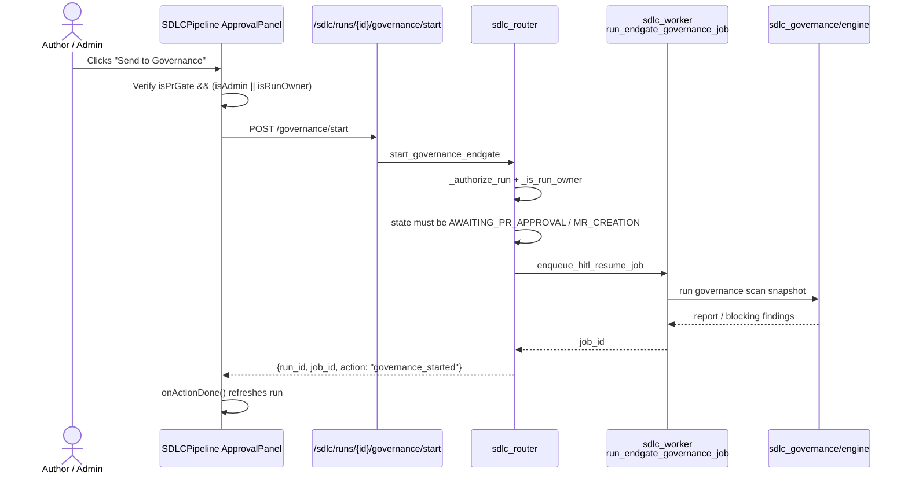
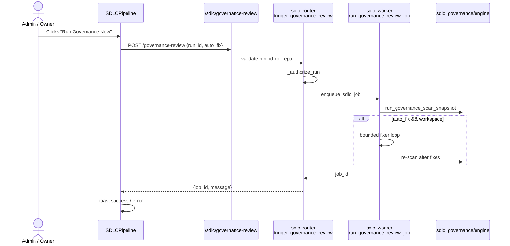
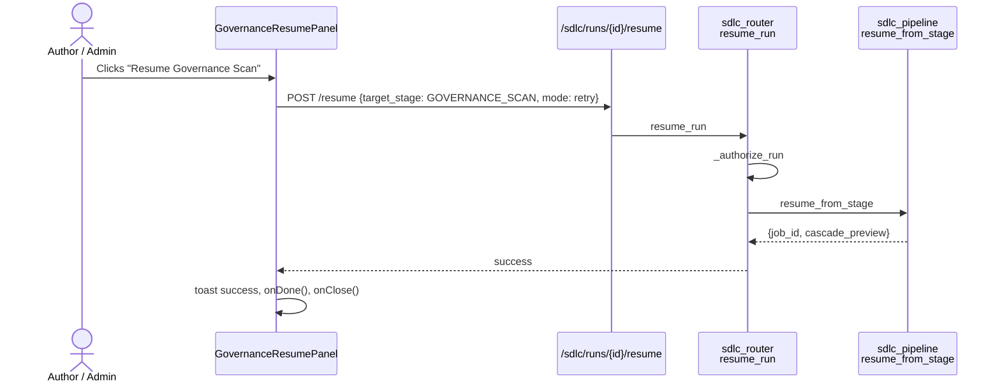
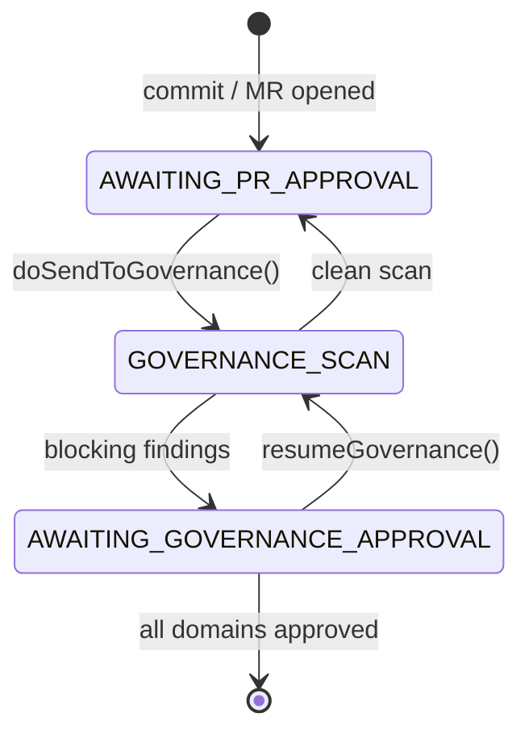

# Governance Actions Module

## Brief Introduction

The **Governance Actions** module is the frontend control surface inside the AI UI SDLC pipeline that lets authors, admins, and domain approvers trigger, resume, and react to pre-merge governance scans. It lives within [`SDLCPipeline.jsx`](sdlc_pipeline.md) and exposes the buttons, banners, and panels that move a run into, through, and out of the governance end-gate.

Governance actions are not the review UI itself — that responsibility belongs to [`sdlc_governance_review`](sdlc_governance_review.md). Instead, this module provides the *entry points* and *recovery controls*: sending a PR to governance, re-running a governance review on demand, resuming a suspended governance scan, and refreshing the run after an approval action completes.

---

## Core Responsibilities

| Responsibility | Description |
| --- | --- |
| **Trigger governance end-gate** | Authors/admins start the pre-merge governance scan from the PR-approval gate. |
| **Trigger standalone governance review** | Admins or owners request an on-demand governance review with optional auto-fix. |
| **Resume suspended governance scans** | Re-run a governance scan that did not complete cleanly. |
| **Surface manifest validation status** | Show a banner when the `MANIFEST_VALIDATION` stage produced a cross-provider validation result. |
| **Refresh after approval actions** | Notify the parent pipeline to refresh the selected run once an approval/rejection completes. |

---

## Architecture

### Component Hierarchy

```mermaid
flowchart TB
    subgraph SDLCPipeline["SDLCPipeline.jsx (parent)"]
        direction TB
        RunDetail["RunDetail / ApprovalPanel"]
        ManifestValidationBanner["ManifestValidationBanner"]
        GovernanceResumePanel["GovernanceResumePanel"]
    end

    subgraph GovernanceReview["GovernanceReviewPanel.jsx (sibling module)"]
        GovernanceApprovalPanel["GovernanceApprovalPanel"]
        GovernanceReadOnlyPanel["GovernanceReadOnlyPanel"]
    end

    subgraph GateSignals["GateSignalRow.jsx (sibling module)"]
        ManifestValidationSignal["ManifestValidationSignal"]
    end

    RunDetail -->|calls| doSendToGovernance
    RunDetail -->|calls| runGovernanceNow
    RunDetail -->|calls| handleApprovalDone
    GovernanceResumePanel -->|calls| resumeGovernance
    ManifestValidationBanner -->|fetches| MANIFEST_VALIDATION_Artifact
    ManifestValidationSignal -->|fetches| MANIFEST_VALIDATION_Artifact
    GovernanceApprovalPanel -->|calls| handleResume

    style doSendToGovernance fill:#e1f5fe
    style runGovernanceNow fill:#e1f5fe
    style resumeGovernance fill:#e1f5fe
    style handleApprovalDone fill:#e1f5fe
```

### Where Governance Actions Live

The governance action functions are defined inside the large `SDLCPipeline.jsx` component. They are not exported as standalone modules; they are closures that capture the current `run`, `run.id`, and `refreshSelected` callback. This keeps the action logic co-located with the run detail view that renders the buttons.

---

## Core Components

### `doSendToGovernance`

Starts the author-triggered pre-merge governance end-gate.

- **When it appears**: only at `AWAITING_PR_APPROVAL`, when the run is not already a governance run, and only for admins or the run owner.
- **Endpoint**: `POST /api/sdlc/runs/{run_id}/governance/start`
- **Effect on success**: run transitions to `GOVERNANCE_SCAN`, then either returns to `AWAITING_PR_APPROVAL` (clean) or suspends at `AWAITING_GOVERNANCE_APPROVAL` (blocking findings). The parent refreshes via `onActionDone`.
- **Ownership guard**: mirrors the backend `_is_run_owner()` check by comparing the current user's email/id against `context.triggered_by_email`, `context.triggered_by_user_id`, and `run.created_by`.

### `runGovernanceNow`

Triggers a standalone governance review job, optionally with auto-fix.

- **Endpoint**: `POST /api/sdlc/governance-review`
- **Payload**: `{ run_id, auto_fix: true, governance_skills: null }`
- **Result**: returns immediately with a `job_id`; the review runs asynchronously in an SDLC worker.
- **UI feedback**: toast success with the job id, or toast error with the backend detail.

### `GovernanceResumePanel`

A small card rendered when a governance scan is suspended. It explains the situation and offers a **Resume Governance Scan** button.

- **Endpoint**: `POST /api/sdlc/runs/{run_id}/resume`
- **Payload**: `{ target_stage: "GOVERNANCE_SCAN", mode: "retry" }`
- **Callbacks**: `onDone` (refresh data) and `onClose` (dismiss the panel).

### `resumeGovernance`

The async handler inside `GovernanceResumePanel`. It posts the resume request, shows toast feedback, and invokes the panel callbacks on success.

### `ManifestValidationBanner`

Fetches and displays the `MANIFEST_VALIDATION` stage artifact for a run. If the artifact exists, it renders [`ManifestValidationPanel`](sdlc_governance_review.md) (defined in the governance review module).

- **Endpoint**: `GET /api/sdlc/runs/{run_id}/stages/MANIFEST_VALIDATION/artifact`
- **Behavior**: silently ignores fetch failures; renders nothing if no artifact is present.

### `handleApprovalDone`

A thin callback that calls `refreshSelected()` after an approval/rejection/cancellation action completes. It ensures the run detail view reflects the latest state.

---

## Data Flow

### Triggering the Pre-Merge Governance End-Gate

### Triggering a Standalone Governance Review

### Resuming a Suspended Governance Scan

---

## Dependencies

### Parent / Sibling Modules

| Module | Relationship |
| --- | --- |
| [`sdlc_pipeline`](sdlc_pipeline.md) | Hosts the governance action closures and renders the buttons/panels. |
| [`sdlc_governance_review`](sdlc_governance_review.md) | Renders the full governance findings UI, author triage board, and team review board. |
| [`sdlc_gate_signal`](sdlc_gate_signal.md) | Includes `ManifestValidationSignal`, which fetches the same manifest artifact. |
| [`sdlc_status_model`](sdlc_status_model.md) | Provides labels and badge colors for run states such as `AWAITING_GOVERNANCE_APPROVAL`. |
| [`sdlc_pipeline_stepper`](sdlc_pipeline_stepper.md) | Visualises pipeline stage progression including `GOVERNANCE_SCAN`. |

### Backend Endpoints

| Endpoint | Purpose |
| --- | --- |
| `POST /sdlc/runs/{id}/governance/start` | Author-triggered governance end-gate. |
| `POST /sdlc/governance-review` | Standalone governance review with optional auto-fix. |
| `POST /sdlc/runs/{id}/resume` | Resume a suspended run from a target stage. |
| `GET /sdlc/runs/{id}/stages/MANIFEST_VALIDATION/artifact` | Fetch manifest validation result for the banner. |

### Backend Workers / Engines

| Component | Role |
| --- | --- |
| `workers/sdlc_worker.py::run_endgate_governance_job` | Executes the author-triggered governance end-gate. |
| `workers/sdlc_worker.py::run_governance_review_job` | Executes standalone governance reviews. |
| `agents/sdlc_governance/engine.py::run_review` | Runs the governance review CLI session and returns a structured report. |
| `agents/sdlc_pipeline.py::run_governance_scan_snapshot` | Builds the diff and invokes the governance engine. |

---

## State Transitions

---

## Permission Model

| Action | Who Can Trigger | Guard Location |
| --- | --- | --- |
| Send to Governance | Run owner or admin | Frontend `canSendToGovernance`; backend `_is_run_owner` |
| Run Governance Now | Authorized run viewer (backend enforces) | Backend `_authorize_run` |
| Resume Governance Scan | Run owner or admin (via resume auth) | Backend `_authorize_run` + `resume_from_stage` |

The frontend performs a best-effort ownership check before showing the button, but the backend is authoritative and returns `403` if the caller is not the owner or an admin.

---

## Error Handling

- All async actions parse the backend JSON error body and fall back to `statusText`.
- `doSendToGovernance` and `runGovernanceNow` display errors inline or via toast.
- `resumeGovernance` shows toast errors and keeps the panel open so the user can retry.
- `ManifestValidationBanner` silently swallows fetch failures to avoid breaking the run detail view when no manifest artifact exists.

---

## Related Documentation

- [`sdlc_pipeline`](sdlc_pipeline.md) — parent pipeline UI and run detail view.
- [`sdlc_governance_review`](sdlc_governance_review.md) — governance findings, triage, and team approval UI.
- [`sdlc_gate_signal`](sdlc_gate_signal.md) — gate signal badges including manifest validation.
- [`sdlc_status_model`](sdlc_status_model.md) — run state labels and badge styling.
- [`sdlc_pipeline_stepper`](sdlc_pipeline_stepper.md) — pipeline stage visualisation.
