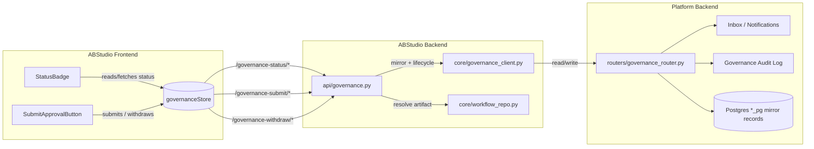
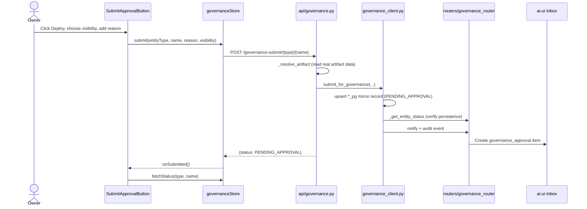
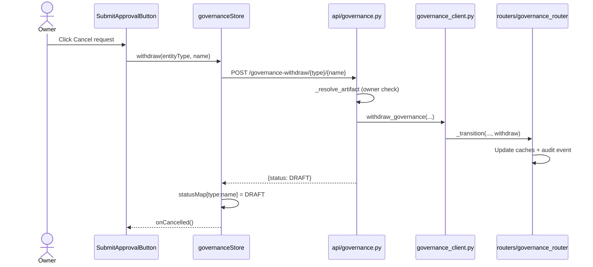
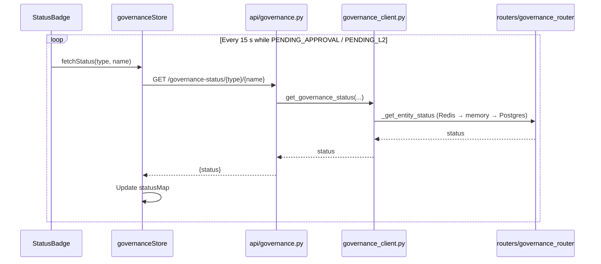
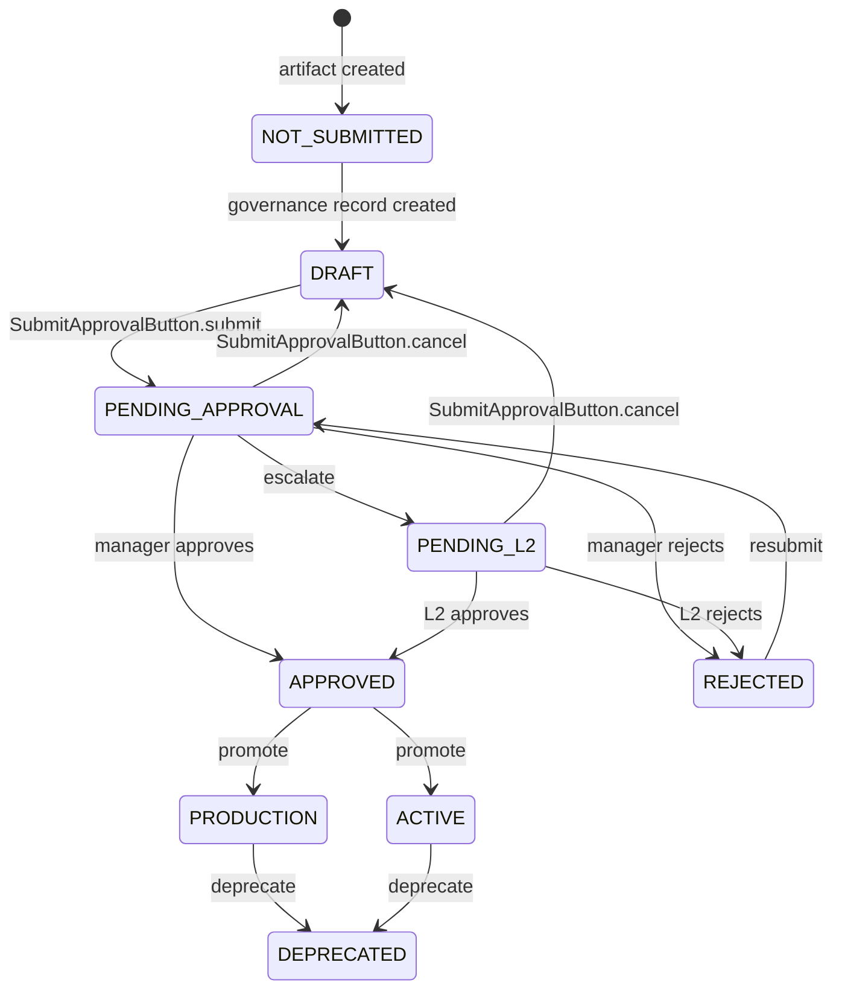

# Governance Feature (ABStudio Frontend)

## Introduction

The `governance_feature` module is the Build Studio (ABStudio) frontend layer for the platform-wide artifact approval workflow. It lets creators of **workflows**, **agents**, and **skills** request department-manager (HOD) approval before those artifacts can be published as reusable templates or run in production.

The module is intentionally thin: it provides two small, self-contained React components and a Zustand store that bridge Build Studio artifacts to the platform governance system. The actual approval lifecycle, inbox notifications, audit logging, and mirror-record management live in the platform backend (see [api_governance](api_governance.md), [core_governance_client](core_governance_client.md), and [ai_ui_frontend](ai_ui_frontend.md)).

### Purpose

- Surface the current governance status of an artifact inside Build Studio editors and dashboards.
- Let the artifact owner submit a "Deploy" request to their department manager with a visibility choice (`public` / `private`) and an optional reason.
- Allow the owner to cancel a pending request and return the artifact to an editable `DRAFT` state.
- Poll for status changes so approvals performed in the separate `ai-ui` Inbox app are reflected without a page reload.

---

## Architecture Overview

### Key Design Decisions

1. **Operational copy vs. governance mirror**  
   Build Studio keeps the real artifact data in its own tables. The platform governance system keys off mirror records (`agents_pg`, `skills_pg`, `workflows_pg`). The ABStudio backend creates these mirror records on demand when a user submits for approval.

2. **Fail-closed runtime guard**  
   An artifact with no governance record is treated as **not usable** for governed entity types. This prevents a freshly created but unsubmitted artifact from being run until it has been approved.

3. **Self-contained UI components**  
   `StatusBadge` and `SubmitApprovalButton` use inline styles and do not depend on ABStudio's CSS theme, so they can be dropped into any card, list, or editor header.

4. **Polling for cross-app status**  
   Approvers act in the `ai-ui` sidebar Inbox, which is a separate application. `StatusBadge` polls every 15 seconds while the status is pending so Build Studio reflects the outcome without requiring a manual refresh.

---

## Core Components

### `StatusBadge`

**File:** `ABStudio/frontend/src/features/governance/StatusBadge.jsx`

A status pill that renders the governance lifecycle state of an artifact.

| Prop | Type | Description |
|------|------|-------------|
| `status` | `string` | Optional. Use when the parent already knows the status. |
| `entityType` | `'workflows' \| 'agents' \| 'skills'` | Required for self-managed lookups. |
| `name` | `string` | Artifact name; required for self-managed lookups. |
| `style` | `object` | Optional inline style overrides. |
| `poll` | `boolean` | Default `true`. Re-fetches on mount and polls every 15 s while pending. |

**Supported statuses**

| Status | Label | Meaning |
|--------|-------|---------|
| `NOT_SUBMITTED` | Not Submitted | No governance record exists; the artifact cannot run. |
| `DRAFT` | Not Approved | Record exists but is not yet submitted. |
| `PENDING_APPROVAL` | Awaiting Approval | Submitted, waiting for department manager approval. |
| `PENDING_L2` | Awaiting L2 | Escalated to a second-level approver. |
| `APPROVED` | Approved | Approved but not yet promoted to production. |
| `PRODUCTION` / `ACTIVE` | Live | Approved and available for use as a template. |
| `REJECTED` | Rejected | Approval denied; can be edited and resubmitted. |
| `DEPRECATED` | Deprecated | Previously approved but no longer recommended. |

**Responsibilities**

- Fetch and cache the artifact status via `governanceStore.fetchStatus`.
- Distinguish between "still loading" (`undefined`) and "fetched, no record" (`null`) so a missing record is shown as `NOT_SUBMITTED`.
- Stop polling once the status reaches a terminal or approved state.

---

### `SubmitApprovalButton`

**File:** `ABStudio/frontend/src/features/governance/SubmitApprovalButton.jsx`

The "Deploy" affordance for an artifact. Clicking it opens a small popover where the user chooses visibility and adds an optional reason, then submits the request to the department manager.

| Prop | Type | Description |
|------|------|-------------|
| `entityType` | `'workflows' \| 'agents' \| 'skills'` | Artifact type. |
| `name` | `string` | Artifact name. |
| `onSubmitted` | `function` | Optional callback after a successful submit. |
| `onCancelled` | `function` | Optional callback after a successful cancel. |
| `style` | `object` | Optional inline style overrides. |

**Responsibilities**

- Show a **Deploy** button only when the artifact is submittable (`null`, `DRAFT`, `REJECTED`, `DEPRECATED`).
- Show a **Cancel request** button while the artifact is `PENDING_APPROVAL` or `PENDING_L2`.
- Hide the deploy affordance once the artifact is approved or live.
- Collect `visibility` (`public` = all users, `private` = submitter's department) and an optional `reason`.
- Call `governanceStore.submit` / `governanceStore.withdraw` and refresh the cached status.

---

### `governanceStore`

**File:** `ABStudio/frontend/src/store/governanceStore.js`

A Zustand store that centralizes all governance API calls from the Build Studio frontend.

| Member | Description |
|--------|-------------|
| `statusMap` | Cache keyed by `${entityType}:${name}`. `null` means "not submitted". |
| `fetchStatus(type, name)` | `GET /governance-status/{type}/{name}`. Treats any failure as `null`. |
| `submit(type, name, reason, visibility)` | `POST /governance-submit/{type}/{name}`. |
| `withdraw(type, name)` | `POST /governance-withdraw/{type}/{name}`. Optimistically flips the cached status to `DRAFT`. |

---

## Data Flow

### Submit for Approval

### Withdraw / Cancel Request

### Status Polling

---

## Integration Points

| Related Module | Relationship |
|----------------|--------------|
| [api_governance](api_governance.md) | Backend endpoints that Build Studio calls to submit, withdraw, and read governance status. |
| [core_governance_client](core_governance_client.md) | Client that mirrors ABStudio artifacts into the platform `*_pg` records and drives the approval lifecycle. |
| [core_governance](core_governance.md) | Low-level governance primitives, policy exceptions, and feature flags used by the backend. |
| [workflows_feature](workflows_feature.md) | One of the governed artifact types; workflows are resolved and hashed before submission. |
| [agents_feature](agents_feature.md) | One of the governed artifact types; agent configs are resolved and hashed before submission. |
| [skills_feature](skills_feature.md) | One of the governed artifact types; skill content is resolved and hashed before submission. |
| [ai_ui_frontend](ai_ui_frontend.md) | Approvers review and act on `governance_approval` items in the `ai-ui` sidebar Inbox. |

---

## Governance Lifecycle

---

## Notes for Maintainers

- The frontend never talks directly to the platform `routers/governance_router`. It always goes through the ABStudio backend so that mirror records can be created on demand from the artifact's real data.
- `StatusBadge` is designed to be safe to render in lists: it returns `null` while loading and stops polling once the status is resolved.
- `SubmitApprovalButton` uses local `justSubmitted` state to hide the Deploy button briefly after submit while the pending status settles; cancelling clears this flag immediately so the button reappears.
- Any API failure during status fetch is treated as "not submitted" (`null`) to keep the UI resilient, but the submit path is strict and surfaces real errors if the mirror record cannot be written.
