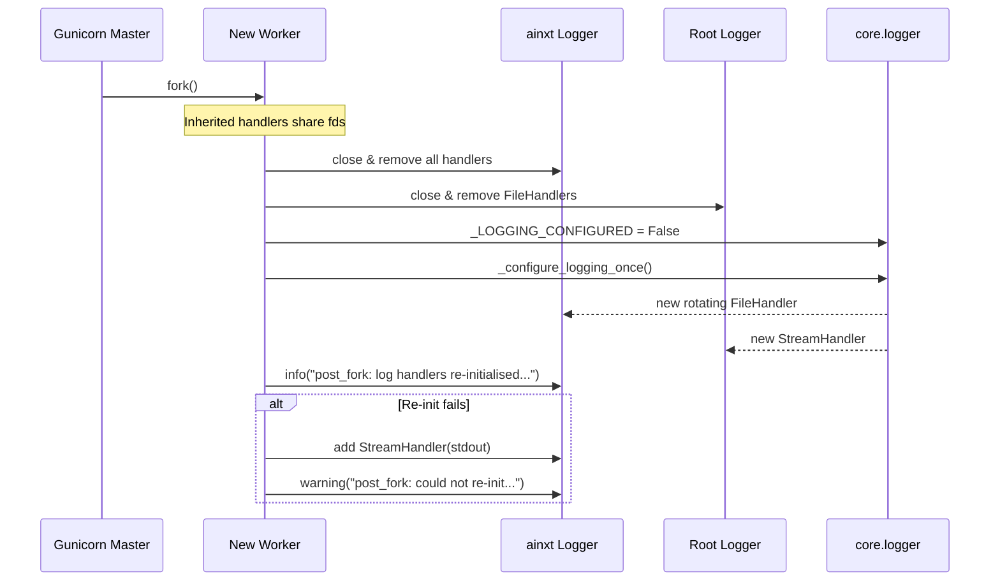
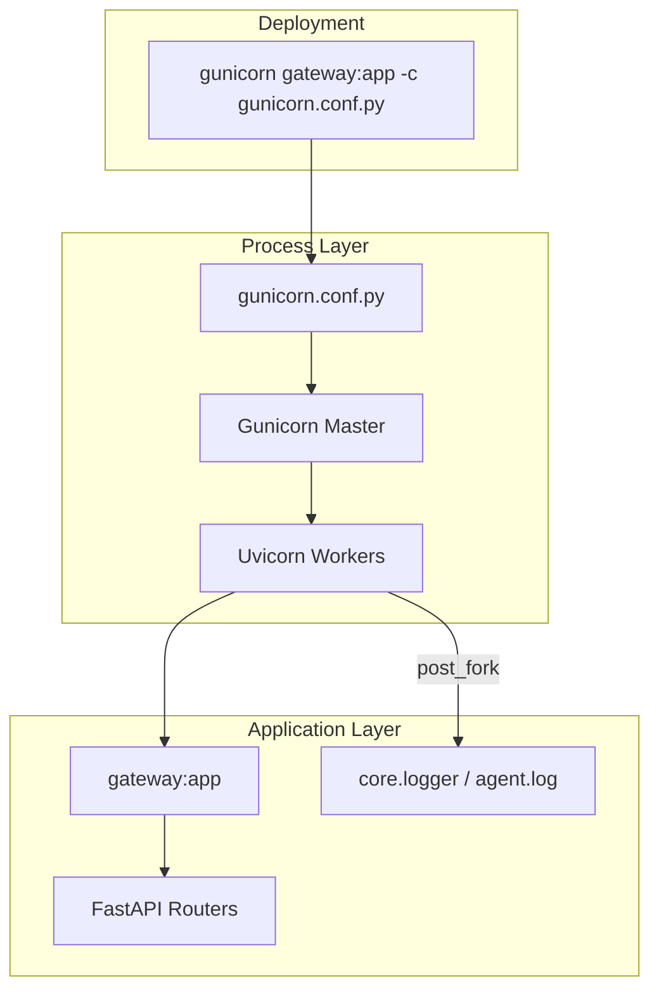

# gunicorn_config

The `gunicorn_config` module provides the production Gunicorn configuration used to serve the platform's main ASGI application. It is a single-file configuration (`gunicorn.conf.py`) that tunes the Gunicorn/Uvicorn worker pool, network bindings, timeouts, and logging behavior for the `gateway` service. The module's most important responsibility is the `post_fork` hook, which re-initializes logging handlers in every worker process after a fork, preventing log corruption and rotation issues caused by shared file descriptors.

---

## Core Responsibilities

| Area | Responsibility |
|------|----------------|
| **Server Tuning** | Defines worker count, worker class, connections, bindings, backlog, and keep-alive behavior. |
| **Resilience** | Configures request limits, graceful shutdown, worker recycling (`max_requests`), and jitter to avoid thundering-herd restarts. |
| **Logging Integrity** | The `post_fork` hook closes inherited file handlers and re-runs the canonical logging setup from `core.logger` so each worker owns independent file descriptors. |
| **Observability** | Sets access/error log paths, log level, and a detailed access-log format including request latency. |

---

## Architecture

```mermaid
flowchart TB
    subgraph "Host / Container"
        G[gunicorn master]
        W1[Worker 1<br/>UvicornWorker]
        W2[Worker N<br/>UvicornWorker]
        ALF[/app/log/access.log]
        ELF[/app/log/error.log]
        AGF[/app/log/agent.log]
    end

    G -->|fork| W1
    G -->|fork| W2

    W1 -->|access log| ALF
    W1 -->|error log| ELF
    W1 -->|post_fork re-init| AGF

    W2 -->|access log| ALF
    W2 -->|error log| ELF
    W2 -->|post_fork re-init| AGF

    style G fill:#e1f5fe
    style W1 fill:#e8f5e9
    style W2 fill:#e8f5e9
```

The Gunicorn master process forks multiple `UvicornWorker` processes. Each worker serves the ASGI application (the `gateway` module) and writes to shared access/error logs. The `post_fork` hook ensures that the application-specific `ainxt` logger and any root `FileHandler` instances are reopened per worker, so log rotation remains consistent.

---

## Component: `post_fork`

`post_fork(server, worker)` is invoked by Gunicorn immediately after a worker process is forked from the master. Its purpose is to fix a classic fork + logging problem:

1. **Inherited file descriptors** — Before the fork, the master process imports application code and configures loggers. File handlers hold open file descriptors.
2. **Shared descriptors after fork** — Forked workers inherit those descriptors. Concurrent writes from multiple workers can interleave and corrupt log lines.
3. **Stale inodes after rotation** — When `SizeAndTimeRotatingFileHandler` rotates a log file, the old fd still points to the rotated (renamed) file. Workers that inherited the old fd continue writing to the stale inode.

The hook solves this by:

1. Closing and removing every handler on the `ainxt` logger.
2. Closing and removing any `FileHandler` on the root logger.
3. Resetting `_core_logger._LOGGING_CONFIGURED` to `False`.
4. Calling `_core_logger._configure_logging_once()` to recreate handlers with fresh file descriptors.
5. Falling back to a `StreamHandler(stdout)` if re-initialization fails.



---

## Configuration Reference

| Setting | Default / Value | Purpose |
|---------|-----------------|---------|
| `workers` | `2 × CPU + 1` (env: `WORKERS`) | Number of Uvicorn worker processes. |
| `worker_class` | `uvicorn.workers.UvicornWorker` | ASGI worker class. |
| `worker_connections` | `1000` | Max concurrent connections per worker. |
| `bind` | `0.0.0.0:8000` (env: `BIND`) | Interface and port to bind. |
| `backlog` | `2048` | Pending connection queue size. |
| `timeout` | `240` | Worker silent timeout (seconds). Raised to cover large attachment uploads. |
| `graceful_timeout` | `30` | Time to wait for graceful shutdown before SIGKILL. |
| `keepalive` | `5` | Keep-alive timeout for idle connections. |
| `max_requests` | `1000` | Restart a worker after this many requests to guard against memory leaks. |
| `max_requests_jitter` | `100` | Randomize restart threshold to avoid all workers restarting together. |
| `preload_app` | `False` | Each worker loads the application independently (fresh state). |
| `loglevel` | `info` (env: `LOG_LEVEL`) | Gunicorn log level. |
| `accesslog` | `/app/log/access.log` | Access log file. |
| `errorlog` | `/app/log/error.log` | Error log file. |
| `access_log_format` | Custom format | Includes remote host, user, time, request, status, bytes, referrer, user-agent, and latency in microseconds. |
| `limit_request_line` | `8190` | Max size of an HTTP request line. |
| `limit_request_fields` | `100` | Max number of HTTP header fields. |

---

## Dependencies


- **[gateway](gateway.md)** — The ASGI application that Gunicorn is configured to serve (`gunicorn gateway:app -c gunicorn.conf.py`).
- **[core.logger](core_logger.md)** — Provides `_configure_logging_once()` and `SizeAndTimeRotatingFileHandler`. The `post_fork` hook depends on this module to rebuild per-worker log handlers correctly.

---

## How It Fits into the System

`gunicorn.conf.py` is not imported by application code at runtime; it is read by the Gunicorn command-line launcher. It sits at the boundary between the container/host process model and the Python application:



Because `preload_app` is `False`, each worker imports the application independently. This is important for modules that hold process-local state (for example, the logging subsystem and any per-process caches). The `post_fork` hook compensates for the fact that some initialization may already have happened in the master before the fork.

---

## Operational Notes

- **Log rotation** — The `post_fork` hook is essential for `SizeAndTimeRotatingFileHandler` to work correctly across worker restarts. Do not remove it unless the logging strategy is changed to a non-file backend.
- **Worker recycling** — `max_requests = 1000` keeps memory growth in check for long-running workers. The jitter prevents all workers from recycling simultaneously.
- **Timeout** — The 240-second timeout accommodates endpoints that stream large payloads or wait on slow downstream calls (for example, Graph/Teams relay operations that can take ~135 seconds).
- **Environment overrides** — `WORKERS`, `BIND`, and `LOG_LEVEL` can be overridden via environment variables for different deployment sizes.

---

## See Also

- [gateway](gateway.md) — Main ASGI application served by this configuration.
- [core.logger](core_logger.md) — Logging infrastructure re-initialized by `post_fork`.
