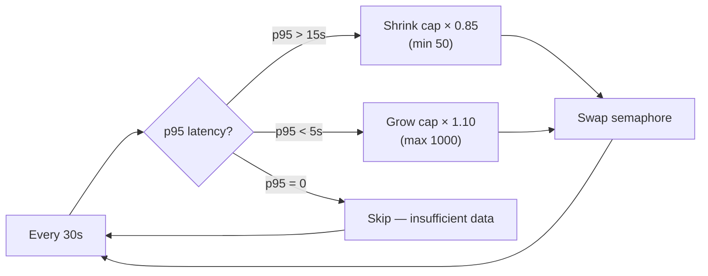
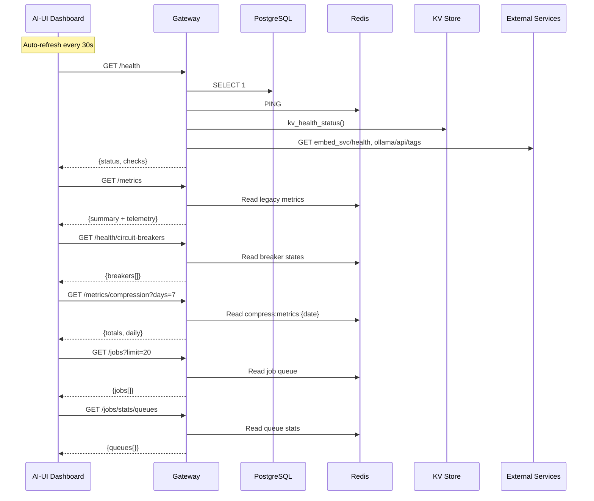
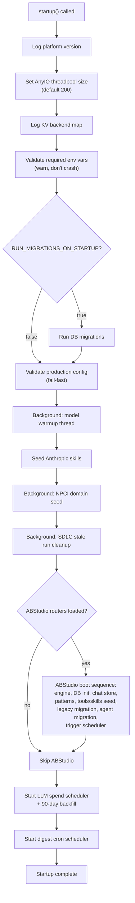
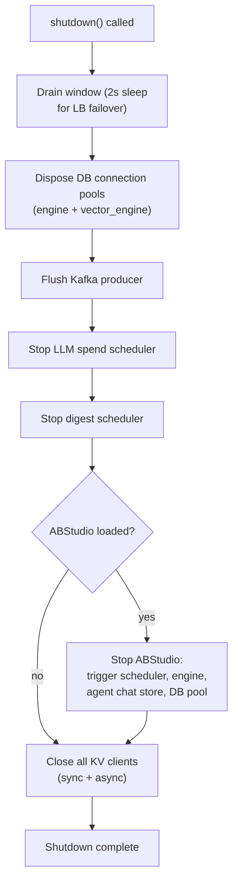
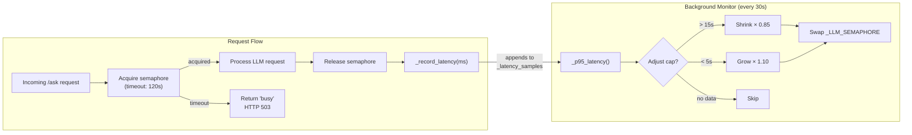

# Health & Monitoring Module

## Introduction

The **Health & Monitoring** module is the operational observability layer of the AI-NXT gateway. It provides real-time visibility into platform health, collects and exposes telemetry metrics, manages the application lifecycle (startup/shutdown), and offers administrative controls such as a platform kill-switch. The module is consumed by both automated infrastructure (Prometheus/Grafana, load-balancer health checks) and the human-facing Monitoring dashboard in the AI-UI frontend.

All components in this module reside in a single file — `gateway.py` — and are exposed as FastAPI route handlers or background threads.

---

## Architecture Overview

```mermaid
graph TB
    subgraph ExternalConsumers["External Consumers"]
        LB["Load Balancer<br/>Health Check"]
        PROM["Prometheus / Grafana"]
        LOKI["Loki / Promtail"]
        UI["AI-UI Monitoring Dashboard"]
    end

    subgraph HealthMonitoring["Health & Monitoring Module (gateway.py)"]
        direction TB
        
        subgraph Lifecycle["Lifecycle Management"]
            STARTUP["startup()"]
            SHUTDOWN["shutdown()"]
            SEM_MON["_adaptive_semaphore_monitor()"]
        end
        
        subgraph HealthChecks["Health Checks"]
            HEALTH["health()"]
            ABS_HEALTH["_abs_health()"]
            SANDBOX_H["sandbox_health()"]
            CB_HEALTH["circuit_breaker_health()"]
        end
        
        subgraph Metrics["Metrics & Telemetry"]
            GET_METRICS["get_metrics()"]
            PROM_METRICS["get_prometheus_metrics()"]
            COMPRESS["get_compression_metrics()"]
            BYPASS["llm_bypass_metrics()"]
            SEM_STATS["semaphore_stats()"]
        end
        
        subgraph PlatformControl["Platform Control"]
            P_STATUS["platform_status()"]
            P_ENABLE["platform_enable()"]
            P_DISABLE["platform_disable()"]
        end
        
        subgraph Observability["Observability Probe"]
            LOKI_PROBE["loki_probe()"]
        end
    end

    subgraph Backends["Backend Dependencies"
        PG["PostgreSQL"]
        REDIS["Redis"]
        KV["KV Store<br/>(Redis / RustyCluster)"]
        EMBED["Embed Service"]
        OLLAMA["Ollama"]
        DOCKER["Docker Daemon"]
    end

    LB -->|"GET /health"| HEALTH
    PROM -->|"GET /metrics"| PROM_METRICS
    LOKI -->|"structured logs"| LOKI_PROBE
    UI -->|"GET /health, /metrics,<br/>/health/circuit-breakers,<br/>/metrics/compression"| HEALTH
    UI --> GET_METRICS
    UI --> CB_HEALTH
    UI --> COMPRESS

    HEALTH --> PG
    HEALTH --> REDIS
    HEALTH --> KV
    HEALTH --> EMBED
    HEALTH --> OLLAMA
    HEALTH --> DOCKER
    ABS_HEALTH --> PG
    SANDBOX_H --> DOCKER
    CB_HEALTH --> REDIS

    STARTUP -->|"seeds, warms, schedules"| Backends
    SHUTDOWN -->|"drains, closes"| Backends
    SEM_MON -->|"adjusts cap"| SEM_STATS
```

---

## Component Documentation

### 1. Lifecycle Management

#### `startup()`

The gateway's async startup handler, invoked by FastAPI's lifespan context. It orchestrates a sequenced boot of all platform subsystems:

| Phase | Description |
|-------|-------------|
| **Version logging** | Reads `VERSION` file and logs the platform version. |
| **Threadpool sizing** | Raises AnyIO's default thread limiter (40 → 200, env-tunable via `GATEWAY_THREADPOOL_SIZE`) to prevent sync I/O bottlenecks in auth/budget/compliance gates. |
| **KV backend map** | Logs the per-database KV backend resolution (Redis vs RustyCluster) for incident postmortems. |
| **Env validation** | Warns (does not crash) if `JWT_SECRET`, `POSTGRES_HOST`, or `REDIS_HOST` are unset. |
| **DB migrations** | Optionally runs migrations when `RUN_MIGRATIONS_ON_STARTUP=true` (off by default — migrations should be a deploy step). |
| **Production config validation** | Fail-fast via `validate_prod_config()` — refuses to start if production config is invalid. |
| **Model warmup** | Background daemon thread triggers local LLM discovery and model listing. |
| **Skill seeding** | Seeds Anthropic skills and NPCI domain skills/agent templates (idempotent upserts). |
| **SDLC cleanup** | Background thread cancels stale SDLC runs older than 4 hours. |
| **ABStudio boot** | If ABStudio routers are loaded: engine startup, DB init, agent chat store, pattern library, canonical tools/skills seed, legacy catalog migration, orphan agent migration, trigger scheduler. |
| **LLM spend tracking** | Starts nightly fetcher + four digest cron jobs (daily/weekly/monthly/quarterly) with a 90-day backfill. |
| **Digest cron** | Starts HOD + Manager monthly usage digest scheduler. |

#### `shutdown()`

Graceful shutdown handler that drains in-flight requests and closes all resources:

1. **Drain window** — 2-second sleep for load-balancer failover, then up to 10s total drain.
2. **DB pools** — Disposes SQLAlchemy `engine` and `vector_engine` connection pools.
3. **Kafka** — Flushes the Kafka producer.
4. **LLM spend scheduler** — Stops the spend tracking scheduler.
5. **Digest scheduler** — Stops the HOD/Manager digest cron.
6. **ABStudio** — Stops trigger scheduler, engine, agent chat store, and closes DB pool.
7. **KV clients** — Closes all sync and async KV clients (Redis pools + RustyCluster gRPC channels).

#### `_adaptive_semaphore_monitor()`

A daemon background thread that runs every 30 seconds and dynamically adjusts the LLM concurrency semaphore cap based on p95 latency:

| Condition | Action |
|-----------|--------|
| p95 > 15,000 ms & cap > `_SEM_MIN` (50) | Shrink cap by 15% |
| p95 < 5,000 ms & cap < `_SEM_MAX` (1000) | Grow cap by 10% |
| p95 = 0 (insufficient data) | No change |

When the cap changes, a new `threading.Semaphore` is atomically swapped in. The semaphore parameters are:

| Parameter | Value | Rationale |
|-----------|-------|-----------|
| `_SEM_MIN` | 50 | Floor — never starve the service |
| `_SEM_MAX` | 1000 | Ceiling — 1 slot per concurrent user |
| `_SEM_INITIAL` | 500 | Startup cap; monitor adjusts from here |
| `_SEM_ACQUIRE_TIMEOUT` | 120s | Wait time before returning "busy" |



---

### 2. Health Checks

#### `health()`

The primary health endpoint (`GET /health`). Performs tiered checks and returns an overall status of `healthy`, `degraded`, or `unhealthy`:

| Check | Criticality | Method |
|-------|-------------|--------|
| **PostgreSQL** | Critical | `SELECT 1` via SQLAlchemy session |
| **Redis** | Critical | `redis_client.ping()` |
| **KV Store** | Critical (RustyCluster only) | Per-DB backend ping via `kv_health_status()` |
| **Embed Service** | Non-critical | HTTP GET to `{EMBED_SVC_URL}/health` (2s timeout) |
| **Ollama** | Non-critical | HTTP GET to `{OLLAMA_URL}/api/tags` (2s timeout) |
| **Docker Sandbox** | Non-critical | `docker_executor.is_available()` + image verification |
| **Circuit Breakers** | Non-critical (if ≥2 open) | `all_breaker_states()` — flags if 2+ breakers are OPEN |

**Status logic:**
- Any **critical** failure → `unhealthy`
- Any **non-critical** failure → `degraded`
- All pass → `healthy`

#### `_abs_health()`

ABStudio-specific health check (async). Verifies:
1. **Engine health** — Calls `get_engine().health()` for the ABStudio native engine.
2. **Database connectivity** — If a Postgres pool is configured, runs `SELECT 1` in a thread; otherwise reports `db_mode: "memory"`.

#### `sandbox_health()`

Returns detailed Docker sandbox status including:
- **Architecture** — Documents that AiNxt services run under pm2 (not Docker); Docker is used only for ephemeral code execution containers.
- **Docker daemon** — Connected/unavailable.
- **Image cache** — Per-language image cache state (cached vs. will auto-pull).
- **Language-image map** — Maps each supported language to its Docker image.
- **Execution limits** — 60s timeout, 512m memory, 50% CPU, network disabled, no-new-privileges, temp-dir-only filesystem.
- **Fallback** — When Docker is unavailable, `SubprocessExecutor` (Python-only, 30s timeout) is used.

#### `circuit_breaker_health()`

Returns the state of all registered circuit breakers (`GET /health/circuit-breakers`). Imports `models.model_router` as a side-effect to ensure all four provider breakers (ollama_local, openai, claude, gemini) are registered even if no chat request has been processed yet.

Each breaker reports: `name`, `state` (CLOSED/OPEN/HALF_OPEN), `failures`, `failure_threshold`, `recovery_timeout`, and `opened_at`.

> **See also:** [shared_core](shared_core.md) — `core/circuit_breaker.py` for the `CircuitBreaker` class implementation and state machine details.

---

### 3. Metrics & Telemetry

#### `get_metrics()`

Returns a JSON summary combining legacy `Metrics` (Redis-persisted query/retrieval stats) and `_TelemetryMetrics` (in-memory + Prometheus counters):

```json
{
  "total_queries": 12345,
  "local_queries": 8000,
  "local_llm_queries": 2000,
  "draft_queries": 500,
  "escalation_rate": 0.162,
  "average_retrieval_score": 0.78,
  "average_latency_ms": 1200.5,
  "repo_usage": { ... },
  "telemetry": {
    "requests_total": 50000,
    "agent_executions": 3000,
    "workflow_executions": 500,
    "errors_total": 120,
    "agent_success": 2800,
    "agent_failure": 200,
    "cache_hits": 15000,
    "compliance_blocks": 45,
    "avg_latency_ms": 1100.2,
    "p95_latency_ms": 3500.0,
    "model_calls": { "gpt-4": 1000, ... },
    "model_tokens": { "gpt-4": 500000, ... },
    "model_cost_usd": { "gpt-4": 12.50, ... }
  }
}
```

> **See also:** [shared_core](shared_core.md) — `core/telemetry.py` for `_TelemetryMetrics` and `metrics.py` for the legacy `Metrics` class.

#### `get_prometheus_metrics()`

Prometheus text-format endpoint (`GET /metrics`). Augments in-memory counters with DB-backed values so the Monitoring dashboard always shows real numbers even after a restart:

1. Queries `ModelUsage` table for total requests, agent executions, avg latency, cost, and errors.
2. Queries `SDLCRun` table for workflow execution counts and failed runs.
3. Uses `max(in_memory, db_count)` for each counter so a fresh restart never wipes historical totals.
4. Seeds latency list and model-level counters from DB if in-process data is empty.
5. Returns `telemetry_metrics.to_prometheus()` in Prometheus 0.0.4 text format.

#### `get_compression_metrics(days=7)`

Returns per-source context compression telemetry for the last N days. Sources include: `ide_session`, `ide_tool`, `sdlc_build`, `sdlc_test`, `rag_phase1`, `lingua_rag`.

For each source, reports: `before` (chars), `after` (chars), `calls`, and `reduction_pct`. Data is read from Redis hash keys (`compress:metrics:{date}`).

> **See also:** [shared_core](shared_core.md) — `core/compress_metrics.py::get_stats` for the implementation.

#### `llm_bypass_metrics(days=7)`

Returns daily LLM bypass rate breakdown showing how many requests were served from cache vs. requiring full LLM inference:

| Source | Meaning |
|--------|---------|
| `redis` | L1 exact cache hits — zero LLM cost |
| `semantic` | L2 similarity cache hits — zero LLM cost |
| `llm` | Full LLM inference — cost incurred |

**Bypass rate** = `(redis + semantic) / total × 100`. A target of ≥30% indicates healthy cache utilisation. Data is read from Redis keys (`ainxt:bypass:{date}:{source}`).

#### `semaphore_stats()`

Returns the current state of the adaptive LLM semaphore:

```json
{
  "current_cap": 500,
  "min_cap": 50,
  "max_cap": 1000,
  "p95_latency_ms": 3200.0,
  "sample_count": 450
}
```

---

### 4. Platform Control

The platform kill-switch allows administrators to suspend all platform activity via Redis flags:

| Function | Endpoint | Action |
|----------|----------|--------|
| `platform_status()` | `GET /platform/status` | Returns `{disabled: bool, reason: str}` |
| `platform_disable(reason)` | `POST /platform/disable` | Sets `platform:disabled=1` and `platform:disabled_reason` in Redis |
| `platform_enable()` | `POST /platform/enable` | Clears both Redis keys |

When disabled, the gateway rejects incoming requests with a suspension message. The reason is surfaced to users for transparency.

---

### 5. Observability Probe

#### `loki_probe()`

Emits a deterministic structured log event to validate the Promtail → Loki ingestion pipeline. Binds structured context fields (`agent_id`, `pipeline_stage`, `task_id`, `correlation_id`) via `bind_context()`, logs a `loki_probe` event with `probe=True`, then clears the context.

Returns a JSON confirmation with the probe timestamp and all bound fields, allowing operators to correlate the emitted log with what appears in Loki.

> **See also:** [llm_proxy](llm_proxy.md) — `core/logger.py` for `bind_context` / `clear_bound_context` implementation.

---

## Data Flow



---

## Startup Sequence



---

## Shutdown Sequence



---

## Dependencies

### Internal Dependencies

| Dependency | Module | Purpose |
|------------|--------|---------|
| `_TelemetryMetrics` | [shared_core](shared_core.md) (`core/telemetry.py`) | In-memory + Prometheus counters, latency histograms, model usage tracking |
| `Tracer` | [shared_core](shared_core.md) (`core/telemetry.py`) | OTLP/in-memory distributed tracing |
| `Metrics` | [shared_core](shared_core.md) (`metrics.py`) | Legacy Redis-persisted query metrics |
| `CircuitBreaker`, `all_breaker_states` | [shared_core](shared_core.md) (`core/circuit_breaker.py`) | Per-provider circuit breaker state machine with Redis persistence |
| `kv_health_status`, `kv_backend_map`, `close_all_kv`, `async_close_all_kv` | [shared_core](shared_core.md) (`core/kv/`) | KV store health, backend resolution, and connection cleanup |
| `get_stats` | [shared_core](shared_core.md) (`core/compress_metrics.py`) | Context compression telemetry from Redis |
| `bind_context`, `clear_bound_context` | [llm_proxy](llm_proxy.md) (`core/logger.py`) | Structured logging context for Loki probe |
| `validate_prod_config` | [shared_core](shared_core.md) (`core/config.py`) | Production configuration validation |
| `docker_executor`, `LANGUAGE_CONFIG` | [shared_core](shared_core.md) (`sandbox/docker_executor.py`) | Docker sandbox availability and image verification |
| `seed_platform_skills` | [shared_api_routers](shared_api_routers.md) (`routers/skills_router.py`) | Skill seeding on startup |
| `gateway_bootstrap` | [shared_core](shared_core.md) (`services/llm_spend/`) | LLM spend tracking scheduler lifecycle |
| `digest_service` | [shared_core](shared_core.md) (`services/digest_service.py`) | HOD/Manager digest cron lifecycle |

### External Dependencies

| Dependency | Purpose |
|------------|---------|
| **PostgreSQL** | Primary relational database; health-checked via `SELECT 1` |
| **Redis** | KV store, circuit breaker state, metrics persistence, platform kill-switch, compression/bypass telemetry |
| **RustyCluster** | Alternative KV backend (gRPC); health-checked per-database |
| **Embed Service** | Embedding/reranking microservice; non-critical health check |
| **Ollama** | Local LLM inference; non-critical health check |
| **Docker** | Ephemeral code execution sandbox; non-critical health check |
| **Prometheus/Grafana** | Scrapes `/metrics` endpoint for dashboards and alerting |
| **Loki/Promtail** | Log aggregation; validated via `loki_probe()` |

---

## Frontend Integration

The AI-UI frontend's `Monitoring` component (`ai-ui/src/components/Monitoring.jsx`) is the primary human-facing consumer of this module. It is access-restricted to admin, operator, or Director-level (AD level ≤ 3) users.

The dashboard auto-refreshes every 30 seconds and fetches data from seven endpoints in parallel via `Promise.allSettled`:

| Endpoint | UI Section |
|----------|------------|
| `GET /health` | Service Health grid (postgres, redis, kv, embed_svc, ollama, docker, circuit_breakers) |
| `GET /health/circuit-breakers` | Circuit Breaker cards (per-provider state, failures, thresholds) |
| `GET /sdlc/stats` | SDLC Runs by State/Type bar charts |
| `GET /jobs?limit=20` | Recent Jobs table |
| `GET /metrics` | Key metric cards (requests, error rate, p95 latency, compliance blocks, agent executions, cache hit rate) |
| `GET /jobs/stats/queues` | Queue Health table (queued/running/done/failed per queue) |
| `GET /metrics/compression?days=7` | Context Compression 7-day stats grid |

Key UI components:
- **`StatCard`** — Color-coded metric card with icon, value, and subtitle.
- **`BreakerCard`** — Per-circuit-breaker card showing state (CLOSED/HALF_OPEN/OPEN), failure count vs. threshold, and recovery timeout.
- **`QueueRow`** — Per-queue row with health dot, queued/running/done/failed counts, and fail rate.
- **`JobRow`** — Per-job table row with status badge, job name, queue time, and duration.
- **`MiniBar`** — Proportional bar used in SDLC stats and model usage visualizations.

---

## Adaptive Semaphore Tuning Model



The semaphore uses a rolling window of the last 500 latency samples to compute a stable p95. The monitor only acts when at least 20 samples have been collected, preventing premature adjustments during cold start.
