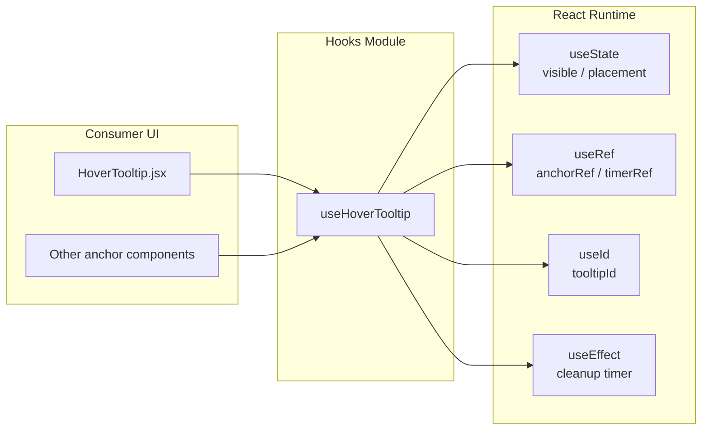
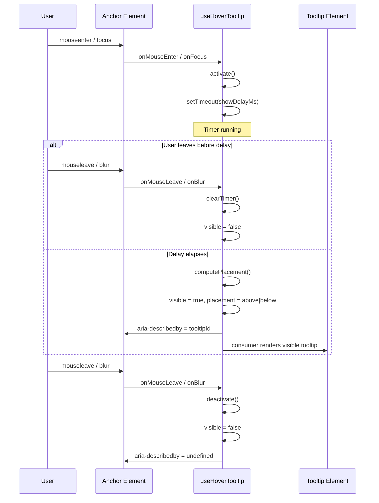
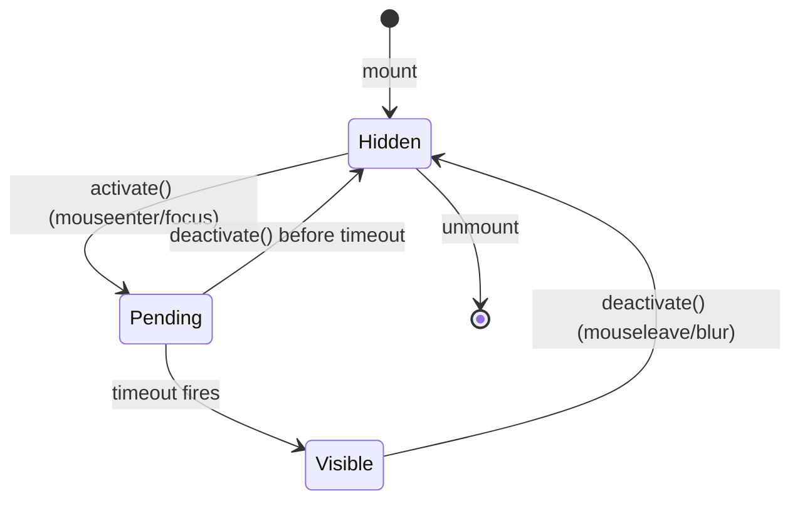
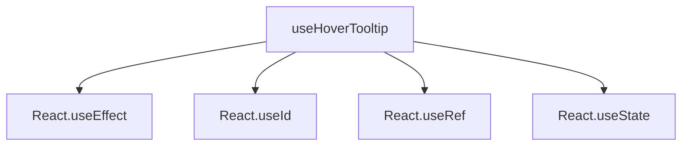
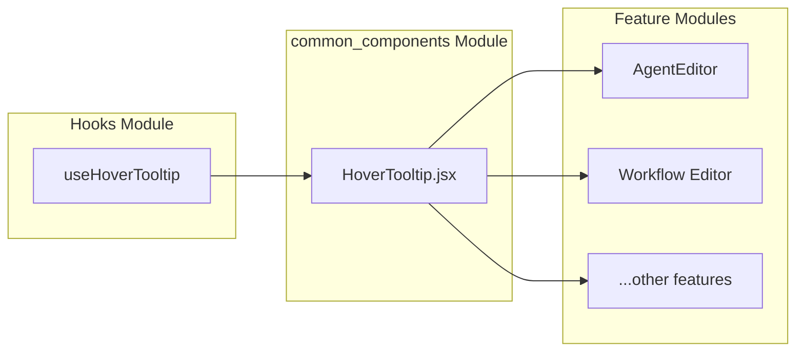

# Hooks Module

The **Hooks** module in the ABStudio frontend provides reusable React hooks that encapsulate shared UI behavior. Currently, it exposes a single hook, `useHoverTooltip`, which manages the visibility, placement, and accessibility attributes for hover-activated and focus-activated tooltips.

This module is intentionally small and focused: it contains no UI markup, only stateful logic that can be composed with presentational components such as [`HoverTooltip`](common_components.md) and [`HoverTooltip.jsx`](common_components.md).

---

## Core Functionality

`useHoverTooltip` coordinates three concerns for a tooltip anchor element:

1. **Delayed activation** — Shows the tooltip only after the user hovers or focuses the anchor for a configurable delay (default `450 ms`).
2. **Smart placement** — Computes whether the tooltip should render above or below the anchor based on the anchor's viewport position and an estimated tooltip height.
3. **Accessibility wiring** — Attaches `aria-describedby` to the anchor when the tooltip is visible, and supports both mouse and keyboard focus events.

The hook returns an `anchorRef`, `tooltipId`, `visible`/`placement` state, and a ready-to-spread `anchorProps` object so consumers can attach the required event handlers and ARIA attributes with minimal boilerplate.

---

## Architecture



### Component Relationships

| Symbol | Role |
|--------|------|
| `useHoverTooltip` | Default-exported React hook that owns tooltip visibility logic. |
| `activate` | Internal helper that starts the show-delay timer and computes placement when firing. |
| `deactivate` | Internal helper that cancels the timer and hides the tooltip. |
| `computePlacement` | Internal helper that decides `'above'` vs `'below'` from the anchor's `getBoundingClientRect()`. |
| `onFocus` / `onBlur` | Internal event handlers that ignore focus transitions inside the same anchor subtree. |
| `anchorProps` | Object returned to consumers containing `ref`, mouse/focus handlers, and `aria-describedby`. |

---

## Data Flow



### State Transitions



---

## API Reference

### `useHoverTooltip(options?)`

```javascript
const {
  anchorRef,
  tooltipId,
  visible,
  placement,
  anchorProps,
} = useHoverTooltip({
  enabled: true,
  showDelayMs: 450,
  estimatedHeight: 130,
});
```

#### Options

| Option | Type | Default | Description |
|--------|------|---------|-------------|
| `enabled` | `boolean` | `true` | If `false`, the tooltip never activates. |
| `showDelayMs` | `number` | `450` | Milliseconds to wait before showing the tooltip. |
| `estimatedHeight` | `number` | `130` | Estimated tooltip height used to decide `'above'` vs `'below'`. |

#### Returns

| Property | Type | Description |
|----------|------|-------------|
| `anchorRef` | `React.RefObject` | Ref to attach to the anchor element. |
| `tooltipId` | `string` | Stable unique id for the tooltip element (from `useId`). |
| `visible` | `boolean` | Whether the tooltip should currently be rendered. |
| `placement` | `'above' \| 'below'` | Suggested placement relative to the anchor. |
| `anchorProps` | `object` | `{ ref, onMouseEnter, onMouseLeave, onFocus, onBlur, 'aria-describedby' }` |

---

## Process Flows

### Showing a Tooltip

1. The user hovers over or focuses the anchor element.
2. `onMouseEnter` or `onFocus` calls `activate()`.
3. `activate()` checks `enabled`, clears any existing timer, and starts a new `setTimeout` for `showDelayMs`.
4. When the timer fires, `computePlacement()` reads `anchorRef.current.getBoundingClientRect()` and compares `rect.top` to `estimatedHeight`.
5. `setPlacement()` and `setVisible(true)` are called.
6. `anchorProps['aria-describedby']` is set to `tooltipId`, linking the anchor to the tooltip for screen readers.

### Hiding a Tooltip

1. The user moves the mouse away or blurs the anchor.
2. `onMouseLeave` or `onBlur` calls `deactivate()`.
3. `deactivate()` clears the pending timer and sets `visible` to `false`.
4. `aria-describedby` is removed until the tooltip becomes visible again.

### Focus Containment Handling

`onFocus` and `onBlur` use `e.currentTarget.contains(e.relatedTarget)` to detect when focus moves between elements inside the same anchor subtree. In that case, the tooltip remains active, preventing flicker when the user tabs through nested controls.

---

## Dependencies

The Hooks module has no internal file dependencies. It relies only on standard React primitives:

- `useEffect`
- `useId`
- `useRef`
- `useState`



---

## Integration with the Rest of the System

`useHoverTooltip` is designed to be consumed by presentational components in the frontend. The most direct consumer is the [`HoverTooltip`](common_components.md) component in the `common_components` module, which combines this hook with tooltip rendering markup.

Other components that need a simple hover/focus explanation can also import `useHoverTooltip` directly and wire `anchorProps` to any focusable or hoverable element.



For details on the tooltip UI itself, see [`common_components.md`](common_components.md).

---

## Notes for Maintainers

- The hook is self-contained and has no side effects beyond the internal timer.
- Cleanup is handled in a `useEffect` return callback so the timer is cleared on unmount.
- Placement logic is viewport-relative and does not account for horizontal overflow; consumers may need additional positioning logic for edge cases.
- Because the module currently contains only one hook, expanding it with additional reusable hooks (e.g., `useClickOutside`, `useDebounce`) should follow the same pattern: pure logic, no markup, and clear return contracts.
