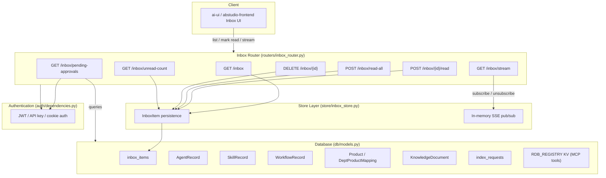
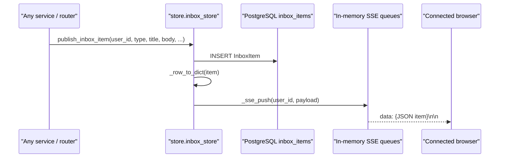
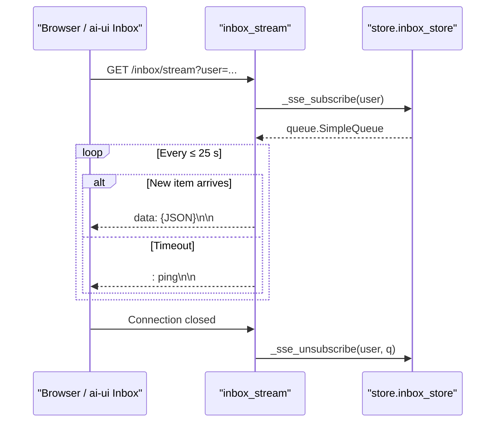
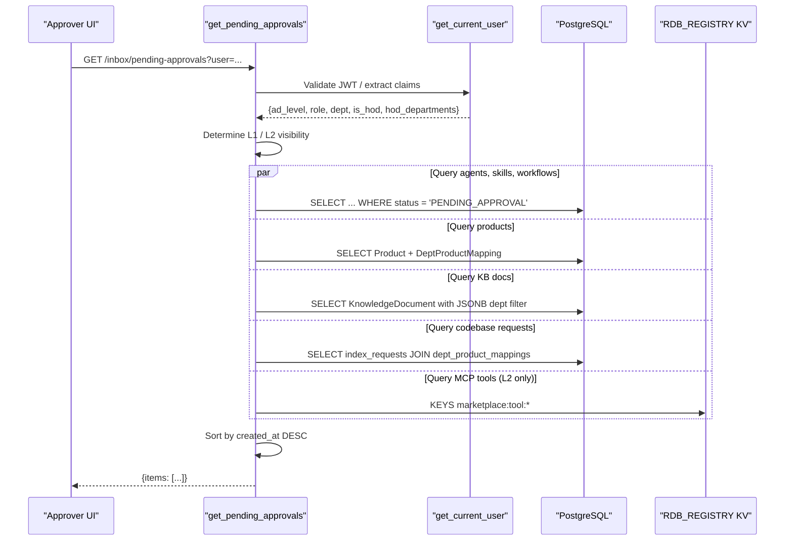

# Inbox Router

The `inbox_router` module exposes the `/inbox` API surface for user notifications and governance approvals. It combines a persisted notification store, a real-time Server-Sent Events (SSE) stream, and a live aggregation endpoint that surfaces pending approvals from across the platform (agents, skills, workflows, products, knowledge-base documents, codebase index requests, and MCP tools).

---

## 1. Purpose & Core Functionality

The router serves three primary responsibilities:

1. **Notification Inbox** — CRUD-style operations for user-specific inbox items stored in PostgreSQL (`inbox_items` table).
2. **Real-Time Delivery** — An SSE endpoint (`/inbox/stream`) that pushes new notifications to connected clients as they are published.
3. **Pending Approvals Aggregation** — A single endpoint (`/inbox/pending-approvals`) that queries multiple entity tables for items awaiting approval and returns them in a uniform inbox-compatible format, scoped by the caller's role and department.

This module is part of the shared API router layer. It depends on the [store layer](store_layer.md) for persistence and pub/sub, the [authentication module](authentication.md) for identity and authorization, and the [database models](database.md) for the entity records it aggregates.

---

## 2. Architecture



---

## 3. Component Reference

### 3.1 Notification Inbox Endpoints

| Endpoint | Handler | Purpose |
|----------|---------|---------|
| `GET /inbox` | `get_inbox` | Returns the user's inbox items plus unread count, optionally filtered by `type`. |
| `POST /inbox/{item_id}/read` | `mark_item_read` | Marks a single inbox item as read. Returns `404` if the item does not exist. |
| `POST /inbox/read-all` | `mark_all_read` | Marks all unread items for the user as read. |
| `DELETE /inbox/{item_id}` | `delete_item` | Deletes an item scoped to the requesting user. |
| `GET /inbox/unread-count` | `get_unread_count` | Returns the unread item count for the user. |

These endpoints delegate directly to [`store.inbox_store`](store_layer.md). The store handles SQLAlchemy sessions, row-to-dict mapping, and optimistic error handling.

### 3.2 Real-Time Stream

| Endpoint | Handler | Purpose |
|----------|---------|---------|
| `GET /inbox/stream` | `inbox_stream` | SSE endpoint that streams new notifications to the browser. |

The stream uses an in-memory queue registry (`_sse_subscribers`) maintained by [`store.inbox_store`](store_layer.md). When [`publish_inbox_item()`](store_layer.md) is called, the new item is persisted and simultaneously pushed to all active queues for the target user. The generator sends a heartbeat (`: ping`) every 25 seconds to keep proxies and load balancers from closing idle connections.

### 3.3 Pending Approvals Aggregation

| Endpoint | Handler | Purpose |
|----------|---------|---------|
| `GET /inbox/pending-approvals` | `get_pending_approvals` | Live query across entity tables for items in a pending-approval state. |

This endpoint is the most complex in the module. It:

1. **Authorizes the caller** using the JWT payload from [`get_current_user`](authentication.md). Only the following roles may receive results:
   - L1 approvers: `ad_level <= 3`, `role == "admin"`, or `is_hod == true`.
   - L2 approvers: department is in `IS_TEAM_DEPARTMENTS` (default `IS,AppSec,InfoSec`) or `role == "admin"`.
2. **Scopes results by department**:
   - Admins see all departments.
   - HODs see departments listed in `hod_departments`.
   - Other approvers see their own department plus platform-wide (`NULL` department) records.
3. **Queries and normalizes records** from:
   - `AgentRecord` (status `PENDING_APPROVAL`)
   - `SkillRecord` (status `PENDING_APPROVAL`)
   - `WorkflowRecord` (status `PENDING_APPROVAL`)
   - `Product` (status `PENDING_APPROVAL`, active)
   - `KnowledgeDocument` (status `PENDING_APPROVAL`, scoped by `department_ids` JSONB)
   - `index_requests` table (status `pending`, scoped via `dept_product_mappings`)
   - RDB_REGISTRY KV store for MCP tools in `PENDING_L2` state (IS team only)

Each result is shaped as an inbox-compatible object with a synthetic `id` prefixed by `live-`, a `type` such as `governance_approval` or `product_approval`, and a `metadata` block that the UI can use to route the user to the correct approval flow.

### 3.4 Helper Functions

| Function | Purpose |
|----------|---------|
| `_resolve_email(db, user_id)` | Resolves a user ID to an email address via the `User` table. Returns an empty string on failure. |
| `_build_approval_body(db, entity_label, record)` | Builds a Markdown-rich body for governance approval items, including submitter, sent-to target (HOD for private, Admin for public), and description. |

---

## 4. Data Flows

### 4.1 Publishing a Notification



### 4.2 Consuming the Inbox Stream



### 4.3 Fetching Pending Approvals



---

## 5. Security & Access Control

- All endpoints except the SSE stream accept a `user` query parameter for scoping, but the **authoritative identity** for approvals comes from the JWT via [`get_current_user`](authentication.md).
- The `ad_level`, `role`, `department`, `is_hod`, and `hod_departments` claims drive row-level scoping.
- Admins bypass department filters.
- HODs see artifacts for the departments they head, even if their `ad_level` is greater than 3.
- L2 IS/Security reviewers see MCP tools in `PENDING_L2` state.
- Each entity query is wrapped in a `try/except` block so a failure in one domain does not break the entire approvals list.

---

## 6. Integration with the Rest of the System

| Related Module | Relationship |
|----------------|--------------|
| [store_layer](store_layer.md) | Provides `InboxItem` persistence and the SSE pub/sub registry. |
| [authentication](authentication.md) | Supplies `get_current_user` for JWT/API-key/cookie validation and claims extraction. |
| [database](database.md) | Defines `InboxItem`, `User`, `DepartmentHodMapping`, `AgentRecord`, `SkillRecord`, `WorkflowRecord`, `Product`, `DeptProductMapping`, `KnowledgeDocument`, and `index_requests`. |
| [governance_router](governance_router.md) | Owns the actual approve/reject/withdraw actions for governance entities surfaced by `get_pending_approvals`. |
| [index_router](index_router.md) | Owns codebase index request submission and approval; `get_pending_approvals` surfaces pending requests. |
| [marketplace_router](marketplace_router.md) / [mcp_governance_router](mcp_governance_router.md) | Own MCP tool registration and L2 governance; `get_pending_approvals` surfaces `PENDING_L2` tools. |
| [products_router](products_router.md) | Owns product creation and approval; surfaced in pending approvals. |
| [docs_router](docs_router.md) | Owns knowledge document upload and approval; surfaced in pending approvals. |
| [ai_ui_frontend](ai_ui_frontend.md) | The `Inbox.jsx` component consumes these endpoints and renders approval previews. |

---

## 7. Deployment & Operational Notes

- The SSE registry is **in-memory and process-local**. In a multi-process deployment, clients connected to one worker will not receive pushes generated on another worker. For horizontal scale, a Redis-backed pub/sub or external message bus would be required.
- The 25-second heartbeat is chosen to keep connections alive through common proxy and load-balancer idle timeouts.
- `get_pending_approvals` performs multiple sequential SQL queries plus a KV scan. It is suitable for dashboard use but should be monitored for latency as the number of pending entities grows.
- Each pending-approval domain is queried independently and failures are logged at `WARNING` level without failing the request.

---

## 8. File Location

```text
routers/inbox_router.py
```
