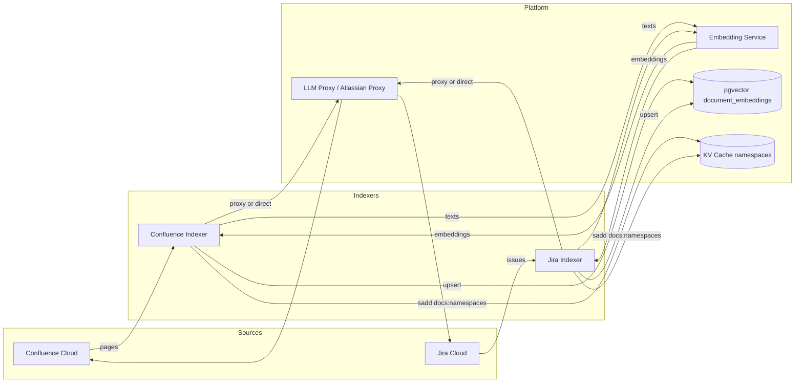
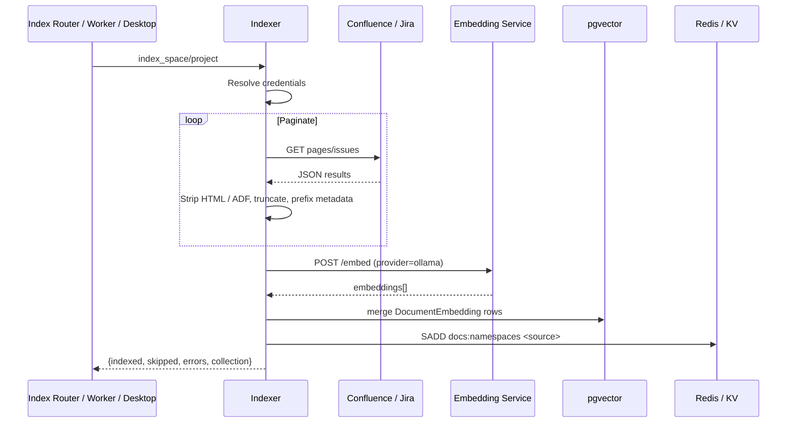

# Indexers Module

The **Indexers** module is responsible for pulling content from external knowledge sources and making it searchable inside the platform's retrieval-augmented generation (RAG) pipeline. It currently supports two Atlassian products:

- **Confluence** – indexes all pages from a Confluence space.
- **Jira** – indexes issues from a Jira project.

Indexed content is converted into vector embeddings and stored in `pgvector` (`document_embeddings`), where it can be retrieved by chat, agents, workflows, and the knowledge-base search tools.

---

## Purpose

Enterprise knowledge is often spread across Confluence wikis and Jira backlogs. The indexers bridge those systems with the platform by:

1. Authenticating to the external system (user-stored tokens for Jira, service-account credentials for Confluence).
2. Paginating through pages or issues.
3. Extracting and normalizing plain text from HTML, ADF, or wiki markup.
4. Calling the embedding service to generate dense vector representations.
5. Upserting the resulting vectors, metadata, and content hashes into `pgvector`.
6. Registering the new namespace in the KV cache so that downstream search can discover it.

Once indexed, the content behaves like any other document in the knowledge base and can be queried through the shared KB search infrastructure.

---

## Architecture Overview

### Key Design Points

- **Dual transport mode**: In production, Atlassian Cloud is reached through the `llm_proxy` `/atlassian/proxy` endpoint because the application hosts cannot reach the public internet directly. In local development, the indexers call Confluence/Jira directly.
- **Correlation propagation**: When using the proxy, the indexers forward `request_id` and `chat_id` from the current thread-local logging context so that every external API call remains traceable.
- **Embedding via service**: Vector generation is delegated to the embedding service (`EMBED_SVC_URL`), keeping the indexer lightweight and provider-agnostic.
- **Deduplication**: Each row is keyed with a deterministic UUID (UUID5 over a stable source identifier) and a SHA-256 content hash, so repeated runs can safely merge updates.
- **Namespace registration**: After a successful upsert, the indexer adds `confluence_<space>` or `jira_<project>` to the `docs:namespaces` set in the KV cache, which the KB search layer uses to enumerate available sources.

---

## Sub-modules

| Sub-module | File | Responsibility | Documentation |
|------------|------|----------------|---------------|
| Confluence Indexer | `indexers/confluence_indexer.py` | Fetches all pages from a Confluence space, normalizes HTML body text, embeds, and stores them under `docs_kb:confluence_<space>`. | [indexers_confluence.md](indexers_confluence.md) |
| Jira Indexer | `indexers/jira_indexer.py` | Fetches issues from a Jira project, extracts ADF/plain-text descriptions, embeds, and stores them under `docs_kb:jira_<project>`. | [indexers_jira.md](indexers_jira.md) |

---

## Data Flow

---

## Integration with the Rest of the System

The indexers are not exposed directly as HTTP endpoints. They are invoked by higher-level modules:

- **[index_router.md](index_router.md)** – Accepts repository index requests and can trigger the Jira/Confluence indexers for connected sources.
- **[workers/index_worker.md](index_worker.md)** – Background worker that runs `index_repo_job` and mirrors code nodes to the knowledge graph; it also coordinates external source indexing.
- **[desktop_router.md](desktop_router.md)** – Desktop client can request batch indexing of local files and may also trigger connector-based source indexing.
- **[gateway.md](gateway.md)** – The gateway exposes `index_submit` and `index_status`, which ultimately flow into the indexing pipeline.
- **[shared_core_knowledge_base.md](shared_core_knowledge_base.md)** – Stores and searches the resulting `DocumentEmbedding` rows.

---

## Security & Credentials

- **Confluence** uses environment-level service credentials:
  - `CONFLUENCE_URL`
  - `CONFLUENCE_EMAIL`
  - `CONFLUENCE_API_TOKEN`
  - `CONFLUENCE_SPACE_KEY` (fallback when no space key is passed)
- **Jira** uses the calling user's stored Atlassian token, resolved through `core.platform_credentials.get_atlassian_creds`. Service-account credentials are intentionally not used.
- Both indexers support routing through the `LLM_PROXY_URL` `/atlassian/proxy` endpoint in production to avoid exposing Atlassian credentials to application hosts and to centralize outbound traffic.

---

## Error Handling & Observability

- Each indexer returns a consistent result dictionary: `{indexed, skipped, errors, collection, error?}`.
- Missing configuration or credentials is treated as a fatal error with a descriptive message and zero counts.
- Individual page/issue processing failures are logged but do not stop the batch; they increment the `errors` counter.
- Embedding service failures and `pgvector` insert failures are logged and cause the affected batch to be counted as errors.
- All significant events are emitted through `core.logger` with a `ConfluenceIndexer:` or `JiraIndexer:` prefix.

---

## Configuration Reference

| Variable | Used By | Purpose |
|----------|---------|---------|
| `CONFLUENCE_URL` | Confluence | Base URL of the Confluence instance. |
| `CONFLUENCE_EMAIL` | Confluence | Service account email. |
| `CONFLUENCE_API_TOKEN` | Confluence | Service account API token. |
| `CONFLUENCE_SPACE_KEY` | Confluence | Default space to index. |
| `JIRA_URL` | Jira | Base URL of the Jira instance. |
| `LLM_PROXY_URL` | Both | Optional proxy for outbound Atlassian API calls. |
| `EMBED_SVC_URL` | Both | URL of the embedding service (default `http://localhost:8001`). |
| `HTTPS_PROXY` / `FORWARD_PROXY_URL` | Jira direct mode | Optional forward proxy for direct Jira calls. |
