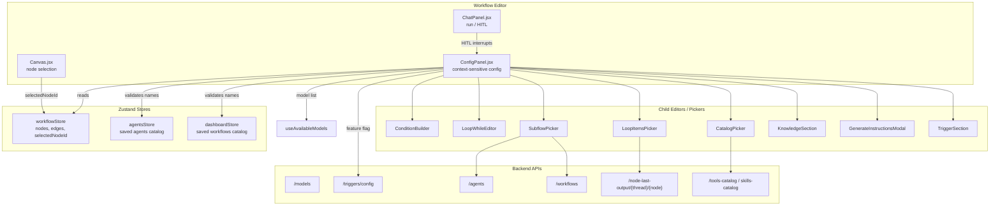
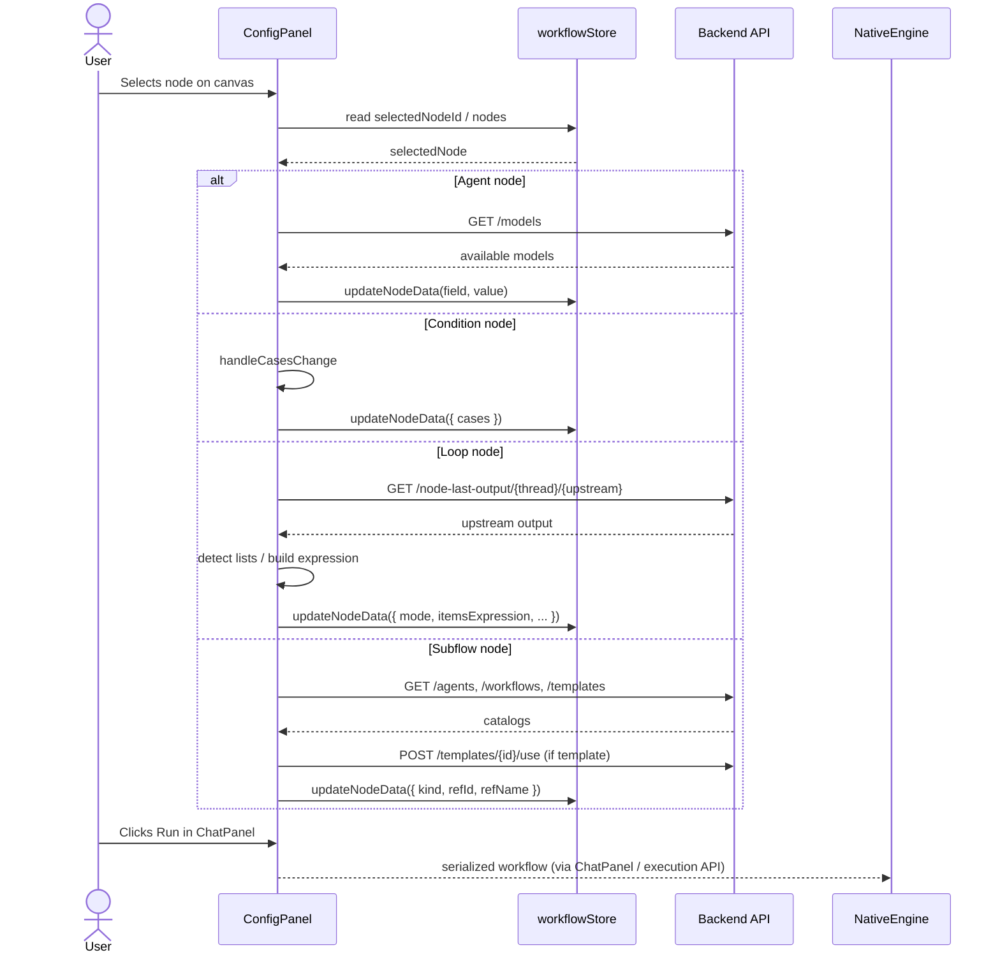
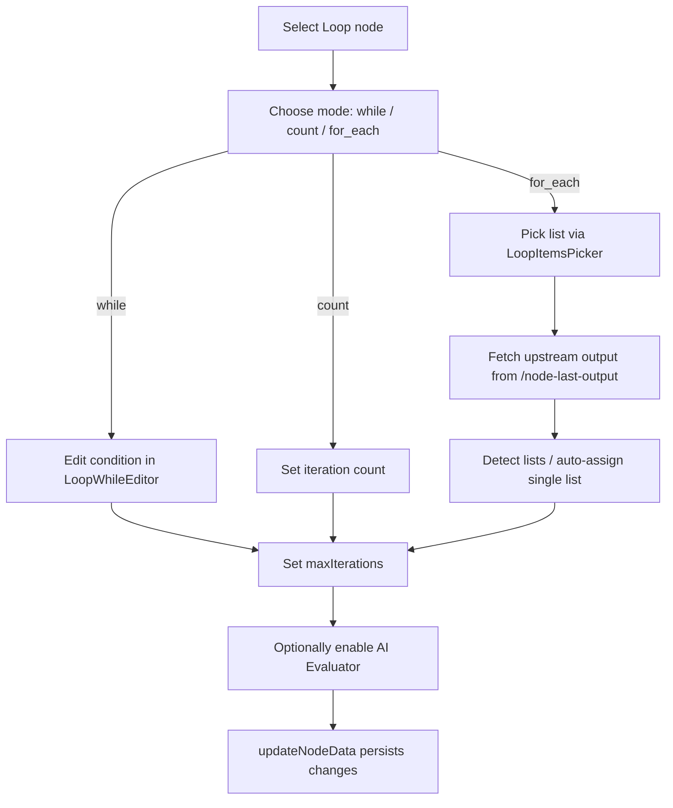

# ConfigPanel

The **ConfigPanel** is the right-hand configuration sidebar of the ABStudio workflow editor. It renders a context-sensitive form for whichever canvas node is currently selected, letting users edit node data without leaving the visual workflow canvas. It supports all workflow node types defined in [`workflowStore`](../workflowStore.md): `start`, `end`, `agent`, `condition`, `subflow`, and `loop`.

When no node is selected, the panel shows an empty state. When a node is selected, it loads the node from the workflow store and presents the appropriate editor: agent configuration, condition routing rules, loop iteration and evaluator settings, or subflow asset linking.

---

## Architecture



---

## Component Responsibilities

### `ConfigPanel`

The default-exported React component. It:

1. Subscribes to `selectedNodeId`, `nodes`, `edges`, `workflowId`, `workflowKnowledge`, and `activeThreadId` from [`workflowStore`](../workflowStore.md).
2. Bootstraps the saved agents and workflows catalogs (via [`agentsStore`](../agentsStore.md) and [`dashboardStore`](../dashboardStore.md)) so the in-canvas agent name validator can enforce global uniqueness.
3. Fetches the `ABSTUDIO_AGENT_TRIGGERS_ENABLED` feature flag from `/triggers/config`.
4. Uses [`useAvailableModels`](../useAvailableModels.md) to populate model dropdowns and auto-configure provider / max-tokens defaults.
5. Renders one of five configuration UIs based on `selectedNode.type`.

### `handleChange(field, value)`

Thin wrapper around `workflowStore.updateNodeData(selectedNodeId, { [field]: value })`. All form controls in the panel use this to mutate node data immutably.

### `handleDeleteClick`, `handleDeleteConfirm`, `handleDeleteCancel`

Manage the delete confirmation modal. On confirm, `workflowStore.removeNode(selectedNodeId)` is called and the modal closes.

### `acceptGeneratedInstructions(text)`

Callback passed to [`GenerateInstructionsModal`](../GenerateInstructionsModal.md). Writes the AI-generated instructions into the selected agent node.

### `buildModelOptionGroups(fallbackId)` / `renderModelOptions(groups)`

Normalizes the backend model catalog into grouped `<optgroup>` options. Supports both the modern grouped-provider shape and the legacy flat model list. Used for the agent model dropdown and the loop judge model dropdown.

---

## Node-Type Specific Configuration

### Start / End Nodes

- No editable fields.
- End nodes can be deleted; start nodes cannot.
- Displays a "No configuration needed" empty state.

### Agent Nodes

Agent nodes expose the richest configuration surface:

| Section | Fields | Back-end / Runtime Effect |
|---------|--------|---------------------------|
| **Agent Name** | `name` | Must be unique across other workflow agent nodes, saved agents, and saved workflows. Validated with [`validateEntityName`](../validateName.md). |
| **Instructions** | `instructions` | System prompt for the agent. Can be AI-generated via [`GenerateInstructionsModal`](../GenerateInstructionsModal.md). |
| **Model** | `modelName`, `provider`, `apiKey`, `baseUrl` | Routed through the AiNxt gateway. Auto-caps `maxTokens` via [`getMaxTokensForModel`](../modelMaxTokens.md). |
| **Subagents (swarm)** | `enable_subagents`, `disable_subagents` | Per-node override of the run-level swarm toggle. Forces injection of `WorkflowSwarmTool` in [`native_engine`](../native_engine.md). |
| **Model Parameters** | `temperature`, `maxTokens`, `topP` | Standard LLM sampling controls. |
| **Catalog Tools & Skills** | `tools`, `skills` | Attached via [`CatalogPicker`](../CatalogPicker.md). |
| **Knowledge** | `knowledge` | RAG configuration via [`KnowledgeSection`](../KnowledgeSection.md); inherits workflow-level KB when node is `KB_MODE_NONE`. |
| **Human-in-the-Loop** | `hitlMode` | Emits `hitl_interrupt` SSE events consumed by [`ChatPanel`](../chat/ChatPanel.md). |
| **Triggers** | — | Conditionally rendered when `agentTriggersEnabled` is true and the workflow is saved. Uses [`TriggerSection`](../TriggerSection.md). |

### Condition Nodes

- Edits `data.cases` through [`ConditionBuilder`](../ConditionBuilder.md).
- Cases are evaluated top-to-bottom; the first match wins.
- Unmatched inputs fall through to the implicit `ELSE` branch.
- See [`ConditionBuilder`](../ConditionBuilder.md), [`ConditionCase`](../ConditionCase.md), and [`SingleCondition`](../SingleCondition.md) for the condition DSL.

### Subflow Nodes

- Links the canvas node to a saved agent or workflow via [`SubflowPicker`](../ui/SubflowPicker.md).
- Stores `kind`, `refId`, and `refName` on `node.data`.
- The previous node's output becomes the subflow input; the subflow's final response flows to the next node.
- Templates can be selected and are instantiated via `POST /agent-templates/{id}/use` or `POST /templates/{id}/use` before linking.

### Loop Nodes

Loop nodes support three modes:

| Mode | Stop Condition | UI Controls |
|------|----------------|-------------|
| `while` | A condition expression stays true | [`LoopWhileEditor`](../LoopWhileEditor.md) |
| `count` | Fixed number of iterations | Number input |
| `for_each` | Iterate over a list | [`LoopItemsPicker`](../ui/LoopItemsPicker.md) |

All modes share:

- `name` — optional display name for run timelines.
- `maxIterations` — hard safety ceiling.

`while` and `count` modes additionally support an optional **AI Evaluator** (LLM-as-judge):

- `useLlmEvaluator` — master toggle.
- `evaluatorModelName` — judge model.
- `stopMode` — `adaptive` (early exit on confidence / convergence / regression) or `fixed` (always run to max).
- `confidenceThreshold`, `similarityThreshold`, `regressionDelta` — adaptive stop signals.
- `evaluatorTask` — describes what the judge should score.
- `evaluatorRubric` — optional full prompt override.

The evaluator data is forwarded by `workflowStore.getWorkflowForExecution` and consumed by [`loop_evaluator`](../loop_evaluator.md) in the backend.

---

## Data Flow



---

## Model Selection Logic

A `useEffect` inside `ConfigPanel` keeps agent node model defaults in sync with the catalog while respecting explicit user choices:

1. If the user has already picked a model for this node (`userPickedModelNodesRef`), the effect is a no-op.
2. If the node already carries a non-blank, non-legacy-default model, it is preserved even if the catalog has not yet loaded it.
3. Otherwise the node is seeded with `defaultModel`, `backendProvider`, and the model's max token cap.

This prevents the previous bug where a catalog refresh would snap every agent node back to the default model.

---

## Dependencies

### Zustand Stores

- [`workflowStore`](../workflowStore.md) — selected node, node list, edges, workflow id, knowledge, active thread.
- [`agentsStore`](../agentsStore.md) — saved agents catalog for name uniqueness checks.
- [`dashboardStore`](../dashboardStore.md) — saved workflows catalog for name uniqueness checks.

### Child Components

- [`ConditionBuilder`](../ConditionBuilder.md) / [`LoopWhileEditor`](../LoopWhileEditor.md) — condition DSL editors.
- [`SubflowPicker`](../ui/SubflowPicker.md) — saved agent / workflow / template linker.
- [`LoopItemsPicker`](../ui/LoopItemsPicker.md) — upstream list detector for `for_each` loops.
- [`CatalogPicker`](../CatalogPicker.md) — tools and skills attachment.
- [`KnowledgeSection`](../KnowledgeSection.md) — RAG / KB attachment.
- [`GenerateInstructionsModal`](../GenerateInstructionsModal.md) — AI-generated instructions.
- [`TriggerSection`](../TriggerSection.md) — per-node trigger configuration.

### Hooks & Utilities

- [`useAvailableModels`](../useAvailableModels.md) — model catalog with loading / error states.
- [`useCurrentUser`](../useCurrentUser.md) — department and approval role for KB uploads.
- [`validateEntityName`](../validateName.md) — global name uniqueness validation.
- [`stripProviderPrefix`](../modelLabel.md) — human-readable model labels.
- [`getMaxTokensForModel`](../modelMaxTokens.md) — per-model token cap.
- [`getUpstreamNodeId`](../loopPicker.md) — derives the node wired into a loop.

### Backend Counterparts

- [`native_engine`](../native_engine.md) — executes agent, subflow, condition, and loop nodes.
- [`loop_evaluator`](../loop_evaluator.md) — optional LLM-as-judge for loops.
- [`workflow_factory`](../workflows/workflow_factory_pipeline.md) / [`agent_factory`](../agents/agent_factory_pipeline.md) — generate instructions and templates.

---

## Process Flows

### Deleting a Node

```mermaid
flowchart LR
    A[User clicks trash icon] --> B[setShowDeleteModal(true)]
    B --> C{Confirm?}
    C -->|Cancel| D[setShowDeleteModal(false)]
    C -->|Confirm| E[removeNode(selectedNodeId)]
    E --> F[Modal closes]
```

### Generating Instructions

```mermaid
flowchart LR
    A[User clicks Generate] --> B[setShowGenerateModal(true)]
    B --> C[GenerateInstructionsModal opens]
    C --> D[User accepts generated text]
    D --> E[acceptGeneratedInstructions(text)]
    E --> F[updateNodeData(selectedNodeId, { instructions: text })]
```

### Configuring a Loop



---

## Notes for Maintainers

- The panel intentionally avoids prop-drilling by reading directly from Zustand stores. This keeps `Canvas.jsx` and `EditorShell` thin.
- The `loopUpstreamId` selector uses `getUpstreamNodeId(state.edges, selectedNodeId)` so the loop editor re-renders only when the wiring into the loop changes, not on every edge edit.
- Triggers are hidden until the workflow has a persisted backend id (`workflowId.startsWith('workflow-')`). Creating a trigger against a temporary session id would fail server-side.
- The agent name validator enforces uniqueness across three namespaces: in-workflow agent nodes, saved agents, and saved workflows. Keep these namespaces in sync with the backend's entity resolution to avoid shadowing bugs.
- The `enable_subagents` / `disable_subagents` flags are intentionally tri-state: explicit ON, explicit OFF, or inherit from the run-level toggle. Do not collapse them into a single boolean without updating [`native_engine`](../native_engine.md).
