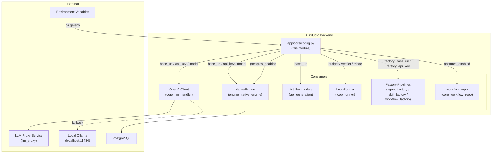
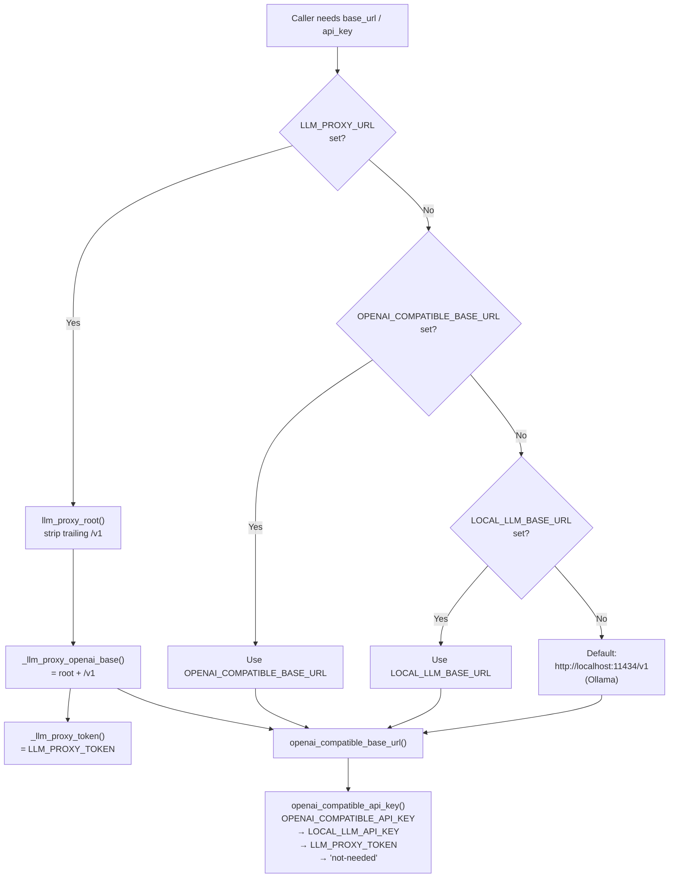
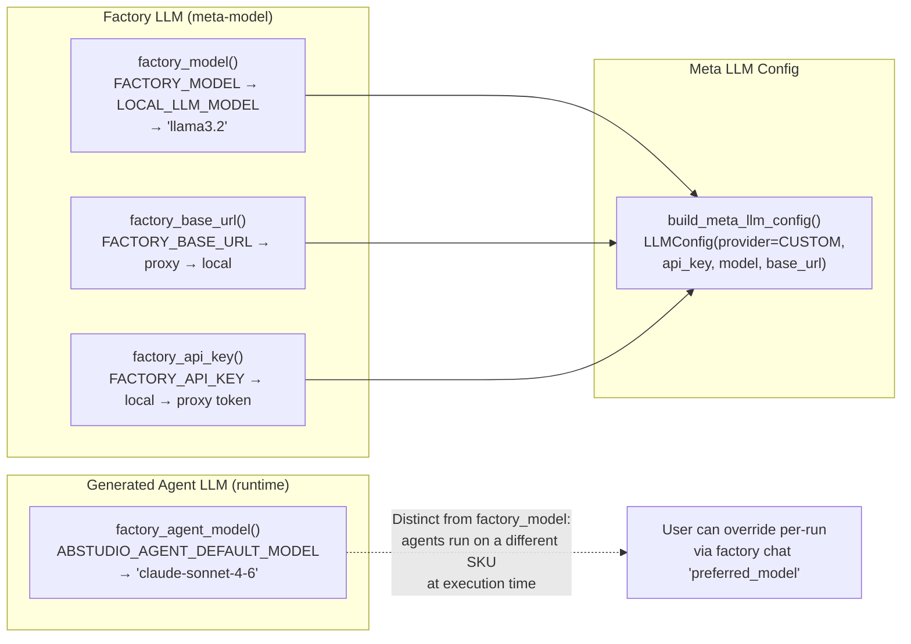
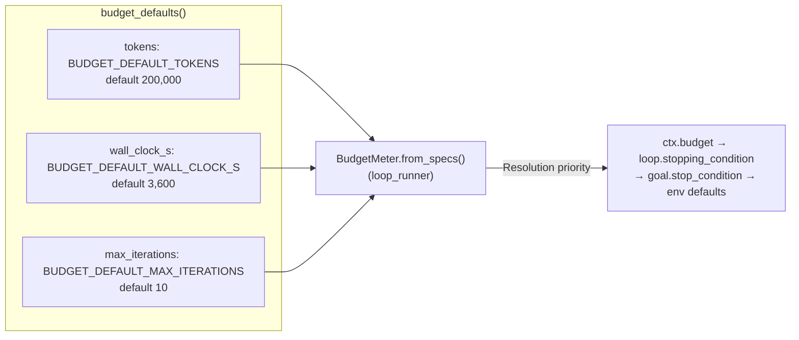
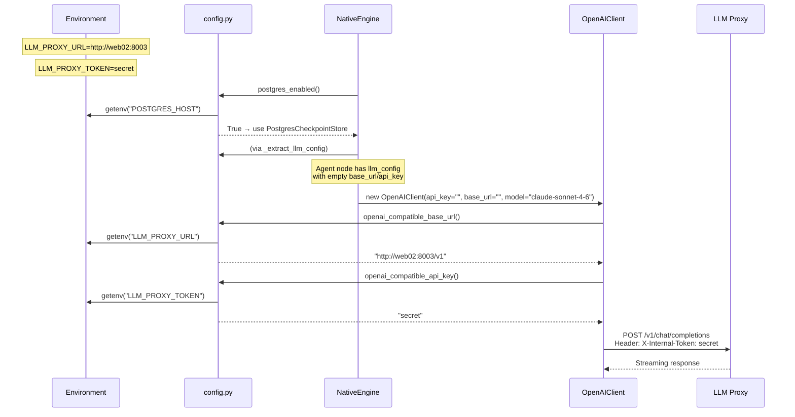
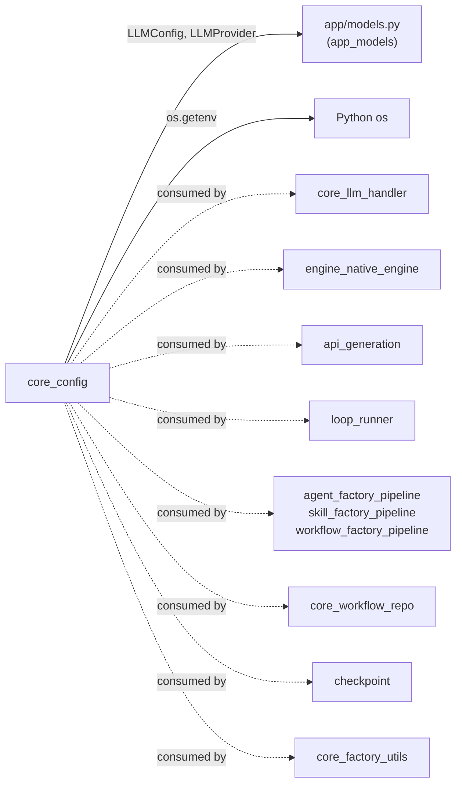

# core_config — Centralised Environment & LLM Configuration

## 1. Introduction

The `core_config` module (`ABStudio/backend/app/core/config.py`) is the **single source of truth** for all environment-driven configuration in the ABStudio backend. It centralises:

- **LLM endpoint resolution** — the cascading logic that picks the correct OpenAI-compatible base URL, API key, and model name for runtime inference, factory pipelines, and meta-LLM calls.
- **Feature-flag parsing** — a reusable `env_flag()` helper consumed across the codebase.
- **Persistence gating** — `postgres_enabled()` / `agentchain_postgres_uri()` that every "Postgres-vs-file" call site checks.
- **Document-injection tunables** — size-aware thresholds controlling how uploaded documents are injected into agent prompts.
- **Loop Engineering tunables** — budget caps, verifier settings, triage/reflection/memory knobs spanning Phases P1–P5 of the Loop Engineering roadmap.

By funnelling every `os.getenv` lookup through typed helper functions, the module ensures consistent fallback chains, safe defaults, and a single audit surface for configuration changes.

---

## 2. Architecture Overview

### 2.1 Module Position in the System

### 2.2 LLM Endpoint Resolution Cascade

The most critical responsibility of this module is resolving which LLM endpoint the backend should call. The resolution follows a strict priority cascade:

> **Key invariant:** When `LLM_PROXY_URL` is set, it **must win** over all local fallbacks. Otherwise the Agent Configuration picker shows proxy-backed models that the orchestrator has no way to invoke — a known SIT failure mode.

### 2.3 Factory vs. Runtime Model Distinction

---

## 3. Component Reference

### 3.1 Feature-Flag & Utility Helpers

| Function | Env Var(s) | Default | Description |
|---|---|---|---|
| `env_flag(name, default)` | *(any)* | `False` | Parses boolean env vars (`1`/`true`/`yes`/`on`, case-insensitive). The canonical feature-flag parser used across the backend. |
| `llm_proxy_root()` | `LLM_PROXY_URL` | `""` | Returns the platform LLM proxy root URL (no `/v1` suffix). Strips a trailing `/v1` if an operator pasted the full OpenAI-compatible surface. |
| `_llm_proxy_openai_base()` | `LLM_PROXY_URL` | `""` | Returns `{llm_proxy_root}/v1` when the proxy is configured, else `""`. |
| `_llm_proxy_token()` | `LLM_PROXY_TOKEN` | `""` | Returns the proxy auth token. |

### 3.2 OpenAI-Compatible Endpoint Resolution

| Function | Priority Chain | Default |
|---|---|---|
| `openai_compatible_base_url()` | `_llm_proxy_openai_base()` → `OPENAI_COMPATIBLE_BASE_URL` → `LOCAL_LLM_BASE_URL` | `http://localhost:11434/v1` |
| `openai_compatible_api_key()` | `OPENAI_COMPATIBLE_API_KEY` → `LOCAL_LLM_API_KEY` → `_llm_proxy_token()` | `"not-needed"` |

**Consumed by:** [`core_llm_handler`](../models/core_llm_handler.md) (`OpenAIClient.__init__` falls back to these helpers when the caller doesn't pass an explicit `base_url`/`api_key`), [`api_generation`](../api/api_generation.md) (`list_llm_models` probes the proxy's `/v1/models` endpoint).

### 3.3 Factory LLM Helpers

| Function | Env Var(s) | Default | Purpose |
|---|---|---|---|
| `factory_base_url()` | `FACTORY_BASE_URL` → proxy → `LOCAL_LLM_BASE_URL` | `http://localhost:11434/v1` | Base URL for factory pipeline LLM calls (clarification, structure generation). |
| `factory_api_key()` | `FACTORY_API_KEY` → `LOCAL_LLM_API_KEY` → proxy token | `"not-needed"` | API key for factory LLM calls. |
| `factory_model()` | `FACTORY_MODEL` → `LOCAL_LLM_MODEL` | `"llama3.2"` | Meta-model that runs the factory itself. |
| `factory_agent_model()` | `ABSTUDIO_AGENT_DEFAULT_MODEL` | `"claude-sonnet-4-6"` | Default model baked into **generated** agent nodes. Deliberately distinct from `factory_model()` — agents created via "Create with AI" default to Claude Sonnet for strong instruction following. |
| `build_meta_llm_config(max_tokens, temperature)` | *(composes factory_* helpers)* | — | Builds a complete `LLMConfig` object for meta-LLM calls. |

**Consumed by:** [`agent_factory_pipeline`](../agents/agent_factory_pipeline.md), [`skill_factory_pipeline`](../agents/skill_factory_pipeline.md), [`workflow_factory_pipeline`](../workflows/workflow_factory_pipeline.md), [`loop_runner`](../reference/loop_runner.md) (`ReflectionWriter`, `VerifierAgent`).

### 3.4 Document Injection Tunables

These control how uploaded documents (attachments) are injected into agent prompts in the workflow engine — no RAG/KB, the already-extracted `parsed_text` is injected verbatim.

| Function | Env Var | Default | Behaviour |
|---|---|---|---|
| `doc_inline_threshold_chars()` | `ABSTUDIO_DOC_INLINE_THRESHOLD_CHARS` | `40000` | Boundary between "small" and "big" documents. ≤ threshold → injected into the **first agent only**; > threshold → injected into **every agent** so the document reaches every node. |
| `doc_agent_budget_chars()` | `ABSTUDIO_DOC_AGENT_BUDGET_CHARS` | `48000` | Hard per-agent clip on the injected document section. Guards the model context window; appends a truncation note when exceeded. |

**Consumed by:** [`engine_native_engine`](../reference/engine_native_engine.md) (`_build_documents_section` in `NativeEngine._run_agent`).

### 3.5 LLM Config Utility

#### `fill_blank_llm_fields(cfg, *, base_url, api_key, model_name)`

Populates `base_url` / `api_key` / `model_name` on a config dict **only when** the current value is missing or whitespace. Mutates and returns `cfg` for chaining. Empty-string is treated as unset (the engine's LLM dict commonly carries `""` for absent fields, not `None`).

### 3.6 Persistence Gating

| Function | Env Var | Default | Description |
|---|---|---|---|
| `postgres_enabled()` | `POSTGRES_HOST` | `False` | The single gate every "Postgres-vs-file" call site checks. ABStudio shares the platform's pool (`db.database.engine`), so it's backed by Postgres whenever `POSTGRES_HOST` is set. When unset, ABStudio degrades to in-memory/file stores. |
| `agentchain_postgres_uri()` | *(delegates to `postgres_enabled()`)* | `""` | **Deprecated** compatibility shim. Returns `"postgres"` when `postgres_enabled()` is true, else `""`. Retained so lingering `if agentchain_postgres_uri()` checks keep working; slated for removal. |

**Consumed by:** [`engine_native_engine`](../reference/engine_native_engine.md) (`NativeEngine.startup` picks `PostgresCheckpointStore` vs `FileCheckpointStore`), [`core_workflow_repo`](../reference/core_workflow_repo.md), [`checkpoint`](../reference/checkpoint.md) stores.

### 3.7 Loop Engineering Tunables (P1–P5)

These helpers were introduced across the Loop Engineering roadmap phases. Most are consumed from P2 onward (`BudgetMeter`, `VerifierAgent`) and P5 (`TriageSkill`, `ReflectionWriter`, `MemoryReadHandler`).

#### Budget Defaults (P2)

Used only on ad-hoc `/run-stream` goal-mode runs where the caller didn't supply explicit budget. Saved Loops always carry their own `stopping_condition` (validated at create time per FR-1.7).

#### Verifier Settings (P4)

| Function | Env Var | Default | Description |
|---|---|---|---|
| `verifier_model()` | `VERIFIER_MODEL` | Falls through to `factory_model()` | LLM model for the independent `VerifierAgent` pre-ship check. |
| `verifier_temperature()` | `VERIFIER_TEMPERATURE` | `0.2` | Low temperature for reproducible verdicts. |
| `verifier_max_tokens()` | `VERIFIER_MAX_TOKENS` | `4096` | Output cap on the verifier completion (fits the JSON verdict block with headroom). |
| `verifier_timeout_s()` | `VERIFIER_TIMEOUT_S` | `90` | Wall-clock cap for one verifier call. Timeout → `INCONCLUSIVE` → treated as FAIL. |
| `verifier_debug()` | `VERIFIER_DEBUG` | `False` | When `True`, surfaces the verifier's `raw_response` on the verdict API. Off by default so chain-of-thought never leaks. |

**Consumed by:** [`loop_runner`](../reference/loop_runner.md) (`VerifierAgent`, `_run_verifier_gate`).

#### Triage & Reflection (P5)

| Function | Env Var | Default | Description |
|---|---|---|---|
| `loop_triage_enabled()` | `LOOP_TRIAGE_ENABLED` | `True` | Master switch for `TriageSkill` cron rows. |
| `loop_reflection_inject_top_k()` | `LOOP_REFLECTION_INJECT_TOP_K` | `3` | Top-K reflections injected into next run's prompt. |
| `loop_reflection_max_chars()` | `LOOP_REFLECTION_MAX_CHARS` | `1500` | Cap on the injected reflection prompt section. |
| `loop_degradation_inbox_enabled()` | `LOOP_DEGRADATION_INBOX_ENABLED` | `True` | Route non-shipped outcomes to inbox. |
| `triage_interval_cron()` | `TRIAGE_INTERVAL_CRON` | `*/30 * * * *` | APScheduler cron expression for TriageSkill firing (every 30 min, IST). |
| `triage_max_inbox_items()` | `TRIAGE_MAX_INBOX_ITEMS` | `50` | Hard cap on inbox items per TriageSkill run (SRS ceiling: 200). |
| `triage_model()` | `TRIAGE_MODEL` | `None` (falls through to `factory_model()`) | LLM model for the TriageSkill summariser. |
| `triage_include_log_alerts()` | `TRIAGE_INCLUDE_LOG_ALERTS` | `False` | Whether to scan platform log alerts as part of the triage inbox. |
| `reflection_top_n()` | `REFLECTION_TOP_N` | `5` | Top-N most recent reflections fetched by `MemoryReadHandler`. |
| `reflection_max_tokens()` | `REFLECTION_MAX_TOKENS` | `256` | Cap on the LLM's reflection-derivation completion (keeps each call cheap). |
| `memory_inject_max_tokens()` | `MEMORY_INJECT_MAX_TOKENS` | `1200` | Approximate character budget (≈4 chars/token) for the lesson + digest payload injected into the maker prompt. |

**Consumed by:** [`loop_runner`](../reference/loop_runner.md) (`MemoryReadHandler`, `ReflectionWriter`, `TriageSkill`), [`engine_native_engine`](../reference/engine_native_engine.md) (P5 palette nodes: `memory_read`, `memory_write`, `reflection_writer`, `triage`).

---

## 4. Data Flow: How Configuration Reaches the Runtime

---

## 5. Dependency Map

### Internal Dependencies

The module imports from:
- **`app.models`** ([`app_models`](../models/app_models.md)) — `LLMConfig` and `LLMProvider` types used by `build_meta_llm_config()`.
- **`os`** and **`typing.Optional`** — standard library only; no third-party dependencies.

### Downstream Consumers

| Consumer Module | Functions Used | Purpose |
|---|---|---|
| [`core_llm_handler`](../models/core_llm_handler.md) | `openai_compatible_base_url()`, `openai_compatible_api_key()` | Fallback resolution when `OpenAIClient` caller doesn't pass explicit endpoint config. |
| [`engine_native_engine`](../reference/engine_native_engine.md) | `postgres_enabled()`, `doc_inline_threshold_chars()`, `doc_agent_budget_chars()`, `verifier_timeout_s()`, loop P5 helpers | Persistence backend selection, document injection, loop verifier timeout, P5 palette node execution. |
| [`api_generation`](../api/api_generation.md) | `openai_compatible_base_url()` | Model catalogue discovery via proxy `/v1/models` probe. |
| [`loop_runner`](../reference/loop_runner.md) | `budget_defaults()`, `verifier_model()`, `verifier_temperature()`, `verifier_max_tokens()`, `verifier_timeout_s()`, `verifier_debug()`, `loop_triage_enabled()`, `loop_reflection_inject_top_k()`, `loop_reflection_max_chars()`, `loop_degradation_inbox_enabled()`, `triage_*()`, `reflection_*()`, `memory_inject_max_tokens()`, `factory_model()`, `factory_api_key()`, `factory_base_url()` | Budget meter construction, verifier agent configuration, triage/reflection/memory handler initialisation, reflection LLM client construction. |
| [`core_factory_utils`](../reference/core_factory_utils.md) | `factory_base_url()`, `factory_api_key()`, `factory_model()` | Factory LLM call wrapper. |
| [`core_workflow_repo`](../reference/core_workflow_repo.md) | `postgres_enabled()` | Persistence backend selection. |
| [`checkpoint`](../reference/checkpoint.md) | `postgres_enabled()` | Store backend selection (Postgres vs file). |

---

## 6. Configuration Reference: Complete Env Var Catalogue

### LLM Endpoint

| Env Var | Helper | Default | Notes |
|---|---|---|---|
| `LLM_PROXY_URL` | `llm_proxy_root()` | `""` | Platform proxy root (no `/v1`). Trailing `/v1` is auto-stripped. |
| `LLM_PROXY_TOKEN` | `_llm_proxy_token()` | `""` | Proxy auth token; injected as `X-Internal-Token` header. |
| `OPENAI_COMPATIBLE_BASE_URL` | `openai_compatible_base_url()` | — | Secondary fallback after proxy. |
| `OPENAI_COMPATIBLE_API_KEY` | `openai_compatible_api_key()` | — | Secondary fallback after proxy token. |
| `LOCAL_LLM_BASE_URL` | `openai_compatible_base_url()`, `factory_base_url()` | — | Tertiary fallback (standalone dev against Ollama). |
| `LOCAL_LLM_API_KEY` | `openai_compatible_api_key()`, `factory_api_key()` | — | Tertiary fallback. |
| `LOCAL_LLM_MODEL` | `factory_model()` | — | Tertiary model fallback. |

### Factory

| Env Var | Helper | Default |
|---|---|---|
| `FACTORY_BASE_URL` | `factory_base_url()` | — |
| `FACTORY_API_KEY` | `factory_api_key()` | — |
| `FACTORY_MODEL` | `factory_model()` | `llama3.2` |
| `ABSTUDIO_AGENT_DEFAULT_MODEL` | `factory_agent_model()` | `claude-sonnet-4-6` |

### Document Injection

| Env Var | Helper | Default |
|---|---|---|
| `ABSTUDIO_DOC_INLINE_THRESHOLD_CHARS` | `doc_inline_threshold_chars()` | `40000` |
| `ABSTUDIO_DOC_AGENT_BUDGET_CHARS` | `doc_agent_budget_chars()` | `48000` |

### Persistence

| Env Var | Helper | Default |
|---|---|---|
| `POSTGRES_HOST` | `postgres_enabled()` | *(unset → file stores)* |

### Loop Engineering — Budget (P2)

| Env Var | Helper | Default |
|---|---|---|
| `BUDGET_DEFAULT_TOKENS` | `budget_defaults()` | `200000` |
| `BUDGET_DEFAULT_WALL_CLOCK_S` | `budget_defaults()` | `3600` |
| `BUDGET_DEFAULT_MAX_ITERATIONS` | `budget_defaults()` | `10` |

### Loop Engineering — Verifier (P4)

| Env Var | Helper | Default |
|---|---|---|
| `VERIFIER_MODEL` | `verifier_model()` | *(falls to `factory_model()`)* |
| `VERIFIER_TEMPERATURE` | `verifier_temperature()` | `0.2` |
| `VERIFIER_MAX_TOKENS` | `verifier_max_tokens()` | `4096` |
| `VERIFIER_TIMEOUT_S` | `verifier_timeout_s()` | `90` |
| `VERIFIER_DEBUG` | `verifier_debug()` | `false` |

### Loop Engineering — Triage / Reflection / Memory (P5)

| Env Var | Helper | Default |
|---|---|---|
| `LOOP_TRIAGE_ENABLED` | `loop_triage_enabled()` | `true` |
| `LOOP_REFLECTION_INJECT_TOP_K` | `loop_reflection_inject_top_k()` | `3` |
| `LOOP_REFLECTION_MAX_CHARS` | `loop_reflection_max_chars()` | `1500` |
| `LOOP_DEGRADATION_INBOX_ENABLED` | `loop_degradation_inbox_enabled()` | `true` |
| `TRIAGE_INTERVAL_CRON` | `triage_interval_cron()` | `*/30 * * * *` |
| `TRIAGE_MAX_INBOX_ITEMS` | `triage_max_inbox_items()` | `50` |
| `TRIAGE_MODEL` | `triage_model()` | *(falls to `factory_model()`)* |
| `TRIAGE_INCLUDE_LOG_ALERTS` | `triage_include_log_alerts()` | `false` |
| `REFLECTION_TOP_N` | `reflection_top_n()` | `5` |
| `REFLECTION_MAX_TOKENS` | `reflection_max_tokens()` | `256` |
| `MEMORY_INJECT_MAX_TOKENS` | `memory_inject_max_tokens()` | `1200` |

---

## 7. Design Decisions & Rationale

### 7.1 Why a Single Config Module?

Before extraction, `os.getenv` calls were scattered across `app/main.py` and various engine files. This led to:
- Inconsistent fallback chains (some call sites checked the proxy, others didn't).
- Duplicated `/v1` normalisation logic that produced `…/v1/v1/…` 404s.
- No single audit surface for configuration changes.

Centralising here makes every caller idempotent: the proxy URL is normalised once, the fallback chain is defined once, and adding a new env var means adding one helper function.

### 7.2 Proxy URL Normalisation

Operators occasionally paste the proxy URL with a trailing `/v1` (matching the OpenAI-compatible surface they see in docs). If the code then re-appends `/v1`, the request lands on `…/v1/v1/…`, which the proxy doesn't expose — surfacing as `NotFoundError: 404` after 5 retries. `llm_proxy_root()` strips the trailing `/v1` once, making every caller idempotent.

### 7.3 Factory Model vs. Generated Agent Model

`factory_model()` is the **meta** model that runs the factory itself (clarification, structure generation — typically an in-house SKU like Qwen). `factory_agent_model()` is the model the **generated agents** will run on at execution time. These are deliberately distinct so operators can override the agent SKU (`ABSTUDIO_AGENT_DEFAULT_MODEL`) without touching the factory model. A user who names a model in the factory chat overrides this per-run (see `preferred_model` handling in the factory pipelines).

### 7.4 Deprecated `agentchain_postgres_uri()`

Historically built an `AGENTCHAIN_POSTGRES_*` URI that drove ABStudio's own connection pool. ABStudio no longer opens a pool (it borrows from the shared platform engine), so no connection string is needed. Callers only ever tested this for truthiness to pick Postgres vs file stores; it now returns a non-empty sentinel iff `postgres_enabled()`. Retained for backward compatibility; slated for removal.

### 7.5 Loop Engineering Phase Alignment

The Loop Engineering tunables are organised by phase:
- **P1 (Foundations):** `budget_defaults()` — schema/API surface stable, consumed from P2.
- **P2 (Budget):** `BudgetMeter` in [`loop_runner`](../reference/loop_runner.md) consumes `budget_defaults()`.
- **P4 (Verifier):** `VerifierAgent` consumes `verifier_*()` helpers.
- **P5 (Triage/Reflection/Memory):** `TriageSkill`, `ReflectionWriter`, `MemoryReadHandler` consume `triage_*()`, `reflection_*()`, `memory_inject_max_tokens()`.

The pre-existing `loop_triage_enabled` / `loop_reflection_*` helpers are intentionally kept (older callers consume them); the P5-specific helpers below them are the names called for by the phase spec.

---

## 8. Related Documentation

- [`core_llm_handler`](../models/core_llm_handler.md) — `OpenAIClient` and `FallbackLLMClient` that consume the endpoint resolution helpers.
- [`engine_native_engine`](../reference/engine_native_engine.md) — `NativeEngine` that consumes `postgres_enabled()`, document injection thresholds, and P5 palette node config.
- [`loop_runner`](../reference/loop_runner.md) — `LoopRunner`, `BudgetMeter`, `VerifierAgent`, `MemoryReadHandler`, `ReflectionWriter` that consume the Loop Engineering tunables.
- [`api_generation`](../api/api_generation.md) — `list_llm_models` that probes the proxy for model discovery.
- [`core_workflow_repo`](../reference/core_workflow_repo.md) — persistence layer gated by `postgres_enabled()`.
- [`checkpoint`](../reference/checkpoint.md) — checkpoint stores (Postgres vs file) gated by `postgres_enabled()`.
- [`app_models`](../models/app_models.md) — `LLMConfig` and `LLMProvider` types used by `build_meta_llm_config()`.
