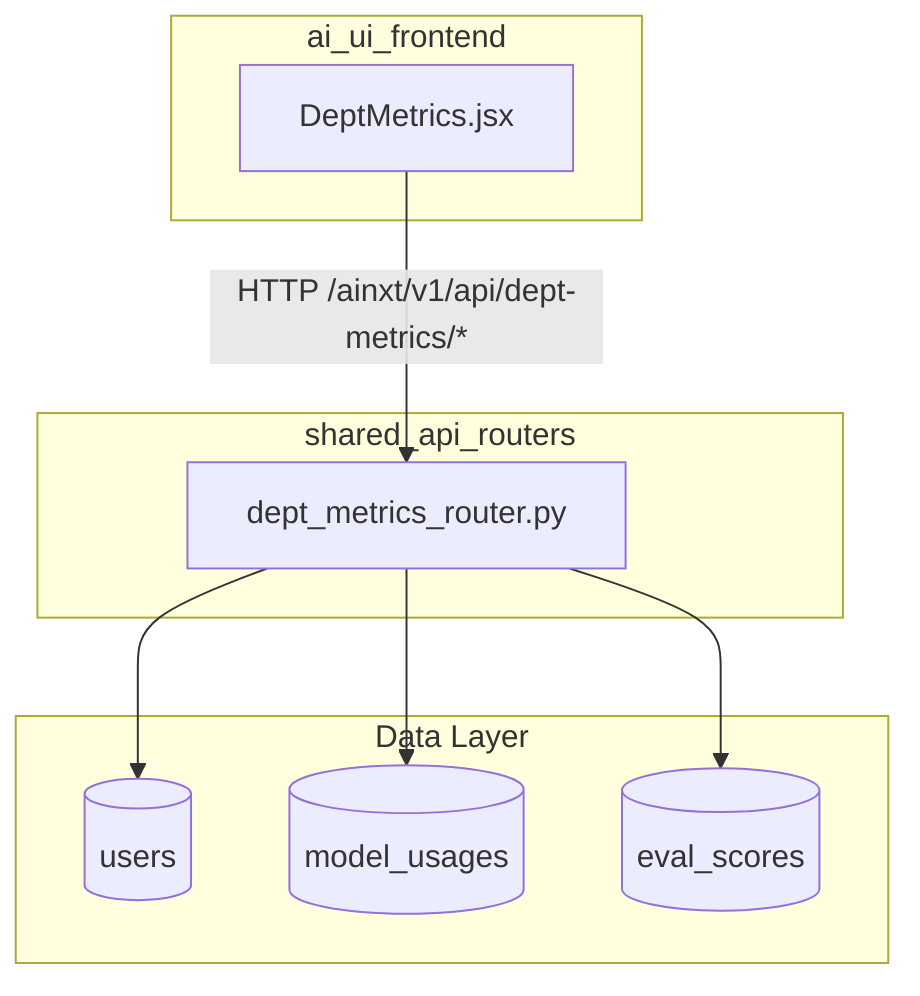
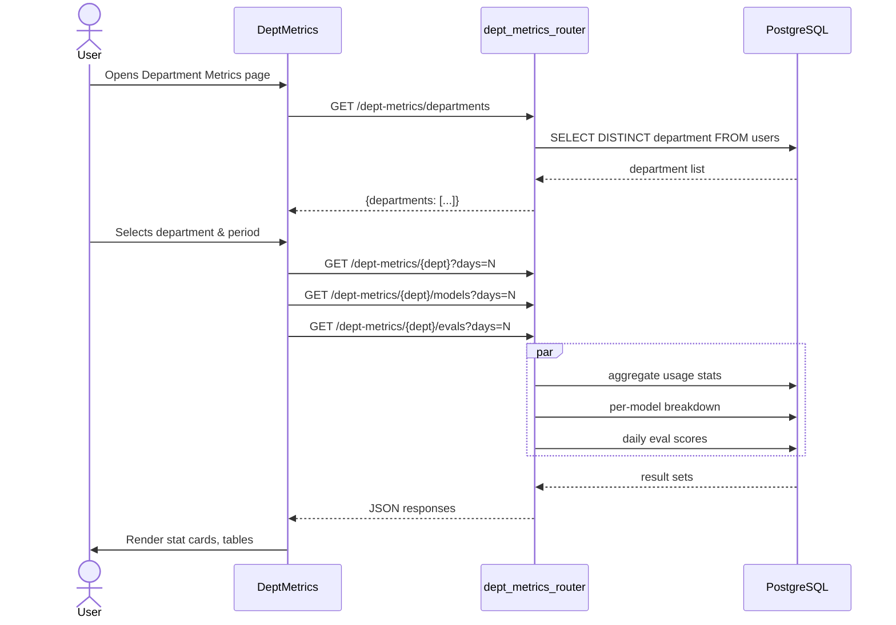
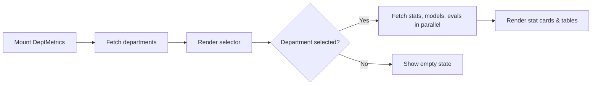
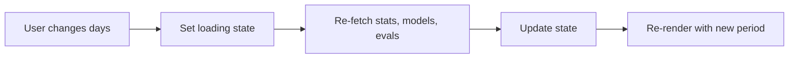

# Department Metrics Module

## Brief Introduction

The **Department Metrics** module provides a read-only analytics dashboard that lets administrators and operators inspect LLM usage, cost, latency, and evaluation quality broken down by organizational department. It is implemented as a React frontend view (`DeptMetrics`) backed by a dedicated FastAPI router (`dept_metrics_router`). The module aggregates data from the central `model_usages`, `eval_scores`, and `users` tables and exposes it through a small, focused REST API under `/ainxt/v1/api/dept-metrics`.

This module is part of the `ai_ui_frontend` application and is closely related to the broader [budget](../models/budget.md), [agent_analytics](../agents/agent_analytics.md), [evals_dashboard](../evaluation/evals_dashboard.md), and [model_governance](../sdlc/model_governance.md) modules.

---

## Core Functionality

### Frontend (`ai-ui/src/components/DeptMetrics.jsx`)

The frontend component renders a department selector, a time-range selector, and three report sections:

1. **Summary stat cards** — total requests, total tokens, estimated cost in USD, and average latency, plus a count of unique users.
2. **Model breakdown table** — per-model request count, token volume, cost, and average latency for the selected department.
3. **Eval quality table** — daily averages for grounding score, completeness score, average chunk count, and total number of evaluations.

Key frontend components:

| Component | Responsibility |
|-----------|----------------|
| `DeptMetrics` | Main container. Manages state, fetches data in parallel, and renders the dashboard. |
| `StatCard` | Reusable card for a single metric with an optional subtitle. |

### Backend (`routers/dept_metrics_router.py`)

The backend router exposes five endpoints:

| Endpoint | Handler | Purpose |
|----------|---------|---------|
| `GET /dept-metrics/departments` | `list_departments` | Returns the distinct list of departments from the `users` table. |
| `GET /dept-metrics/summary` | `dept_summary` | Cross-department aggregate of requests, tokens, cost, and latency. |
| `GET /dept-metrics/{dept}` | `dept_stats` | Aggregated stats and daily breakdown for one department. |
| `GET /dept-metrics/{dept}/models` | `dept_model_breakdown` | Per-model usage for one department. |
| `GET /dept-metrics/{dept}/evals` | `dept_eval_summary` | Daily eval-quality metrics for one department. |

All endpoints accept an optional `days` query parameter (default `7`, range `1–90`) and rely on `_get_db` for SQLAlchemy session management.

---

## Architecture

### High-Level Placement



### Component Interaction



### Data Flow

1. On mount, `DeptMetrics` fetches the department list and populates the selector.
2. When the user picks a department or changes the period, the component fires three parallel `fetch` requests.
3. Each backend handler runs parameterized SQL against `model_usages` joined with `users` (or directly against `eval_scores`).
4. Responses update React state and trigger a re-render of the stat cards and tables.

---

## Dependencies

### Frontend Dependencies

- React hooks: `useState`, `useEffect`
- Tailwind CSS utility classes for layout and theming
- Bearer-token authorization via the `token` prop

### Backend Dependencies

- FastAPI (`Query`, `Depends`)
- SQLAlchemy text queries
- `db.database.SessionLocal` for database sessions

### Related Modules

| Module | Relationship |
|--------|--------------|
| [budget](../models/budget.md) | Also consumes `model_usages` and `users` for cost and utilization tracking. |
| [agent_analytics](../agents/agent_analytics.md) | Provides agent-level usage analytics; department metrics provide the organizational rollup. |
| [evals_dashboard](../evaluation/evals_dashboard.md) | Surfaces evaluation results; `dept_eval_summary` feeds a department-scoped slice of that data. |
| [model_governance](../sdlc/model_governance.md) | Defines which models are allowed per department; department metrics show actual model consumption. |
| [auth](../security/auth.md) | Supplies user identity, roles, and department membership used by the queries. |

---

## API Reference

### `GET /ainxt/v1/api/dept-metrics/departments`

Returns all non-empty departments from the `users` table.

**Response:**
```json
{
  "departments": ["Engineering", "Product", "Sales"]
}
```

### `GET /ainxt/v1/api/dept-metrics/summary?days=7`

Returns a cross-department summary ordered by total token usage.

**Response:**
```json
{
  "days": 7,
  "departments": [
    {
      "department": "Engineering",
      "total_requests": 1200,
      "total_tokens": 4500000,
      "total_cost_usd": 12.3456,
      "avg_latency_ms": 842.5
    }
  ]
}
```

### `GET /ainxt/v1/api/dept-metrics/{dept}?days=7`

Returns aggregated stats and a daily breakdown for the selected department.

**Response:**
```json
{
  "department": "Engineering",
  "days": 7,
  "summary": {
    "total_requests": 1200,
    "total_tokens": 4500000,
    "input_tokens": 3200000,
    "output_tokens": 1300000,
    "total_cost_usd": 12.3456,
    "avg_latency_ms": 842.5,
    "unique_users": 45
  },
  "daily": [
    { "day": "2025-01-15", "requests": 180, "tokens": 650000, "cost_usd": 1.78 }
  ]
}
```

### `GET /ainxt/v1/api/dept-metrics/{dept}/models?days=7`

Returns per-model usage for the department, ordered by token volume descending.

**Response:**
```json
{
  "department": "Engineering",
  "days": 7,
  "models": [
    {
      "model": "gpt-4o",
      "requests": 800,
      "tokens": 4000000,
      "cost_usd": 11.5000,
      "avg_latency_ms": 900.0
    }
  ]
}
```

### `GET /ainxt/v1/api/dept-metrics/{dept}/evals?days=7`

Returns daily eval-quality metrics for the department.

**Response:**
```json
{
  "department": "Engineering",
  "days": 7,
  "evals": [
    {
      "day": "2025-01-15",
      "avg_grounding": 0.72,
      "avg_completeness": 0.85,
      "avg_chunks": 4.2,
      "total_evals": 32
    }
  ]
}
```

---

## Process Flows

### Loading the Dashboard



### Changing the Time Period



---

## Design Notes

- **Read-only analytics:** The module does not mutate any data; it only queries existing usage and evaluation tables.
- **Department scoping:** All usage queries join `model_usages` with `users` on `user_id` and filter by `u.department`.
- **Graceful degradation:** Backend handlers catch exceptions and return empty result sets with an optional `error` field, so the UI does not crash if a table is missing or a query fails.
- **Time window:** The `days` parameter is bounded between 1 and 90 to keep query cost predictable.
- **Currency formatting:** The frontend formats `cost_usd` to four decimal places and latency to the nearest millisecond.
- **Color-coded quality:** Eval grounding scores are rendered green (≥ 60%), yellow (≥ 30%), or red (< 30%) for quick visual triage.

---

## How It Fits Into the System

The Department Metrics module sits at the intersection of cost governance, model governance, and quality assurance:

- **Cost governance:** It surfaces which departments are driving token spend and which models they use, complementing the [budget](../models/budget.md) and [budget_manager](../models/budget_manager.md) modules.
- **Model governance:** By showing per-department model breakdowns, it helps administrators verify compliance with department-level model allow-lists managed by [model_governance](../sdlc/model_governance.md).
- **Quality assurance:** The eval-quality table gives department-level visibility into retrieval grounding and response completeness, tying into the broader [evals_dashboard](../evaluation/evals_dashboard.md) ecosystem.

It is typically accessed from the main AI UI navigation alongside other analytics and governance views.
