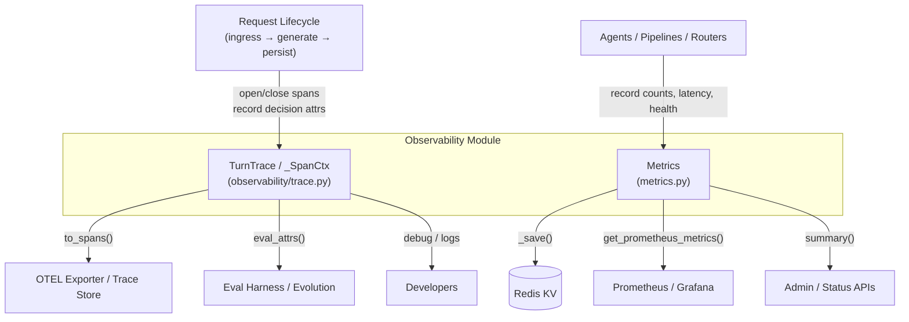
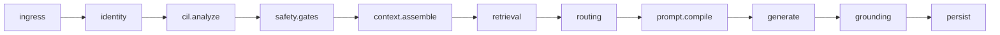

# Observability Module

The **Observability** module collects, structures, and exposes runtime signals from the AI platform. It is intentionally small and fail-safe: tracing and metrics are captured in-memory or pushed to external sinks, but they never block the request lifecycle they observe. The module follows the "instrument once, use three ways" principle — the same spans and counters feed live debugging, offline evaluation, and continuous improvement pipelines.

## Purpose

- Provide a **pure, in-memory per-turn trace builder** (`TurnTrace`) that records decision-rich spans across the request lifecycle without depending on an OTLP stack.
- Provide a **thread-safe metrics aggregator** (`Metrics`) that persists counters to Redis and exposes Prometheus-compatible metrics for dashboards and alerting.
- Stay importable and testable offline, degrading gracefully when backends are unavailable.

## Architecture Overview

### Component Responsibilities

| Component | File | Responsibility |
|-----------|------|----------------|
| `TurnTrace` | `observability/trace.py` | Builds a per-request span tree correlated by `request_id`. Each span captures decision inputs/outputs for a lifecycle stage. |
| `_SpanCtx` | `observability/trace.py` | Context-manager helper for `with trace.span(...):` blocks. |
| `Span` | `observability/trace.py` | Internal dataclass representing one named span with timing, attributes, parent reference, and optional error. |
| `Metrics` | `metrics.py` | Thread-safe aggregator for query counters, retrieval scores, latency, and Prometheus metrics; persists to Redis. |

## Request Lifecycle Stages

`TurnTrace` mirrors the canonical lifecycle defined in `STAGES`:

Each stage can be opened as a span, annotated with decision attributes, and closed independently. Spans can be nested via the `parent` parameter.

## Sub-modules

The observability module is split into two focused sub-modules:

- **[observability_tracing](observability_tracing.md)** — per-turn span collection, OTEL-style export, and eval-harness integration.
- **[observability_metrics](observability_metrics.md)** — Prometheus metrics, Redis-backed counters, and runtime health gauges.

## Integration with the Rest of the System

- **Gateway / Routers / Agents**: open spans around lifecycle stages and call `Metrics.record_*` helpers.
- **Eval Harness**: consumes `TurnTrace.eval_attrs()` to score decisions without re-running the pipeline.
- **Telemetry / OTEL**: `core/otel.py` may export `TurnTrace.to_spans()`; `trace.py` itself has no OTLP dependency.
- **KV Store**: `Metrics` uses `core.kv.get_kv(RDB_CACHE)` for persistence and recovery across restarts.
- **Prometheus**: the `Metrics` registry is scraped by monitoring infrastructure via `get_prometheus_metrics()`.

## Design Principles

1. **Fail-safe**: every tracing method swallows exceptions; metrics logging errors never raise.
2. **Pure model**: `TurnTrace` is independent of the OTLP exporter, making it unit-testable offline.
3. **Decision-rich spans**: spans record *why* a decision was made (model, tier, retrieval score, etc.), not just timing.
4. **Thread safety**: `Metrics` uses a `threading.Lock` and atomic Redis writes.
5. **Instrument once, use three ways**: the same trace feeds debugging, evaluation, and improvement loops.
