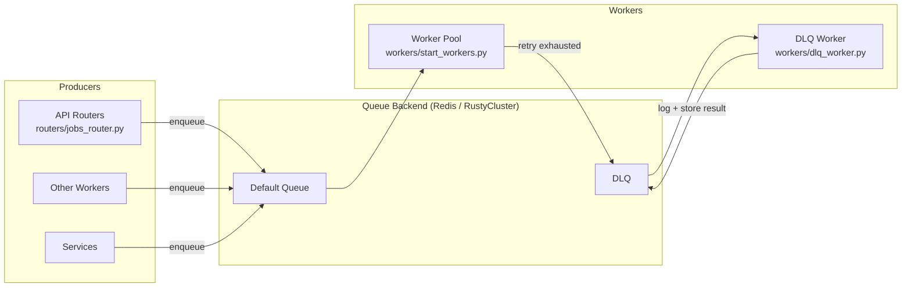
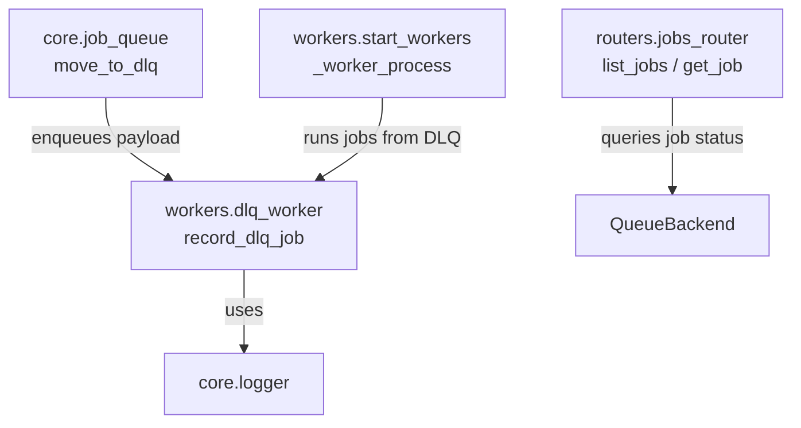
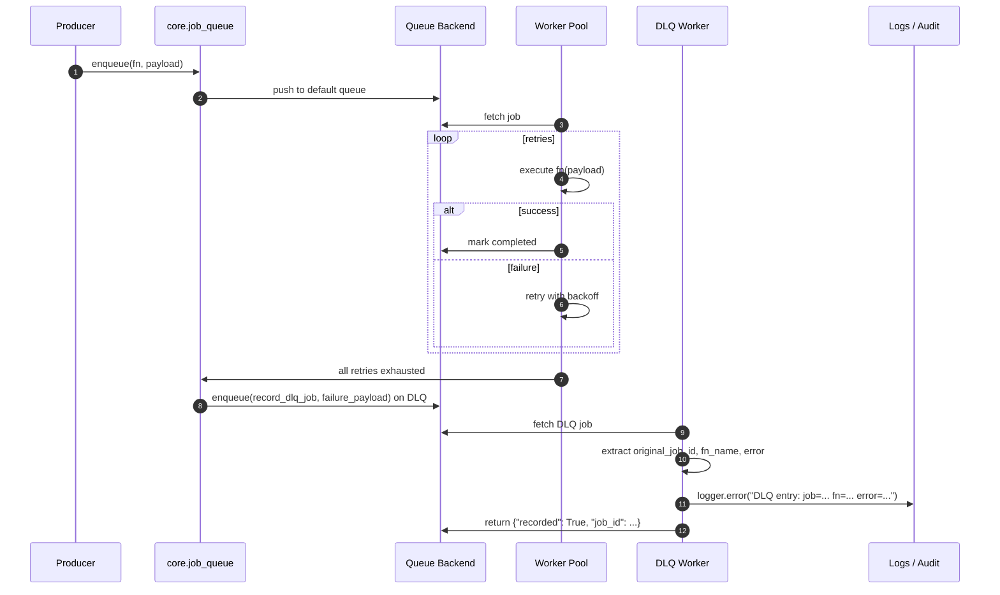

# infrastructure_maintenance_workers_dlq

## Brief Introduction

The `infrastructure_maintenance_workers_dlq` module provides the **Dead-Letter Queue (DLQ)** sink for the platform's background job infrastructure. Its single responsibility is to record jobs that have permanently failed after all retry attempts, making them available for manual inspection and remediation.

The module contains one worker function, `record_dlq_job`, which is intentionally a no-op: it does not attempt to reprocess the failed job, but instead logs the original job ID, function name, and truncated error message. This creates a durable, auditable record that operators can query through admin job-inspection endpoints.

---

## Core Functionality

### `record_dlq_job(payload: dict) -> dict`

Located in `workers/dlq_worker.py`, this function is the terminal destination for jobs moved to the DLQ.

**Behavior:**
- Extracts `original_job_id`, `fn_name`, and `error` from the incoming payload.
- Truncates the error message to 500 characters to avoid oversized log entries.
- Emits a structured `logger.error` line marking the DLQ entry.
- Returns a small confirmation dict: `{"recorded": True, "job_id": job_id}`.

**Input payload shape (enqueued by `core.job_queue.move_to_dlq`):**

```python
{
    "original_job_id": "<original job id>",
    "fn_name":         "<worker function name>",
    "payload":         {<original job payload>},
    "error":           "<exception / failure reason>",
    "failed_at":       "<ISO-8601 UTC timestamp>",
}
```

Because the function is registered as an RQ/RustyCluster job, its return value is stored by the queue backend and can be retrieved via job-status APIs.

---

## Architecture

### Position in the System

The DLQ worker sits at the end of the job-lifecycle pipeline:

1. A producer enqueues work through `core.job_queue`.
2. A worker process (spawned by `start_workers.py`) picks up the job and executes it.
3. If the job exhausts its retries, `move_to_dlq` enqueues a new job on the DLQ queue pointing at `record_dlq_job`.
4. The DLQ worker records the failure and completes, leaving the job artifact in the queue backend for inspection.



### Component Relationship



---

## Dependencies

### Direct Dependencies

| Component | Module | Purpose |
|-----------|--------|---------|
| `logger` | `core.logger` | Emits the DLQ entry log line. |

### Upstream Callers

| Component | Module | Purpose |
|-----------|--------|---------|
| `move_to_dlq` | `core.job_queue` | Moves permanently failed jobs to the DLQ by enqueuing `record_dlq_job`. |
| `_worker_process` | `workers.start_workers` | Worker pool runner that executes DLQ jobs. |

### Downstream Consumers

| Component | Module | Purpose |
|-----------|--------|---------|
| Admin job endpoints | `routers.jobs_router` | List and inspect DLQ job status/history. |

For details on the queue abstraction, retry policy, and worker orchestration, see:
- [core_infrastructure](core_infrastructure.md) — logging, configuration, and shared utilities.
- [worker_orchestration](worker_orchestration.md) — how worker processes are started and managed.
- [jobs_router](jobs_router.md) — admin/job inspection HTTP endpoints.

---

## Data Flow

### DLQ Entry Lifecycle



### Payload Transformation

| Stage | Field | Source | Notes |
|-------|-------|--------|-------|
| Original job | `job_id` | Queue backend | Unique job identifier. |
| Failure | `fn_name` | Worker invocation | Name of the worker function that failed. |
| Failure | `payload` | Original enqueue payload | Preserved for manual replay. |
| Failure | `error` | Exception text | Truncated to 500 chars by `record_dlq_job`. |
| Failure | `failed_at` | `datetime.utcnow()` | Added by `move_to_dlq`. |

---

## Process Flows

### Recording a Failed Job

```mermaid
flowchart TD
    A[DLQ job fetched by worker] --> B{Payload valid?}
    B -->|yes| C[Extract original_job_id, fn_name, error]
    B -->|no| D[Use 'unknown' defaults]
    C --> E[Truncate error to 500 chars]
    D --> E
    E --> F[logger.error DLQ entry]
    F --> G[Return {recorded: True, job_id}]
```

### Manual Inspection

Operators can inspect DLQ entries through the job router:

1. Call `GET /jobs?queue=dlq` (via `routers/jobs_router.list_jobs`) to list recent DLQ jobs.
2. Call `GET /jobs/{job_id}` (via `routers.jobs_router.get_job`) to retrieve the full payload and error.
3. Re-enqueue the original job manually if the underlying issue has been resolved.

> **Note:** The docstring in `record_dlq_job` references `GET /jobs/failed`. The exact admin endpoint may vary by deployment; use the queue-filtered list endpoint or the job-status endpoint described in [jobs_router](jobs_router.md).

---

## Operational Considerations

- **No automatic retry:** The DLQ worker is deliberately a no-op. Reprocessing requires explicit operator action.
- **Log-based observability:** Failures are surfaced through the centralized logger, so alerting rules should watch for `DLQ entry:` log lines.
- **Queue backend durability:** The original payload is preserved in the queue backend job artifact, not just in logs, enabling forensic analysis.
- **Timeout:** DLQ jobs are enqueued with a 30-second timeout, more than sufficient for a logging operation.

---

## Related Modules

- [infrastructure_maintenance_workers](infrastructure_maintenance_workers.md) — parent module covering purge, memory, scheduling, and DLQ maintenance workers.
- [worker_orchestration](worker_orchestration.md) — worker process lifecycle and queue assignment.
- [core_infrastructure](core_infrastructure.md) — shared logging, configuration, and queue abstractions.
- [jobs_router](jobs_router.md) — HTTP endpoints for job inspection.
