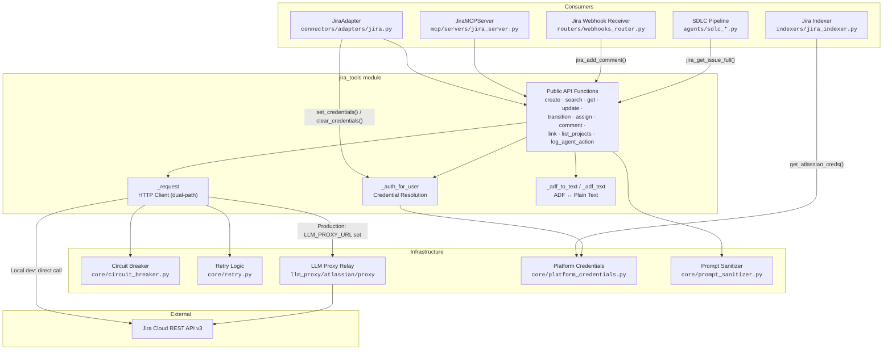
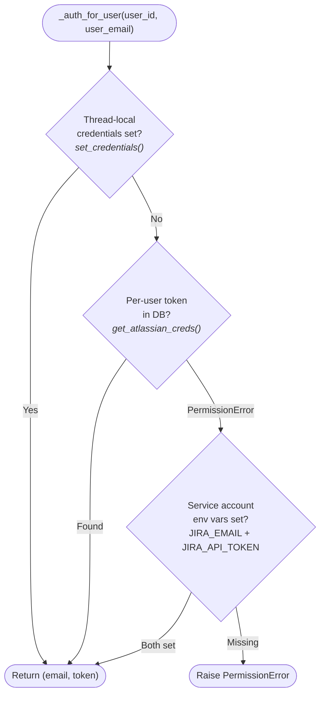
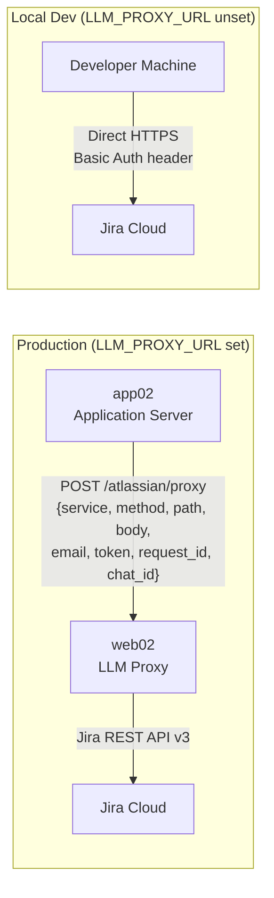
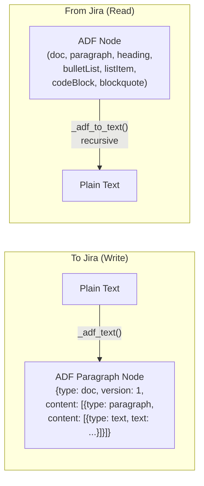
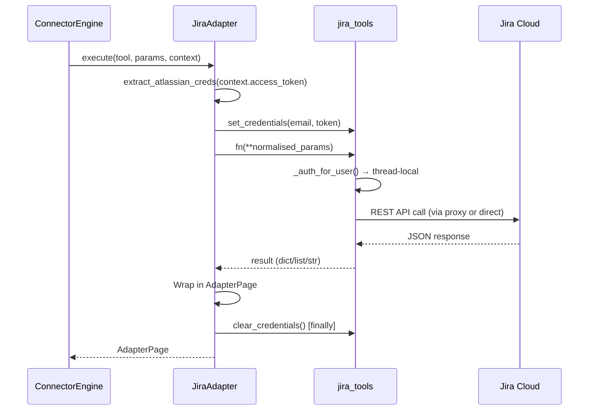
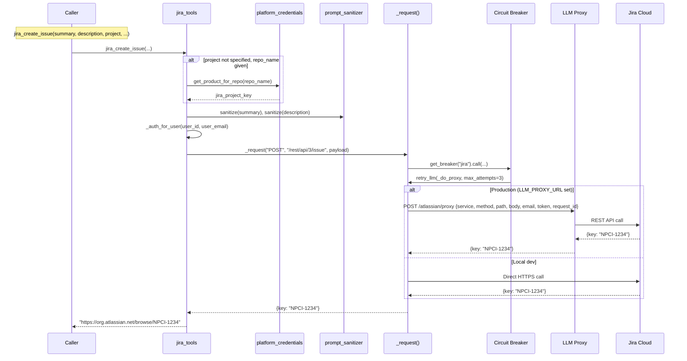
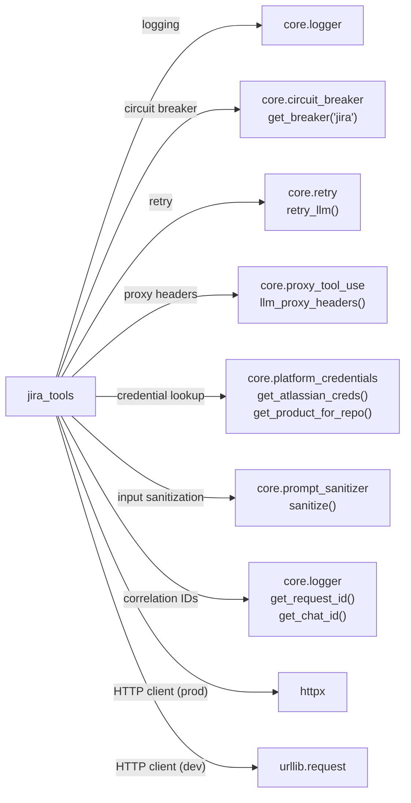

# Jira Tools Module

## Introduction

The `jira_tools` module (`tools/jira_tools.py`) is the **single shared client** for the Atlassian Jira Cloud REST API v3 across the entire NPCI Agentic Platform. It provides a suite of functions for issue lifecycle management (create, read, update, transition, assign, comment, link), JQL search with cursor pagination, project/user metadata lookups, and an enterprise audit-trail mechanism that logs platform events as Jira tickets.

The module is designed as a **library, not a service** — it exposes plain Python functions that are consumed by three distinct integration surfaces:

1. **Connector Adapter** — `JiraAdapter` injects per-user credentials via thread-locals and dispatches tool calls for the Buddy/Cowork chat experience.
2. **MCP Server** — `JiraMCPServer` registers a subset of functions as MCP tools available to LLM agents.
3. **SDLC Pipeline & Webhooks** — The SDLC pipeline fetches full ticket details for normalization, and the Jira webhook receiver posts feedback comments back to tickets.

All HTTP traffic is resilient (circuit breaker + exponential-backoff retry) and supports a dual-path deployment topology: production routes through the `web02` LLM proxy (since Atlassian Cloud is only reachable from `web02`), while local development calls Jira directly.

---

## Architecture Overview

---

## Credential Resolution

Authentication is the most security-critical aspect of this module. The `_auth_for_user()` function implements a **three-tier resolution chain** that balances per-user identity with service-account fallback:

| Tier | Source | Use Case | Security Notes |
|------|--------|----------|----------------|
| **0 — Thread-local** | `set_credentials(email, token)` | Connector path (`JiraAdapter`); per-user token injected per-request | Must always be paired with `clear_credentials()` in a `finally` block to prevent cross-user token leakage in thread-pooled servers |
| **1 — DB lookup** | `core.platform_credentials.get_atlassian_creds()` | SDLC pipeline, indexer, MCP tools with `user_id`/`user_email` | Resolves to the user's stored Atlassian API token; raises `PermissionError` if none stored |
| **2 — Service account** | `JIRA_EMAIL` + `JIRA_API_TOKEN` env vars | Background workers, audit logging, local development | Process-wide fallback; never used when a per-user identity is available |

> **Critical:** The thread-local mechanism (`threading.local()`) is used instead of mutating `os.environ` because environment variables are process-global and unsafe across concurrent workers. A leaked thread-local credential under a thread-pooled server means one user's token could serve another user's request.

---

## HTTP Client & Dual-Path Topology

The `_request()` function is the single HTTP entry point for all Jira API calls. It supports two deployment modes controlled by the `LLM_PROXY_URL` environment variable:

### Production Path (via LLM Proxy)

Atlassian Cloud is only reachable from `web02`, not from `app02`. When `LLM_PROXY_URL` is set, all Jira calls are relayed through the LLM proxy's `/atlassian/proxy` endpoint. The relay payload includes:

- `service: "jira"`, `method`, `path`, and optional `body`
- `email` and `token` for Basic-auth delegation
- **Correlation ID propagation**: `request_id` and `chat_id` are injected from the thread-local logger context so every Jira API call is logged under the same identifiers as the originating gateway/SDLC request

### Local Dev Path (Direct)

When `LLM_PROXY_URL` is unset, the module calls Jira directly using `urllib.request` with an opener that honors enterprise forward proxies (`HTTPS_PROXY` / `FORWARD_PROXY_URL`). SSL verification is disabled in this path for compatibility with corporate proxy interception.

### Resilience

Both paths wrap the actual HTTP call in:

1. **Circuit breaker** (`core.circuit_breaker.get_breaker("jira")`) — trips after consecutive failures, preventing cascading outages
2. **Exponential-backoff retry** (`core.retry.retry_llm`, max 3 attempts, 1.0s base delay) — handles transient 5xx and 429 responses

4xx errors (except 429) are **not retried** — they indicate client-side problems (bad JQL, missing fields, auth failure) that won't resolve on retry.

---

## Component Reference

### Issue Lifecycle

| Function | Description | Returns |
|----------|-------------|---------|
| `jira_create_issue()` | Create a new issue with project key resolution (explicit arg → product-linked repo → `JIRA_PROJECT` env) | Issue URL string |
| `jira_get_issue()` | Get formatted details of an issue (human-readable string) | Formatted string |
| `jira_get_issue_dict()` | Get structured issue details as a dict (programmatic use) | `dict` |
| `jira_get_issue_full()` | Get rich issue data for SDLC normalization — includes comments (last 10), attachments, acceptance criteria, labels, epic summary, and raw fields | `dict` |
| `jira_update_issue()` | Update status (transition), add comment, change assignee, or update priority — all fields optional | Confirmation string |
| `jira_transition_issue()` | Transition issue to a new workflow status (thin wrapper over `jira_update_issue`) | Confirmation string |
| `jira_assign_issue()` | Assign issue to a user by Atlassian `accountId` | Confirmation string |
| `jira_add_comment()` | Post a comment to an issue | Confirmation string |
| `jira_link_issues()` | Link two issues with a relationship type (e.g., "blocks", "relates to") | Confirmation string |

### Search & Listing

| Function | Description | Returns |
|----------|-------------|---------|
| `jira_search_issues()` | JQL search via `POST /rest/api/3/search/jql` with cursor-based pagination (`nextPageToken`) | `{"issues": [...], "next_cursor": str\|None}` |
| `jira_count_issues()` | Approximate count via `POST /rest/api/3/search/approximate-count` (cheaper than paging) | `{"count": int, "jql": str}` |
| `jira_list_issues()` | Thin wrapper over `jira_search_issues()` — lists issues for a project filtered by status | Formatted string |

> **Note:** The legacy `GET /rest/api/3/search` endpoint was removed from Jira Cloud. The module exclusively uses `POST /rest/api/3/search/jql` with cursor-based pagination. The search endpoint does **not** return a total count — use `jira_count_issues()` for that.

### Metadata Lookups

| Function | Description | Returns |
|----------|-------------|---------|
| `jira_list_projects()` | List projects visible to the authenticated user (use to resolve project keys before project-scoped calls) | `List[dict]` |
| `jira_get_project()` | Get metadata for one project — name, description, lead | `dict` |
| `jira_get_current_user()` | Get authenticated user's profile — also serves as the **connection-test probe** for the Jira connector | `dict` with `account_id`, `display_name`, `email`, `active` |
| `jira_get_transitions()` | List available status transitions for an issue (call before transitioning) | `List[dict]` |
| `jira_list_comments()` | List comments on an issue with ADF bodies flattened to plain text | `List[dict]` |

### Enterprise Audit Trail

| Function | Description | Returns |
|----------|-------------|---------|
| `jira_log_agent_action()` | Create an audit-trail Jira ticket for platform events (agent created, workflow executed, incident detected, security alert, compliance violation, etc.) | Issue URL string |

The audit function maps `event_type` to a predefined Jira issue type, priority, and summary prefix via the `_AUDIT_EVENT_TYPES` dictionary:

| Event Type | Issue Type | Priority | Prefix |
|------------|-----------|----------|--------|
| `agent_created` | Story | Medium | `[AUDIT] Agent Created` |
| `workflow_created` | Story | Medium | `[AUDIT] Workflow Created` |
| `workflow_executed` | Task | Low | `[AUDIT] Workflow Executed` |
| `incident_detected` | Bug | High | `[INCIDENT] Detected` |
| `incident_resolved` | Bug | Medium | `[INCIDENT] Resolved` |
| `code_change_proposed` | Task | Medium | `[CODE] Change Proposed` |
| `code_change_merged` | Task | Low | `[CODE] Change Merged` |
| `security_alert` | Bug | Critical | `[SECURITY] Alert` |
| `compliance_violation` | Bug | High | `[COMPLIANCE] Violation` |
| `model_cost_exceeded` | Task | High | `[COST] Budget Exceeded` |

### Internal Helpers

| Function | Description |
|----------|-------------|
| `_request()` | Core HTTP client with dual-path routing, circuit breaker, and retry |
| `_put()` | Convenience wrapper for PUT requests |
| `_auth_for_user()` | Three-tier credential resolution chain |
| `_auth_header()` | Builds the Basic-auth header from email + token |
| `_make_opener()` | Builds a `urllib` opener honoring enterprise forward proxies |
| `_adf_text()` | Converts plain text to an Atlassian Document Format (ADF) paragraph node |
| `_adf_to_text()` | Recursively converts ADF nodes (doc, paragraph, text, heading, bulletList, listItem, codeBlock, blockquote) to plain text |
| `_normalize_issue()` | Flattens a raw Jira issue into a compact dict for callers |
| `_fetch_transitions()` | Raw transition fetch shared by `jira_get_transitions` and `jira_update_issue` |
| `_default_project()` | Returns `JIRA_PROJECT` env var (default: `AINRPY`) |
| `set_credentials()` / `clear_credentials()` | Thread-local credential injection for the connector path |

---

## Atlassian Document Format (ADF) Handling

Jira Cloud stores rich text fields (descriptions, comments) in **Atlassian Document Format (ADF)** — a nested JSON structure. The module provides bidirectional conversion:

`_adf_to_text()` handles all common ADF node types recursively, including ordered/unordered lists with proper numbering and bullet prefixes.

---

## Integration Surfaces

### 1. Connector Adapter (`JiraAdapter`)

The `JiraAdapter` in `connectors/adapters/jira.py` is the primary consumer for the Buddy/Cowork chat experience. It delegates all HTTP work to `jira_tools` after injecting per-user credentials:

The adapter maintains a `_TOOL_MAP` that maps connector tool names to `jira_tools` function names, and an `_ALLOWED_PARAMS` set per tool to strip hallucinated extra arguments. It translates HTTP 401/403 errors into `ConnectorReauthRequired` exceptions so the engine prompts a reconnect.

### 2. MCP Server (`JiraMCPServer`)

The `JiraMCPServer` in `mcp/servers/jira_server.py` registers seven tools (create, list, get, update, comment, transition, link) as MCP tools available to LLM agents. Write operations (`jira_create_issue`, `jira_update_issue`) are flagged with `pci_audit=True` for compliance logging. See [mcp_system](mcp_system.md) for details on the MCP infrastructure.

### 3. Jira Webhook Receiver

The webhook receiver in `routers/webhooks_router.py` uses `jira_add_comment()` to post feedback back to Jira tickets when:
- Required fields are missing (summary, description, repo) — the pipeline is not triggered and a comment explains what to fix
- A per-reporter rate limit is hit — a comment explains the throttling

The webhook also triggers SDLC pipelines (bug vs. feature) based on issue type, and the BRD→FSD pipeline for epics with a "BRD" label. See [shared_api_routers](shared_api_routers.md) for the full webhook router documentation.

### 4. Jira Indexer

The `index_jira_project()` function in `indexers/jira_indexer.py` fetches Jira issues and indexes them into pgvector for semantic search. It uses `core.platform_credentials.get_atlassian_creds()` directly (not the thread-local path) and has its own HTTP client for pagination. See [indexers](indexers.md) for details.

### 5. SDLC Pipeline

The SDLC pipeline uses `jira_get_issue_full()` during the **TICKET_NORMALIZATION** stage to fetch maximum raw material (comments, attachments, acceptance criteria, labels, epic summary) for the `NormalizationAgent`. See [shared_core_sdlc_pipeline](shared_core_sdlc_pipeline.md) for the SDLC pipeline documentation.

---

## Data Flow: Issue Creation & Audit Logging

---

## Environment Variables

| Variable | Required | Description |
|----------|----------|-------------|
| `JIRA_URL` | Yes | Base URL of the Jira Cloud instance (e.g., `https://your-org.atlassian.net`) |
| `JIRA_PROJECT` | No | Default project key when none is specified (default: `AINRPY`) |
| `JIRA_EMAIL` | Conditional | Service account email for local dev / fallback auth |
| `JIRA_API_TOKEN` | Conditional | Service account API token for local dev / fallback auth |
| `LLM_PROXY_URL` | No | When set, all Jira calls route through the LLM proxy's `/atlassian/proxy` endpoint (production) |
| `HTTPS_PROXY` / `https_proxy` / `FORWARD_PROXY_URL` | No | Enterprise forward proxy for direct (local dev) Jira calls |

---

## Dependencies

### Related Module Documentation

- **[shared_integrations_connector_adapters](shared_integrations_connector_adapters.md)** — `JiraAdapter` and the connector infrastructure
- **[mcp_system](mcp_system.md)** — `JiraMCPServer` and MCP tool registration
- **[shared_api_routers](shared_api_routers.md)** — Jira webhook receiver and SDLC trigger routing
- **[indexers](indexers.md)** — Jira project indexing into pgvector
- **[shared_core_sdlc_pipeline](shared_core_sdlc_pipeline.md)** — SDLC pipeline consumption of `jira_get_issue_full()`
- **[core_infrastructure](core_infrastructure.md)** — Circuit breaker, retry, logger, and credential infrastructure
- **[llm_proxy_main](llm_proxy_main.md)** — The `/atlassian/proxy` relay endpoint on the LLM proxy

---

## Security Considerations

1. **Thread-local credentials**: Per-user tokens are injected via `threading.local()` and **must** be cleared in a `finally` block. The `JiraAdapter` enforces this pattern. A leaked credential under a thread-pooled server means one user's token serving another user's request.

2. **Input sanitization**: `jira_create_issue()` sanitizes `summary` and `description` through `core.prompt_sanitizer.sanitize()` before sending to Jira, preventing prompt injection payloads from being written into Jira tickets.

3. **Webhook secret verification**: The Jira webhook receiver verifies the `X-Jira-Webhook-Secret` header against `JIRA_WEBHOOK_SECRET` using `hmac.compare_digest()` (constant-time comparison) when configured.

4. **No service-account fallback for indexing**: The Jira indexer explicitly uses **only** the user's stored Atlassian token — service-account credentials are never used, ensuring indexed content is scoped to the user's Jira permissions.

5. **4xx error handling**: Client errors (except 429) are not retried and are raised immediately with truncated response bodies, preventing retry storms on malformed requests while still surfacing actionable error messages.
