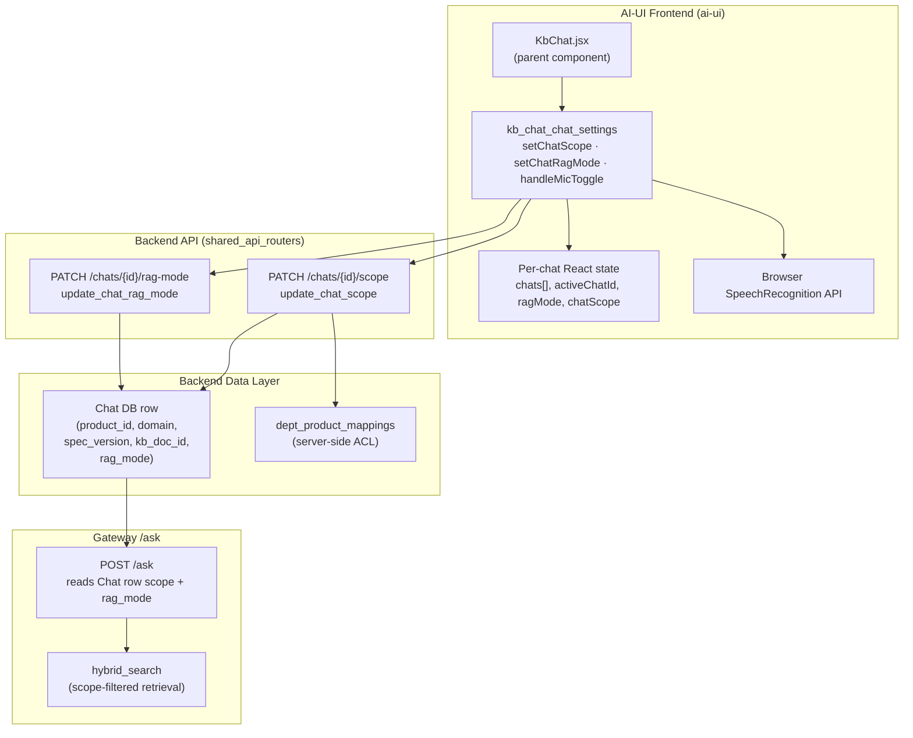
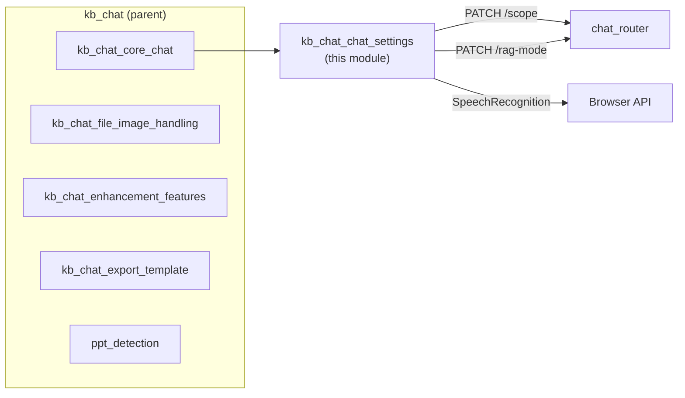
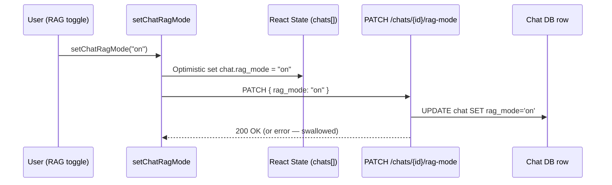
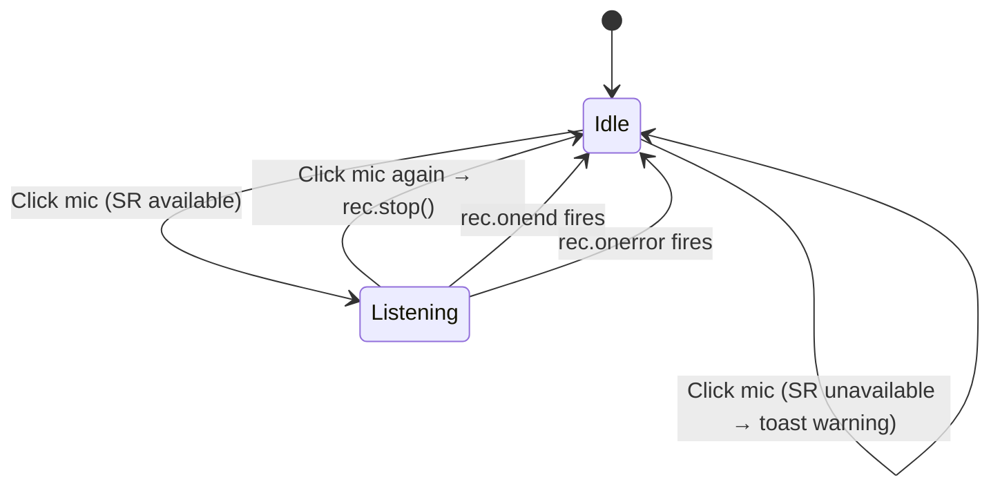
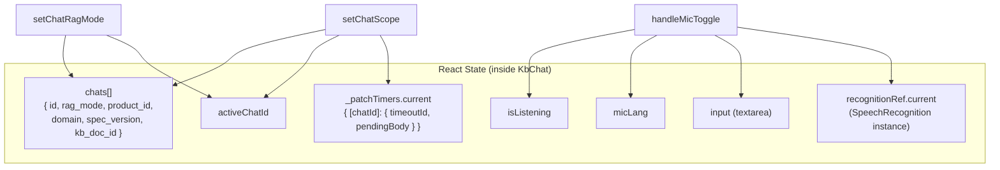
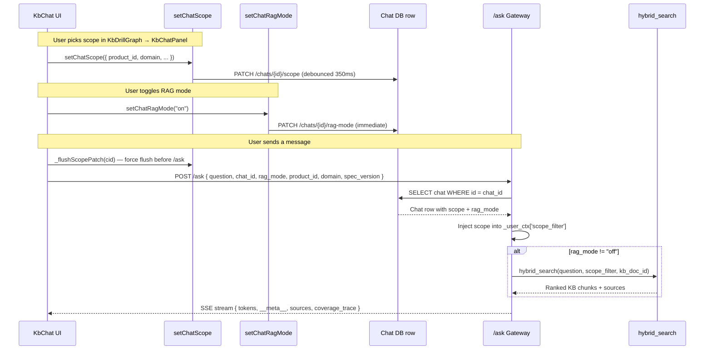

# kb_chat_chat_settings

## 1. Introduction

The **kb_chat_chat_settings** module is a sub-module of the larger `kb_chat` component in the AI-UI frontend. It groups three configuration-oriented handlers that live inside the `KbChat` React component (`ai-ui/src/components/KbChat.jsx`):

| Component | Responsibility |
|---|---|
| `setChatScope` | Persists the per-chat Knowledge Base retrieval scope (product, domain, spec version, document) to the backend with a debounced PATCH. |
| `setChatRagMode` | Toggles the per-chat RAG (Retrieval-Augmented Generation) mode between `off`, `auto`, and `on` via an immediate PATCH. |
| `handleMicToggle` | Starts / stops browser-based Speech-to-Text (STT) for voice-driven prompt input, supporting multiple Indian languages plus US English. |

Together these handlers give the user fine-grained control over *what* knowledge the chat retrieves from, *how* retrieval is applied, and *how* the user composes their prompt — all without leaving the KB chat surface.

---

## 2. Architecture Overview



### 2.1 Module Position in the System

The three settings handlers are invoked from within the `KbChat` component's render tree and event handlers. They sit between the user-facing UI controls (scope breadcrumb, RAG toggle, mic button) and the backend persistence layer. The persisted values are later consumed by the `/ask` gateway endpoint to drive deterministic, scope-filtered retrieval.



> **Related modules:** For the full chat lifecycle (send, stream, stop, regenerate), see [kb_chat_core_chat](kb_chat_core_chat.md). For file/image attachment handling, see [kb_chat_file_image_handling](kb_chat_file_image_handling.md). For prompt enhancement, see [kb_chat_enhancement_features](kb_chat_enhancement_features.md). For the backend router that owns the scope and rag-mode endpoints, see [chat_router](chat_router.md).

---

## 3. Component Documentation

### 3.1 setChatScope

#### Purpose

Updates the KB retrieval scope for the currently active chat. The scope is a four-field tuple — `product_id`, `domain`, `spec_version`, `kb_doc_id` — that the `/ask` gateway reads from the persisted `Chat` row to inject into `_user_ctx['scope_filter']` and `_user_ctx['kb_doc_id']`. This makes `hybrid_search` filter deterministically by product, domain, version, and optionally a single document.

#### Signature

```javascript
setChatScope(next: {
  product_id?:   string | null,
  domain?:       string | null,
  spec_version?: string | null,
  kb_doc_id?:    string | null,
}) => void
```

#### Behaviour

1. **Guard** — returns early if no `activeChatId` is set.
2. **Snapshot** — captures `cid = activeChatId` so the closure is immune to subsequent chat switches (a critical audit fix).
3. **Optimistic local update** — immediately merges `next` into the matching chat object in React state via `setChats`.
4. **Debounced PATCH** — schedules a `PATCH /chats/{cid}/scope` request after a 350 ms delay. If another scope change arrives within that window, the previous timer is cancelled and replaced — but **only for the same chat**. Timers are keyed per-chat in a `useRef` map (`_patchTimers.current`) so switching to chat B between an edit on chat A and the deadline does not cancel A's pending write.
5. **Flush on unmount** — a cleanup `useEffect` flushes all pending timers when the component unmounts, preventing SPA route changes from dropping in-flight edits.
6. **Pre-send flush** — `sendMessage()` (in the parent `KbChat` component) calls `_flushScopePatch(activeChatId)` before issuing `POST /ask`, ensuring the gateway reads the freshest scope, not a stale DB row still within the 350 ms debounce window.

#### Data Flow

```mermaid
sequenceDiagram
    participant U as User (ScopePicker)
    participant S as setChatScope
    participant State as React State (chats[])
    participant Timer as _patchTimers (useRef)
    participant API as PATCH /chats/{id}/scope
    participant DB as Chat DB row

    U->>S: setChatScope({ product_id, domain, ... })
    S->>State: Optimistic merge into chat[cid]
    S->>Timer: Clear existing timer for cid
    S->>Timer: Schedule _flushScopePatch(cid) in 350ms
    Note over Timer: If another call arrives,<br/>only THIS chat's timer is replaced
    Timer->>API: PATCH { product_id, domain, spec_version, kb_doc_id }
    API->>DB: UPDATE chat SET product_id=..., domain=..., ...
    API-->>S: 200 OK (best-effort; errors swallowed)
```

#### Key Design Decisions

| Decision | Rationale |
|---|---|
| **Per-chat timer map** | Prevents a chat switch from silently cancelling another chat's pending scope PATCH (audit Fix #3). |
| **350 ms debounce** | A rapid dropdown sequence (domain → product → version) fires one round-trip, not three. |
| **Optimistic update, no rollback** | The server-side default matches the client default, so a failed PATCH does not leave the UI in a misleading state. |
| **Snapshot `cid`** | The async `setTimeout` closure must not see a future `activeChatId` after the user switches chats. |
| **Unmount flush** | SPA route changes would otherwise drop a pending write that hasn't hit the 350 ms deadline. |

#### Backend Endpoint: `PATCH /chats/{id}/scope`

The backend handler `update_chat_scope` (in `routers/chat_router.py`) performs:

- **Authentication** — resolves `current_user` via `get_current_user`.
- **Shape validation** — normalises all four fields to `str | None`; non-string values raise `400`.
- **Server-derived ACL** — non-admin users can only set a `product_id` that belongs to their department's mapped product set (`dept_product_mappings`). This is a server-side guarantee that cannot be spoofed by the client. If verification fails (e.g. Redis/Postgres unavailable), the `product_id` is silently dropped (fail-closed).
- **Persistence** — updates the `Chat` row's `product_id`, `domain`, `spec_version`, `kb_doc_id`, and `updated_at` columns.

> See [chat_router](chat_router.md) for the full router documentation and [model_governance](model_governance_router.md) for department-product mapping governance.

---

### 3.2 setChatRagMode

#### Purpose

Toggles the per-chat RAG mode. This controls whether the `/ask` gateway performs knowledge-base retrieval before generating an answer.

| Mode | Behaviour |
|---|---|
| `off` | No retrieval; the LLM answers from its parametric knowledge only. Default for new chats. |
| `auto` | The gateway decides whether to retrieve based on query characteristics. |
| `on` | Retrieval is always performed; the answer is grounded in KB chunks. |

#### Signature

```javascript
setChatRagMode(mode: "off" | "auto" | "on") => void
```

#### Behaviour

1. **Guard** — returns early if no `activeChatId` or if `mode` is not one of the three allowed values.
2. **Optimistic local update** — immediately sets `rag_mode` on the active chat in React state.
3. **Immediate PATCH** — fires `PATCH /chats/{activeChatId}/rag-mode` with `{ rag_mode: mode }`. Unlike `setChatScope`, this is **not debounced** — the toggle is a discrete user action and should persist instantly.
4. **Best-effort** — on network failure, the local state is **not** rolled back. The server-side default is the same as the client default (`off`), so a failed PATCH does not create a dangerous mismatch.

#### Data Flow



#### Backend Endpoint: `PATCH /chats/{id}/rag-mode`

The backend handler `update_chat_rag_mode` (in `routers/chat_router.py`):

- Validates `rag_mode` is one of `off`, `auto`, `on` (raises `400` otherwise).
- Resolves the `Chat` row by `chat_id` + `user_id` (raises `404` if not found).
- Persists `rag_mode` and `updated_at`.

#### Downstream Consumption

The `ragMode` value is read in the `sendMessage()` function of the parent `KbChat` component and included in the `POST /ask` request body:

```json
{
  "question": "...",
  "chat_id": "...",
  "rag_mode": "on",
  "product_id": "...",
  "domain": "...",
  "spec_version": "..."
}
```

The gateway uses `rag_mode` to decide whether to invoke the hybrid retrieval pipeline before LLM generation. When `rag_mode` is `off`, the spinner's initial stage skips the "Searching" step.

---

### 3.3 handleMicToggle

#### Purpose

Toggles browser-based Speech-to-Text (STT) for voice-driven prompt composition. When active, the user's spoken words are transcribed in real time and placed into the chat input textarea.

#### Signature

```javascript
handleMicToggle() => void
```

#### Behaviour



1. **If already listening** — stops the current `SpeechRecognition` instance via `recognitionRef.current.stop()` and sets `isListening` to `false`.
2. **If not listening** — checks for `window.SpeechRecognition` or `window.webkitSpeechRecognition`. If neither exists, shows a toast warning ("Speech recognition is not supported in this browser. Try Chrome or Edge.") and returns.
3. **Creates a new `SpeechRecognition` instance** with:
   - `lang` = `micLang` (defaults to `en-IN`; user-selectable from a dropdown of 11 languages).
   - `continuous = true` — the mic stays open until the user explicitly stops it.
   - `interimResults = true` — partial transcripts update the input in real time.
   - `maxAlternatives = 1`.
4. **Event handlers**:
   - `onstart` → `setIsListening(true)`
   - `onend` → `setIsListening(false)`
   - `onerror` → `setIsListening(false)`
   - `onresult` → joins all result transcripts and calls `setInput(transcript)`, replacing the textarea content.
5. **Stores the instance** in `recognitionRef.current` so the toggle can stop it later.

#### Supported Languages

| Code | Language |
|---|---|
| `en-IN` | English (India) — default |
| `hi-IN` | Hindi |
| `ta-IN` | Tamil |
| `te-IN` | Telugu |
| `kn-IN` | Kannada |
| `ml-IN` | Malayalam |
| `bn-IN` | Bengali |
| `mr-IN` | Marathi |
| `gu-IN` | Gujarati |
| `pa-IN` | Punjabi |
| `en-US` | English (US) |

#### UI Integration

The mic button in the toolbar row reflects `isListening`:
- **Idle** — grey `Mic` icon.
- **Listening** — red, pulsing `MicOff` icon.

The language `<select>` dropdown sits adjacent to the mic button and is disabled while listening. Changing the language takes effect on the next recognition session.

#### Relationship to Voice Mode

`handleMicToggle` is distinct from the full **Voice Mode** overlay (`VoiceMode` component), which provides a hands-free conversational experience with both STT and TTS. The mic toggle is a lightweight, inline input aid; Voice Mode is a separate modal flow invoked via the "Voice" button in the chat header. Both share the `micLang` state for language consistency.

> See [voice_mode](voice_mode.md) for the full Voice Mode overlay documentation.

---

## 4. State & Dependency Map



### External Dependencies

| Dependency | Type | Used By |
|---|---|---|
| `authFetch` | HTTP client (from `ai-ui/src/config.js`) | `setChatScope` (via `_flushScopePatch`), `setChatRagMode` |
| `API` | Base URL constant (from `ai-ui/src/config.js`) | All PATCH calls |
| `useToast` | Toast notification hook | `handleMicToggle` (unsupported browser warning) |
| `window.SpeechRecognition` / `window.webkitSpeechRecognition` | Browser Web Speech API | `handleMicToggle` |
| `get_current_user` | Backend auth dependency | `update_chat_scope`, `update_chat_rag_mode` |
| `Chat` model (SQLAlchemy) | Database ORM | `update_chat_scope`, `update_chat_rag_mode` |
| `dept_product_mappings` | DB table (ACL) | `update_chat_scope` (product validation) |

> See [config](config.md) for `authFetch` and `API` documentation. See [auth](auth.md) for `get_current_user` and authentication flow.

---

## 5. Interaction with the /ask Gateway

The settings persisted by this module are consumed by the `/ask` gateway endpoint on every chat turn. The following diagram shows the end-to-end flow:



### Inline Scope Fallback (Turn 1)

For chats created from the Knowledge Base → Chat handoff (`KbChatPanel`), the `Chat` row may not exist server-side until the first `/ask` call lazy-creates it. In this case, `sendMessage()` sends `product_id`, `domain`, `spec_version`, and `kb_doc_id` **inline** in the `/ask` body. The gateway treats these as a fallback that only fires when the DB row has the columns `NULL`. After the first turn, a back-patch in the `finally` block retries the scope and rag-mode PATCHes so subsequent turns read from the DB.

---

## 6. Error Handling & Edge Cases

| Scenario | Handling |
|---|---|
| `setChatScope` called with no `activeChatId` | Early return; no state mutation, no API call. |
| `setChatScope` PATCH fails (network/server error) | Error is swallowed; local optimistic state remains. Server default matches client default. |
| Rapid scope changes (dropdown sequence) | 350 ms debounce coalesces into a single PATCH per chat. |
| Chat switch during debounce window | Per-chat timer map ensures each chat's PATCH is independent and not cancelled by a switch. |
| Component unmount with pending timers | Cleanup `useEffect` flushes all pending PATCHes. |
| `setChatRagMode` called with invalid mode | Early return; no state mutation. |
| `setChatRagMode` PATCH fails | Error swallowed; local state not rolled back. |
| `handleMicToggle` on unsupported browser | Toast warning; no recognition started. |
| `SpeechRecognition` `onerror` | `isListening` set to `false`; mic button returns to idle. |
| `SpeechRecognition` `onend` (e.g. silence timeout) | `isListening` set to `false`; user must click again to resume. |
| Backend `update_chat_scope` — invalid product for non-admin | Returns `403`; client does not roll back (fail-closed on server). |
| Backend `update_chat_scope` — product verification infra unavailable | `product_id` silently dropped (fail-closed). |
| Backend `update_chat_rag_mode` — chat not found | Returns `404`; client does not roll back. |

---

## 7. Cross-Module References

| Module | Relationship |
|---|---|
| [kb_chat_core_chat](kb_chat_core_chat.md) | Parent `KbChat` component; owns `sendMessage()` which flushes pending scope PATCHes and reads `ragMode` for the `/ask` body. |
| [kb_chat_file_image_handling](kb_chat_file_image_handling.md) | Sibling sub-module; shares the same `input` state that `handleMicToggle` writes to. |
| [kb_chat_enhancement_features](kb_chat_enhancement_features.md) | Sibling sub-module; also modifies the `input` state. |
| [kb_chat_export_template](kb_chat_export_template.md) | Sibling sub-module; shares the chat header toolbar. |
| [ppt_detection](ppt_detection.md) | Sibling sub-module; does not interact with settings. |
| [chat_router](chat_router.md) | Backend router owning `PATCH /chats/{id}/scope` and `PATCH /chats/{id}/rag-mode`. |
| [config](config.md) | Provides `authFetch` and `API` base URL. |
| [auth](auth.md) | Provides `get_current_user` dependency used by backend endpoints. |
| [voice_mode](voice_mode.md) | Full voice conversation overlay; shares `micLang` state with `handleMicToggle`. |
| [kb_chat_panel](kb_chat_panel.md) | Parent panel that creates KB chats with initial scope and `kbScopePending` flag. |
| [kb_graph](kb_graph.md) | `KbDrillGraph` / `KbScopeGraph` where the user initially picks the scope that `setChatScope` persists. |
