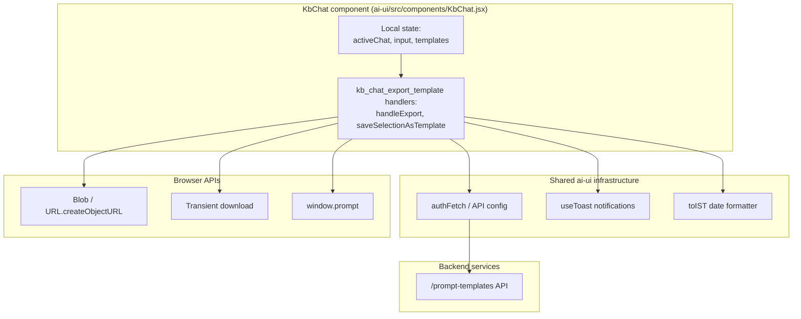
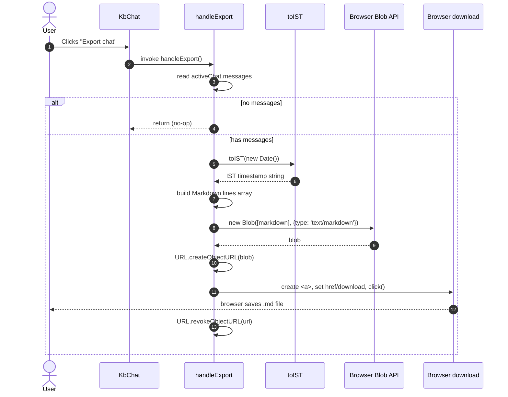
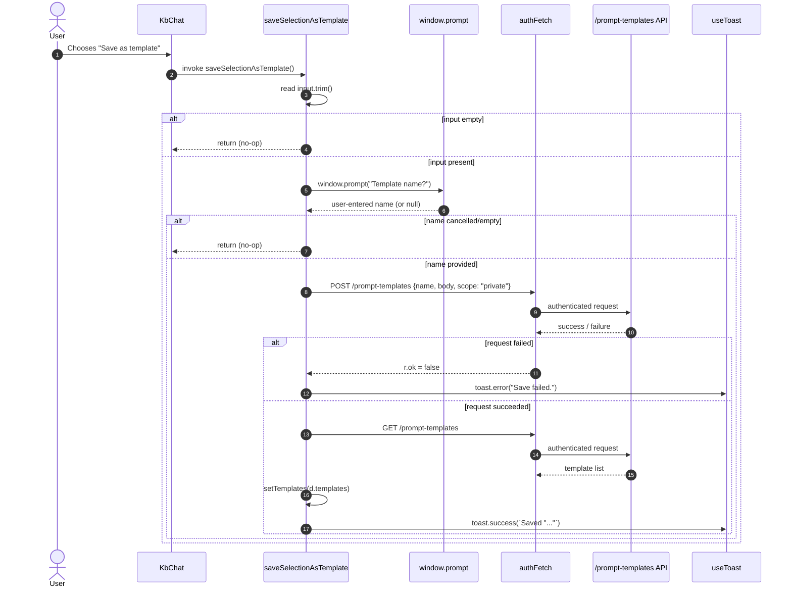

# kb_chat_export_template

## Brief Introduction

The `kb_chat_export_template` module is a utility sub-module of the Knowledge Base (KB) chat surface in the `ai-ui` frontend. It provides two user-facing productivity features inside `KbChat`:

1. **Export chat to Markdown** — lets a user download the current KB chat thread as a local `.md` file, including the chat title, export timestamp, and every message rendered with a speaker label.
2. **Save selection as prompt template** — lets a user turn the current text in the chat input box into a reusable private prompt template that is persisted via the `/prompt-templates` API and immediately becomes available through the `/` template menu.

These features are intentionally lightweight: they run entirely in the browser (export) or make a single authenticated API call (template save), and they reuse the same auth, toast, and template infrastructure that powers the regular chat surface.

> **Scope note:** This module lives inside `ai-ui/src/components/KbChat.jsx`. It is the KB-chat counterpart of the regular chat export/template features found in `Chat.jsx`. See [chat_export_template](chat_export_template.md) for the non-KB implementation.

---

## Core Components

### `handleExport`

Exports the currently active KB chat thread to a Markdown file downloaded by the browser.

**Location:** `ai-ui/src/components/KbChat.jsx` (lines 1238–1255)

**Behavior:**
- Reads `activeChat.messages` from the local chat state.
- Early-returns if the thread has no messages.
- Builds a Markdown document with:
  - A level-1 heading using the chat title.
  - An "Exported" timestamp in IST.
  - Each message prefixed by `**You**` for user messages or `**AiNxt**` for assistant messages.
- Creates a `Blob` of type `text/markdown`, generates an object URL, and triggers a download via a transient `<a>` element.
- Sanitizes the filename by replacing non-alphanumeric characters with underscores.

**Key implementation details:**
- No server round-trip is required; the export is generated client-side.
- The object URL is revoked immediately after the click to avoid memory leaks.
- Timestamps are formatted with the shared `toIST` helper.

### `saveSelectionAsTemplate`

Persists the current chat input text as a private prompt template.

**Location:** `ai-ui/src/components/KbChat.jsx` (lines 370–389)

**Behavior:**
- Reads the current `input` state.
- Early-returns if the input is empty.
- Prompts the user for a template name via `window.prompt`.
- POSTs `{ name, body, scope: "private" }` to `${API}/prompt-templates` using `authFetch`.
- On success, re-fetches the template list and updates local `templates` state so the new template appears in the `/` menu.
- Shows toast notifications for success or failure.

**Key implementation details:**
- Templates are always saved with `scope: "private"`, so they are visible only to the current user.
- The template body is the raw input text; no additional formatting is applied.
- The local template list is refreshed after a successful save to keep the `/` menu in sync.

---

## Architecture & Component Relationships

`kb_chat_export_template` is not a standalone component; it is a pair of event handlers defined inside the `KbChat` functional component. Both handlers operate on local `KbChat` state and rely on shared utilities and APIs provided by the `ai-ui` application shell.

### Relationship to parent module

- `kb_chat_export_template` is a child of the [kb_chat](kb_chat.md) module.
- It shares the same `activeChat`, `input`, and `templates` state managed by `KbChat`.
- It is invoked from the `KbChat` UI chrome (typically menu items or keyboard shortcuts rendered by the parent).

### Relationship to regular chat

- The regular chat surface (`Chat.jsx`) implements an equivalent export/template feature set. See [chat_export_template](chat_export_template.md).
- The two implementations are intentionally kept similar so that behavior and file naming stay consistent across chat modes, but they are not extracted into a shared hook yet (documented in the codebase as future work).

---

## Data Flow

### Export flow

### Save-template flow

---

## Dependencies

| Dependency | Module / File | Purpose |
|------------|---------------|---------|
| `activeChat` | [kb_chat_core_chat](kb_chat_core_chat.md) | Source of messages and title for export. |
| `input` / `setTemplates` | [kb_chat](kb_chat.md) | Input text for template body; local template list refresh. |
| `authFetch` | [config](config.md) | Authenticated HTTP client for the prompt-templates API. |
| `API` base URL | [config](config.md) | Backend API root. |
| `useToast` | [ui_dialog](ui_dialog.md) | Success / error notifications. |
| `toIST` | ai-ui utils | Format export timestamp in IST. |
| `/prompt-templates` endpoint | [chat_router](chat_router.md) | Create and list user prompt templates. |

---

## Process Flows

### How a chat export is produced

1. The user triggers export from the `KbChat` action menu.
2. `handleExport` gathers the message list from `activeChat`.
3. It constructs a Markdown document in memory.
4. A `Blob` is created and an object URL is generated.
5. A hidden anchor element initiates the browser download.
6. The object URL is revoked to free memory.

### How a prompt template is created

1. The user triggers "Save as template" while the input box contains text.
2. `saveSelectionAsTemplate` validates that the input is non-empty.
3. A browser prompt collects the template name.
4. An authenticated POST creates the private template on the backend.
5. On success, the template list is re-fetched and local state is updated.
6. A toast confirms the save.

---

## Error Handling & Edge Cases

| Scenario | Handler | Behavior |
|----------|---------|----------|
| Empty chat thread | `handleExport` | Returns immediately; no file is generated. |
| Empty input | `saveSelectionAsTemplate` | Returns immediately; no prompt is shown. |
| User cancels name prompt | `saveSelectionAsTemplate` | Returns immediately; no API call is made. |
| API request fails | `saveSelectionAsTemplate` | Shows `toast.error("Save failed.")`; local state is unchanged. |
| Template list refresh fails | `saveSelectionAsTemplate` | Catches error silently; the save itself already succeeded, so the toast success is still shown. |

---

## Integration with the Rest of the System

- **KB chat surface:** This module is one of several action groups inside `KbChat`. It does not manage chat messages itself; it consumes the message state maintained by [kb_chat_core_chat](kb_chat_core_chat.md).
- **Prompt template system:** Saved templates are stored through the same `/prompt-templates` REST endpoint used by the regular chat and other AI UI features. See [chat_router](chat_router.md) for the backend contract.
- **Authentication:** All API calls use `authFetch`, which attaches the current user's JWT and handles base-URL resolution. See [config](config.md) and [auth](auth.md).
- **Notifications:** Both handlers use the global toast provider. See [ui_dialog](ui_dialog.md).

---

## References

- [kb_chat](kb_chat.md) — parent KB chat module.
- [kb_chat_core_chat](kb_chat_core_chat.md) — core chat logic and state inside `KbChat`.
- [chat_export_template](chat_export_template.md) — equivalent export/template features in regular `Chat.jsx`.
- [config](config.md) — `authFetch` and `API` configuration.
- [auth](auth.md) — authentication context that underlies `authFetch`.
- [ui_dialog](ui_dialog.md) — toast/notification provider (`useToast`).
- [chat_router](chat_router.md) — backend router that serves `/prompt-templates`.
