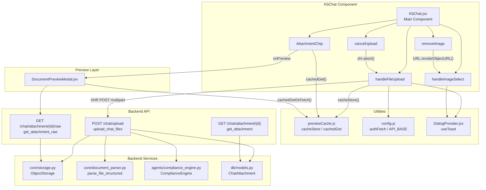
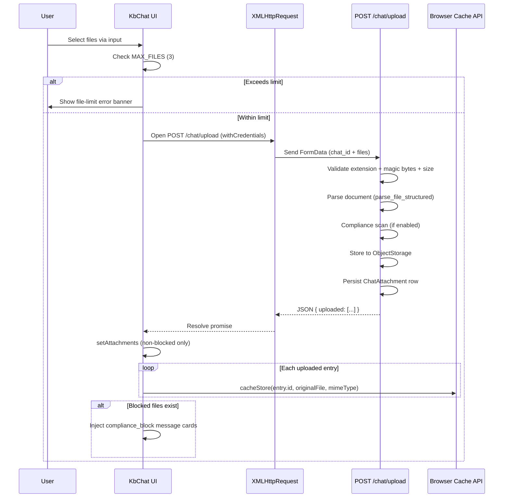
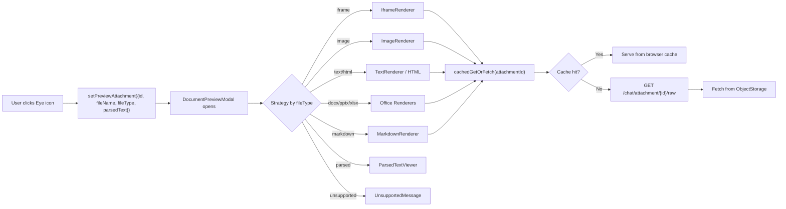
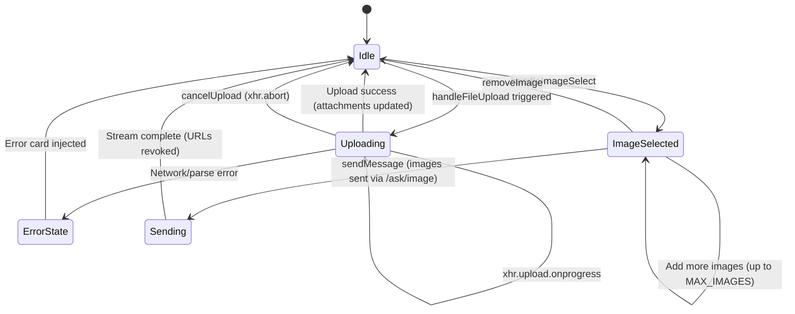
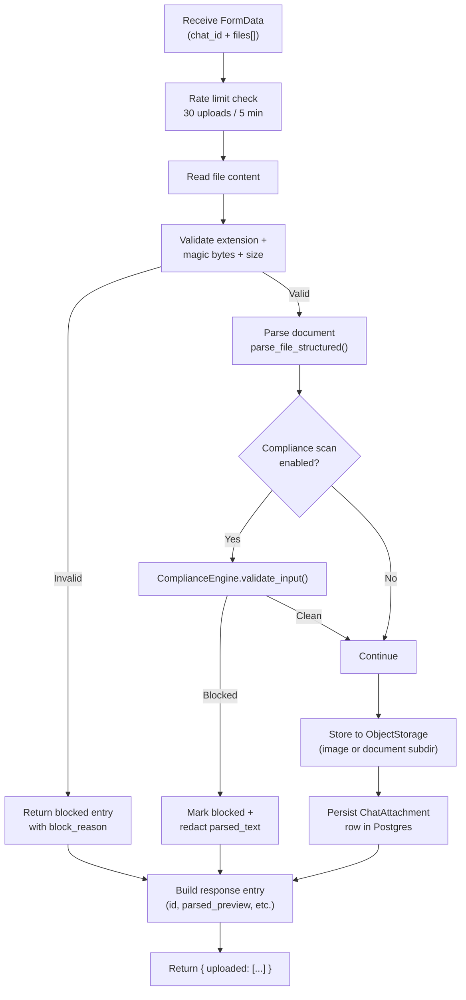
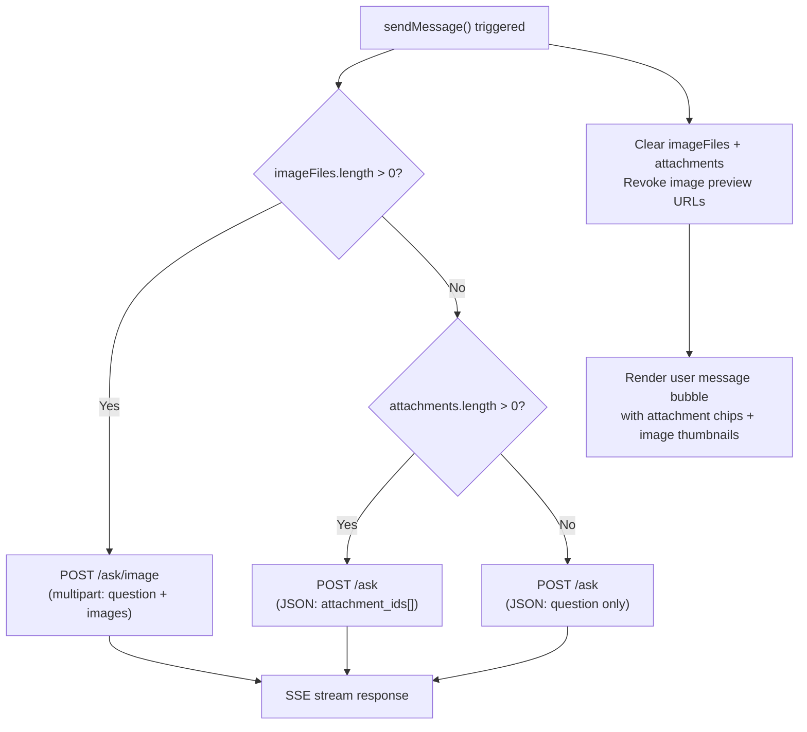

# KB Chat File & Image Handling

## Overview

The **kb_chat_file_image_handling** module is a sub-module of the [kb_chat](kb_chat.md) component within the AI-UI frontend. It encapsulates all client-side logic for uploading files, selecting images, managing attachment previews, and cancelling in-flight uploads within the Knowledge Base chat interface (`KbChat.jsx`).

This module bridges the user's local file system and the backend chat infrastructure — handling multipart uploads via `XMLHttpRequest`, caching file bytes in the browser Cache API for instant previews, validating image formats and sizes client-side, and rendering cache-aware attachment chips on sent messages.

---

## Architecture

---

## Core Components

### `handleFileUpload`

**Purpose**: Uploads one or more files (PDF, DOCX, XLSX, CSV, TXT, etc.) to the backend chat session via `XMLHttpRequest` with real-time progress tracking.

**Key behaviours**:

| Aspect | Detail |
|--------|--------|
| **Max files** | 3 attachments per chat (enforced client-side; `fileLimitError` banner auto-dismisses after 5s) |
| **Transport** | `XMLHttpRequest` (not `fetch`) — required for `upload.onprogress` events |
| **Auth** | `xhr.withCredentials = true` sends the `httpOnly auth_token` cookie |
| **Endpoint** | `POST {API}/chat/upload` with `FormData` containing `chat_id` + `files[]` |
| **Progress** | `uploadProgress` state (0–100%) drives a progress bar with a cancel button |
| **Caching** | Each successfully uploaded file's raw `File` object is stored in the browser Cache API via `cacheStore(entry.id, originalFile, mimeType)` for instant client-side preview |
| **Compliance** | Files flagged as `blocked` by the backend compliance engine are NOT added to `attachments`; instead, a `compliance_block` message card is injected into the chat with the detected sensitive-data reasons |
| **Error handling** | Network errors and parse failures inject an assistant error message; intentional cancellations (`"Upload cancelled"`) are silently swallowed |

**Data flow**:

---

### `handleImageSelect`

**Purpose**: Validates and adds image files to the `imageFiles` state array for inline image chat (sent via `POST /ask/image` as multipart).

**Validation rules**:

| Rule | Value |
|------|-------|
| Accepted MIME types | `image/jpeg`, `image/png`, `image/gif`, `image/webp` |
| Max file size | 10 MB (`IMAGE_MAX_BYTES = 10 * 1024 * 1024`) |
| Max images per message | 3 (`MAX_IMAGES`) |

**Key behaviours**:
- Invalid format or oversized files trigger a `toast.error()` with the specific file name and reason
- Valid files are wrapped as `{ file, previewUrl }` where `previewUrl = URL.createObjectURL(file)` for instant thumbnail rendering
- If the user selects more images than the remaining slots, only the allowed number are added and a toast informs the user
- The file input value is immediately reset (`e.target.value = ""`) to allow re-selecting the same file

**Clipboard paste support**: The `handlePaste` callback (defined in the parent `KbChat` component) intercepts clipboard image items, converts Office metafile formats (EMF/WMF) to PNG, and routes through the same `setImageFiles` flow.

---

### `removeImage`

**Purpose**: Removes an image from the `imageFiles` array at a given index and revokes its object URL to prevent memory leaks.

**Key behaviours**:
- Calls `URL.revokeObjectURL(updated[index].previewUrl)` before splicing the array
- Uses functional state update (`setImageFiles(prev => ...)`) to avoid stale closures
- On chat switch or component unmount, a `useEffect` cleanup revokes all remaining preview URLs

---

### `AttachmentChip`

**Purpose**: A cache-aware file chip rendered on sent user messages. Displays the attachment filename with one of three states based on browser Cache API availability.

**States**:

| State | Trigger | UI |
|-------|---------|----|
| `checking` | Initial mount; `cachedGet()` in-flight | Spinner + greyed filename |
| `available` | Cache hit (file bytes still valid) | Interactive button with `Eye` icon → opens `DocumentPreviewModal` |
| `expired` | Cache miss or TTL expired | Static chip with amber "preview expired" notice |

**Cache lifecycle**:
- Files are stored with a timestamp header (`X-Cached-At`)
- `cachedGet()` checks `MAX_AGE_MS` and auto-deletes expired entries
- `cachePurgeExpired()` runs on `KbChat` mount to clean up stale entries

**Preview flow**:

---

### `cancelUpload`

**Purpose**: Aborts an in-flight file upload by calling `xhr.abort()` on the stored `XMLHttpRequest` reference.

**Key behaviours**:
- Accesses `uploadXhrRef.current` (a `useRef` holding the active XHR)
- Sets `uploadXhrRef.current = null` after abort
- Resets `uploading` to `false` and `uploadProgress` to `0`
- Shows a `toast.info("Upload cancelled.")` notification
- The aborted XHR triggers the `onabort` handler in `handleFileUpload`, which rejects with `"Upload cancelled"` — this is caught and silently swallowed (no error card injected)

---

## State Management

The file and image handling state lives in the parent `KbChat` component and is shared across all sub-modules:

| State variable | Type | Purpose |
|----------------|------|---------|
| `attachments` | `Array<{id, file_name, file_type, file_size, parsed_text, parsed_preview}>` | Uploaded file metadata from backend |
| `uploading` | `boolean` | Controls progress bar visibility and input disabled state |
| `uploadProgress` | `number` (0–100) | Drives the upload progress bar width |
| `fileLimitError` | `boolean` | Shows the "max 3 files" error banner (auto-dismiss 5s) |
| `imageFiles` | `Array<{file: File, previewUrl: string}>` | Locally selected images with object URLs |
| `previewAttachment` | `{id, fileName, fileType, parsedText} \| null` | Controls `DocumentPreviewModal` open/close |
| `uploadXhrRef` | `useRef<XMLHttpRequest \| null>` | Mutable ref for abort capability |

---

## Backend Integration

### Upload Pipeline (`POST /chat/upload`)

The backend `upload_chat_files` endpoint in [chat_router](chat_router.md) performs a multi-stage pipeline for each file:

**Key backend details**:
- **Owner ID**: Uses JWT `sub` claim (not `user_id`) for storage path ownership — ensures `ChatAttachment` lookups match
- **Storage separation**: Images go to `UPLOAD_SUBDIR_IMAGE`, documents to `UPLOAD_SUBDIR_DOCUMENT`
- **Parsed text**: Full parsed text is returned to the frontend (not just a preview) so `DocumentPreviewModal` can render Office file types without a second API call
- **Compliance gating**: Scanning is controlled by `COMPLIANCE_SCAN_TOOL_RESULTS` config flag (default OFF)

### Attachment Retrieval

| Endpoint | Purpose | Auth |
|----------|---------|------|
| `GET /chat/attachment/{id}` | Returns metadata + presigned download URL (MinIO) | JWT required |
| `GET /chat/attachment/{id}/raw` | Serves raw file bytes with owner ACL | JWT + owner check (admins bypass) |

The `DocumentPreviewModal` uses `cachedGetOrFetch()` which tries the browser Cache API first, falling back to `GET /chat/attachment/{id}/raw` for a server fetch.

---

## Dependencies

### Internal (AI-UI Frontend)

| Dependency | Module | Usage |
|------------|--------|-------|
| `previewCache.js` | [ai_ui_frontend_utils](ai_ui_frontend_utils.md) | `cacheStore`, `cachedGet`, `cachePurgeExpired` for browser Cache API management |
| `config.js` | [config](config.md) | `authFetch` for authenticated requests, `API_BASE` for endpoint URLs |
| `DialogProvider.jsx` | [ui_dialog](ui_dialog.md) | `useToast` for user notifications (errors, info, cancellations) |
| `DocumentPreviewModal.jsx` | [document_preview](document_preview.md) | Full-screen file preview with format-specific renderers |
| `messageContent.js` | [ai_ui_frontend_utils](ai_ui_frontend_utils.md) | `stripMemoryTag`, `stripSystemPrefix` for message content processing |
| `KbChat.jsx` (parent) | [kb_chat](kb_chat.md) | Hosts all state and the `sendMessage` flow that consumes `attachments` and `imageFiles` |

### External (Backend)

| Dependency | Module | Usage |
|------------|--------|-------|
| `chat_router.py` | [chat_router](chat_router.md) | `upload_chat_files`, `get_attachment`, `get_attachment_raw` endpoints |
| `core/storage.py` | [core_infrastructure](core_infrastructure.md) | `ObjectStorage` for file persistence (local FS or MinIO) |
| `core/document_parser.py` | [document_processing](document_processing.md) | `parse_file_structured` for text extraction |
| `agents/compliance_engine.py` | [agent_system](agent_system.md) | `ComplianceEngine.validate_input` for PII/PCI detection |
| `db/models.py` | [database](database.md) | `ChatAttachment` ORM model for persistence |

---

## Interaction with `sendMessage`

The file and image handling state is consumed by the parent `KbChat` component's `sendMessage` function:

**Attachment metadata on user messages**: When `sendMessage` constructs the user message object, it stores `attachments` metadata (id, file_name, file_type, file_size, parsed_text) and `imageUrls` (object URLs) on the message. This allows:
- `AttachmentChip` to render cache-aware preview buttons on past messages
- Image thumbnails to display inline in the user's message bubble
- The `📎 filename1, filename2` text suffix is stripped from the displayed content when attachment chips are present

---

## Security Considerations

1. **Client-side validation is advisory only**: Image format and size checks in `handleImageSelect` provide immediate feedback but the backend independently validates via magic bytes and size limits
2. **Compliance blocking**: Files containing PII/PCI data are blocked server-side; the frontend never stores blocked file bytes in the cache and renders a red compliance card instead
3. **Owner ACL**: Raw attachment retrieval enforces owner-only access (404 for non-owners to prevent existence leakage)
4. **Cookie-based auth**: Uploads use `withCredentials: true` to send the `httpOnly auth_token` cookie — no bearer token in JavaScript-accessible storage
5. **Object URL cleanup**: All `URL.createObjectURL()` calls have corresponding `revokeObjectURL()` cleanup (on image removal, chat switch, unmount, and post-send)

---

## Related Documentation

- [kb_chat](kb_chat.md) — Parent module containing the full `KbChat` component
- [kb_chat_core_chat](kb_chat_core_chat.md) — Core chat logic, streaming, and message handling
- [kb_chat_enhancement_features](kb_chat_enhancement_features.md) — Prompt enhancement and AI-powered improvements
- [chat_router](chat_router.md) — Backend API router for chat file operations
- [document_preview](document_preview.md) — `DocumentPreviewModal` and format-specific renderers
- [ai_ui_frontend_utils](ai_ui_frontend_utils.md) — Shared utilities including `previewCache.js`
- [config](config.md) — `authFetch` and `API_BASE` configuration
- [ui_dialog](ui_dialog.md) — Toast and confirm dialog providers
